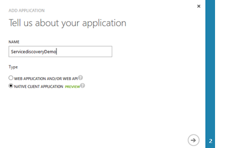
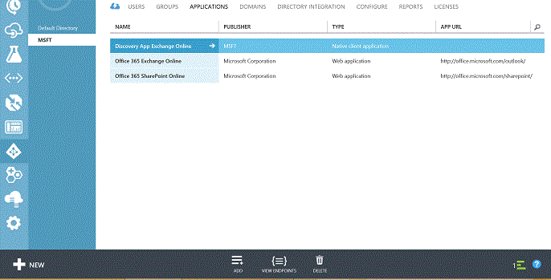
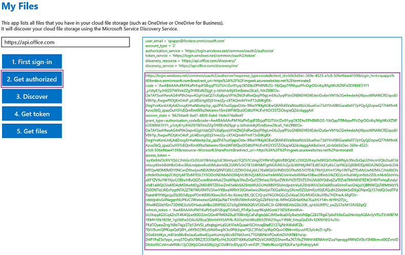
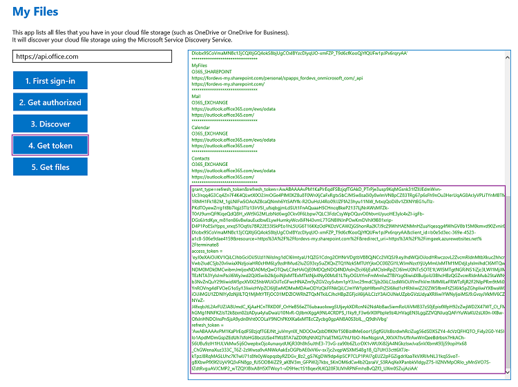
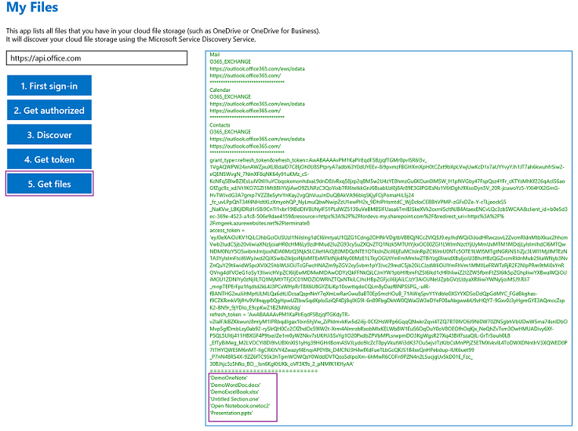

# Office 365 APIs: How to use Discovery Service
## Requires
- Visual Studio 2013
## License
- Apache License, Version 2.0
## Technologies
- Sharepoint Online
- SharePoint Foundation 2013
## Topics
- App
## Updated
- 07/06/2015
## Description

<table id="bottomTable" cellspacing="0" cellpadding="0">
<tbody>
<tr id="headerTableRow1">
<td align="left">&nbsp;</td>
</tr>
<tr id="headerTableRow2">
<td align="left">Office 365 APIs: How to use Discovery Service</td>
</tr>
</tbody>
</table>

This sample app demonstrates how to use discovery service to find user-specific end points for the various Microsoft services.

<strong>Last modified: </strong>January 12, 2015

<strong>In this article</strong> 
<a href="#O15Readme_Description">Description</a> 
<a href="#O15Readme_Prereq">Prerequisites</a> 
<a href="#O15Readme_KeyComponents">Key components of the sample</a> 
<a href="#O15Readme_ManagingDirectory">Managing the directory for your Office 365 subscription in Azure</a> 
<a href="#O15Readme_RegisteringApps">Registering an app and getting client ID in Azure Management Portal</a> 
<a href="#O15Readme_ToRegisterApp">To register and add an app using Organizational accounts</a> 
<a href="#sectionSection6">To get a client ID for Organizational accounts</a> 
<a href="#O15Readme_ConfiguringSample">Configuring the sample</a> 
<a href="#sectionSection8">Configuring permissions for the app to Azure Active Directory (AD), Office 365 SharePoint Online and Office 365 Exchange Online in Azure Management Portal</a> 
<a href="#O15Readme_build">To run the sample app</a> 
<a href="#O15Readme_DiscoveryService">Discovery Service flow with Organization account</a> 
<a href="#O15Readme_ChangeLog">Change log</a> 
<a href="#O15Readme_RelatedContent">Related content</a>

<table cellspacing="0" cellpadding="0" width="100%">
<tbody>
<tr>
<th align="left"><strong>Important</strong></th>
</tr>
<tr>
<td>

For this sample app to work, you need to also configure permissions for the app to Azure Active Directory (AD), Office 365 SharePoint Online and Office 365 Exchange Online in Azure Management Portal. For more information, see the
<strong>Configuring permissions to Azure Active Directory (AD), Office 365 SharePoint Online and Office 365 Exchange Online in Azure Management Portal</strong> section in this article.

</td>
</tr>
</tbody>
</table>

Your feedback about these features and APIs is important. <a href="http://officespdev.uservoice.com/" target="_blank">
Let us know</a> what you think. Have questions? Connect with us on <a href="https://stackoverflow.com/users/login?returnurl=%2fquestions%2fask%3ftags%3dms-office%2cpreview" target="_blank">
Stack</a>. Tag your questions with [Office365APIs].

<h2>Description</h2>

This solution is based on Windows app that finds user-specific end points for the various Microsoft services, using a Windows template from Visual Studio 2012 or Visual Studio 2013. The app describes the simple flow established by &quot;Discovery Service&quot; for
 using authenticated Microsoft productivity services locations for a given user. For more information on this sample, see the live demonstration at
<a href="http://channel9.msdn.com/events/SharePoint-Conference/2014/SPC3999">SharePoint Power Hour - New developer APIs and features for Apps for SharePoint | SharePoint Conference 2014 | Channel 9</a> demo start at 55.11 minutes into the video.

<a name="O15Readme_Prereq">
<h2 class="heading">Prerequisites</h2>
</a>

This sample requires the following:

<ul>
<li>Visual Studio 2012 or Visual Studio 2013. </li><li>An Office 365 Organizational account. </li><li>Windows app development registration. </li><li>A directory for your Office 365 subscription in Azure. For more information, see the
<strong>Managing the directory for your Office 365 subscription in Azure</strong> section in this article.
</li><li>App registration in the Azure Management Portal. For more information, see the
<strong>Registering an app and getting client ID in Azure Management Portal</strong> section in this article.
</li><li>Configuring permissions for the app to Azure Active Directory (AD), Office 365 SharePoint Online and Office 365 Exchange Online in Azure Management Portal. For more information, see the
<strong>Configuring permissions to Azure Active Directory (AD), Office 365 SharePoint Online and Office 365 Exchange Online in Azure Management Portal</strong> section in this article.
</li></ul>

<h2 class="heading">Key components of the sample</h2>
The sample app contains the following: 
<ul>
<li><strong>MainPage.xaml.cs</strong> - a code-behind file of the main page containing the logic behind all the steps such as First Sign-In, Get Authorized, Discover, and Get Files.
</li><li><strong>FirstSignIn.xaml</strong>- contains the code for the dialog (sign-in) box that appears when a user clicks on First Sign-In.
</li><li><strong>DiscoveryXElements.cs</strong> - a file for XLINQ element and namespace names.
</li></ul>

<h2>Managing the directory for your Office 365 subscription in Azure</h2>

You'll only see your Office 365 tenant in the Azure AD after you've added your Office 365 subscription to Azure AD.&nbsp;If you haven't done so, you need to associate and manage your Office 365 subscription with Azure. To learn how to associate and manage
 the directory for your Office 365 subscription in Azure, see <a href="http://msdn.microsoft.com/en-us/library/azure/dn629580.aspx" target="_blank">
Manage the directory for your Office 365 subscription in Azure</a>.

<h2 class="heading">Registering an app and getting client ID in Azure Management Portal</h2>

This code sample demonstrates how you can authenticate into the Office 365 APIs using an Office 365 Organizational account. This Windows 8 app needs to have a registered client ID so that the authentication process trusts the app.

<h2 class="heading" style="display:inline!important">To register and add an app using Organizational accounts</h2>
Following are the steps to add and register an app for Office 365 accounts:

<ol>
<li>

Sign into your Microsoft Azure account via Azure Management Portal

</li><li>

Click the <strong>Active Directory</strong> icon from the left menu, as shown in the following Figure 1. 
 
Figure 1. Windows Azure active directory&nbsp;

</li><li>

Click the desired directory, which in this case is Office 365 tenant.

<table cellspacing="0" cellpadding="0" width="100%">
<tbody>
<tr>
<th align="left"><strong>Note</strong></th>
</tr>
<tr>
<td>

You'll only see your Office 365 tenant in the directory after you've added your Office 365 subscription to Azure AD. If haven't, see the previous
<strong>Managing the directory for your Office 365 subscription in Azure</strong> section to learn how.

</td>
</tr>
</tbody>
</table>

</li><li>

Select <strong>Applications</strong> tab, as shown below in Figure 2. 
 
Figure 2. Applications tab

</li><li>Click the Add button at the bottom of the page to add a new native application.
</li><li>

On the <strong>What do you want to do</strong> page, click on the link to 
Add an application my organization is developing option.

</li><li>

On the <strong>Tell us about your application</strong> page, you must specify a name for your application as well as indicate the type of application you are registering with Azure AD. Give a name to your application and choose
Native Client Application from <strong>Type</strong> option, as shown below in Figure 3. 
 
Figure 3. Add application dialog box

</li><li>

Once finished, click the arrow icon on the bottom-right corner of the page.

</li><li>

On the <strong>App information</strong> page, provide a redirect URI, for example, http://contoso.com. Then click the checkbox in the bottom-right hand corner of the page.

<table cellspacing="0" cellpadding="0" width="100%">
<tbody>
<tr>
<th align="left"><strong>Note</strong></th>
</tr>
<tr>
<td>

For more information about adding apps to Azure AD, see <a href="http://msdn.microsoft.com/en-us/library/azure/dn132599.aspx" target="_blank">
Adding, Updating, and Removing an Application</a>.

</td>
</tr>
</tbody>
</table>

</li></ol>

You should now see the app you just added listed in the <strong>Applications</strong> tab page of your Office 365 tenant in the directory as shown in Figure 4.

Figure 4. Adding an app to Azure AD

 

<h2 class="heading">To get a client ID for Organizational accounts</h2>

Following are the steps to get client ID for Office 365 accounts:

<ol>
<li>

Sign into your Microsoft Azure account via Azure Management Portal

</li><li>

Click the Active Directory icon from the left menu.

</li><li>

Click the desired directory, which in this case is Office 365 tenant.

<table cellspacing="0" cellpadding="0" width="100%">
<tbody>
<tr>
<th align="left"><strong>Note</strong></th>
</tr>
<tr>
<td>

You'll only see your Office 365 tenant in the directory after you've added your Office 365 subscription to Azure AD. If haven't, see the previous
<strong>Managing the directory for your Office 365 subscription in Azure</strong> section to learn how.

</td>
</tr>
</tbody>
</table>

</li><li>

Select Applications tab to display all the applications in the Office 365 directory.

</li><li>

Select the app that you just registered and added in the previous <strong>To register and add an app using Organizational accounts</strong> section.

</li><li>

Select Configure tab as shown in Figure 5.

Figure 5. Configure page showing client ID and redirect URI values

</li><li>

Copy the client ID value and the redirect URI value.

</li></ol>

<h2 class="heading">Configuring the sample</h2>

Follow these steps to configure the sample:

<ol>
<li>

Open the <strong>DiscoveryWin8.sln</strong> file using Visual Studio 2012 or 2013.

</li><li>

In the <strong>config.cs</strong> file, update the client ID, and redirect URI for the Organizational account. For example:

<table cellspacing="0" cellpadding="0" width="100%">
<tbody>
<tr>
<th>&nbsp;</th>
<th>&nbsp;</th>
</tr>
<tr>
<td colspan="2">
<pre>   // App registration for Organizational account (Office 365 account)
&nbsp;&nbsp;&nbsp;&nbsp;&nbsp;&nbsp;&nbsp; public string OrganizationalAccountClientId = &quot;81839e2b-5902-4721-b62-39c8bce47eae&quot;;
&nbsp;&nbsp;&nbsp;&nbsp;&nbsp;&nbsp;&nbsp; public string OrganizationalAccountRedirectUri = &quot;http://contoso.com&quot;;
</pre>
</td>
</tr>
</tbody>
</table>

</li></ol>

Rebuild the solution.

<h2 class="heading">Configuring permissions for the app to Azure Active Directory (AD), Office 365 SharePoint Online and Office 365 Exchange Online in Azure Management Portal</h2>

Follow these steps to configure permissions to Azure Active Directory (AD), Office 365 SharePoint Online and Office 365 Exchange Online in Azure Management Portal:

<ol>
<li>

Sign into your Microsoft Azure account via Azure Management Portal

</li><li>

Click the Active Directory icon from the left menu.

</li><li>

Click the desired directory, which in this case is Office 365 tenant as shown in Figure 6.

Figure 6. Office 365 tenant in Azure AD

 

<table cellspacing="0" cellpadding="0" width="100%">
<tbody>
<tr>
<th align="left"><strong>Note</strong></th>
</tr>
<tr>
<td>

You'll only see your Office 365 tenant in the directory after you've added your Office 365 subscription to Azure AD. If haven't, see the previous
Managing the directory for your Office 365 subscription in Azure section to learn how.

</td>
</tr>
</tbody>
</table>

</li><li>

Select Applications tab to display all the applications in the Office 365 directory.

</li><li>

Select the app that you just registered and added in the previous <strong>To register and add an app using Organizational accounts</strong> section.

</li><li>

Select Configure tab.

</li><li>

Scroll down to the Permissions to other applications section. The first column allows you to select from the available applications in your directory that expose a web API. Once selected, you may select application and delegation
 permissions that the web API exposes.

</li><li>

Add the applications you want to set permissions for. Make sure you add the following applications from the
Select application drop down list as shown in Figure 7.

<ul>
<li>

Azure Active Directory (AD)

</li><li>

Office 365 SharePoint Online

</li><li>

Office 365 Exchange Online

</li></ul>

Figure 7. Selecting applications to set permissions to in Azure AD

</li><li>

Set the permissions you want to give to the app in each of the following application. Set the permissions in the
Delegated Permissions drop down list. Do this for the following as shown in Figure 8:

<ul>
<li>

Azure Active Directory (AD): Set Read directory data permission

</li><li>

Office 365 SharePoint Online: Set Read users' files

</li><li>

Office 365 Exchange Online: Set Read user's contacts

</li></ul>
</li><li>

Figure 8. Setting permissions to applications in Azure AD

 

Once the applications are selected and permissions are set, click the 
Save button on the command bar.

<table cellspacing="0" cellpadding="0" width="100%">
<tbody>
<tr>
<th align="left"><strong>Note</strong></th>
</tr>
<tr>
<td>

For more information about how the consent experience works for both the application developer and user in Azure AD, see the
<strong>Overview of the Consent Framework</strong> section in <a href="http://msdn.microsoft.com/en-us/library/azure/dn132599.aspx#BKMK_Consent" target="_blank">
Adding, Updating, and Removing an Application</a>.

</td>
</tr>
</tbody>
</table>

</li></ol>

<h2 class="heading">To run the sample app</h2>

Press F5 to run the app on the local machine.

<h2 class="heading">Discovery Service flow with Organization account</h2>

The following images depict the discovery service flow with Microsoft account:

It is a single point where the developer can pass the user identity, get information to initiate authorization flows, get the hosting location of services (for the user), and get the endpoints to the service.

<ol>
<li>

First Sign-in: When a user clicks &quot;First Sign-In&quot;, the email of the user is requested. The app contacts the Discovery service and passes in the email address and the set of scopes that the app wants to access, as shown in the following Figure 9 and 10.

Figure 9: Log-in window with Organization ID

 

&nbsp;

Figure 10: First Sign-in return values with Organization ID

 

</li></ol>

&nbsp;

&nbsp;

&nbsp;

&nbsp;

&nbsp;

&nbsp;

&nbsp;

&nbsp;

&nbsp;

<table cellspacing="0" cellpadding="0" width="100%">
<tbody>
<tr>
<th align="left"><strong>Note</strong></th>
</tr>
<tr>
<td>

Microsoft account type returns &quot;1&quot; whereas Organizational ID returns &quot;2&quot; as account type.

</td>
</tr>
</tbody>
</table>

<ol>
<li>

Get authorized: The app goes to the authorization endpoint and the user is prompted with a single consent UI for all the services that the app wants to access. The app is granted permissions to access the resources and gets a generic refresh token, as shown
 in the following Figure 11.

Figure 11: Get Authorize return values with Organization ID

 

</li><li>

Discover: The app contacts the Discovery service, presenting an access token to talk to this service, which includes the user on whose behalf it is acting and a list of resources it wants to access, as shown in the following Figure 12.

</li></ol>

&nbsp;

&nbsp;

<table cellspacing="0" cellpadding="0" width="100%">
<tbody>
<tr>
<th align="left"><strong>Note</strong></th>
</tr>
<tr>
<td>

With Organizational ID, you can talk to any of the four services i.e. Files, Mail, Calendar, or Contacts by Office 365

</td>
</tr>
</tbody>
</table>
<li>

Figure 12: Discovery service return values with Organization ID

 

</li><li>

Get token: The app contacts the service endpoints with the access tokens and is authorized for the discovered services, as shown in the following Figure 13.

Figure 13: Get Token values with Organization ID

 

</li><li>

Get Files: The app contacts the resource server using the access token to access the desired resource or files, as shown in the Figure 14.

Figure 14: File return with Organization ID

 

<h2 class="heading">Change log</h2>
<ul>
<li>

First version: March, 2014

</li><li>

2nd version: November 2014

</li></ul>

<h2 class="heading">Related content</h2>
<ul>
<li><a href="http://msdn.microsoft.com/en-us/office/office365/howto/discover-service-endpoints" target="_blank">Discover service endpoints for your Office 365 app</a>
</li><li><a href="http://dev.office.com/getting-started" target="_blank">Office Dev Center - Getting Started</a>
</li><li><a href="http://msdn.microsoft.com/library/office/fp179930.aspx" target="_blank">Overview of Apps for SharePoint</a>
</li><li><a href="http://msdn.microsoft.com/library/office/fp161179.aspx" target="_blank">How to: Set up an environment for developing apps for SharePoint on Office 365</a>
</li></ul>
</li>