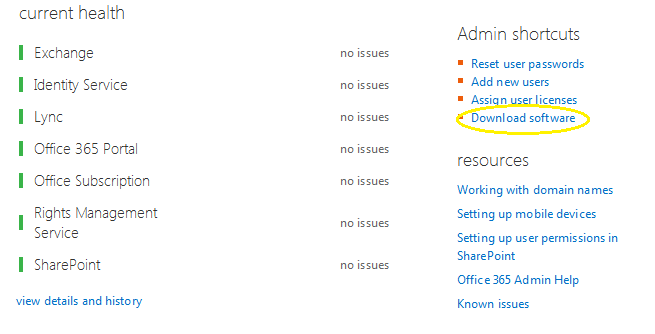
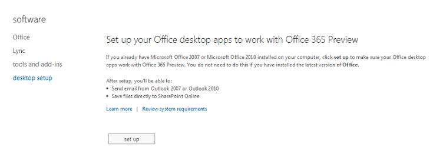
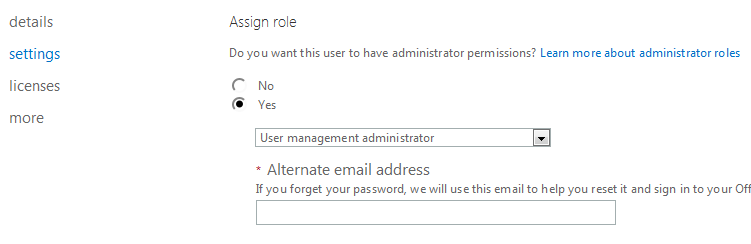

# Office 365: Office 365 Dashboard
## Requires
- Visual Studio 2012
## License
- Apache License, Version 2.0
## Technologies
- Office 365
## Topics
- EWS Managed API
## Updated
- 07/30/2013
## Description

<table id="bottomTable" cellspacing="0" cellpadding="0">
<tbody>
<tr id="headerTableRow1">
<td align="left">&nbsp;</td>
</tr>
<tr id="headerTableRow2">
<td align="left">Office 365: Office 365 Dashboard</td>
</tr>
</tbody>
</table>

Learn how to use the Exchange Web Services (EWS) Managed API, Microsoft Lync 2013 SDK, and Windows PowerShell to make an Office 365 communication dashboard application that shows Microsoft Outlook 2013 mailbox usage and Microsoft Lync 2013 user presence.

<em>Applies to: </em>

<h1>Description of the sample</h1>

This C# desktop application showcases the integration of Microsoft API technologies with Office 365 service version 2013-V1. It shows three important API integrations:

<ul>
<li>

The EWS Managed API provides the functionality to enable client applications to communicate with Microsoft Exchange Server 2007 Service Pack 1 (SP1), Exchange Server 2010, Exchange Server 2013, and Exchange Online.

</li><li>

The Windows PowerShell 2.0 SDK contains sample code and reference assemblies that allow you to build applications based on Windows PowerShell.

</li><li>

The Microsoft Lync 2013 API includes a set of managed classes with methods that you can use to add collaboration functionality to your application.

</li></ul>

This code sample helps you understand how to use the cross-product technologies with Office 365. The sample shows the following:

<ul>
<li>

The Office 365 users who are online - the list includes current availability and contact information.

</li><li>

The total number of read and unread email messages in a user's Outlook Inbox - the data is shown in a pie chart.

</li><li>

The mailbox usage for a particular user - the statistics are shown in progress-bar form.

</li></ul>

<h1>Prerequisites</h1>

This sample requires the following:

<ul>
<li>

<a href="http://www.microsoft.com/en-us/download/details.aspx?id=34673" target="_blank">Microsoft Visual Studio 2012 Express</a> and associated requirements for Windows Forms applications.

</li><li>

Office 365 Enterprise with the onmicrosoft.com domain.

</li><li>

Office 365 Enterprise domain user account with administrative privileges.

</li><li>

Microsoft Lync 2013 client. The client must be installed on the local development computer and on all computers that run your application.

</li><li>

<a href="http://www.microsoft.com/en-us/download/confirmation.aspx?id=35371" target="_blank">Microsoft Exchange Web Services Managed API</a>.

</li><li>

<a href="http://www.microsoft.com/en-us/download/details.aspx?id=36824" target="_blank">Microsoft Lync 2013 SDK</a>.

</li><li>

Office 365 cmdlets.

Before you use the Office 365 cmdlets, they need to be installed from the <a href="http://technet.microsoft.com/en-us/library/jj151815.aspx" target="_blank">
Windows Azure Active Directory Module for Windows PowerShell</a> download link. Office 365 cmdlets have the following prerequisites:

<ul>
<li>

Windows 7 or Windows Server 2008 R2.

</li><li>

Windows PowerShell and .NET Framework 3.5.1.

</li><li>

Microsoft Online Services Sign-In Assistant. Download and install from the Microsoft Download Center:
<a href="http://www.microsoft.com/en-in/download/details.aspx?id=28177" target="_blank">
Microsoft Online Services Sign-In Assistant for IT Professionals RTW</a>.

</li></ul>
</li><li>

Valid script execution policy for your development computer. Run the Get-ExecutionPolicyWindows PowerShell command to check the script execution policy of your system. If the value returned is not
RemoteSigned, then run the Set-ExecutionPolicy RemoteSignedWindows PowerShell command so that your computer can run Windows PowerShell scripts against your Office 365 Enterprise.

</li></ul>
<h3>Install the Office 365 application suite</h3>

To install the Office 365 application suite on your computer, follow these steps:

<ol>
<li>

In the right pane of the dashboard, click the Download software link, as shown in the following figure.

 </li><li>

On the next page, in the left pane, click desktop setup.

 </li><li>

Click set up and confirm when you are prompted to run Office 365 Desktop Setup.

</li></ol>

<h3>Verify Office 365 user account settings</h3>

The sample depends on the fact that at least one user configured on your Office 365 domain has user administration privileges.

Log in to your Office 365 portal and follow these steps:

<ol>
<li>

On the Office 365 ribbon, choose the Admin option, and then click
Office 365.

</li><li>

On the left side of the Office 365 admin center page, click Users and groups.

</li><li>

On the Active users page, select the check box next to the names of the users whose admin roles you want to change, and then click the edit button.

 </li><li>

On the selected user page, on the left tab, click settings.

 </li><li>

On the Settings page, under Assign role, click 
yes.

</li><li>

Choose a user management admin role from the list.

</li><li>

Click save to return to the users and groups page.

</li><li>

On the menu on the left side of the Office 365 admin center page, click 
dashboard to return to the dashboard.

</li></ol>

&nbsp;

<h1>Key components of the sample</h1>

The sample Windows Forms solution contains the following:

<ul>
<li>

O365_Dashboard_cs project file

</li><li>

<strong>ShowDashboard</strong> class

</li><li>

<strong>OutlookHelper</strong> class

</li><li>

<strong>O365User</strong> class

</li><li>

<strong>LyncHelper</strong> class

</li></ul>

<h1>Configure the sample</h1>

To configure the Office 365 dashboard sample, follow these steps:

<ol>
<li>

Open Microsoft Visual Studio 2012 by using the Run as Administrator option.

</li><li>

Click File, select Open, and then click Project.

</li><li>

Browse to the location of the O365_Dashboard_cs solution folder and select the
O365_Dashboard_cs.sln file.

</li><li>

The solution will look like the following figure.

 </li><li>

Open the App.config file and enter the following values:

<ul>
<li>

UserID - The organizational account of the user. For example: &Prime;anac@contoso.com&Prime; where Contoso, Ltd. is the tenant in the Office 365 service.

</li><li>

Password - The password for the account you chose.

</li><li>

LiveIDConnectionUri - A string that contains the URI of the server that will authenticate the sample application. For example: https://pod51037psh.outlook.com/PowerShell-LiveID?PSVersion=2.0\0

</li><li>

AutodiscoverUrl - An optional parameter. The Autodiscover service determines the best endpoint for a specific user. For example: https://sixpr02.outlook.com/EWS/Exchange.asmx

</li></ul>
</li></ol>

<h1>Run the sample</h1>

Before running the sample, be sure you have assigned yourself as a user administrator for your Office 365 Enterprise domain. In Visual Studio, press
F5 to start debugging the sample. The sample window shows a list of Office 365 users who are online (obscured in the following figure).

&nbsp;

Click the Outlook Details tab to view Outlook-related information. The tab shows the Outlook email activity details in a pie chart.

<h1>Troubleshooting</h1>

The following table lists the common configuration and environment errors that help troubleshoot issues preventing the sample from building or deploying successfully.

<strong>

</strong>

<table cellspacing="2" cellpadding="5" width="50%" frame="lhs">
<tbody>
<tr>
<th>

Problem

</th>
<th>

Solution

</th>
</tr>
<tr>
<td>

The request failed. The remote server returned one of the following errors:

<ul>
<li>

(401) Unauthorized.

</li><li>

A valid SMTP address must be specified.

</li><li>

Cannot process argument because the value of argument &quot;userName&quot; is invalid.

</li></ul>
</td>
<td>

Verify your credentials entered in the App.config file.

</td>
</tr>
<tr>
<td>

Invalid URI: The host name could not be parsed.

</td>
<td>

Verify the LiveIDConnectionUri value in the App.config file.

</td>
</tr>
<tr>
<td>

No Office 365 users are listed in the table.

</td>
<td>

Sign in to Lync with the same credentials that you used to sign in to the Office 365 portal.

</td>
</tr>
</tbody>
</table>

<h1>Change log</h1>

<strong>

</strong>

<table cellspacing="2" cellpadding="5" width="50%" frame="lhs">
<tbody>
<tr>
<th>

Version

</th>
<th>

Date

</th>
</tr>
<tr>
<td>

First version

</td>
<td>

July 17, 2013

</td>
</tr>
</tbody>
</table>

&nbsp;

