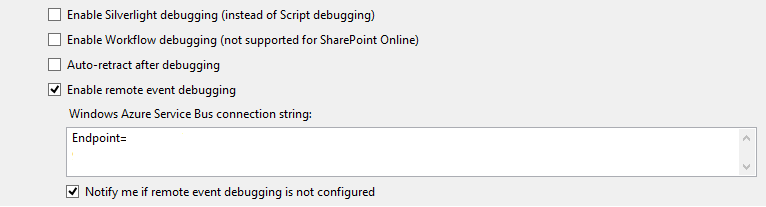
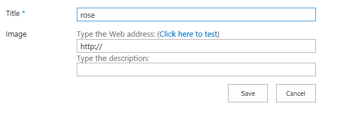

# SharePoint 2013: Add list item properties with a remote event receiver
## Requires
- Visual Studio 2012
## License
- Apache License, Version 2.0
## Technologies
- SharePoint Server 2013
- apps for SharePoint
## Topics
- apps for SharePoint
## Updated
- 06/13/2014
## Description

<table id="bottomTable" cellspacing="0" cellpadding="0">
<tbody>
<tr id="headerTableRow1">
<td align="left">&nbsp;</td>
</tr>
<tr id="headerTableRow2">
<td align="left">SharePoint 2013: Add list item properties with a remote event receiver</td>
</tr>
</tbody>
</table>

Learn how to create a remote event receiver in a provider-hosted app for SharePoint.

<strong>Last modified: </strong>April 07, 2014

<strong>In this article</strong>  
<a href="#sectionSection0">Prerequisites</a>  
<a href="#sectionSection1">Key components</a>  
<a href="#sectionSection2">Configure the sample</a>  
<a href="#sectionSection3">Build and deploy the sample</a>  
<a href="#sectionSection4">Run and test the sample</a>  
<a href="#sectionSection5">Change log</a>  
<a href="#sectionSection6">Related content</a>

Provided by: Thomas Mechelke, Microsoft Corporation

This sample shows how to add a remote event receiver to a provider-hosted app for SharePoint. The app creates a list of plants on the app web of your SharePoint site. Whenever you add an item to the list, the remote event receiver populates the new item's
 image search property.

<strong>

Figure 1. New list item with image search property

</strong> 
<strong></strong>

<h1>Prerequisites</h1>

This sample requires the following:

<ul>
<li>

An Office 365 Developer Site

</li><li>

Visual Studio 2012 and Office Developer Tools for Visual Studio 2012 installed on your development computer

</li><li>

A <a href="https://manage.windowsazure.com" target="_blank">Microsoft Azure account</a> with permissions to create a service bus

</li></ul>

<h1>Key components</h1>

&nbsp;

<ul>
<li>

<strong>RemoteEventReceiverApp</strong> project, which contains:

<ul>
<li>

<strong>AppManifest.xml</strong>: The configuration file that defines the app as a provider-hosted app for SharePoint.

</li><li>

<strong>Plants</strong>: The custom list that deploys with the app.

</li></ul>
</li><li>

<strong>RemoteEventReceiverAppWeb</strong> project, which contains:

<ul>
<li>

<strong>Services\OnPlantUpdated.svc</strong>. Defines the remote event receiver for the app.

</li><li>

<strong>Web.config</strong>. Stores the client id and client secret.

</li></ul>
</li></ul>

<h1>Configure the sample</h1>

Follow these steps to configure the sample.

<ol>
<li>

Open the <strong>RemoteEventReceiverApp.sln</strong> file in Visual Studio 2012.

</li><li>

In the <strong>Properties</strong> pane, change the <strong>
Site URL</strong> property. It is the absolute URL of your SharePoint test site collection on Office 365:
https://&lt;my tenant&gt;.sharepoint.com/sites/dev.

</li></ol>

<h1>Build and deploy the sample</h1>

Follow these steps to build and deploy the sample.

<h3>To configure and deploy the app for SharePoint</h3>

<ol>
<li>

Create a service bus namespace on <a href="https://manage.windowsazure.com" target="_blank">
Microsoft Azure</a>, and copy its connection string. <a href="http://msdn.microsoft.com/en-us/library/windowsazure/hh690931.aspx" target="_blank">
How To: Create or Modify a Service Bus Service Namespace</a> explains how to do this.

</li><li>

Right-click the <strong>RemoteEventReceiverApp</strong> project in
<strong>Solution Explorer</strong>, and choose <strong>
Properties</strong>.

</li><li>

Navigate to the SharePoint tab, and select the <strong>Enable remote event debugging</strong> check box.

</li><li>

For <strong>Microsoft Azure Service Bus Connection String</strong>, enter the connection string for the new service bus namespace that you created.

<strong>

Figure 2. Select the enable remote event debugging check box and enter the Microsoft Azure service bus connection string

</strong> 
<strong></strong> </li><li>

Press F5 to build and deploy the app.

</li><li>

Choose <strong>Trust It</strong>, and wait for the start page of the app to load.

</li></ol>

<h1>Run and test the sample</h1>

<ol>
<li>

In the web browser, add a plant name to the list that appears when you start the app.

<strong>

Figure 3. Add a plant name to the list that deploys with the app

</strong> 
<strong></strong> </li><li>

The app has a break point in the code for the remote event receiver, so you will return to Visual Studio 2012 and see the code. Press F5 to continue.

</li><li>

The new item will appear in the list, along with the image search field that the remote event receiver has populated.

</li></ol>

<h1>Change log</h1>

<strong>

</strong>

<table cellspacing="2" cellpadding="5" width="50%" frame="lhs">
<tbody>
<tr>
<th>

Version

</th>
<th>

Date

</th>
</tr>
<tr>
<td>

First version

</td>
<td>

July 2013

</td>
</tr>
</tbody>
</table>

<h1>Related content</h1>

<ul>
<li>

<a href="http://channel9.msdn.com/Series/Reimagine-SharePoint-Development/Migrating-a-SharePoint-Event-Receiver-to-a-Remote-Event-Receiver" target="_blank">Migrating a SharePoint Event Receiver to a Remote Event Receiver</a>

</li></ul>

&nbsp;

