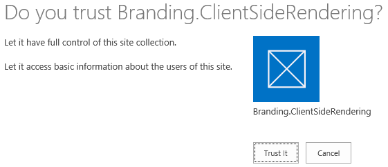

# SharePoint 2013: Client-side rendering and remote provisioning pattern
## Requires
- Visual Studio 2013
## License
- Apache License, Version 2.0
## Technologies
- SharePoint Server 2013
- apps for SharePoint
## Topics
- Client Side Rendering
- JSLink
## Updated
- 09/10/2014
## Description

<table id="bottomTable" cellspacing="0" cellpadding="0">
<tbody>
<tr id="headerTableRow1">
<td align="left">&nbsp;</td>
</tr>
<tr id="headerTableRow2">
<td align="left"><strong>SharePoint 2013: Client-side rendering and remote provisioning of SharePoint artifacts and JSLink files</strong></td>
</tr>
</tbody>
</table>

<strong>Summary: </strong>This sample demonstrates how to use a provider-hosted app to remotely provision SharePoint artifacts and JSLink files that use client-side rendering to customize the look and behavior of SharePoint lists, list fields, etc.

<strong>Last modified: </strong>September 08, 2014

<em><strong>Applies to: </strong>apps for SharePoint&nbsp;| SharePoint Server 2013</em>

<strong>In this article</strong> 
<a href="file://ipoawsfs201/DropZone/Rawhide/FileDropOff/Readmes_SP15_Beta2/Jimcrowley/Branding.ClientSideRendering/Branding.ClientSideRendering.htm#O15Readme_Prereq">Prerequisites</a> 
<a href="file://ipoawsfs201/DropZone/Rawhide/FileDropOff/Readmes_SP15_Beta2/Jimcrowley/Branding.ClientSideRendering/Branding.ClientSideRendering.htm#O15Readme_components">Key components</a> 
<a href="file://ipoawsfs201/DropZone/Rawhide/FileDropOff/Readmes_SP15_Beta2/Jimcrowley/Branding.ClientSideRendering/Branding.ClientSideRendering.htm#O15Readme_config">Configure the sample</a> 
<a href="file://ipoawsfs201/DropZone/Rawhide/FileDropOff/Readmes_SP15_Beta2/Jimcrowley/Branding.ClientSideRendering/Branding.ClientSideRendering.htm#O15Readme_test">Run and test the sample</a> 
<a href="file://ipoawsfs201/DropZone/Rawhide/FileDropOff/Readmes_SP15_Beta2/Jimcrowley/Branding.ClientSideRendering/Branding.ClientSideRendering.htm#O15Readme_Changelog">Change log</a> 
<a href="file://ipoawsfs201/DropZone/Rawhide/FileDropOff/Readmes_SP15_Beta2/Jimcrowley/Branding.ClientSideRendering/Branding.ClientSideRendering.htm#O15Readme_RelatedContent">Related content</a>

This sample combines the JSLink samples from <a href="http://code.msdn.microsoft.com/office/Client-side-rendering-JS-2ed3538a" target="_blank">
Muawiyah Shannak's Client-side rendering (JSLink) code samples</a> into a single provider-hosted app for SharePoint that provisions the JSLink files. This sample demonstrates how the remote provisioning pattern may be used to deploy client-side rendering components
 and associate them with views and forms in a SharePoint list.

Client-side rendering provides you with a mechanism that allows you to render customized output for a set of controls that are hosted in a SharePoint page (list views, add and edit forms, etc.). This mechanism enables you to use standard web technologies,
 such as HTML and JavaScript, to define the rendering logic of custom and predefined field types.

You can see the GitHub version of this sample in the <a href="https://github.com/OfficeDev/PnP/tree/master/Samples/Branding.ClientSideRendering" target="_blank">
Office365 Development Patterns and Practices</a> repository.

<table cellspacing="0" cellpadding="0" width="100%">
<tbody>
<tr>
<th align="left"><strong>Note</strong></th>
</tr>
<tr>
<td>

The <a href="https://github.com/SPCSR/DisplayTemplates" target="_blank">DisplayTemplates repository on GitHub</a> contains a number of JSLink display template samples that have been created by the SharePoint community.

</td>
</tr>
</tbody>
</table>

<a name="O15Readme_Prereq">
<h2 class="heading">Prerequisites</h2>

This sample requires the following:

<ul>
<li>

An Office 365 Developer Site

</li><li>

Visual Studio 2013 and Office Developer Tools for Visual Studio 2013 installed on your development computer

</li></ul>

</a>
<h2 class="heading"><a name="O15Readme_components">Key components</a><a name="O15Readme_components" style="font-size:10px">

&nbsp;

</a></h2>

<ul>
<li>

<strong>Branding.ClientSideRendering</strong> project, which contains:

<strong>AppManifest.xml</strong>: The configuration file that defines the app as a provider-hosted app for SharePoint.

</li><li>

<strong>Branding.ClientSideRenderingWeb</strong> project, which contains:

<ul>
<li>

<strong>Pages\Default.aspx</strong>. The starter page that presents links to all of the JSLink samples.

</li><li>

<strong>Pages\Default.aspx.cs</strong>. The file that contains the code that uploads the JSLink samples and remotely provisions all of the SharePoint artifacts (lists, list items, list views, etc.) that are affected by the JSLink files.

</li><li>

<strong>Web.config</strong>. Stores the client id and client secret.

</li></ul>
</li></ul>

<a name="O15Readme_config">
<h2 class="heading">Configure the sample</h2>

Follow these steps to configure the sample.

<ol>
<li>

Open the <strong>Branding.ClientSideRendering.sln</strong> file in Visual Studio 2013.

</li><li>

In the Properties pane, change the 
Site URL property. It is the absolute URL of your SharePoint test site collection on Office 365:
https://&lt;my tenant&gt;.sharepoint.com/sites/dev.

You may be prompted to enter your user name and password to log in to your developer site.

</li></ol>

</a><a name="O15Readme_test">
<h2 class="heading">Run and test the sample</h2>

<ol>
<li>

In Visual Studio 2013, press F5. The trust dialog will appear in your web browser. Figure 1 shows how this dialog will appear.

Figure 1: Client-side rendering trust dialog

 

</li><li>

In the trust dialog, click the Trust It button. The start page of the provider-hosted app will appear in your web browser.

</li><li>

On the start page of the app, click the Provision Samples button. This remotely provisions all of the JSLink files and SharePoint artifacts that the sample requires.

Figure 2: Client-side rendering start page and provision samples button

 

</li><li>

After the app has finished provisioning the samples, use the links to view each JSLink sample.

</li></ol>

</a><a name="O15Readme_Changelog">
<h2 class="heading">Change log</h2>

<table cellspacing="2" cellpadding="5" width="50%" frame="lhs">
<tbody>
<tr>
<th>

Version

</th>
<th>

Date

</th>
</tr>
<tr>
<td>

First version

</td>
<td>

September 2013

</td>
</tr>
</tbody>
</table>

</a><a name="O15Readme_RelatedContent">
<h2 class="heading">Related content</h2>
</a>

<ul>

<li>

<a href="https://github.com/OfficeDev/PnP/tree/master/Samples/Branding.ClientSideRendering" target="_blank">Office365 Development Patterns and Practices</a>

</li><li>

<a href="https://github.com/SPCSR/DisplayTemplates" target="_blank">DisplayTemplates repository on GitHub</a>

</li><li>

<a href="http://msdn.microsoft.com/en-us/magazine/dn745867.aspx" target="_blank">Using JSLink with SharePoint 2013</a>

</li><li>

<a href="http://code.msdn.microsoft.com/office/Client-side-rendering-JS-2ed3538a" target="_blank">Client-side rendering (JSLink) code samples</a>

</li></ul>

