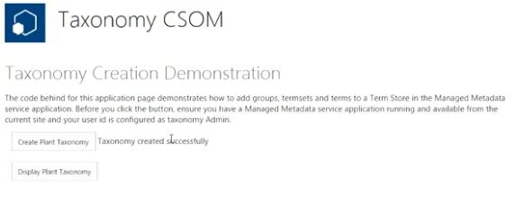

# SharePoint 2013: Create a taxonomy group in an app for SharePoint
## Requires
- Visual Studio 2012
## License
- Apache License, Version 2.0
## Technologies
- SharePoint Server 2013
- apps for SharePoint
## Topics
- apps for SharePoint
## Updated
- 06/13/2014
## Description

<table id="bottomTable" cellspacing="0" cellpadding="0">
<tbody>
<tr id="headerTableRow1">
<td align="left">&nbsp;</td>
</tr>
<tr id="headerTableRow2">
<td align="left">SharePoint 2013: Create a taxonomy group in an app for SharePoint</td>
</tr>
</tbody>
</table>

Learn how to create a taxonomy group in a provider-hosted app for SharePoint.

Provided by: Thomas Mechelke, Microsoft Corporation

This sample shows you how to add a taxonomy group to the term store of a SharePoint 2013 site with a provider-hosted app for SharePoint. This app works only for users who are administrators of the site's enterprise metadata service.

<strong>

Figure 1. Create a new taxonomy group

</strong> 
<strong></strong>

<h1>Prerequisites</h1>

This sample requires the following:

<ul>
<li>

An Office 365 Developer Site

</li><li>

Visual Studio 2012 and Office Developer Tools for Visual Studio 2012 installed on your development computer

</li></ul>

<h1>Key components</h1>

&nbsp;

<ul>
<li>

<strong>TaxonomyApp</strong> project, which includes the AppManifest.xml file that contains the registration information for the provider-hosted app for SharePoint.

</li><li>

<strong>TaxonomyAppWeb</strong> project, which contains:

<ul>
<li>

<strong>Pages\Default.aspx</strong>. The page that displays the app's user interface.

</li><li>

<strong>Web.config</strong>. Stores the client id and client secret.

</li></ul>
</li></ul>

<h1>Configure the sample</h1>

Follow these steps to configure the sample.

<ol>
<li>

Open the <strong>TaxonomyApp.sln</strong> file in Visual Studio 2012.

</li><li>

In the <strong>Properties</strong> pane, change the <strong>
Site URL</strong> property. It is the absolute URL of your SharePoint test site collection on Office 365:
https://&lt;my tenant&gt;.sharepoint.com/sites/dev.

</li></ol>

<h1>Build and deploy the sample</h1>

Before you run the sample, you'll need to make sure that you are an administrator for the enterprise metadata service of your site.

<h3>To make yourself an enterprise metadata service administrator</h3>

<ol>
<li>

Navigate to the home page of your Office 365 Developer Site.

</li><li>

Click on the <strong>Admin</strong> dropdown menu in the upper right corner of the page. Select
<strong>SharePoint</strong>.

</li><li>

Click on the term store link in the left pane.

</li><li>

Enter the user id and domain that you created for your developer site in the <strong>
Term Store Administrators</strong> box, as in Figure 2.

<strong>

Figure 2. Make yourself a term store administrator

</strong> 
<strong></strong> </li><li>

Press F5 to build and deploy the app.

</li><li>

Choose <strong>Trust It</strong>, and wait for the start page of the app to load.

</li></ol>

<h1>Run and test the sample</h1>

<ol>
<li>

In the web browser, click on the <strong>Create Plant Taxonomy</strong> box to create the new taxonomy group.

</li><li>

Click on the Display Plant Taxonomy box to see the new taxonomy group.

</li></ol>

<h1>Change log</h1>

<strong>

</strong>

<table cellspacing="2" cellpadding="5" width="50%" frame="lhs">
<tbody>
<tr>
<th>

Version

</th>
<th>

Date

</th>
</tr>
<tr>
<td>

First version

</td>
<td>

July 2013

</td>
</tr>
</tbody>
</table>

<h1>Related content</h1>

<ul>
<li>

<a href="http://channel9.msdn.com/Series/Reimagine-SharePoint-Development/Understanding-the-differences-between-Server-Side-Object-Model-and-the-Client-Side-Object-Model" target="_blank">Understanding the differences between Server-Side Object Model and
 the Client-Side Object Model</a>

</li></ul>

&nbsp;

