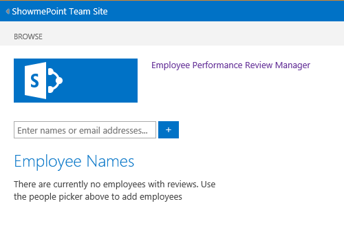
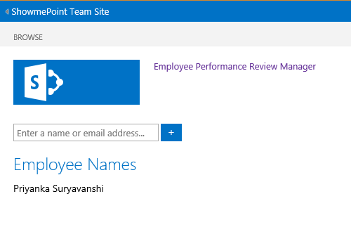
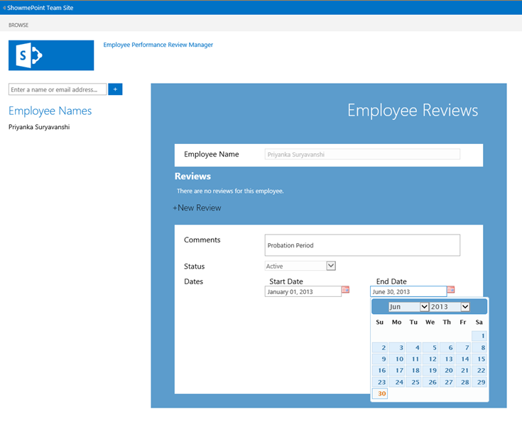
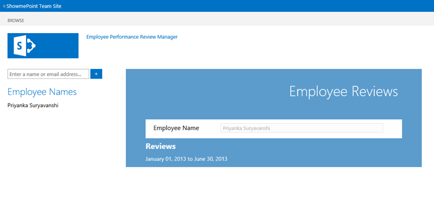
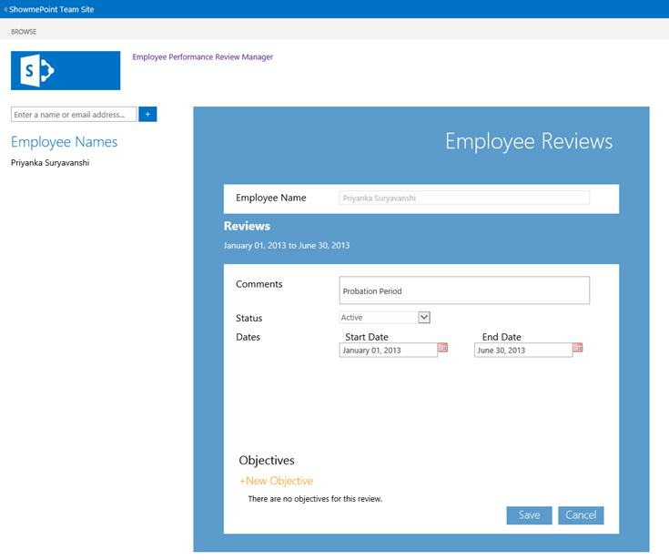
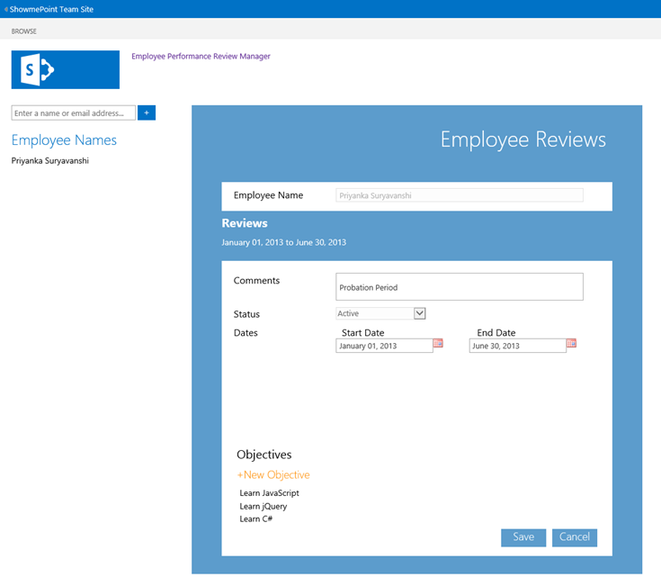
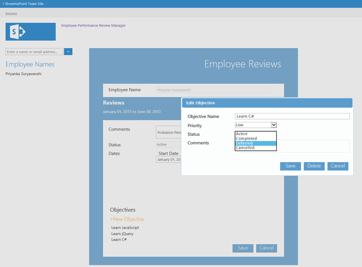
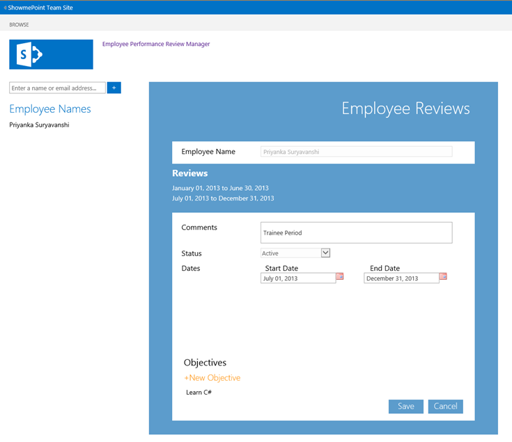
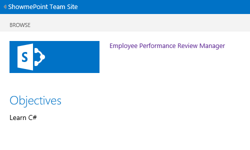
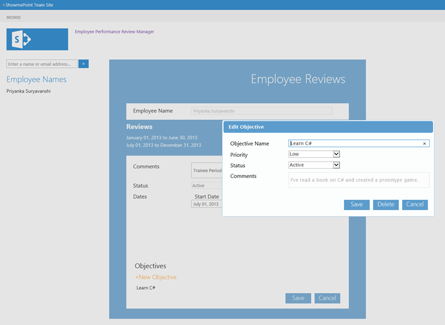

# SharePoint 2013: Employee performance review manager
## Requires
- Visual Studio 2012
## License
- Apache License, Version 2.0
## Technologies
- Javascript
- SharePoint Server 2013
- SharePoint Foundation 2013
- apps for SharePoint
## Topics
- data and storage
## Updated
- 06/27/2013
## Description

<table id="bottomTable" cellspacing="0" cellpadding="0">
<tbody>
<tr id="headerTableRow1">
<td align="left">&nbsp;</td>
</tr>
<tr id="headerTableRow2">
<td align="left">SharePoint 2013: Employee performance review manager</td>
</tr>
</tbody>
</table>

&nbsp;

Demonstrates how to use JavaScript and jQuery in an app for SharePoint to implement a scenario for managing employee review periods and associated objectives.

Provided by: <a href="http://mvp.microsoft.com/en-US/findanmvp/Pages/profile.aspx?MVPID=c558e0ed-382f-4008-8002-4634a9167b99" target="_blank">
Martin Harwar</a>, <a href="http://point8020.com/Default.aspx" target="_blank">Point8020.com</a>

The solution is based on the SharePoint-hosted app template provided by Visual Studio 2012. The solution uses the JavaScript implementation of the client object model to read, create, update, and delete data from lists based on user actions. The list data
 in this solution represents employees, review periods, and objectives.

In this app, users are either reviewers or employees. Reviewers create review periods that contain objectives. Employees can add comments to an objective. At the end of the review period, reviewers can mark the objectives as completed, deferred, or cancelled,
 and then create the next review period. Deferred objectives from the previous review period are automatically added to the new review.

The user interface is implemented with simple HTML elements and Cascading Style Sheet (CSS) styles to present a modern look and feel. The user interface also includes a client-side implementation of the SharePoint People Picker control. JavaScript and jQuery
 are used to control all aspects of the user interface, and the solution contains no server-side code.

<h1>Prerequisites</h1>

This sample requires the following:

<ul>
<li>

Office Developer Tools for Visual Studio 2012

</li><li>

Visual Studio 2012

</li><li>

Either:

<ul>
<li>

Access to an Office 365 Enterprise site that has been configured to host apps (recommended). In this environment, you will be able to add multiple users to the site, and can then treat those users as employees.

<table cellspacing="0" cellpadding="0" width="100%">
<tbody>
<tr>
<th align="left"><strong>Note</strong> </th>
</tr>
<tr>
<td>

Using an Office 365 Developer Site is not recommended because you will probably only be able to add one employee.

</td>
</tr>
</tbody>
</table>

</li><li>

SharePoint Server 2013 configured to host apps, and with a Developer Site Collection already created.

</li></ul>
</li></ul>

<h1>Key components</h1>

This sample app contains the following:

<ul>
<li>

The <strong>Default.aspx</strong> webpage, which is used to present the employees, review periods, and objectives to reviewers. It also presents a list of current objectives to employees (reviewees).

</li><li>

The <strong>App.js</strong> file in the
<strong>scripts</strong> folder, which is used to retrieve and manage employee, review period, and objective data by using the JavaScript implementation of the client object model (JSOM). The
<strong>App.js</strong> file also contains the user interface logic that is implemented in
<strong>Default.aspx</strong>.

</li><li>

The <strong>App.css</strong> file in the
<strong>contents</strong> folder, which contains style definitions used by the elements in
<strong>Default.aspx</strong>.

</li><li>

List definition instances for the Employee, Review, Objective, and DeferredObjective lists, in the respective folders. For example, the Employee list definition schema file is
<strong>Schema.xml</strong> in the 
<strong>Employee</strong> folder.

</li><li>

All other files are automatically provided by the Visual Studio project template for apps for SharePoint, and they have not been modified in the development of this sample app.

</li></ul>

<h1>Configure the sample</h1>

Follow these steps to configure the sample.

<ol>
<li>

Open the <strong>SP_EmployeePerformance_js.sln</strong> file with Visual Studio 2012.

</li><li>

In the <strong>Properties</strong> window, add the full URL to your Office 365 Enterprise site or SharePoint Server 2013 Developer Site collection to the
<strong>Site URL</strong> property. You may be prompted to provide credentials if you added a URL to an Office 365 site.

</li><li>

No other configuration is necessary.

</li></ol>

<h1>Build, run, and test the sample</h1>

<ol>
<li>

Press Ctrl&#43;Shift&#43;B to build the solution.

</li><li>

Press F5 to run the app.

</li><li>

Sign in to your SharePoint Server 2013 or Office 365 Enterprise site if you are prompted to do so by the browser.

</li><li>

When the app appears, it determines whether you are a reviewer or an employee based on your SharePoint permissions. If your permissions include &quot;manage web&quot;, you are a reviewer, otherwise you are an employee (reviewee).

If you are a reviewer, the starting screen will resemble Figure 1. From here, you can start adding employees by using the people picker.

Users who are not reviewers will see their starting screen as described in step 14. These users can only enter comments on existing objectives.

<strong>

Figure 1. Start screen for a reviewer

</strong> 
 </li><li>

When you start typing in an employee's name, the people picker can find matches for current site members.

When you select a user and then click the <strong>&#43;</strong> (plus sign) button, the user is added as an employee, as shown in Figure 2.

<strong>

Figure 2. New employee added

</strong> 
 </li><li>

When you click an employee name, their reviews (if any) are displayed, or you are informed that the user does not currently have any reviews.

When you click the <strong>&#43; New Review</strong> link, the screen resembles Figure 3. You can enter comments, and you must choose a start date and an end date to represent the review period.

<strong>

Figure 3. New review form

</strong> 
 </li><li>

When the new review period has been saved, the screen resembles Figure 4. You can see the review period listed.

<strong>

Figure 4. New review added

</strong> 
 </li><li>

When you click a review period, the screen resembles Figure 5. You can now add objectives for this employee's review period.

<strong>

Figure 5. New review form

</strong> 
 </li><li>

When you click the <strong>&#43; New Objective</strong> link, a client-side jQuery dialog box appears, as shown in Figure 6. You can then enter the objective and set its status and priority.

<strong>

Figure 6. New objective form

</strong> 
 </li><li>

Figure 7 shows a review period with multiple objectives.

<strong>

Figure 7. Review with multiple objectives

</strong> 
 </li><li>

When you click an objective, you can set the status to one of four values: 
<strong>Active</strong>, <strong>Completed</strong>,
<strong>Deferred</strong>, or <strong>Cancelled</strong>, as shown in Figure 8. Note that while at least one objective in a review period is
<strong>Active</strong>, the entire review period is considered
<strong>Active</strong>, and you will not be allowed to set the review to
<strong>Completed</strong> or start another review.

<strong>

Figure 8. Setting an objective's status

</strong> 
 </li><li>

When all objectives in a review have been set to a value other than <strong>Active</strong>, you can then mark the review period as
<strong>Completed</strong>, as shown in Figure 9.

<strong>

Figure 9. Setting a review period's status

</strong> 
 </li><li>

When a review has been set to <strong>Completed</strong>, you can then create another review period for the employee.

If the previous review included any objectives that are marked as <strong>Deferred</strong>, they are automatically added to the new review period and marked as
<strong>Active</strong>. Figure 10 shows how the objective named &quot;Learn C#&quot; that was deferred in the original review period has been carried over.

<strong>

Figure 10. New review form with a previously deferred objective

</strong> 
 </li><li>

Figure 11 shows an example of the app when an employee has logged in. Their current objectives are listed.

<strong>

Figure 11. Start screen for an employee

</strong> 
 </li><li>

When an employee clicks one of the objectives, the screen resembles Figure 12. The employee can add or edit the
<strong>Employee Comments</strong> field, but cannot change anything else about the objective.

<strong>

Figure 12. Objective details form for an employee

</strong> 
 </li><li>

When a reviewer clicks an objective to which the employee has added a comment, the comment appears as in Figure 13. The reviewer can then change the objective's status as appropriate, as described in step 11.

<strong>

Figure 13. Reviewer's view of an employee's comment on an objective

</strong> 
 </li></ol>

<h1>Troubleshooting</h1>

Ensure that you have SharePoint Server 2013 configured to host apps (with a Developer Site Collection already created), or that you have signed up for an Office 365 Enterprise site configured to host apps.

<h1>Change log</h1>

<strong>

</strong>

<table cellspacing="2" cellpadding="5" width="50%" frame="lhs">
<tbody>
<tr>
<th>

Version

</th>
<th>

Date

</th>
</tr>
<tr>
<td>

First version

</td>
<td>

June 2013

</td>
</tr>
</tbody>
</table>

<h1>Related content</h1>

<ul>
<li>

<a href="http://msdn.microsoft.com/en-us/library/fp179930.aspx" target="_blank">Apps for SharePoint overview</a>

</li><li>

<a href="http://msdn.microsoft.com/en-us/library/jj713593.aspx" target="_blank">SharePoint People Picker control</a>

</li><li>

<a href="http://www.jQuery.com" target="_blank">jQuery</a>

</li></ul>

&nbsp;

&nbsp;

