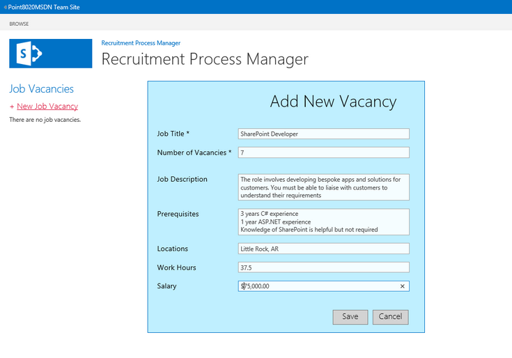
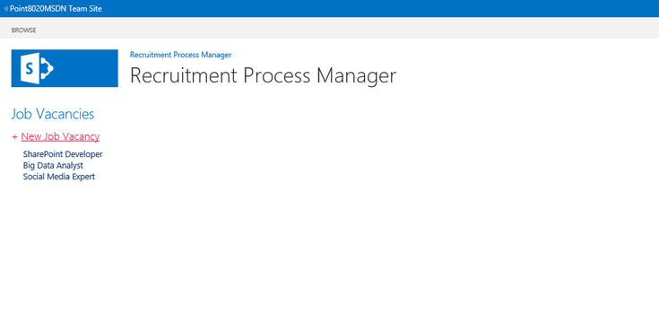
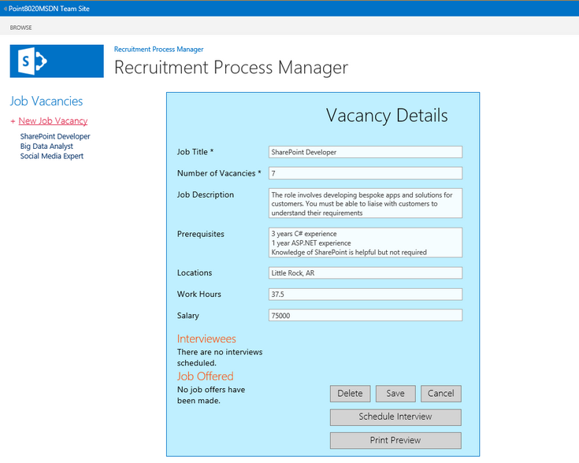
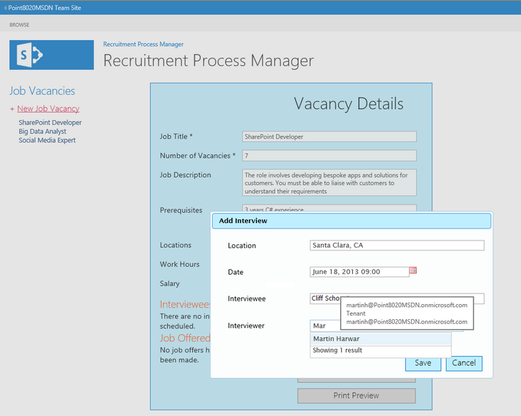
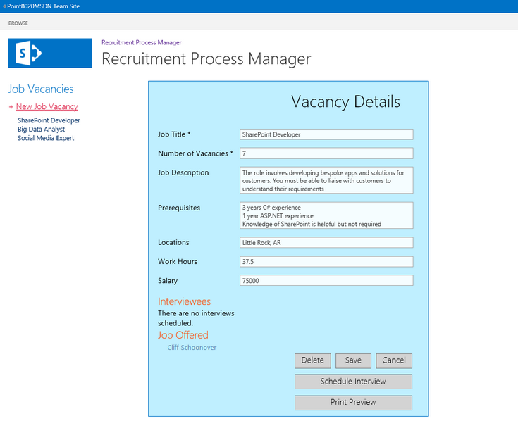

# SharePoint 2013: Employee recruitment process manager app
## Requires
- Visual Studio 2012
## License
- Apache License, Version 2.0
## Technologies
- Javascript
- Sharepoint Online
- SharePoint Server 2013
- SharePoint Foundation 2013
## Topics
- data and storage
## Updated
- 07/31/2013
## Description

<table id="bottomTable" cellspacing="0" cellpadding="0">
<tbody>
<tr id="headerTableRow1">
<td align="left">&nbsp;</td>
</tr>
<tr id="headerTableRow2">
<td align="left">SharePoint 2013: Employee recruitment process manager app</td>
</tr>
</tbody>
</table>

Demonstrates how to use JavaScript and jQuery in an app for SharePoint that manages job vacancies, descriptions, prerequisites, salary, locations, interviews, and job offers.

Provided by: <a href="http://mvp.microsoft.com/en-us/mvp/Martin%20Harwar-4025664" target="_blank">
Martin Harwar</a>, <a href="http://point8020.com/Default.aspx" target="_blank">Point8020.com</a>

In this app, a Human Resources (HR) administrator tracks the progress of a job vacancy, from the job description through interviews to an offer letter.

This solution is based on the SharePoint-hosted app template provided by Visual Studio 2012. The solution uses the JavaScript implementation of the client object model to read, create, update, and delete data from lists based on user actions. The lists included
 in this solution represent job vacancies (including data such as job titles, number of vacancies, location, role descriptions, job prerequisites, and salary) and calendared interviews (including interviewee data, interviewer data, interview location, notes,
 and outcomes).

The lists are related to each other through lookup fields, and the user interface (UI) ensures that all data operations synchronize with their list items so that the relationships are maintained. The UI is implemented with HTML elements and cascading style
 sheet (CSS) styles to present a modern look and feel. JavaScript and jQuery are used to control all aspects of the UI, and the solution contains no server-side code.

<h1>Prerequisites</h1>

This sample requires the following:

<ul>
<li>

Visual Studio 2012

</li><li>

Office Developer Tools for Visual Studio 2012

</li><li>

Either of the following:

<ul>
<li>

Access to an Office 365 Enterprise site that has been configured to host apps (recommended).

</li><li>

SharePoint Server 2013 configured to host apps, and with a Developer Site Collection already created.

</li></ul>
</li></ul>

<h1>Key components</h1>

The sample app contains the following:

<ul>
<li>

The <strong>Default.aspx</strong> webpage, which is used by HR administrators to create job vacancies, print job descriptions, schedule interviews, record details of any job offers to candidates, and to print job
 offer letters.

</li><li>

The <strong>App.js</strong> file in the
<strong>scripts</strong> folder, which is used to retrieve and manage job and recruitment data by using the JavaScript implementation of the client object model (JSOM). The
<strong>App.js</strong> file also contains the UI logic that is implemented in
<strong>Default.aspx</strong>, including the ability to print from the app.

</li><li>

The <strong>App.css</strong> file in the
<strong>contents</strong> folder, which contains style definitions used by the elements in
<strong>Default.aspx</strong>.

</li><li>

Two list definitions and instances: one for job vacancies tables, and one calendared list for interviews. The lists are linked together by lookup fields.

</li><li>

All other files are automatically provided by the Visual Studio 2012 project template for apps for SharePoint, and they have not been modified in the development of this sample app.

</li></ul>

<h1>Configure the sample</h1>

Follow these steps to configure the sample.

<ol>
<li>

Open the <strong>SP_RecruitmentProcessManager_js.sln</strong> file in Visual Studio 2012.

</li><li>

In the <strong>Properties</strong> window, add the full URL to your Office 365 Enterprise site or SharePoint Server 2013 Developer Site Collection to the
<strong>Site URL</strong> property. You may be prompted to provide credentials if you add a URL to an Office 365 site.

</li><li>

No other configuration is necessary.

</li></ol>

<h1>Build, run, and test the sample</h1>

&nbsp;

<ol>
<li>

Press Ctrl&#43;Shift&#43;B to build the solution.

</li><li>

Press F5 to run the app.

</li><li>

Sign in to your SharePoint Server 2013 or Office 365 Enterprise site if you are prompted to do so by the browser.

</li><li>

When the app appears, the starting screen resembles Figure 1.

<strong>

Figure 1. Start screen

</strong> 
&nbsp; </li><li>

Click <strong>New Job Vacancy</strong> to enter the details for a new job, as shown in Figure 2.

<strong>

Figure 2. Add New Vacancy form

</strong> 
&nbsp; </li><li>

Figure 3 shows that three jobs have been created.

<strong>

Figure 3. List of job vacancies

</strong> 
&nbsp; </li><li>

Click a vacancy name to see its details, as shown in Figure 4. You can update and save the details, and schedule an interview or print a job description document.

<strong>

Figure 4. Vacancy Details form

</strong> 
&nbsp; </li><li>

Click <strong>Print Preview</strong> to see the job details in a printable format, as shown in Figure 5. The
<strong>[Print]</strong> link prints the document.

<strong>

Figure 5. Print Preview screen

</strong> 
&nbsp; </li><li>

Click <strong>Schedule Interview</strong> to enter a location and choose a date and time from the jQuery date picker, as shown in Figure 6.

<strong>

Figure 6. Adding an interview

</strong> 
&nbsp; </li><li>

Figure 7 shows how to use a people picker to select an interviewer from within your organization.

<strong>

Figure 7. Choosing an interviewer

</strong> 
&nbsp; </li><li>

After saving an interview, click a candidate interviewee's name to edit their interview details, as shown in Figure 8. You can update the details of the interview, or add notes about the interview if it has already taken place. You can also specify whether
 a job has been offered to the candidate.

<strong>

Figure 8. Editing interview details

</strong> 
&nbsp; </li><li>

When a job has been offered to a candidate, the candidate is moved from the <strong>
Interviewees</strong> list to the <strong>Job Offered</strong> list, as shown in Figure 9.

<strong>

Figure 9. Job Offered list

</strong> 
&nbsp; </li><li>

Click the name of a candidate to whom a job has been offered to see candidate details, as shown in Figure 10. From here, you can print an offer letter to send to the candidate.

<strong>

Figure 10. Candidate details

</strong> 
&nbsp; </li><li>

Figure 11 shows a preview of the job offer letter. The letter's content is built from boilerplate text merged with details of the candidate, job, and interview.

<strong>

Figure 11. Job offer letter

</strong> 
&nbsp; </li></ol>

<h1>Troubleshooting</h1>

Ensure that you have SharePoint Server 2013 properly configured to host apps (with a Developer Site Collection already created), or that you have signed up for an Office 365 Enterprise site configured to host apps.

&nbsp;

<h1>Change log</h1>

<strong>

</strong>

<table cellspacing="2" cellpadding="5" width="50%" frame="lhs">
<tbody>
<tr>
<th>

Version

</th>
<th>

Date

</th>
</tr>
<tr>
<td>

First version

</td>
<td>

July 2013

</td>
</tr>
</tbody>
</table>

<h1>Related content</h1>

<ul>
<li>

<a href="http://msdn.microsoft.com/en-us/library/fp179930.aspx" target="_blank">Apps for SharePoint overview</a>

</li><li>

<a href="http://www.jQuery.com" target="_blank">jQuery</a>

</li><li>

<a href="http://msdn.microsoft.com/en-us/library/jj713593.aspx" target="_blank">SharePoint People Picker control</a>

</li><li>

<a href="http://msdn.microsoft.com/en-us/library/ms970435.aspx" target="_blank">JavaScript</a>

</li></ul>

&nbsp;

