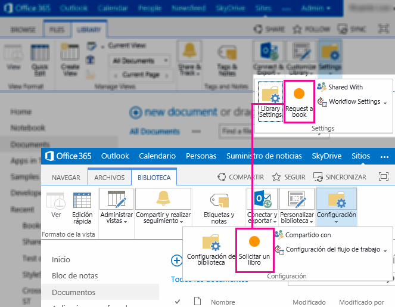

# SharePoint 2013: Localize the app web, host web, and remote components of an app
## License
- Apache License, Version 2.0
## Technologies
- Javascript
- SharePoint Server 2013
- SharePoint Foundation 2013
- apps for SharePoint
## Topics
- Data Access
- User Experience
## Updated
- 08/24/2015
## Description

This sample has been moved to <a href="https://github.com/OfficeDev/SharePoint-Add-in-Localization">
SharePoint-Add-in-Localization</a>.

 

<table id="bottomTable" cellspacing="0" cellpadding="0">
<tbody>
<tr id="headerTableRow1">
<td align="left">&nbsp;</td>
</tr>
<tr id="headerTableRow2">
<td align="left">SharePoint 2013: Localize the app web, host web, and remote components of an app</td>
</tr>
</tbody>
</table>

Summary:&nbsp;&nbsp;This sample simulates a bookstore by using a SharePoint 2013 document library in which every document is a book. End users can request and buy new books by using the provided custom actions. The components
 of the app are localized for English and Spanish.

<strong>Last modified: </strong>May 16, 2014

<strong>In this article</strong> 
 
<a href="#sectionSection1">Prerequisites</a> 
<a href="#sectionSection2">Key components of the sample</a> 
<a href="#sectionSection3">Configure the sample</a> 
<a href="#sectionSection4">Run and test the sample</a> 
<a href="#sectionSection5">Troubleshooting</a> 
<a href="#sectionSection6">Change log</a> 
<a href="#sectionSection7">Related content</a>

This sample includes a remote app that has webpages to handle the book request and book buying experiences in a simulated bookstore. Custom actions provide the link between the document library and the app pages. The cross-domain library provides data access
 from the remote app to the document library. The chrome control and SharePoint style sheet provide the classes to consistently style the app pages. A custom list provides storage for the orders placed by the end user. End users can use the provided app part
 to display the orders history.

The app can be installed in a SharePoint website provisioned in English (en-US) or Spanish (es-ES). The following app components are localized:

<ul>
<li>

App title

</li><li>

Custom lists

</li><li>

SharePoint page

</li><li>

Custom actions

</li><li>

App part

</li><li>

Web application pages

</li><li>

Chrome control

</li></ul>

Figure 1 shows the bookstore custom actions in English and Spanish.

<strong>Figure 1. Bookstore custom actions in English and Spanish</strong>

 

<h2 class="heading">Prerequisites</h2>

This sample requires the following:

<ul>
<li>

Microsoft Visual Studio 2013

</li><li>

Office Developer Tools for Visual Studio 2013 March, 2014, version or later.

</li><li>

A SharePoint 2013 development environment configured for apps

</li></ul>

<h2 class="heading">Key components of the sample</h2>

The sample contains the following:

<ul>
<li>

<strong>BookstoreApp project</strong>, which contains the following components:

<ul>
<li>

Request a book custom action

</li><li>

But this book custom action

</li><li>

My orders app part

</li><li>

Orders custom list

</li><li>

Order status custom list

</li><li>

Home SharePoint page

</li><li>

App web resource files

</li><li>

Host web resource files

</li><li>

JavaScript resource files

</li></ul>

&nbsp;

</li><li>

<strong>BookstoreWeb project</strong>, which contains the following components:

<ul>
<li>

BookOrders app page and JavaScript file

</li><li>

BookPurchase app page and JavaScript file

</li><li>

BookRequest app page and JavaScript file

</li><li>

ChromeLoader JavaScript file

</li><li>

Common JavaScript file

</li><li>

StyleLoader JavaScript file

</li><li>

Resource files

</li><li>

JavaScript resource files

</li></ul>
</li></ul>

<h2 class="heading">Configure the sample</h2>

Update the <strong>SiteUrl</strong> property of the solution with the URL of your SharePoint website. This should be an American English (en-US) site collection.

<h2 class="heading">Run and test the sample</h2>

You can test the sample by deploying it to an English SharePoint website, to a Spanish SharePoint website and to a French SharePoint website.

<ol>
<li>

Press F5 to build and deploy the app.

</li><li>

In the Grant permissions to the App page, click 
Trust It.

</li><li>

Follow the instructions on the SharePoint page.

Request a book by using the Ribbon custom action. Buy a book by using the ECB custom action.

Figure 2 shows the bookstore app start page.

<strong>Figure 2. Bookstore app start page</strong>

 

</li><li>

Create a Spanish (es-ES) site collection using the Developer Site template.

</li><li>

Change the SiteUrl property of the solution to the Spanish site collection.

</li><li>

Repeat the test for the Spanish site collection.

</li><li>

Create a French (fr-FR) site collection using the Developer Site template.

</li><li>

Change the SiteUrl property of the solution to the French site collection.

</li><li>

Repeat the test for the French site collection. Since the sample does not support French, you should get UI elements in the invariant language, which is English in this sample.

</li></ol>

<h2 class="heading">Troubleshooting</h2>

The following table lists common configuration and environment errors that prevent the sample from running or deploying properly, and how to solve them.

<table cellspacing="2" cellpadding="5" width="50%" frame="lhs">
<tbody>
<tr>
<th>

Problem

</th>
<th>

Solution

</th>
</tr>
<tr>
<td>

The app part does not display any content. The app part displays the following error:
<strong>Navigation to the webpage was canceled</strong>.

</td>
<td>

The browser blocked the content page. The solution might be different depending on the browser you are using:

<ul>
<li>

Internet Explorer 9 and 10 display the following message at the bottom of the page:
<strong>Only secure content is displayed</strong>. Click Show all content to display the app part content.

</li><li>

Internet Explorer 8 shows a dialog box with the following message: <strong>Do you want to view only the webpage content that was delivered securely?</strong>. Click
No to display the app part content.

</li></ul>
</td>
</tr>
<tr>
<td>

Error &quot;This content cannot be displayed in a frame.&quot; when the user selects the ECB custom action.

</td>
<td>

See this forum discussion: http://social.msdn.microsoft.com/Forums/sharepoint/en-US/fa6abb31-7251-4744-ab14-634cde38a42d/error-when-viewing-apps-that-utilize-webparts-this-content-cannot-be-displayed-in-a-frame?forum=appsforsharepoint

</td>
</tr>
</tbody>
</table>

<h2 class="heading">Change log</h2>

<table cellspacing="2" cellpadding="5" width="50%" frame="lhs">
<tbody>
<tr>
<th>

Version

</th>
<th>

Date

</th>
</tr>
<tr>
<td>

First version

</td>
<td>

July 16, 2012

</td>
</tr>
<tr>
<td>

Revised

</td>
<td>

April 2013

</td>
</tr>
<tr>
<td>

2nd Revision

</td>
<td>

May 2014

</td>
</tr>
</tbody>
</table>

<h2 class="heading">Related content</h2>

<ul>
<li>

<a href="http://msdn.microsoft.com/en-us/library/b0878c12-27c9-4eea-ae3b-7e79e5a8838d" target="_blank">Setting up a SharePoint 2013 development environment for apps</a>

</li><li>

<a href="http://msdn.microsoft.com/library/fp179919.aspx" target="_blank">How to: Localize apps for SharePoint</a>

</li><li>

<a href="http://msdn.microsoft.com/en-us/library/bfdd0a58-2cc5-4805-ac89-4bd2fe6f3b09" target="_blank">Create UX components</a>

</li><li>

<a href="http://msdn.microsoft.com/en-us/library/d60f409a-b292-4c06-8128-88629091b753" target="_blank">UX design for apps</a>

</li></ul>

