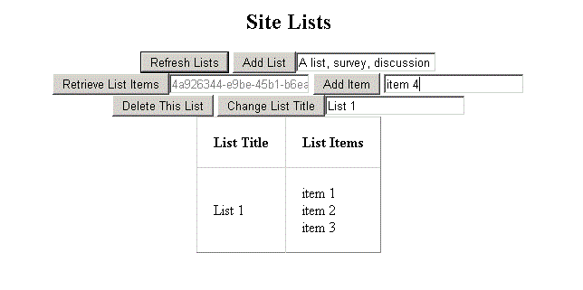

# SharePoint 2013: Perform basic data access operations by using CSOM in apps
## Requires
- 
## License
- Apache License, Version 2.0
## Technologies
- C#
- SharePoint Server 2013
- SharePoint Foundation 2013
- apps for SharePoint
- SharePoint Add-ins
## Topics
- data and storage
## Updated
- 08/17/2015
## Description

This sample has been moved to <a href="https://github.com/OfficeDev/SharePoint-Add-in-CSOM-BasicDataOperations">
SharePoint-Add-in-CSOM-BasicDataOperations</a>.

&nbsp;

The sample demonstrates how to read and write list and list item data by using objects and methods in the SharePoint 2013 client object model (CSOM). Additionally, it demonstrates how to obtain the context and access tokens
 that are necessary for reading and writing data in a provider-hosted app for SharePoint.

The code that uses the CSOM is located in the Home.aspx.cs file of the BasicDataOperationsWeb project. The following screen shot shows how the Home.aspx page of the app appears after you install and launch the app.

<strong>Figure 1. Home.aspx page in the app, which displays the controls for viewing and adding lists to and from the parent web</strong>

<h1>Prerequisites</h1>

This sample requires the following:

<ul>
<li>A SharePoint 2013 development environment that is configured for app isolation and OAuth
</li><li>Visual Studio 2012 and SharePoint development tools in Visual Studio 2012 installed on your developer computer
</li><li>Basic familiarity with the SharePoint CSOM and C#
</li></ul>
<h1>Key components of the sample</h1>

The basic data operations sample app contains the following:

<ul>
<li>BasicDataOperations project, which contains the AppManifest.xml file
</li><li>BasicDataOperationsWeb project
<ul>
<li>Home.aspx file, which contains the HTML and ASP.NET controls for the app&rsquo;s user interface.
</li><li>Home.aspx.cs file, which contains the C# code that uses the SharePoint CSOM to read and write data
</li><li>web.config file </li></ul>
</li></ul>
<h1>Configure the sample</h1>

To configure the perform basic data operations by using CSOM sample app, update the
<strong>SiteUrl</strong> property of the solution with the URL of the home page of your SharePoint 2013 site.

<h1>Build the sample</h1>

Press the F5 key to build and deploy the app.

<h1>Run and test the sample</h1>
<ol>
<li>Choose <strong>Trust It</strong> on the consent page to grant permissions to the app.
</li><li>Use the app&rsquo;s interface to read, create, and update lists and add list items on the parent SharePoint 2013 site.
</li></ol>
<h1>Examples</h1>

The following figure shows an example of how to use this app for SharePoint to view list items.

<strong>Figure 2. View list items from a list on the parent web</strong>

The following figure shows an example of how to use this app for SharePoint to add list items.

<strong>Figure 3. Add list items to a list on the parent web</strong>

<h1>Troubleshooting</h1>

The following table lists common configuration and environment errors that prevent the sample from running or deploying properly and how to solve them.

<table border="0" cellspacing="5" cellpadding="5" frame="void" align="left" style="width:601px; height:212px">
<tbody>
<tr style="background-color:#a9a9a9">
<th align="left" scope="col"><strong>Problem 
</strong></th>
<th align="left" scope="col"><strong>Solution</strong></th>
</tr>
<tr valign="top">
<td>Visual Studio does not open the browser after you press the F5 key.</td>
<td>Set the app for SharePoint project as the startup project.</td>
</tr>
<tr valign="top">
<td>HTTP error 405 <strong>Method not allowed</strong>.</td>
<td>Locate the applicationhost.config file in <em>%userprofile%</em>\Documents\IISExpress\config.

Locate the handler entry for <strong>StaticFile</strong>, and add the verbs
<strong>GET</strong>, <strong>HEAD</strong>, <strong>POST</strong>, <strong>DEBUG</strong>, and
<strong>TRACE</strong>.

</td>
</tr>
</tbody>
</table>
<h1> 
 
&nbsp; 
 
 
</h1>

&nbsp;

&nbsp;

&nbsp;

<h1>Change log</h1>

First version: July 16, 2012

<h1>Related content</h1>
<ul>
<li><a title="http://msdn.microsoft.com/library/f86e2695-4d7a-4fc5-bc23-689de96c4b06.aspx" href="http://msdn.microsoft.com/library/f86e2695-4d7a-4fc5-bc23-689de96c4b06.aspx">SharePoint 2013 development overview</a>
</li><li><a title="http://msdn.microsoft.com/library/f36645da-77c5-47f1-a2ca-13d4b62b320d.aspx" href="http://msdn.microsoft.com/library/f36645da-77c5-47f1-a2ca-13d4b62b320d.aspx">Choose
 the right API set in SharePoint 2013</a> </li></ul>
