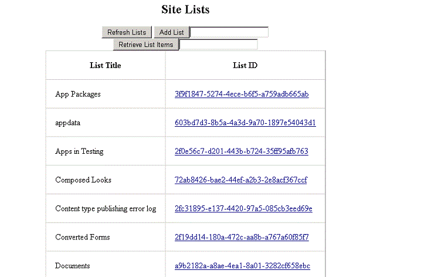
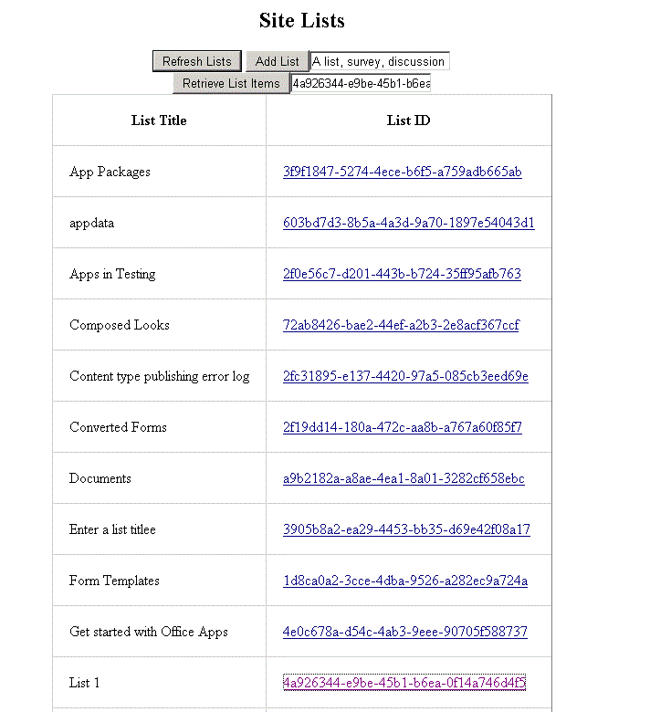

# SharePoint 2013: Perform basic data access operations by using REST in apps
## Requires
- 
## License
- Apache License, Version 2.0
## Technologies
- C#
- REST
- SharePoint Server 2013
- SharePoint Foundation 2013
- apps for SharePoint
- SharePoint Add-ins
## Topics
- data and storage
## Updated
- 08/08/2015
## Description

This sample has been moved to: <a title="SharePoint Add-in REST\OData Basic Data Operations" href="https://github.com/OfficeDev/SharePoint-Add-in-REST-OData-BasicDataOperations" target="_blank">
SharePoint Add-in REST\OData Basic Data Operations</a>. The description below may not match the new version.

&nbsp;

<strong>Old Description:</strong>

The code that uses the REST APIs is located in the Home.aspx.cs file of the BasicDataOperationsRESTWeb project. The following screen shot shows how the Home.aspx page of the app appears after you install and launch the app.

<strong>Figure 1. Home.aspx page in the app, which displays the controls for viewing and creating lists and list items</strong>

&nbsp;

The sample demonstrates the following:

<ul>
<li>How to read and write data to and from a parent web. This data conforms with the OData protocol to the REST endpoints where the list and list item entities are exposed.
</li><li>How to parse Atom-formatted XML returned from these endpoints and how to construct JSON-formatted representations of the list and list item entities so that you can perform
<strong>Create</strong> and <strong>Update</strong> operations on them. </li><li>Best practices for retrieving form digest and eTag values that are required for
<strong>Create</strong> and <strong>Update</strong> operations on lists and list items.
</li></ul>

For more information about the SharePoint REST APIs, see
<a href="http://msdn.microsoft.com/library/d4b5c277-ed50-420c-8a9b-860342284b72.aspx">
Programming using the SharePoint 2013 REST service</a>. For more information about working with JSON, Atom, and OData, see
<a href="http://www.odata.org/developers/protocols/json-format">OData: JavaScript Object Notation (JSON) Format</a> and
<a href="http://www.odata.org/developers/protocols/atom-format">OData: AtomPub Format</a>.

<h1>Prerequisites</h1>

This sample requires the following:

<ul>
<li>A SharePoint 2013 development environment that is configured for app isolation and OAuth
</li><li>Visual Studio 2012 and SharePoint development tools in Visual Studio 2012 installed on your developer computer
</li><li>Basic familiarity with RESTful web services
</li></ul>
<h1>Key components of the sample</h1>

The perform basic data operations by using REST sample app contains the following:

<ul>
<li>BasicDataOperationsREST project, which contains the AppManifest.xml file
</li><li>BasicDataOperationsRESTWeb project, which contains the following:
<ul>
<li>Home.aspx file, which contains the HTML and ASP.NET controls for the app&rsquo;s user interface.
</li><li>Home.aspx.cs file, which contains the C# code that uses the REST APIs to read and write data.
</li><li>Web.config file. </li></ul>
</li></ul>
<h1>Configure the sample</h1>

To configure the basic data operations sample app, update the
<strong>SiteUrl</strong> property of the solution with the URL of the home page of your SharePoint 2013 site.

<h1>Build the sample</h1>

Press the F5 key to build and deploy the app.

<h1>Run and test the sample</h1>
<ol>
<li>Press the F5 key to build and deploy the app.
</li><li>Choose <strong>Trust It</strong> on the consent page to grant permissions to the app.
</li><li>Use the app&rsquo;s interface to read, create, and update lists and add list items on the parent SharePoint 2013 Preview site.
</li></ol>
<h1>Examples</h1>

The following figure shows an example of how to use this app for SharePoint to view list items.

<strong>Figure 2. View list items from a list on the parent web</strong>

The following figure shows an example of how to use this app for SharePoint to add list items.

<strong>Figure 3. Add list items to a list on the parent web</strong>

<h1>Troubleshooting</h1>

The following table lists common configuration and environment errors that prevent the sample from running or deploying properly and how to solve them.

<table border="0" cellspacing="5" cellpadding="5" frame="void" align="left" style="width:601px; height:212px">
<tbody>
<tr style="background-color:#a9a9a9">
<th align="left" scope="col"><strong>Problem 
</strong></th>
<th align="left" scope="col"><strong>Solution</strong></th>
</tr>
<tr valign="top">
<td>Visual Studio does not open the browser after you press the F5 key.</td>
<td>Set the app for SharePoint project as the startup project.</td>
</tr>
<tr valign="top">
<td>HTTP error 405 <strong>Method not allowed</strong>.</td>
<td>Locate the applicationhost.config file in <em>%userprofile%</em>\Documents\IISExpress\config.

Locate the handler entry for <strong>StaticFile</strong>, and add the verbs
<strong>GET</strong>, <strong>HEAD</strong>, <strong>POST</strong>, <strong>DEBUG</strong>, and
<strong>TRACE</strong>.

</td>
</tr>
</tbody>
</table>
<h1> 
 
&nbsp; 
 
 
</h1>

&nbsp;

&nbsp;

&nbsp;

<h1>Change log</h1>

First version: July 16, 2012

<h1>Related content</h1>
<ul>
<li><a title="http://msdn.microsoft.com/library/f86e2695-4d7a-4fc5-bc23-689de96c4b06.aspx" href="http://msdn.microsoft.com/library/f86e2695-4d7a-4fc5-bc23-689de96c4b06.aspx" target="_blank">SharePoint 2013 development overview</a>
</li><li><a title="http://msdn.microsoft.com/library/d4b5c277-ed50-420c-8a9b-860342284b72.aspx" href="http://msdn.microsoft.com/library/d4b5c277-ed50-420c-8a9b-860342284b72.aspx" target="_blank">Programming using the SharePoint 2013
 REST service</a> </li><li><a title="http://www.odata.org/" href="http://www.odata.org/" target="_blank">Open Data Protocol</a>
</li><li><a title="http://www.odata.org/developers/protocols/json-format" href="http://www.odata.org/developers/protocols/json-format" target="_blank">OData: JavaScript Object Notation (JSON) Format</a>
</li><li><a title="http://www.odata.org/developers/protocols/atom-format" href="http://www.odata.org/developers/protocols/atom-format" target="_blank">OData: AtomPub Format</a>
</li></ul>

