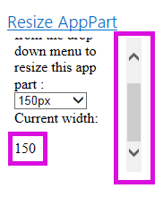
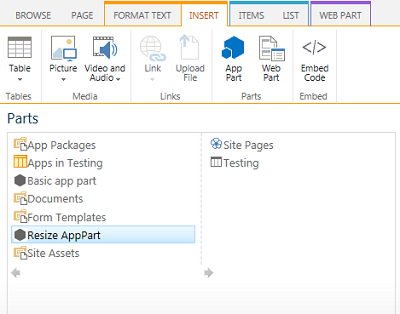

# SharePoint 2013: Resize app parts dynamically in apps for SharePoint
## Requires
- Visual Studio 2012
## License
- Apache License, Version 2.0
## Technologies
- apps for SharePoint
## Topics
- apps for SharePoint
## Updated
- 06/17/2013
## Description

<table id="bottomTable" cellspacing="0" cellpadding="0">
<tbody>
<tr id="headerTableRow1">
<td align="left">&nbsp;</td>
</tr>
<tr id="headerTableRow2">
<td align="left">SharePoint 2013: Resize app parts dynamically in apps for SharePoint</td>
</tr>
</tbody>
</table>

&nbsp;

Summary: Learn how to change the size (width) of an app part dynamically from the app part content area in SharePoint 2013.

This sample autohosted app demonstrates how to change the size of an app part in an app for SharePoint. Although you can manually set a different size on your app part, you can set a particular size for the app part in the app part definition. You can also
 request that your app part be resized dynamically through <strong>postmessages</strong>, as demonstrated in this sample.

The markup that declares the app part is in the ResizeMyAppPart\Elements.xml file in the ResizeMyAppPart project. The rendering logic is in the Resize.js file in the ResizeMyAppPartWeb project. Figure 1 shows the Web Parts page with a
<strong>Resize AppPart</strong> app part with default size (width).

<strong>

Figure 1. Page with Resize app part

</strong> 

Similarly, Figure 2 shows the Web Parts page with a <strong>Resize AppPart</strong> app part with the resized size (width) selected from the drop-down menu.

<strong>

Figure 2. Page with Resize app part with changed size

</strong> 

<h1>Prerequisites</h1>

This sample requires the following:

<ul>
<li>

Visual Studio 2012

</li><li>

Office Developer Tools for Visual Studio 2012

</li><li>

A SharePoint 2013 development environment (app isolation required for on-premises scenarios)

</li></ul>

<h1>Key components of the sample</h1>

The sample contains the following:

<ul>
<li>

The <strong>AppPartsApp</strong> project, which contains the AppManifest.xml file

</li><li>

The <strong>AppPartsWeb</strong> project, which contains the following files:

<ul>
<li>

The <strong>AppPartContent.aspx</strong> file, which contains the controls to be displayed in the content area of the app part

</li><li>

The <strong>Resize.js</strong> file in the <strong>ResizeMyAppPartWeb\Scripts</strong> folder, which contains the logic for resizing the app part

</li><li>

The <strong>Web.config</strong> file

</li></ul>
</li></ul>

<h1>Configure the sample</h1>

<ul>
<li>

Update the <strong>SiteUrl</strong> property of the solution with the URL of the home page of your SharePoint website.

</li></ul>

<h1>Run and test the sample</h1>

&nbsp;

<ol>
<li>

Press F5 to build and deploy the app.

</li><li>

Choose <strong>Trust It</strong> on the consent page to grant permissions to the app.

You should see a SharePoint page with additional instructions.

</li><li>

Go to any wiki page or Web Parts page in the host web.

</li><li>

Edit the page, and add the Resize app part from the Web Part gallery. Figure 3 shows the Resize app part in the Web Part gallery.

<strong>

Figure 3. Resize AppPart in the Web Part gallery

</strong> 
 </li></ol>

<h1>Troubleshooting</h1>

The following table lists common configuration and environment errors that prevent the sample from running or deploying properly and how to solve them.

<strong>

</strong>

<table cellspacing="2" cellpadding="5" width="50%" frame="lhs">
<tbody>
<tr>
<th>

Problem

</th>
<th>

Solution

</th>
</tr>
<tr>
<td>

Visual Studio does not open the browser after you press the F5 key.

</td>
<td>

Set the app for SharePoint project as the startup project.

</td>
</tr>
<tr>
<td>

The app part does not display any content. The app part displays the following error:
<strong>Navigation to the webpage was canceled</strong>.

</td>
<td>

The browser blocked the content page. The solution might be different depending on the browser you are using:

<ul>
<li>

Internet Explorer 9 and 10 display the following message at the bottom of the page:
<strong>Only secure content is displayed</strong>. Choose <strong>Show all content</strong> to display the app part content.

</li><li>

Internet Explorer 8 shows a dialog box with the following message: <strong>Do you want to view only the webpage content that was delivered securely?</strong>. Choose
<strong>No</strong> to display the app part content.

</li></ul>
</td>
</tr>
</tbody>
</table>

<h1>Change log</h1>

<strong>

</strong>

<table cellspacing="2" cellpadding="5" width="50%" frame="lhs">
<tbody>
<tr>
<th>

Version

</th>
<th>

Date

</th>
</tr>
<tr>
<td>

First version

</td>
<td>

May 10, 2013

</td>
</tr>
</tbody>
</table>

<h1>Related content</h1>

<ul>
<li>

<a href="http://msdn.microsoft.com/en-us/library/b0878c12-27c9-4eea-ae3b-7e79e5a8838d" target="_blank">How to: Set up an on-premises development environment for apps for SharePoint</a>

</li><li>

<a href="http://msdn.microsoft.com/en-us/library/bfdd0a58-2cc5-4805-ac89-4bd2fe6f3b09" target="_blank">Create UX components</a>

</li><li>

<a href="http://msdn.microsoft.com/en-us/library/d60f409a-b292-4c06-8128-88629091b753" target="_blank">UX design for apps</a>

</li><li>

<a href="http://msdn.microsoft.com/en-us/library/a2664289-6c56-4cb1-987a-22367fad55eb" target="_blank">How to: Create app parts to deploy with apps for SharePoint</a>

</li><li>

<a href="http://msdn.microsoft.com/en-us/library/26f2999e-db7f-4fe7-a00f-05b009b1927d" target="_blank">What you can do in an app for SharePoint</a>

</li><li>

<a href="http://msdn.microsoft.com/en-us/library/0942fdce-3227-496a-8873-399fc1dbb72c" target="_blank">Three ways to think about design options for apps for SharePoint</a>

</li><li>

<a href="http://msdn.microsoft.com/en-us/library/ae96572b-8f06-4fd3-854f-fc312f7f2d88" target="_blank">Important aspects of the app for SharePoint architecture and development landscape</a>

</li></ul>

&nbsp;

