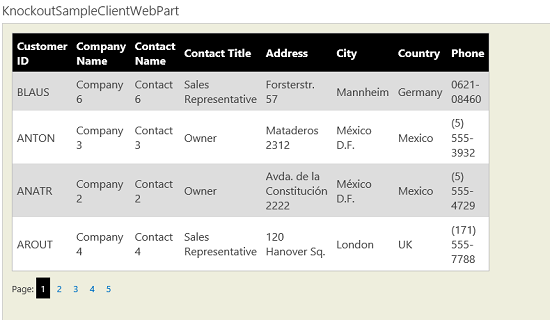
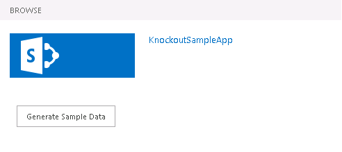

# SharePoint 2013: Use Knockout.js and the REST service to display list data
## Requires
- Visual Studio 2012
## License
- Apache License, Version 2.0
## Technologies
- Visual Studio 2012
## Topics
- apps for SharePoint
## Updated
- 02/12/2014
## Description

<table id="bottomTable" cellspacing="0" cellpadding="0">
<tbody>
<tr id="headerTableRow1">
<td align="left">&nbsp;</td>
</tr>
<tr id="headerTableRow2">
<td align="left">SharePoint 2013: Use Knockout.js and the REST service to display list data</td>
</tr>
</tbody>
</table>

Use the SharePoint 2013 REST interface and Knockout.js to display list data in a responsive grid view.

Provided by: Todd Baginski, <a href="http://www.canviz.com" target="_blank">
Canviz Consulting </a>

This sample app for SharePoint shows how to use the SharePoint 2013 REST interface to get list item data from a SharePoint list and then to use Knockout.js to create a rich and responsive display with a clean underlying data model.

<strong>

Figure 1. Knockout sample client web part

</strong> 
&nbsp;

<h1>Prerequisites</h1>

This sample requires the following:

<ul>
<li>

An Office 365 Developer Site

</li><li>

Visual Studio 2012 and Office Developer Tools for Visual Studio 2012 installed on your development computer

</li></ul>

<h1>Sample for demo only: deviations from best practices</h1>

The sample is focused on demonstrating how to use the SharePoint 2013 REST service and Knockout.js to retrieve data and render data, so it doesn't conform to all the best practices that you should use in a production app. Specifically, be aware of the following:

<ul>
<li>

The app has no exception handling.

</li></ul>

<h1>Key components</h1>

The app's <strong>KnockoutSampleApp</strong> project includes the following:

<ul>
<li>

<strong>list_Customers</strong>. A sample SharePoint list of customers and contact information that you deploy to the app web.

</li><li>

<strong>Pages\Default.aspx</strong> project. The landing page for the app. This page displays a button that populates the
<strong>list_Customers</strong> list.

</li><li>

<strong>Pages\KnockoutSampleClientWebPart.aspx</strong>. The page that displays the app part.

</li><li>

<strong>Scripts\App.js</strong>. The JavaScript file that contains the logic that populates the
<strong>list_Customers</strong> list.

</li></ul>

<h1>Build and deploy the sample</h1>

Follow these steps to configure the sample.

<ul>
<li>

Open the <strong>KnockoutSampleApp.sln</strong> file in Visual Studio 2012.

</li><li>

In the <strong>Properties</strong> pane, change the <strong>
Site URL</strong> property. It is the absolute URL of your SharePoint test site collection on Office 365: https://&lt;my tenant&gt;.sharepoint.com/sites/dev.

</li><li>

Right-click the <strong>KnockoutSampleApp.sln</strong> project in
<strong>Solution Explorer</strong>, and choose <strong>
Publish</strong>.

</li><li>

Choose <strong>Finish</strong>.

</li><li>

The resulting app package file has an .app extension (KnockoutSampleApp.app) and is saved in the
<strong>app.publish</strong> subfolder of the <strong>bin\Debug</strong> folder of the Visual Studio solution.

</li><li>

In your browser, navigate to the home page of your Office 365 Developer Site. In the left panel, choose the
<strong>Apps in Testing</strong> link.

</li><li>

Choose <strong>new app to deploy</strong>, and follow the instructions to upload the KnockoutSampleApp.app package file and deploy it to your Developer Site.

</li><li>

Choose <strong>Trust It</strong>, and wait for the app to install.

</li></ul>

<h1>Run and test the sample</h1>

<ol>
<li>

In your browser, navigate to the home page of your Office 365 Developer Site. Click on the
<strong>KnockoutSampleApp</strong> link in the <strong>
Apps in Testing</strong> list to run your app for SharePoint. Click the
<strong>Generate Sample Data</strong> button to add sample data to the list of customers.

<strong>

Figure 2. Generate Sample Data button

</strong> 
&nbsp; </li><li>

Navigate to the home page of your Office 365 Developer Site. Edit the page and add the KnockoutSampleClientWebPart App Part.

<strong>

Figure 3. Add the sample App Part

</strong> 

</li></ol>

<h1>Change log</h1>

<strong>

</strong>

<table cellspacing="2" cellpadding="5" width="50%" frame="lhs">
<tbody>
<tr>
<th>

Version

</th>
<th>

Date

</th>
</tr>
<tr>
<td>

First version

</td>
<td>

September 2013

</td>
</tr>
</tbody>
</table>

<h1>Related content</h1>

<ul>
<li>

<a href="http://msdn.microsoft.com/en-us/library/fp142379.aspx" target="_blank">How to: Create a basic provider-hosted app for SharePoint</a>

</li><li>

<a href="http://msdn.microsoft.com/en-us/library/fp179933.aspx" target="_blank">Deploying and installing apps for SharePoint: methods and options</a>

</li></ul>

