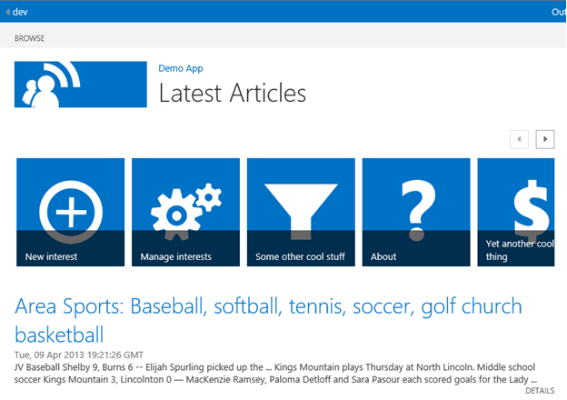
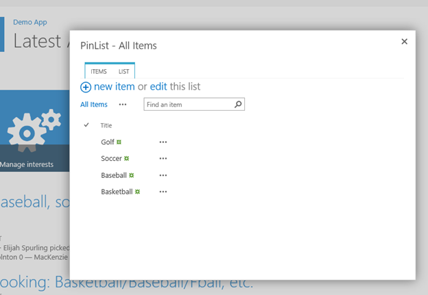
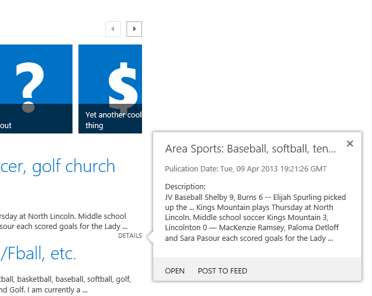
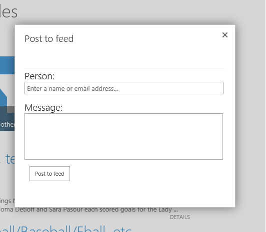
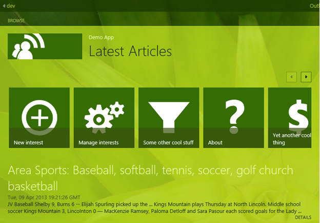

# SharePoint 2013: Use list views, callouts, and dialogs in SharePoint-hosted apps
## Requires
- Visual Studio 2012
## License
- Apache License, Version 2.0
## Technologies
- Visual Studio 2012
- SharePoint Server 2013
- SharePoint Foundation 2013
- apps for SharePoint
## Topics
- SharePoint
- Javascript
## Updated
- 05/08/2013
## Description

Summary: This sample shows how to build user interfaces in SharePoint-hosted apps that use the callout and dialog controls. You'll also learn to use the people picker and promoted links list template, how to call
 external services with the SharePoint 2013 web proxy, and how to post items to a user's newsfeed.

Provided by: Yina Arenas, Microsoft Corporation

<h1 class="heading">Description of the samples</h1>

When you deploy and launch the app, you'll see a page that includes these key features:

<ul>
<li>

A promoted links list at the top of the page.

</li><li>

A series of news items retrieved from Bing.com through the SharePoint 2013 web proxy. These news items are based on a list of interests that the user can choose.

</li></ul>

Figure 1. Page with promoted links and a series of news items, shown when you launch the sample

 

The promoted links SharePoint list, TileList, deploys with the app. The first four items in the list open built-in, list-editing pages inside dialog boxes. For example, the
Manage Interests item opens the dialog box that lets you edit another SharePoint list (PinList), also deployed with the app.
PinList stores keywords that the app uses to find news items.

Figure 2. Manage Interests promoted links list item opens a dialog box for editing your list of interests

 

Each news item contains a Details link to launch a callout control. This callout contains a summary of the news item, an option to open a link to the news item, and a
Post to Feed link.

Figure 3. Callout control that shows news item summary

 

<ul>
<li>

The Post to Feed link opens a dialog box you can use to post a news item link to a user's newsfeed. The
Person box uses the People Picker.

Figure 4. Post to Feed link inside the callout control that opens a dialog box that lets you to post to a user's newsfeed

 
 </li></ul>

The sample inherits several SharePoint classes to make the app look like a regular SharePoint page. It also employs any changes the user makes to the host site's look and feel.

Figure 5. App inherits the green background added by the user

 

<h1 class="heading">Prerequisites</h1>

This sample requires the following:

<ul>
<li>

A SharePoint 2013 Developer Site. This site can be in Office 365 or in an on-premises installation of SharePoint 2013 that is enabled for apps. See
<a href="http://msdn.microsoft.com/en-us/library/sharepoint/fp179923.aspx" target="_blank">
How to: Set up an on-premises development environment for apps for SharePoint</a> to create an on-premises SharePoint Developer Site.

</li><li>

Visual Studio 2012 and Office Developer Tools for Visual Studio 2012 installed on your development computer.

</li></ul>

<h1 class="heading">Key components</h1>

The app's DemoApp project includes the following:

<ul>
<li>

A Pages folder that contains three .aspx pages:

<ul>
<li>

<strong>Default.aspx</strong> is the default page of the SharePoint-hosted app.

</li><li>

<strong>About.aspx</strong> contains app information that starts when you click the
Some other cool stuff and About promoted links list items.

</li><li>

<strong>Post.aspx</strong> displays the Post to Feed dialog box from a callout control.

</li></ul>
</li><li>

Scripts folder that contains the 
App.js file with custom JavaScript for this app.

</li><li>

List definitions for PinList and 
TileList. Both lists are deployed with the app to the app web of your SharePoint 2013 site.

</li></ul>

<h1 class="heading">Configure the sample</h1>

Follow these steps to configure the sample.

<ol>
<li>

Open the <strong>DemoApp.sln</strong> file in Visual Studio 2012.

</li><li>

In the Properties pane, change the 
Site URL property. It's the absolute URL of your SharePoint site.

</li></ol>

<h1 class="heading">Build the sample</h1>

Press F5 to build and deploy the app.

<h1 class="heading">Run and test the sample</h1>

<ol>
<li>

Choose Trust It on the consent page to grant permissions to the app.

</li><li>

Click the New Interest or Manage Interests link to edit your list of interests.

</li><li>

Click the Details link for each news item that you want to view in the callout control. Click the
Post to Feed link to post to someone's newsfeed. You can select only users who have accounts on your site.

</li></ol>

<h1 class="heading">Troubleshooting</h1>

The following table lists common configuration and environment errors that prevent the sample from running or deploying properly and ways to solve them.

<table cellspacing="2" cellpadding="5" width="50%" frame="lhs">
<tbody>
<tr>
<th>

Problem

</th>
<th>

Solution

</th>
</tr>
<tr>
<td>

Visual Studio doesn't open the browser after you press F5.

</td>
<td>

Set the app for SharePoint project as the startup project.

</td>
</tr>
<tr>
<td>

HTTP error 405 <strong>Method not allowed</strong>.

</td>
<td>

Locate the applicationhost.config file in
<strong>%userprofile%\Documents\IISExpress\config</strong>.

Locate the handler entry for <strong>StaticFile</strong>, and add the verbs 
GET, HEAD,
POST, DEBUG, and
TRACE.

</td>
</tr>
</tbody>
</table>

<h1 class="heading">Change log</h1>

<table cellspacing="2" cellpadding="5" width="50%" frame="lhs">
<tbody>
<tr>
<td>

First release

</td>
<td>

April 2013

</td>
</tr>
</tbody>
</table>

<h1 class="heading">Related content</h1>

<ul>
<li>

<a href="http://msdn.microsoft.com/library/1b992485-6efe-4ea4-a18c-221689b0b66f.aspx" target="_blank">How to: Create a basic SharePoint-hosted app</a>

</li><li>

<a href="http://msdn.microsoft.com/en-us/library/sharepoint/fp179923.aspx" target="_blank">How to: Set up an on-premises development environment for apps for SharePoint</a>

</li></ul>

&nbsp;

