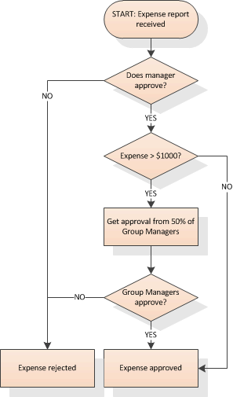
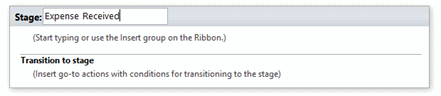
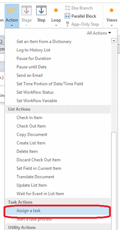
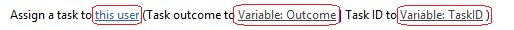
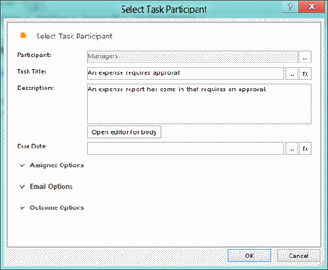
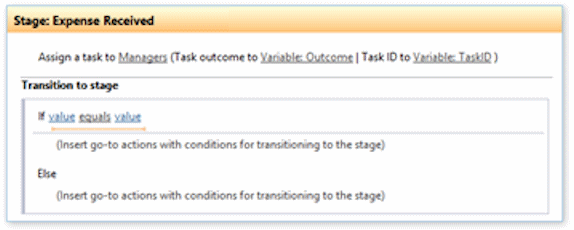

# SharePoint 2013 workflow: Using task action
## License
- Apache License, Version 2.0
## Technologies
- SharePoint Server 2013
- apps for SharePoint
- SharePoint Designer 2013
## Topics
- Workflows
## Updated
- 05/07/2014
## Description

In this sample, we create a workflow that models a simple expense approval process that uses task actions. The process executes the following logic:

<strong>Figure 1. Task action workflow logic</strong>

&nbsp;

When a new expense report enters the system, it is first approved by a manager. After a manager approves the expense, and if the expense is for more than $1,000.00, the expense must be approved by at least half of the Group
 Managers. Only after all required approval points have been passed will the expense be approved; otherwise, it is rejected.

The deployed .wsp file (ExpenseWorkflow.wsp) is available in the sample folder for your inspection. Following are instructions for creating the sample using SharePoint Designer 2013.

<h1>Prerequisites</h1>

This sample requires the following:

<ul>
<li>SharePoint 2013 </li><li>Microsoft Azure Workflow
</li><li>SharePoint Designer 2013 </li></ul>
<h1>Build the sample</h1>

Follow these steps to recreate the approval workflow sample.

<h2>Create the expense approval workflow</h2>
<ol>
<li>Start SharePoint Designer 2013 and connect to a SharePoint 2013 site that is configured with
Microsoft Azure Workflow.&nbsp; 
<strong> 
Note</strong> 
The SharePoint site that you connect to should have a sample list created named&nbsp;&quot;Expenses&quot;. 
 
For instructions on setting up and configuring SharePoint Server and Microsoft Azure Workflow, see
<a href="http://technet.microsoft.com/library/4cd68a3e-9c3b-4fb9-bb66-e96cf0faec69.aspx">
How to: Set up and configure SharePoint 2013 workflows</a>. </li><li>On the SharePoint Designer ribbon, click on the
<strong>List Workflow </strong>icon to open the drop-down and select the &quot;Expenses&quot; list. This opens the
<strong>Create List Workflow </strong>dialog box. </li><li>Enter the workflow name (in this sample, use &quot;Expense Report WF&quot;) and select the
<strong>Platform Type</strong>, &quot;SharePoint 2013 Workflow&quot;, then click <strong>OK</strong>. 
This opens the text-based workflow designer. If instead you are opened in the visual designer, you can switch to the text-based designer by pressing the
<strong>Views</strong> button. Optionally, you can create this sample workflow using the visual designer, although the instructions in this walkthrough are based on the text-based designer. 
 
<strong>Important</strong> 
If the Platform Type dropdown does not list &quot;SharePoint 2013 Workflow&quot; as an option, the server you are connected to probably is not correctly configured with
Microsoft Azure Workflow. 
</li><li>After you click <strong>OK</strong>, the designer presents you with a
<strong>Stage</strong> tile, named &quot;1&quot;. Rename this stage to &quot;Expense Received&quot;. 
 
<strong>Figure 2. 
</strong>
</li><li>At this point we are ready to create and use task actions in our workflow so we can get the manager's approval.
</li></ol>
<h2>Create a task using the &quot;Assign a task&quot; action</h2>
<ol>
<li>In SharePoint Designer, open the <strong>Actions</strong> drop-down, and select
<strong>Assign a task</strong>. 
 
<strong>Figure 3. Assign a task action 
</strong>
</li><li>Step 1 results in the injection of a sentence into the current workflow stage that has three properties: &quot;this user&quot;, &quot;Variable: Outcome&quot;, and &quot;Variable: TaskID&quot;. 
 
<strong>Figure 4. Task action properties</strong> 
&nbsp;
</li><li>

Click <strong>This user </strong>to open the <strong>
Select Task Participant </strong>dialog box. 

<strong>Figure 5. Select task participant dialog box</strong>

&nbsp;
<blockquote dir="ltr" style="margin-right:0px">

a)&nbsp;For <strong>Participant</strong>, use the people picker to select the person or group to whom you are assigning the task. (The sample uses a group named &quot;Managers&quot;.) Note that the
<strong>Assign a task </strong>action allows you to create only a single task, so you can assign only one person or group to the task. Although this sample does not do so, you can create parallel tasks if your business process requires it.

b)&nbsp;For <strong>Task Title</strong>, enter a title for the workflow task. In this sample, we use the title &quot;An expense requires approval&quot;.

c)&nbsp;For <strong>Description</strong>, enter an optional description.

d)&nbsp;For <strong>Due Date</strong>, enter a date on which the task must be completed. Setting a due date is optional. However, by setting a due date, you can trigger additional actions that take place if the due date is passed
 (for example, send a reminder email to the person to whom the task is assigned.

e)&nbsp;Besides these, there are additional <strong>
User</strong> options that are grouped in the sections labeled <strong>Assignee Options</strong>,
<strong>Email Options</strong>, and <strong>Outcome Options</strong>. For explanations of these additional user options, see
<strong>Additional options for Select Task Participant</strong>, below.

f)&nbsp;Click on <strong>Email Options </strong>
to expand the group, then click <strong>Open editor</strong>. This opens the email message editor to allow you to craft the message to task assignees. You can explore using the lookup tokens in your message ([%Task: Title%], [%Task: Due Date%], etc.) You can
 change the lookup tokens by clicking on the <strong>Add</strong> or <strong>Change Lookup
</strong>button in the <strong>Email</strong> dialog box.

</blockquote>
</li><li>Click on <strong>Variable: Outcome </strong>to select the outcome that establishes the task as completed. (More about this in the next section.)
</li><li>Click on <strong>Variable: TaskID </strong>to set the ID for the task.
</li><li>Click OK to close the Task Action dialog box and return to the workflow designer.
</li></ol>

Thus far we have created a single task action, but now we need to create logic to determine if the task was completed or not. If this first task is completed when the manager either approves or rejects the expense report, then
 we need a way for the workflow to recognize this task outcome.

Notice that in the <strong>Stage 1 </strong>tile (named Expense Received), there is an option to
<strong>Transition to stage </strong>This provides us with the opportunity to create conditions to evaluate the task and the way it was completed (that is, its outcome), and depending on the task outcome, to then determine what comes next in the workflow.

<strong>Figure 6. Transition to new stage</strong>

&nbsp;

<h2>Create a conditional transition</h2>
<ol>
<li>In the <strong>Stage 1</strong> tile (&quot;Expense Received&quot;, click
<strong>Transition to stage</strong>, then click on the <strong>Conditions</strong> dropdown on the SharePoint Designer ribbon.
</li><li>Add the condition named <strong>If any value equals value</strong>, then click on the first
<strong>Value</strong> selector link in the <strong>Condition</strong>. </li><li>Press the <strong>Fx</strong> button (this opens the
<strong>Lookup</strong> dialog box), and change the <strong>Data source </strong>
to <strong>Workflow Variables and Parameters</strong>. </li><li>In the <strong>Field from source </strong>dropdown, select
<strong>Variable: Outcome</strong>. Press <strong>OK</strong> to close the dialog box.
</li><li>Now press the second <strong>Value</strong> selector link in the
<strong>Condition</strong>. This exposes a dropdown that contains the values &quot;Approved&quot; and &quot;Rejected&quot;. Select &quot;Approved&quot; and the variable outcome. You now have a transition stage sentence that contains the &quot;If&quot; portion of your logic: &quot;If Variable: OutcomeequalsApproved&quot;.
</li><li>Next step in creating the logic is to test whether the value of the &quot;Expense&quot; is greater than or equal to $1,000. Start by clicking inside the
<strong>If</strong> condition block. </li><li>From the conditions dropdown, add another <strong>
If any value equals value </strong>condition. </li><li>Click on the <strong>Value</strong> selector link in the condition and press the
<strong>Fx</strong> button. This opens the <strong>Define Workflow Lookup </strong>
dialog box. </li><li>In the lookup dialog box, leave the <strong>Data source
</strong>as &quot;Current item&quot; (which is the default). </li><li>In the lookup dialog box, for the <strong>Field from source
</strong>value, select &quot;Expense Amount&quot;, then press <strong>OK</strong> to close the dialog box.
</li><li>Back in the <strong>Transition to Stage </strong>
tile, in the right-hand <strong>Value</strong> selector link, enter &quot;1000&quot; (do not enter the quotation marks).
</li><li>In the upper block of the new <strong>If</strong> condition, go to the
<strong>Actions</strong> dropdown and select the <strong>Go to a stage </strong>action
</li><li>Do the same for the block after the <strong>Else</strong> block, and again for the remaining block. The tile should now look like this:
</li></ol>

<strong>Figure 7. Transition to stage tile</strong>

&nbsp;

Before we can set values for the three <strong>Go to a stage
</strong>value links in the <strong>Transition to stage </strong>tile, we must add three more stages to the diagram.

<h2>Adding additional stages</h2>
<ol>
<li>Add three stages to the workflow and name them &quot;Get Group Manager Approval&quot;, &quot;Expense Approved&quot;, and &quot;Expense Rejected&quot;. This will allow us to establish the branching logic.
</li><li>

Return to the <strong>Transition to stage </strong>
tile where we have the <strong>Go to a stage </strong>value links:

<blockquote dir="ltr" style="margin-right:0px">

a)&nbsp;Set the first <strong>Go to a stage </strong>
value link to &quot;Get Group Manager Approval&quot;. This covers the case where&nbsp; the manager approved the expense
<strong>AND</strong> the expense is greater than $1,000.

b)&nbsp;Set the second <strong>Go to a stage </strong>
value link to &quot;Expense Approved&quot;. This covers the case where&nbsp; the manager approved the expense
<strong>AND</strong> the expense was less than $1,000.

c)&nbsp;Set the third <strong>Go to a stage </strong>
value link to &quot;Expense Rejected&quot;. This covers the case where the manager rejects the expense.

Your Transition to stage tile should now appear like Figure 8.

</blockquote>

<strong>Figure 8. Completed transition stage.</strong>

&nbsp;
</li><li>

Complete the &quot;Get Group Manager&quot; stage by clicking inside of the stage. Go to the
<strong>Actions</strong> dropdown and add the <strong>Start a Task Process </strong>
action. This action is a more complex version of the <strong>Assign a Task </strong>
action which allows you to assign multiple tasks to multiple users and then use the results in a task process. Also note that this action does not return a Task ID, but rather the overall outcome of the action.

<blockquote dir="ltr" style="margin-right:0px">

a)&nbsp;Click on the <strong>these users </strong>
value link to open the <strong>Select Task Process Participants </strong>dialog box.

b)&nbsp;Set the Participants field to the &quot;Group Managers&quot; group that we created earlier. Note that when using the
<strong>Task Process </strong>action (as opposed to the <strong>Assign a Task </strong>
action), we can optionally add multiple participants in this field.

c)&nbsp;Select <strong>All at once </strong>from the dropdown beside the
<strong>Participants</strong> field. This field lets you configure whether multiple task participants must complete their tasks serially or in parallel.

d)&nbsp;In the <strong>Task Title </strong>field, enter &quot;An expense costing more than $1,000 requires an approval&quot;.

e)&nbsp;The <strong>Description</strong> field is optional. Enter any value.

f)&nbsp;Expand the <strong>Assignee Options </strong>
section. Note that the <strong>Expand all groups </strong>check box is selected by default. Leave the default as it is. This directs that all members of a group are each be assigned the task individually and all members must complete the task. If not selected,
 then the task is assigned to the group as a whole and anyone in the group may complete the task.

g)&nbsp;Ensure that <strong>Wait for task completion
</strong>is selected (this is the default). This directs the workflow to wait for the task to be completed before continuing.

h)&nbsp;The <strong>Completion criteria </strong>
field directs how the final outcome of the task is determined. Every task action must return a single outcome, so when multiple tasks are assigned there must be a way to determine the overall outcome. Four options are available, and each one is explained in
 the dialog box when selected. For this sample, select <strong>Wait for percentage of a response</strong>; set the
<strong>Required percentage </strong>at &quot;50%&quot;; and leave the <strong>Required outcome
</strong>as &quot;Approved&quot;.

i)&nbsp;At this point, the <strong>Select Task Process Participants
</strong>dialog box should appear as in Figure 9.

</blockquote>

<strong>Figure 9. Completed Task Participants dialog box.&nbsp; 
</strong>

</li><li>Click <strong>OK </strong>to close the dialog box.
</li><li>Click inside of the <strong>Transition to stage
</strong>section of the <strong>Get Group Manager Approval </strong>stage tile.
</li><li>Add the <strong>If any value equals value </strong>
condition, then, then click on the first <strong>Value</strong> link and press the
<strong>Fx</strong> button to open the <strong>Lookup</strong> dialog box.
</li><li>Change the <strong>data source </strong>value to
<strong>Workflow Variables and Parameters</strong>. </li><li>In the <strong>Field from source </strong>dropdown, select
<strong>Variable: Outcome1</strong>, then press <strong>OK</strong> to close the <strong>
Lookup</strong> dialog box. This selects the outcome of the task action that you created.
</li><li>Press the second <strong>Value</strong> link in the condition and select
<strong>Approved</strong> from the resulting dropdown. This checks whether the Group Managers have approved the expense. Your condition sentence on the
<strong>Stage: Get Group Manager Approval</strong> tile should appear as in Figure 10: 
 
<strong>Figure 10. Condition sentence. 
</strong>
</li><li>Add a <strong>Go to stage </strong>action to both the
<strong>If</strong> and <strong>Else</strong> blocks in the <strong>Transition to stage
</strong>section of the tile. </li><li>Set the <strong>Go to </strong>value in the <strong>
If</strong> block to &quot;Expense Approved&quot;. This outcome occurs if 50% or more of the Group Managers approve.
</li><li>Set the <strong>Go to </strong>in the <strong>Else</strong> block to &quot;Expense Rejected&quot;. This outcome occurs if fewer than 50% of the Group Managers approve. The stage should appear as in Figure 11. 
 
<strong>Figure 11. Completed stage tile 

</strong></li><li>Finally, add the <strong>Go to stage </strong>action to the end of the remaining stages, and for each of these set the action to
<strong>End of workflow</strong>. </li></ol>
<h1>Additional options for Select Task Participant</h1>

The <strong>Select Task Participant </strong>dialog box provides additional
<strong>User</strong> options that are grouped in the sections labeled <strong>Assignee Options</strong>,
<strong>Email Options</strong>, and <strong>Outcome Options</strong>.

<h2>Assignee Options</h2>

<strong>Wait for task completion</strong>. Selecting this option causes the workflow to halt execution and wait until the task is completed before continuing. Because of this, a task that this option not selected does not await
 a response from the task action, nor does it return a task outcome.

<strong>Associated item</strong>. This option allows you to change which list item is associated with the task. By default, tasks are associated with the current item, but you can change this using this option.

<h2>Email Options</h2>

There are two basic email messages that can be configured to be automatically sent to task assignees. One is a message alerting the assignee when they are assigned a task; the other is a reminder email when their task becomes
 overdue. The latter email is valid only if you have set a due date on your task.

<strong>Send emails</strong>. Allows you to configure the task action to send email reminders when the task becomes overdue. Note that this option does not allow you to control the task creation email to assignees when the task
 is assigned. These always go out, even if this option is not selected.

<strong>Customize Task Creation Email / Customize Task Overdue Email</strong>. Allows you to edit the email messages that are sent to task assignees when they are assigned a task, and when the task become overdue.

<strong>Frequency of Overdue Email</strong>. Allows you to configure how frequently the reminder email should be sent. Not valid if the
<strong>Send Emails </strong>option is not selected.

<strong>Recurrence of Overdue Email</strong>. Allows you to configure how many times you want the overdue reminder email to be sent. Select
<strong>infinitely</strong> if you want the emails to be sent indefinitely.

<h2>Outcome Options</h2>

Use these options to configure what takes place if the task is not completed.

<strong>Task Content Type</strong>. Allows you to create a task type that is different from the
<strong>Approve/Reject </strong>type that is used in this sample. You can create different task types, and once created they will appear in the task creation dialog box.

<strong>Outcome Field</strong>. Allows you to select which column within the task content type is the field on which the outcome success or failure is determined.

<strong>Default Outcome</strong>. Allows you to configure which outcome is used by default if the task activity cannot determine the outcome of the task.

<h1>Change log</h1>

First release.&nbsp;July 16, 2012

<h1>Related content</h1>
<ul>
<li><a href="http://msdn.microsoft.com/en-us/library/jj163917.aspx" target="_blank">Get started with workflows in SharePoint 2013</a>
</li><li><a href="http://msdn.microsoft.com/en-us/library/ffaccd6b-426d-4ca0-b62f-bc7b14641a49" target="_blank">SharePoint 2013 workflow samples&nbsp;
</a></li></ul>
