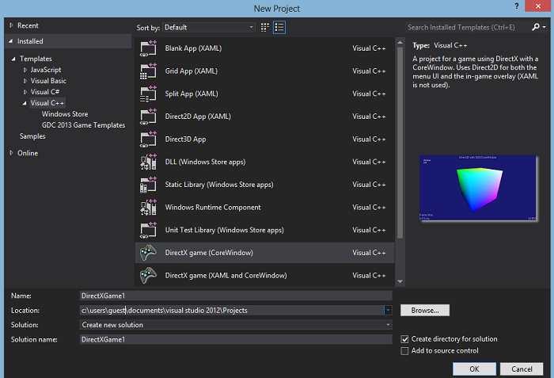

# GDC 2013 Windows Developer Content Direct3D Game Templates
## Requires
- Visual Studio 2012
## License
- MS-LPL
## Technologies
- Direct3D
## Topics
- Graphics
- Graphics and 3D
## Updated
- 11/22/2013
## Description

<h1>Introduction</h1>

&nbsp;

The&nbsp;Windows Content Team&nbsp;GDC 2013 Direct3D game templates are a set of Visual Studio project templates for Windows Store Direct3D apps.&nbsp;The GDC 2013 versions of the content incorporate code from these templates
in the coding examples.

Note: Due to reported compatibility issues, we have removed the Visual Studio 2013 version of this template. The
<a href="http://go.microsoft.com/fwlink/?LinkID=287055">WDC DirectX game learning template</a> is designed for Visual Studio 2013, Windows 8.1, and DirectX 11.2. It also includes new helper classes and has&nbsp;<a href="http://msdn.microsoft.com/library/windows/apps/dn481529.aspx">supporting
 documentation</a>. If you prefer to use this template instead, you can create a GDC 2013 game template project in Visual Studio 2012 and import it into Visual Studio 2013.

The ZIP file includes a single VSIX with three templates:

<ul>
<li><strong>DirectX game (CoreWindow)</strong>. This template constructs a basic CoreWindow view
provider with a game-development friendly layout that demonstrates DirectX 11.1
and C&#43;&#43; coding best practices for Windows Store apps.
</li><li><strong>DirectX game (XAML)</strong>. This template uses the XAML framework with&nbsp; SwapChainBackgroundPanel
to display Direct3D 11.1 rendering output. It demonstrates DirectX 11.1 and C&#43;&#43;
coding best practices for Windows Store apps with XAML.
</li><li><strong>DirectX game (XAML and CoreWindow)</strong>. This template creates two swap chains &ndash; one with
a CoreWindow view provider and the other with the XAML framework and
SwapChainBackgroundPanel &ndash; and allows you to dynamically switch between the two
based on game state or user input. </li></ul>

&nbsp;

The following GDC 2013 documentation incorporates these
samples:

&nbsp;&nbsp;&nbsp;&nbsp;&nbsp;&nbsp;&nbsp; 
<a href="http://go.microsoft.com/fwlink/?LinkId=288796">Prepare your Windows Store DirectX game programming environment</a>&nbsp;

<a href="http://go.microsoft.com/fwlink/?LinkId=288797">Port from DirectX 9 to Windows Store</a>&nbsp;

<a href="http://go.microsoft.com/fwlink/?LinkId=288798">Port from OpenGL ES 2.0 to Direct3D 11.1</a>&nbsp;

&nbsp;

<h1>Using the templates</h1>

 
To use these templates, download the ZIP file and open it. Extract the file<strong> GDC2013GameTemplates.vsix</strong> and double-click on it. This will install the templates. If Visual Studio
 2012 was open when you ran the VSIX installer, close it and re-open it. When you go to FILE-&gt;New Project, the three templates will appear under the Visual C&#43;&#43; project node.&nbsp;

<strong>NOTE</strong>&nbsp;&nbsp;&nbsp;The VSIX installer must be extracted from the archive before installation. The
 SLN and VCXPROJ files exist only to meet validation requirements and can be ignored.

<em></em>

&nbsp;

<h1>Source Code Files</h1>
<ul>
<li><em>GDC2013GameTemplates_VS2012.vsix</em> </li></ul>
<h1><em>&nbsp;</em></h1>
