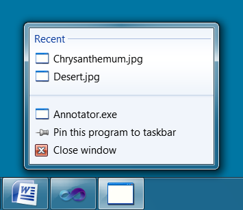

# Hilo (updated for Visual Studio 2013)
## Requires
- Visual Studio 2010
## License
- Custom
## Technologies
- Windows 7
## Topics
- Windows 7 Development
## Updated
- 10/09/2014
## Description

&ldquo;Hilo&rdquo; is a series of articles and sample applications that demonstrate how you can leverage the power of Windows 7, Visual Studio 2010 and Visual C&#43;&#43; to build high performance,
 rich responsive client applications. Hilo provides both source code and guidance that will help you design and develop compelling, touch-enabled Windows applications of your own. Follow us on Twitter @<a class="externalLink" href="http://twitter.com/projecthilo">projecthilo</a>

&nbsp;

10/9/2014 Update: This sample has been updated for Visual Studio 2013, and includes a hot fix to the AsyncLoaderMemoryManager.cpp file (lines 36 and 37) which addresses a common crash issue. 

<h2>New! - Download the Hilo articles as a PDF!</h2>

We've collected the Hilo <a class="externalLink" href="http://msdn.microsoft.com/en-us/library/ff708696%28v=MSDN.10%29.aspx">
article series</a> and packaged them into a single PDF. You can download the PDF from
<a href="http://code.msdn.microsoft.com/Hilo-0e6f10bf/file/21217/1/Developing%20Hilo.pdf">
here</a>. 
 

<h2>Share Your Photos With Hilo!</h2>

The Hilo sample applications allow you to browse, annotate, and share photographs and images. Previous
<a class="externalLink" href="http://msdn.microsoft.com/en-us/library/ff708696%28v=MSDN.10%29.aspx">
articles</a> in this series have described the design and implementation of the Hilo Browser, which allows you to browse and select images using a touch-enabled user interface, and the Hilo Annotator, which allows you to crop, rotate, and draw on the photographs
 you have selected. Now, in the third release of Hilo, we've added support for sharing your photo via Flickr! You can download the source code for the Hilo applications from
<a class="externalLink" href="http://archive.msdn.microsoft.com/Hilo/Release/ProjectReleases.aspx?ReleaseId=4986">
here</a>. 
 
 
 
We've also added support for Windows 7 taskbar and jump lists! 
 
 
 

<h2>Hilo Annotator</h2>

The Hilo Annotator uses the Windows Ribbon Control to provide easy access to the various annotation functions, and the Windows Imaging Component to load and manipulate the images and their metadata. 
 
 
 
The Hilo article series, along with the sample application source code, are intended to jumpstart your development and show you how to take advantage of key Windows capabilities in your own applications. The next articles in the Hilo series will describe how
 the Annotator is implemented using the Windows Ribbon control and the Windows Imaging Components. You can read all of the articles in the Hilo series
<a class="externalLink" href="http://msdn.microsoft.com/en-us/library/ff708696%28v=MSDN.10%29.aspx">
here</a>. 
 

<h2>Getting Started</h2>

To compile and run the Hilo Browser applications, you will need Visual Studio 2010 and Visual C&#43;&#43;. You can download Visual C&#43;&#43; 2010 Express edition for free from
<a class="externalLink" href="http://www.microsoft.com/express/Downloads/#2010-Visual-CPP">
here</a>.

<ul>
<li>Once you have installed Visual C&#43;&#43; 2010 Express, unzip the Hilo Browser source code and double click on the Hilo.sln solution file.
</li><li>Select Rebuild All from the Build menu to compile the Hilo Browser application.
</li><li>Press F5 to run the application in debug mode. </li></ul>
