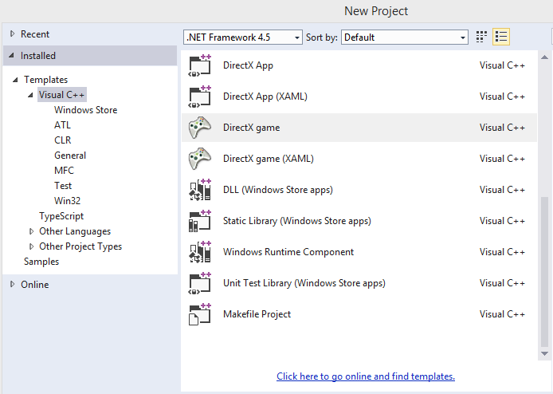

# WDC DirectX game learning template
## Requires
- Visual Studio 2013
## License
- MS-LPL
## Technologies
- Direct2D
- Games
- DirectX
- Direct3D
- DirectWrite
- XAudio
- XInput
## Topics
- Games
- game apps
- game app
- DirectX game development for the Windows Store
## Updated
- 01/07/2014
## Description

The Windows Developer Content DirectX game learning template sample extends the basic DirectX app template with features that help you understand DirectX and C&#43;&#43; as a game development environment. Note that the&nbsp;<a href="http://msdn.microsoft.com/library/windows/apps/dn481529.aspx">Getting
 Started guide</a>&nbsp;has more info on using this template.

The template adds the following:

<ul>
<li>InputManager: Consolidated input from touch, mouse, keyboard, and Xbox controllers.&nbsp;
</li><li>Virtual analog controls: A basic virtual controller with tracked-touch analog control and digital buttons.&nbsp;
</li><li>OverlayManager: Add and manage multiple Direct2D overlays for a Direct3D scene.
</li><li>SoundPlayer: Add rudimentary sound effects and play music as background audio. Updates to Direct3D resource management.
</li></ul>

Here's how to get started with the WDC DirectX simple game template:

<ul>
<li>Download and extract the ZIP file. Then install by double-clicking on the VSIX.
</li><li>Verify the installation by launching Microsoft Visual Studio&nbsp;2013. Go to FILE &gt; New &gt; Project and select &quot;DirectX game&quot; from under Templates &gt; Visual C&#43;&#43; in the New Project dialog.
</li><li>Create a project, then build and run the solution. Use BUILD &gt; Build Solution and, after the build completes, DEBUG &gt; Start Debugging. Or press F7 to build, then F5 after the build completes.
</li><li>Test input one of several ways: run the project on a touch-capable device, plug in an Xbox controller, or use the arrow keys and left mouse button.
</li></ul>

Here's a brief description of the template components.

<h1>DirectX device resources</h1>

The DeviceResources class wraps DirectX device creation. It creates and configures a device and context, a swap chain, render targets, and so on. It also handles screen rotation and device resets. Study this class to learn how DirectX 11 works and how it
 manages the device; you&rsquo;ll need to revise this code if (for example) you add deferred rendering, or change the swap chain format.

To use DeviceResources, initialize it and store it in a shared pointer. Send copies of the pointer to rendering classes; they can call methods to get the device, context, drawing buffers, and so on. These classes will create resources on the GPU - register
 them to get device reset events from DeviceResources so they can reload if needed. The only extension to this class is support for hardware overlays.

<h1>Multiple input sources</h1>

InputManager uses Windows APIs to get player input from touch, mouse/keyboard, and Xbox controllers. It processes input from all these sources and returns state for game actions, such as &quot;move&quot; (analog data) and &quot;jump&rdquo; (digital button state). You can
 modify PLAYER_ACTION_TYPES in InputManager.h to start adding actions for your game, and revise the code as needed to assign buttons and keys to those actions.

Process user input from InputManager by calling GetPlayersActions during your game loop&rsquo;s update phase. This tells InputManager to resolve input events and return a set of player actions. Main.cpp shows how to get the data; for processing code, see
 Main and the virtual controller. You should only call GetPlayersActions once per frame; store the data and use that copy for the duration of the frame.

<h1>Direct2D overlays</h1>

A sample virtual analog controller is included that recognizes touch input and displays using an overlay. Control areas are defined with touch regions. The regions are defined in Main.cpp and send to both the InputManager and the virtual controller overlay.
 Examine this code and learn how to add touch regions appropriate to your game.

The OverlayManager class holds a std::vector of Overlay class objects. It forwards update, render, and resource method calls to each of the included overlays. Create your own overlay by inheriting the Overlay base class provided with the template, then adding
 your overlay to the vector.

<h1>Play a sound effect</h1>

The SoundPlayer class is minimal. It exists to let you experiment with audio right away, and to demonstrate setting up XAudio2 in a Windows Store game. This class is not a full audio engine.

Main.cpp shows how to set up the SoundPlayer and use it to play media files. Use the PlaySound function by providing a path to the sound effect file; it will play the sound effect, categorizing it for Windows as a game sound effect. Use PlayMusic, again
 providing a filename, and it will play. Note that music is categorized for Windows as background audio.

