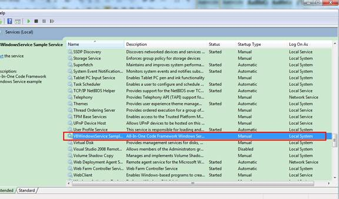
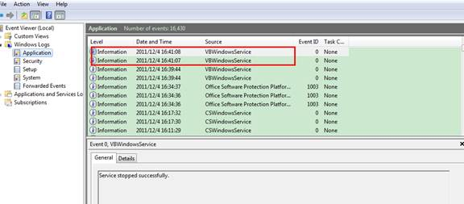
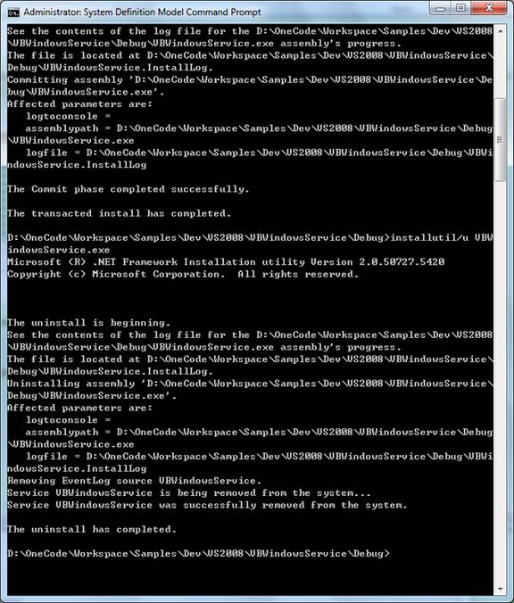

# A basic Windows service in VB (VBWindowsService)
## Requires
- Visual Studio 2010
## License
- MS-LPL
## Technologies
- Windows SDK
## Topics
- Windows Service
## Updated
- 03/01/2012
## Description

<h1>Windows サービス (VBWindowsService)</h1>
<h2>はじめに</h2>

このコード サンプルでは、Visual Basic.NET で非常に基本的な Windows サービス アプリケーションを作成する方法を紹介します。このサンプル Windows サービスでは、アプリケーション イベント ログにサービスの開始と停止情報を記録し、スレッド プールのワーカー スレッドでサービスのメイン関数を実行する方法を示します。この Windows サービス スケルトンは、独自のビジネス要件に合わせて簡単に拡張できます。&nbsp;

<h2>サンプルの実行</h2>

次の手順では、Windows サービス サンプルのデモについて説明します。

手順 1: Visual Studio 2010 でサンプル プロジェクトを正常にビルドすると、サービス アプリケーション VBWindowsService.exe が作成されます。

手順 2: Visual Studio 2010 コマンド プロンプトを管理者として実行し、サンプル プロジェクトの出力フォルダーに移動してから、次のコマンドを入力してサービスをインストールします。

&nbsp; InstallUtil.exe VBWindowsService.exe

次のような出力が表示された場合は、サービスが正常にインストールされています。

&nbsp;

この出力が表示されない場合は、出力フォルダーで VBWindowsService.InstallLog ファイルを検索して失敗の原因を調べてください。

手順 3: サービス管理コンソール (services.msc) を開きます。サービスの一覧で &quot;VBWindowsService Sample Service&quot; を見つけることができます。

手順 4: サービス管理コンソールで VBWindowsService サービスを右クリックし、[開始] をクリックして、サービスを開始します。イベント ビューアーを開き、Windows ログ/Application に移動します。VBWindowsService では、2 つのイベントが次のイベント メッセージとともに表示されます。&quot;VBWindowsService in OnStart.&quot; と &quot;Service started successfully.&quot; です。

サービス管理コンソールでサービスを右クリックし、[停止] を選択して、サービスを停止します。イベント ビューアー/Windows ログ/Application に VBWindowsService の新しい 2 つのイベントが次のメッセージとともに表示されます。&quot;VBWindowsService in OnStop&quot; と &quot;Service stopped successfully&quot; です。

&nbsp;

手順 5: サービスをアンインストールするには、管理者として実行している Visual Studio 2010 のコマンド プロンプトで次のコマンドを入力します。

&nbsp; InstallUtil /u VBWindowsService.exe

サービスが正常に停止して削除されると、次の出力が表示されます。

<h2>
</h2>
<h2>セットアップと削除 </h2>
<h3>開発環境の場合</h3>

A. セットアップ

管理者特権の Visual Studio 2010 コマンド プロンプトでコマンド &quot;Installutil.exe VBWindowsService.exe&quot; を実行します。ローカル サービス コントロール マネージャー データベースに、サービスとして VBWindowsService.exe がインストールされます。

B. クリーンアップ

管理者特権の Visual Studio 2010 コマンド プロンプトでコマンド &quot;Installutil.exe VBWindowsService.exe&quot; を実行します。VBWindowsService
サービスが停止され、ローカル サービス コントロール マネージャー データベースから削除されます。

<h3>展開環境での手順</h3>

A. セットアップ

VBWindowsServiceSetup(x86) セットアップ プロジェクトの出力、VBWindowsServiceSetup(x86).msi を x86 オペレーティング システムにインストールします。ターゲット プラットフォームが x64 の場合、VBWindowsServiceSetup(x64) セットアップ プロジェクトで出力された VBWindowsServiceSetup(x64).msi をインストールします。

B. 削除

VBWindowsServiceSetup(x86) セットアップ プロジェクトの出力、VBWindowsServiceSetup(x86).msi を x86 オペレーティング システムにインストールします。ターゲット プラットフォームが x64 の場合、VBWindowsServiceSetup(x64) セットアップ プロジェクトで出力された VBWindowsServiceSetup(x64).msi をアンインストールします。

<h2>コードの使用</h2>
<h3>A. Windows サービスの作成</h3>

<a href="http://msdn.microsoft.com/ja-jp/library/aa983583.aspx">http://msdn.microsoft.com/ja-jp/library/aa983583.aspx</a>

手順 1: &quot;VBWindowsService&quot; という名前の新しい Visual Basic / Windows / Windows サービス プロジェクトを Visual Studio 2010 に追加します。<a class="libraryLink" href="https://msdn.microsoft.com/ja-JP/library/System.ServiceProcess.ServiceBase.aspx" target="_blank" title="Auto generated link to System.ServiceProcess.ServiceBase">System.ServiceProcess.ServiceBase</a> から継承される &quot;Service1&quot; という名前のコンポーネント クラスがプロジェクトのテンプレートによって自動的に追加されます。

手順 2: 既定の Service1 の名前を &quot;SampleService&quot; に変更します。サービスをデザイナーで開き、ServiceName プロパティを VBWindowsService に設定します。

手順 3: カスタム イベントのログ機能をサービスに追加するために、イベント ログ コンポーネントをツールボックスからデザイン ビューにドラッグ アンド ドロップし、Log プロパティを Application に設定し、Source プロパティを VBWindowsService に設定します。イベント ログ コンポーネントはメッセージを Application ログに記録するために使用されます。

手順 4: サービスの開始および停止で発生する事象を定義するには、プロジェクトの作成時に自動的に上書きされているメソッドの OnStart と OnStop をコード エディターで検索し、サービスの実行を開始したときに発生する事象を特定するコードを記述します。この例では、サービスの開始と停止の情報を Applicaion イベント ログに記録し、サービスのメイン関数をスレッド プールのワーカー スレッドで実行する方法を示します。&nbsp;SampleService.OnStart
 はサービスの開始時に実行され、サービスの開始情報をログする EventLog.WriteEntry を呼び出します。また、これはワーカー スレッドで実行するサービスのメイン関数 (SampleService.ServiceWorkerThread) をキューに登録する ThreadPool.QueueUserWorkItem を呼び出します。

<strong>注:</strong> サービス アプリケーションは、長時間実行できるように設計されています。そのため、通常はシステムの何かをポーリングまたは監視します。監視は OnStart メソッドで設定されます。ただし、OnStart メソッドでは、実際に監視を行いません。サービスの動作が開始された後、OnStart メソッドはオペレーティング システムに制御を返す必要があります。永遠にループすることや、ブロックすることがないようにしなければなりません。単純な監視メカニズムを設定する一般的な方法の
 1 つは、OnStart でタイマーを作成することです。タイマーはコード内でイベントを定期的に発生させます。そのときに、サービスで監視を行うことができます。他には、新しい

スレッドを作成して、サービスのメイン関数を実行する方法があります。このサンプル コードでは、この方法を示しています。

VB

Edit|Remove

vb

<pre class="vb" id="codePreview">Protected Overrides Sub OnStart(ByVal args() As String)
    ' Log a service start message to the Application log.
    Me.EventLog1.WriteEntry(&quot;VBWindowsService in OnStart.&quot;)

    ' Queue the main service function for execution in a worker thread.
    ThreadPool.QueueUserWorkItem(New WaitCallback(AddressOf ServiceWorkerThread))
End Sub

</pre>

&nbsp;

SampleService.OnStop はサービスの停止時に実行され、サービスの停止情報をログする EventLog.WriteEntry を呼び出します。次に、メンバー変数 &quot;stopping&quot; を true に設定してサービスが停止中であることを示し、&quot;stoppedEvent&quot; イベント オブジェクトによって通知されるサービスのメイン関数が終了するのを待機します。

VB

Edit|Remove

vb

<pre class="vb" id="codePreview">Protected Overrides Sub OnStop()
    ' Log a service stop message to the Application log.
    Me.EventLog1.WriteEntry(&quot;VBWindowsService in OnStop.&quot;)

    ' Indicate that the service is stopping and wait for the finish of 
    ' the main service function (ServiceWorkerThread).
    Me.stopping = True
    Me.stoppedEvent.WaitOne()
End Sub

</pre>

&nbsp;

SampleService.ServiceWorkerThread は、スレッド プールのワーカー スレッドで実行されます。名前付きパイプを介してクライアント アプリケーションと通信するなど、サービスのメイン関数を実行します。サービスが停止するときにメイン関数を正常に終了するには、&quot;stopping&quot; 変数を定期的に確認する必要があります。サービスが停止していることを検出すると、作業をクリーンアップし、&quot;stoppedEvent&quot; イベント オブジェクトを通知します。

VB

Edit|Remove

vb

<pre class="vb" id="codePreview">Private Sub ServiceWorkerThread(ByVal state As Object)
    ' Periodically check if the service is stopping.
    Do While Not Me.stopping
        ' Perform main service function here...

        Thread.Sleep(2000)  ' Simulate some lengthy operations.
    Loop

    ' Signal the stopped event.
    Me.stoppedEvent.Set()
End Sub

</pre>

&nbsp;

<h3>B. サービスへのインストーラーの追加</h3>

<a href="http://msdn.microsoft.com/ja-jp/library/aa984263.aspx">http://msdn.microsoft.com/ja-jp/library/aa984263.aspx</a>

手順 1: デザイナーで SampleService.vb を開き、デザイナーの背景をクリックし、内容ではなくサービス自体を選択します。目的のデザイナーを右クリックして、[インストーラーの追加] をクリックします。既定では、2 つのインストーラーを持つコンポーネントのクラスがプロジェクトに追加されます。コンポーネントには &quot;ProjectInstaller&quot; という名前が付けられ、このコンポーネントが含まれるインストーラーは、サービス用とサービスの関連プロセス用です。

手順 2: ProjectInstaller のデザイン ビューで ServiceInstaller1 をクリックします。プロパティ ウィンドウで、ServiceName プロパティを VBWindowsService に設定します。DisplayName プロパティを
VBWindowsService サンプル サービスに設定します。デザイナーで ServiceProcessInstaller1 をクリックします。Account プロパティを LocalService に設定します。これでサービスがインストールされ、ローカル サービス

アカウントで実行されます。

<strong>セキュリティ上の注意</strong>: このサンプル コードでは、サービスは、LocalSystem ではなく、LocalService として実行するように構成されています。LocalSystem アカウントは、広範なアクセス許可を持っています。LocalSystem アカウントを使用する場合は、悪意のあるソフトウェアから攻撃される危険性が高まる可能性があるため、注意してください。広範なアクセス許可を必要としないタスクの場合は、LocalService
 アカウントを使用することを検討してください。このアカウントは、ローカル コンピューター上の権限を持たないユーザーとして動作し、リモート サーバーに匿名の資&#26684;情報を提示します。

<h3>C. サービスで展開を簡単にするためのセットアップ プロジェクトの作成</h3>

手順 1: VBWindowsServiceSetup という名前の他のプロジェクト タイプ/セットアップと展開プロジェクト/セットアップ プロジェクトを新たに追加します。

手順 2: セットアップ プロジェクトに VBWindowsService.exe を追加するには、VBWindowsServiceSetup を右クリックして、[追加] をポイントし、[プロジェクト出力] をクリックします。[プロジェクト] ボックスで
VBWindowsService を選び、リストの [プロジェクト出力] をクリックします。VBWindowsService のプライマリ出力のプロジェクト項目がセットアップ プロジェクトに追加されます。

手順 3: 既定では、セットアップ プロジェクトのターゲット プラットフォームは x86 です。x64 プラットフォームをターゲットにするセットアップをビルドする場合、セットアップ プロジェクトをクリックし、[プロパティ] ダイアログで、&quot;x64&quot; を TargetPlatform として選択します。

手順 4: 次に、VBWindowsService.exe ファイルをインストールするカスタム動作を追加します。ソリューション エクスプローラーでセットアップ プロジェクトを右クリックし、[ビュー] をポイントし、[カスタム動作] をクリックします。カスタム動作エディターでカスタム 動作ノードを右クリックし、[カスタム動作の追加] をクリックします。一覧で [アプリケーション] フォルダーをダブルクリックして開き、VBWindowsService
 (アクティブ) で [プライマリ出力] を選択し、[OK] をクリックします。インストール、確定、ロールバック、アンインストールの 4 つのカスタム動作ノードすべてにプライマリ出力が追加されます。ソリューション エクスプローラーで、VBWindowsServiceSetup プロジェクトを右クリックし、[ビルド] をクリックします。

<h2>詳細情報</h2>

&nbsp;&nbsp;&nbsp;&nbsp;&nbsp;&nbsp;&nbsp;&nbsp;
<a href="http://msdn.microsoft.com/ja-jp/library/y817hyb6.aspx">MSDN: Windows サービス アプリケーション</a>

