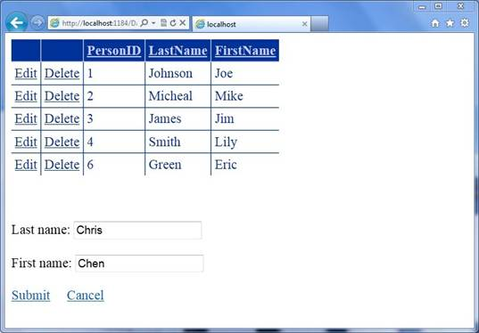

# ASP.NET GridView control demo (CSASPNETGridView)
## Requires
- Visual Studio 2010
## License
- MS-LPL
## Technologies
- ASP.NET
## Topics
- Data Binding
- GridView
## Updated
- 03/09/2017
## Description

<h1>ASP.NET GridView control <a name="OLE_LINK1">demo (</a>CSASPNETGridView)</h1>
<h2>Introduction</h2>

This CSASPNETGridView project describes how to populate ASP.NET GridView control and how to implement
<strong>Insert</strong>, <strong>Edit</strong>, <strong>Update</strong>, <strong>
Delete</strong>, <strong>Paging</strong> and <strong>Sorting</strong> functions in ASP.NET GridView control. We have received many posts in forums about this popular web control, so this sample provides a complete sample for showing how to implement these basic
 functions of this control. The sample demonstrates data source from both database and memory.

<h2>Building the Sample</h2>

For this sample to work, you must install the SqlServer 2008 R2 Express. This sample contains a SqlServer database file, if you do not install SqlServer, The DataInMemory.aspx page can also works fine. More information about SqlServer
 2008 R2 Express and download links can be found here:

&bull;&nbsp;&nbsp;&nbsp;&nbsp;&nbsp;&nbsp;&nbsp;&nbsp;
<a href="http://www.microsoft.com/download/en/details.aspx?id=16978">SqlServer 2008 R2 details</a>

&bull;&nbsp;&nbsp;&nbsp;&nbsp;&nbsp;&nbsp;&nbsp;&nbsp;
<a href="http://www.microsoft.com/download/en/details.aspx?displaylang=en&id=3743">Download SqlServer 2008 R2 Express</a>

<h2>Running the Sample</h2>

Please follow these demonstration steps below.

Step 1:&nbsp;Open the CSASPNETGridView.sln. Expand the CSASPNETGridView web application and press Ctrl &#43; F5 to show the DataFromDatabase.aspx.

Step 2: We will see a GirdView control on the page, you can add, edit, delete the columns of the GridView control, the data is come from App_Data/GridView.mdf file, and the GridView's status is stored in ViewState for persisting data
 across postbacks.

&nbsp; 

Step 3: The GridView the page size is 15, you need insert 16 Persons in this GridView to see the next page. Please click the title of the GridView to sort the result by PersonID, LastName or FirstName properties.

Step 4: Please press Ctrl&#43;F5 to show DataInMemory.aspx page, the test steps just like DataFromDataBase.aspx.

Step 5: Validation finished.

<h2>Using the Code</h2>

Code Logical:

Step 1. Create a C# &quot;ASP.NET Empty Web Application&quot; in Visual Studio 2010 or Visual Web Developer 2010. Name it as &quot;CSASPNETGridView &quot;. The project includes two web form pages for demonstrating two ways to bind data source with the GridView,
 name them as &quot;DataFromDataBase.aspx&quot;, &quot;DataInMemory.aspx&quot;.

Step 2. Before we start to write code, we need install SqlServer 2008 R2 Express and create a database file as the data source of GridView control. Add an Asp.net folder &quot;App_Data&quot; and create a Sql Server Database,&quot;GridView.mdf&quot;. Add
 &quot;Person&quot; table with three fields &quot;PersonID&quot;,&quot;FirstName&quot;,&quot;LastName&quot;, PersonID is the primary key of the table, and you can insert some default values in Person table.

Step 3. Drag and drop a GridView control, two LinkButton controls, two TextBox controls and a Panel control into DataFromDataBase.aspx page. The GridView is used to display, edit and delete the data of database file, the TextBox and LinkButton
 are used to insert new items to the data table. In the first step, check your controls and rename them and set some basic properties of the GridView, such as GridView's templates and events.

<h3>The following Html code is showing the GridView's necessary events (onpageindexchanging, onrowcancelingedit,
onrowdatabound, etc), GridView's TemplateField and other controls:&nbsp;&nbsp;&nbsp;&nbsp;&nbsp;&nbsp;&nbsp;&nbsp;&nbsp;&nbsp;&nbsp;&nbsp;
</h3>

HTML

Edit|Remove

html

<pre class="html" id="codePreview">&lt;asp:GridView ID=&quot;gvPerson&quot; runat=&quot;server&quot; AutoGenerateColumns=&quot;False&quot; BackColor=&quot;White&quot; 
BorderColor=&quot;#3366CC&quot; BorderStyle=&quot;None&quot; BorderWidth=&quot;1px&quot; CellPadding=&quot;4&quot; 
    onpageindexchanging=&quot;gvPerson_PageIndexChanging&quot; 
    onrowcancelingedit=&quot;gvPerson_RowCancelingEdit&quot; 
    onrowdatabound=&quot;gvPerson_RowDataBound&quot; onrowdeleting=&quot;gvPerson_RowDeleting&quot; 
    onrowediting=&quot;gvPerson_RowEditing&quot; onrowupdating=&quot;gvPerson_RowUpdating&quot; 
    onsorting=&quot;gvPerson_Sorting&quot;&gt;
&lt;RowStyle BackColor=&quot;White&quot; ForeColor=&quot;#003399&quot; /&gt;
    &lt;Columns&gt;
        &lt;asp:CommandField ShowEditButton=&quot;True&quot; /&gt;
        &lt;asp:CommandField ShowDeleteButton=&quot;True&quot; /&gt;
        &lt;asp:BoundField DataField=&quot;PersonID&quot; HeaderText=&quot;PersonID&quot; ReadOnly=&quot;True&quot; 
            SortExpression=&quot;PersonID&quot; /&gt;
        &lt;asp:TemplateField HeaderText=&quot;LastName&quot; SortExpression=&quot;LastName&quot;&gt;
            &lt;EditItemTemplate&gt;
                &lt;asp:TextBox ID=&quot;TextBox1&quot; runat=&quot;server&quot; Text='&lt;%# Bind(&quot;LastName&quot;) %&gt;'&gt;&lt;/asp:TextBox&gt;
            &lt;/EditItemTemplate&gt;
            &lt;ItemTemplate&gt;
                &lt;asp:Label ID=&quot;Label1&quot; runat=&quot;server&quot; Text='&lt;%# Bind(&quot;LastName&quot;) %&gt;'&gt;&lt;/asp:Label&gt;
            &lt;/ItemTemplate&gt;
        &lt;/asp:TemplateField&gt;
        &lt;asp:TemplateField HeaderText=&quot;FirstName&quot; SortExpression=&quot;FirstName&quot;&gt;
            &lt;EditItemTemplate&gt;
                &lt;asp:TextBox ID=&quot;TextBox2&quot; runat=&quot;server&quot; Text='&lt;%# Bind(&quot;FirstName&quot;) %&gt;'&gt;&lt;/asp:TextBox&gt;
            &lt;/EditItemTemplate&gt;
            &lt;ItemTemplate&gt;
                &lt;asp:Label ID=&quot;Label2&quot; runat=&quot;server&quot; Text='&lt;%# Bind(&quot;FirstName&quot;) %&gt;'&gt;&lt;/asp:Label&gt;
            &lt;/ItemTemplate&gt;
        &lt;/asp:TemplateField&gt;
    &lt;/Columns&gt;
    &lt;FooterStyle BackColor=&quot;#99CCCC&quot; ForeColor=&quot;#003399&quot; /&gt;
    &lt;PagerStyle BackColor=&quot;#99CCCC&quot; ForeColor=&quot;#003399&quot; HorizontalAlign=&quot;Left&quot; /&gt;
    &lt;SelectedRowStyle BackColor=&quot;#009999&quot; Font-Bold=&quot;True&quot; ForeColor=&quot;#CCFF99&quot; /&gt;
    &lt;HeaderStyle BackColor=&quot;#003399&quot; Font-Bold=&quot;True&quot; ForeColor=&quot;#CCCCFF&quot; /&gt;
&lt;/asp:GridView&gt;
    
 
&lt;asp:LinkButton ID=&quot;lbtnAdd&quot; runat=&quot;server&quot; onclick=&quot;lbtnAdd_Click&quot;&gt;AddNew&lt;/asp:LinkButton&gt;
 
 
&lt;asp:Panel ID=&quot;pnlAdd&quot; runat=&quot;server&quot; Visible=&quot;False&quot;&gt;
    Last name:
    &lt;asp:TextBox ID=&quot;tbLastName&quot; runat=&quot;server&quot;&gt;&lt;/asp:TextBox&gt;
     
     
    First name:
    &lt;asp:TextBox ID=&quot;tbFirstName&quot; runat=&quot;server&quot;&gt;&lt;/asp:TextBox&gt;
     
     
    &lt;asp:LinkButton ID=&quot;lbtnSubmit&quot; runat=&quot;server&quot; onclick=&quot;lbtnSubmit_Click&quot;&gt;Submit&lt;/asp:LinkButton&gt;
    &nbsp;&nbsp;&nbsp;
    &lt;asp:LinkButton ID=&quot;lbtnCancel&quot; runat=&quot;server&quot; onclick=&quot;lbtnCancel_Click&quot;&gt;Cancel&lt;/asp:LinkButton&gt;
    
&lt;/asp:Panel&gt;

</pre>

&nbsp;

&nbsp;

Step 4. Copy the Page_Load and BindGridView methods of the sample and paste them to your DataFromDataBase.aspx.cs file, and navigator to the Property panel and switch to Event. Double click on the following event and generate the Event
 Handlers, after that, fill the generated methods with the sample code.

&bull;&nbsp;&nbsp;&nbsp;&nbsp;&nbsp;&nbsp;&nbsp;&nbsp;
<a href="http://msdn.microsoft.com/en-us/library/system.web.ui.webcontrols.gridview.rowdatabound.aspx">RowDataBound Event</a>

&bull;&nbsp;&nbsp;&nbsp;&nbsp;&nbsp;&nbsp;&nbsp;&nbsp;
<a href="http://msdn.microsoft.com/en-us/library/system.web.ui.webcontrols.gridview.pageindexchanging.aspx">PageIndexChanging Event</a>

&bull;&nbsp;&nbsp;&nbsp;&nbsp;&nbsp;&nbsp;&nbsp;&nbsp;
<a href="http://msdn.microsoft.com/en-us/library/system.web.ui.webcontrols.gridview.rowediting.aspx">RowEditing Event</a>

&bull;&nbsp;&nbsp;&nbsp;&nbsp;&nbsp;&nbsp;&nbsp;&nbsp;
<a href="http://msdn.microsoft.com/en-us/library/system.web.ui.webcontrols.gridview.rowcancelingedit.aspx">RowCancelingEdit Event</a>

&bull;&nbsp;&nbsp;&nbsp;&nbsp;&nbsp;&nbsp;&nbsp;&nbsp;
<a href="http://msdn.microsoft.com/en-us/library/system.web.ui.webcontrols.gridview.rowupdating.aspx">RowUpdating Event</a>

&bull;&nbsp;&nbsp;&nbsp;&nbsp;&nbsp;&nbsp;&nbsp;&nbsp;
<a href="http://msdn.microsoft.com/en-us/library/system.web.ui.webcontrols.gridview.rowdeleting.aspx">RowDeleting Event</a>

&bull;&nbsp;&nbsp;&nbsp;&nbsp;&nbsp;&nbsp;&nbsp;&nbsp;
<a href="http://msdn.microsoft.com/en-us/library/system.web.ui.webcontrols.gridview.sorting.aspx">Sorting Event</a>

<h3>The following code is used to implement the basic functions of the GridView control.</h3>

C#

Edit|Remove

csharp

<pre class="csharp" id="codePreview">protected void Page_Load(object sender, EventArgs e)
{
    // The Page is accessed for the first time.
    if (!IsPostBack)
    {
        // Enable the GridView paging option and 
        // specify the page size.
        gvPerson.AllowPaging = true;
        gvPerson.PageSize = 15;

        // Enable the GridView sorting option.
        gvPerson.AllowSorting = true;

        // Initialize the sorting expression.
        ViewState[&quot;SortExpression&quot;] = &quot;PersonID ASC&quot;;

        // Populate the GridView.
        BindGridView();
    }
}

private void BindGridView()
{
    // Get the connection string from Web.config. 
    // When we use Using statement, 
    // we don't need to explicitly dispose the object in the code, 
    // the using statement takes care of it.
    using (SqlConnection conn = new SqlConnection(ConfigurationManager.ConnectionStrings[&quot;SQLServer2005DBConnectionString&quot;].ToString()))
    {
        // Create a DataSet object.
        DataSet dsPerson = new DataSet();

        // Create a SELECT query.
        string strSelectCmd = &quot;SELECT PersonID,LastName,FirstName FROM Person&quot;;

        // Create a SqlDataAdapter object
        // SqlDataAdapter represents a set of data commands and a 
        // database connection that are used to fill the DataSet and 
        // update a SQL Server database. 
        SqlDataAdapter da = new SqlDataAdapter(strSelectCmd, conn);

        // Open the connection
        conn.Open();

        // Fill the DataTable named &quot;Person&quot; in DataSet with the rows
        // returned by the query.new n
        da.Fill(dsPerson, &quot;Person&quot;);

        // Get the DataView from Person DataTable.
        DataView dvPerson = dsPerson.Tables[&quot;Person&quot;].DefaultView;

        // Set the sort column and sort order.
        dvPerson.Sort = ViewState[&quot;SortExpression&quot;].ToString();

        // Bind the GridView control.
        gvPerson.DataSource = dvPerson;
        gvPerson.DataBind();
    }
}

// GridView.RowDataBound Event
protected void gvPerson_RowDataBound(object sender, GridViewRowEventArgs e)
{
    // Make sure the current GridViewRow is a data row.
    if (e.Row.RowType == DataControlRowType.DataRow)
    {
        // Make sure the current GridViewRow is either 
        // in the normal state or an alternate row.
        if (e.Row.RowState == DataControlRowState.Normal || e.Row.RowState == DataControlRowState.Alternate)
        {
            // Add client-side confirmation when deleting.
            ((LinkButton)e.Row.Cells[1].Controls[0]).Attributes[&quot;onclick&quot;] = &quot;if(!confirm('Are you certain you want to delete this person ?')) return false;&quot;;
        }
    }
}

// GridView.PageIndexChanging Event
protected void gvPerson_PageIndexChanging(object sender, GridViewPageEventArgs e)
{
    // Set the index of the new display page. 
    gvPerson.PageIndex = e.NewPageIndex;

    // Rebind the GridView control to 
    // show data in the new page.
    BindGridView();
}

// GridView.RowEditing Event
protected void gvPerson_RowEditing(object sender, GridViewEditEventArgs e)
{
    // Make the GridView control into edit mode 
    // for the selected row. 
    gvPerson.EditIndex = e.NewEditIndex;

    // Rebind the GridView control to show data in edit mode.
    BindGridView();

    // Hide the Add button.
    lbtnAdd.Visible = false;
}

// GridView.RowCancelingEdit Event
protected void gvPerson_RowCancelingEdit(object sender, GridViewCancelEditEventArgs e)
{
    // Exit edit mode.
    gvPerson.EditIndex = -1;

    // Rebind the GridView control to show data in view mode.
    BindGridView();

    // Show the Add button.
    lbtnAdd.Visible = true;
}

// GridView.RowUpdating Event
protected void gvPerson_RowUpdating(object sender, GridViewUpdateEventArgs e)
{
    using (SqlConnection conn = new SqlConnection(ConfigurationManager.ConnectionStrings[&quot;SQLServer2005DBConnectionString&quot;].ToString()))
    {
        // Create a command object.
        SqlCommand cmd = new SqlCommand();

        // Assign the connection to the command.
        cmd.Connection = conn;

        // Set the command text
        // SQL statement or the name of the stored procedure 
        cmd.CommandText = &quot;UPDATE Person SET LastName = @LastName, FirstName = @FirstName WHERE PersonID = @PersonID&quot;;

        // Set the command type
        // CommandType.Text for ordinary SQL statements; 
        // CommandType.StoredProcedure for stored procedures.
        cmd.CommandType = CommandType.Text;

        // Get the PersonID of the selected row.
        string strPersonID = gvPerson.Rows[e.RowIndex].Cells[2].Text;
        string strLastName = ((TextBox)gvPerson.Rows[e.RowIndex].FindControl(&quot;TextBox1&quot;)).Text;
        string strFirstName = ((TextBox)gvPerson.Rows[e.RowIndex].FindControl(&quot;TextBox2&quot;)).Text;

        // Append the parameters.
        cmd.Parameters.Add(&quot;@PersonID&quot;, SqlDbType.Int).Value = strPersonID;
        cmd.Parameters.Add(&quot;@LastName&quot;, SqlDbType.NVarChar, 50).Value = strLastName;
        cmd.Parameters.Add(&quot;@FirstName&quot;, SqlDbType.NVarChar, 50).Value = strFirstName;

        // Open the connection.
        conn.Open();

        // Execute the command.
        cmd.ExecuteNonQuery();
    }

    // Exit edit mode.
    gvPerson.EditIndex = -1;

    // Rebind the GridView control to show data after updating.
    BindGridView();

    // Show the Add button.
    lbtnAdd.Visible = true;
}

// GridView.RowDeleting Event
protected void gvPerson_RowDeleting(object sender, GridViewDeleteEventArgs e)
{
    using (SqlConnection conn = new SqlConnection(ConfigurationManager.ConnectionStrings[&quot;SQLServer2005DBConnectionString&quot;].ToString()))
    {
        // Create a command object.
        SqlCommand cmd = new SqlCommand();

        // Assign the connection to the command.
        cmd.Connection = conn;

        // Set the command text
        // SQL statement or the name of the stored procedure 
        cmd.CommandText = &quot;DELETE FROM Person WHERE PersonID = @PersonID&quot;;

        // Set the command type
        // CommandType.Text for ordinary SQL statements; 
        // CommandType.StoredProcedure for stored procedures.
        cmd.CommandType = CommandType.Text;

        // Get the PersonID of the selected row.
        string strPersonID = gvPerson.Rows[e.RowIndex].Cells[2].Text;

        // Append the parameter.
        cmd.Parameters.Add(&quot;@PersonID&quot;, SqlDbType.Int).Value = strPersonID;

        // Open the connection.
        conn.Open();

        // Execute the command.
        cmd.ExecuteNonQuery();
    }

    // Rebind the GridView control to show data after deleting.
    BindGridView();
}

// GridView.Sorting Event
protected void gvPerson_Sorting(object sender, GridViewSortEventArgs e)
{
    string[] strSortExpression = ViewState[&quot;SortExpression&quot;].ToString().Split(' ');

    // If the sorting column is the same as the previous one, 
    // then change the sort order.
    if (strSortExpression[0] == e.SortExpression)
    {
        if (strSortExpression[1] == &quot;ASC&quot;)
        {
            ViewState[&quot;SortExpression&quot;] = e.SortExpression &#43; &quot; &quot; &#43; &quot;DESC&quot;;
        }
        else
        {
            ViewState[&quot;SortExpression&quot;] = e.SortExpression &#43; &quot; &quot; &#43; &quot;ASC&quot;;
        }
    }
    // If sorting column is another column,  
    // then specify the sort order to &quot;Ascending&quot;.
    else
    {
        ViewState[&quot;SortExpression&quot;] = e.SortExpression &#43; &quot; &quot; &#43; &quot;ASC&quot;;
    }

    // Rebind the GridView control to show sorted data.
    BindGridView();
}

</pre>

&nbsp;

&nbsp;

Step 5. Double click on the Click event of LinkButton control to generate the event handler and fill the generated methods with the sample, these two button are used to add new items to the database file and cancel the insert operate.

<h3><a name="OLE_LINK3">The following code shows how to insert new items to the database file.</a></h3>

C#

Edit|Remove

csharp

<pre class="csharp" id="codePreview">protected void lbtnAdd_Click(object sender, EventArgs e)
{
    // Hide the Add button and showing Add panel.
    lbtnAdd.Visible = false;
    pnlAdd.Visible = true;
}

protected void lbtnSubmit_Click(object sender, EventArgs e)
{
    using (SqlConnection conn = new SqlConnection(ConfigurationManager.ConnectionStrings[&quot;SQLServer2005DBConnectionString&quot;].ToString()))
    {
        // Create a command object.
        SqlCommand cmd = new SqlCommand();

        // Assign the connection to the command.
        cmd.Connection = conn;

        // Set the command text
        // SQL statement or the name of the stored procedure 
        cmd.CommandText = &quot;INSERT INTO Person ( LastName, FirstName ) VALUES ( @LastName, @FirstName )&quot;;

        // Set the command type
        // CommandType.Text for ordinary SQL statements; 
        // CommandType.StoredProcedure for stored procedures.
        cmd.CommandType = CommandType.Text;

        // Append the parameters.
        cmd.Parameters.Add(&quot;@LastName&quot;, SqlDbType.NVarChar, 50).Value = tbLastName.Text;
        cmd.Parameters.Add(&quot;@FirstName&quot;, SqlDbType.NVarChar, 50).Value = tbFirstName.Text;

        // Open the connection.
        conn.Open();

        // Execute the command.
        cmd.ExecuteNonQuery();
    }

    // Rebind the GridView control to show inserted data.
    BindGridView();

    // Empty the TextBox controls.
    tbLastName.Text = &quot;&quot;;
    tbFirstName.Text = &quot;&quot;;

    // Show the Add button and hiding the Add panel.
    lbtnAdd.Visible = true;
    pnlAdd.Visible = false;
}

protected void lbtnCancel_Click(object sender, EventArgs e)
{
    // Empty the TextBox controls.
    tbLastName.Text = &quot;&quot;;
    tbFirstName.Text = &quot;&quot;;

    // Show the Add button and hiding the Add panel.
    lbtnAdd.Visible = true;
    pnlAdd.Visible = false;
}

</pre>

&nbsp;

&nbsp;

Step 6. The DataInMemory.aspx page is pretty much the same with DataFromDataBase.aspx page, this web page get data from memory, instead of database file. So we only need to add a new method &quot;InitializeDataSource&quot; for generating the DataTable
 variable, then we need to modify the BindGridView method to bind new the DataTable with GridView.

<h3>The following code is use initialize the DataTable and stores it in ViewState.</h3>

C#

Edit|Remove

csharp

<pre class="csharp" id="codePreview">// Initialize the DataTable.
private void InitializeDataSource()
{
    // Create a DataTable object named dtPerson.
    DataTable dtPerson = new DataTable();

    // Add four columns to the DataTable.
    dtPerson.Columns.Add(&quot;PersonID&quot;);
    dtPerson.Columns.Add(&quot;LastName&quot;);
    dtPerson.Columns.Add(&quot;FirstName&quot;);

    // Specify PersonID column as an auto increment column
    // and set the starting value and increment.
    dtPerson.Columns[&quot;PersonID&quot;].AutoIncrement = true;
    dtPerson.Columns[&quot;PersonID&quot;].AutoIncrementSeed = 1;
    dtPerson.Columns[&quot;PersonID&quot;].AutoIncrementStep = 1;

    // Set PersonID column as the primary key.
    DataColumn[] dcKeys = new DataColumn[1];
    dcKeys[0] = dtPerson.Columns[&quot;PersonID&quot;];
    dtPerson.PrimaryKey = dcKeys;

    // Add new rows into the DataTable.
    dtPerson.Rows.Add(null, &quot;Davolio&quot;, &quot;Nancy&quot;);
    dtPerson.Rows.Add(null, &quot;Fuller&quot;, &quot;Andrew&quot;);
    dtPerson.Rows.Add(null, &quot;Leverling&quot;, &quot;Janet&quot;);
    dtPerson.Rows.Add(null, &quot;Dodsworth&quot;, &quot;Anne&quot;);
    dtPerson.Rows.Add(null, &quot;Buchanan&quot;, &quot;Steven&quot;);
    dtPerson.Rows.Add(null, &quot;Suyama&quot;, &quot;Michael&quot;);
    dtPerson.Rows.Add(null, &quot;Callahan&quot;, &quot;Laura&quot;);

    // Store the DataTable in ViewState. 
    ViewState[&quot;dtPerson&quot;] = dtPerson;
}

private void BindGridView()
{
    if (ViewState[&quot;dtPerson&quot;] != null)
    {
        // Get the DataTable from ViewState.
        DataTable dtPerson = (DataTable)ViewState[&quot;dtPerson&quot;];

        // Convert the DataTable to DataView.
        DataView dvPerson = new DataView(dtPerson);  

        // Set the sort column and sort order.
        dvPerson.Sort = ViewState[&quot;SortExpression&quot;].ToString();

        // Bind the GridView control.
        gvPerson.DataSource = dvPerson;
        gvPerson.DataBind();
    }
}

</pre>

&nbsp;

&nbsp;

Step 7. Build the application and you can debug it.

&nbsp;

<h2>More Information</h2>

&bull;&nbsp;&nbsp;&nbsp;&nbsp;&nbsp;&nbsp;&nbsp;&nbsp;
<a href="http://msdn.microsoft.com/en-us/library/yh598w02%28v=VS.80%29.aspx">using Statement (C# Reference)</a>

&bull;&nbsp;&nbsp;&nbsp;&nbsp;&nbsp;&nbsp;&nbsp;&nbsp;
<a href="http://msdn.microsoft.com/en-us/library/ms972976.aspx">Understanding ASP.NET View State</a>

&bull;&nbsp;&nbsp;&nbsp;&nbsp;&nbsp;&nbsp;&nbsp;&nbsp;
<a href="http://www.asp.net/data-access/tutorials/editing,-inserting,-and-deleting-data">Editing, Inserting, and Deleting Data</a>

&bull;&nbsp;&nbsp;&nbsp;&nbsp;&nbsp;&nbsp;&nbsp;&nbsp;
<a href="http://www.asp.net/data-access/tutorials/adding-client-side-confirmation-when-deleting-vb">Adding Client-Side Confirmation When Deleting</a>

&bull;&nbsp;&nbsp;&nbsp;&nbsp;&nbsp;&nbsp;&nbsp;&nbsp;
<a href="http://msdn.microsoft.com/en-us/library/system.web.ui.webcontrols.webcontrol.attributes.aspx">WebControl.Attributes Property</a>

