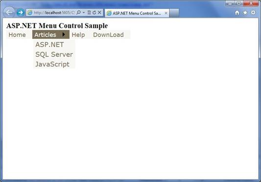

# ASP.NET Menu control demo (CSASPNETMenu)
## Requires
- Visual Studio 2008
## License
- MIT
## Technologies
- ASP.NET
## Topics
- Controls
- Menu
## Updated
- 04/11/2016
## Description

<h1><a name="OLE_LINK1">ASP.NET Menu Control (</a>CSASPNETMenu)</h1>
<h2>Introduction</h2>

The sample demonstrates how to bind the ASP.NET Menu Control to the Database. All the contents of the Menu control are generated dynamically, if we want to add some new navigation items into the website, we only need to insert some data
 to the database instead of modifying the source code.

<h2>Running the Sample</h2>

Please follow these demonstration steps below.

Step 1:&nbsp;Open the CSASPNETMenu.sln. Expand the CSASPNETMenu web application and press Ctrl &#43; F5 to show the CSASPNETMenu.aspx.

Step 2: We will see a Menu control on the page, you can click the Menu items and jump to the Test.aspx page.

&nbsp; 

Step 3: If you want to change the url string variables to your website��s pages, you need to modify the DataTable object in the code-bebind page (CSASPNETMenu.aspx.cs). Perhaps we need a table in DataBase for managing menu items content
 and navigator url, you can also create a database file to constitute a DataTable like this sample.&nbsp;

Step 4: Validation finished.

<h2>Using the Code</h2>

Code Logical:

Step 1. Create a C# &quot;ASP.NET Empty Web Application&quot; in Visual Studio 2008. Name it as &quot; CSASPNETMenu &quot;. The project includes two web form pages for demonstrating how to bind Menu control with a DataTable variable.

Step 2. Add two web form pages in the root directory of the application, name them as ��CSASPNETMenu.aspx��, ��Test.aspx��. The CSASPNETMenu page is used to show Menu control and redirect to the Test page by clicking the items of Menu.

Step 3. Drag and Drop a Menu control to the CSASPNETMenu page, you can set the styles of the Menu to make it looks better. Then you can begin to write C# code for generating DataTable variable and bind it to the Menu control, in this
 sample, we create a GetData() method to generate data.

<h3>The following code is used to generate a DataTable variable and fill it with some default value:&nbsp;&nbsp;&nbsp;&nbsp;&nbsp;
</h3>

C#

Edit|Remove

csharp

<pre class="csharp" id="codePreview">public DataSet GetData()
{
    // In order to test, we use the memory tables as the datasource.
    DataTable mainTB = new DataTable();
    DataColumn mainIdCol = new DataColumn(&quot;mainId&quot;);
    DataColumn mainNameCol = new DataColumn(&quot;mainName&quot;);
    DataColumn mainUrlCol = new DataColumn(&quot;mainUrl&quot;);
    mainTB.Columns.Add(mainIdCol);
    mainTB.Columns.Add(mainNameCol);
    mainTB.Columns.Add(mainUrlCol);

    DataTable childTB = new DataTable();
    DataColumn childIdCol = new DataColumn(&quot;childId&quot;);
    DataColumn childNameCol = new DataColumn(&quot;childName&quot;);

    // The MainId column of the child table is the foreign key to the main table.
    DataColumn childMainIdCol = new DataColumn(&quot;MainId&quot;);         
    DataColumn childUrlCol = new DataColumn(&quot;childUrl&quot;);

    childTB.Columns.Add(childIdCol);
    childTB.Columns.Add(childNameCol);
    childTB.Columns.Add(childMainIdCol);
    childTB.Columns.Add(childUrlCol);

    // Insert some test records to the main table.
    DataRow dr = mainTB.NewRow();
    dr[0] = &quot;1&quot;;
    dr[1] = &quot;Home&quot;;
    dr[2] = &quot;Test.aspx&quot;;
    mainTB.Rows.Add(dr);
    DataRow dr1 = mainTB.NewRow();
    dr1[0] = &quot;2&quot;;
    dr1[1] = &quot;Articles&quot;;
    dr1[2] = &quot;Test.aspx&quot;;
    mainTB.Rows.Add(dr1);
    DataRow dr2 = mainTB.NewRow();
    dr2[0] = &quot;3&quot;;
    dr2[1] = &quot;Help&quot;;
    dr2[2] = &quot;Test.aspx&quot;;
    mainTB.Rows.Add(dr2);
    DataRow dr3 = mainTB.NewRow();
    dr3[0] = &quot;4&quot;;
    dr3[1] = &quot;DownLoad&quot;;
    dr3[2] = &quot;Test.aspx&quot;;
    mainTB.Rows.Add(dr3);

    // Insert some test records to the child table
    DataRow dr5 = childTB.NewRow();
    dr5[0] = &quot;1&quot;;
    dr5[1] = &quot;ASP.NET&quot;;
    dr5[2] = &quot;2&quot;;
    dr5[3] = &quot;Test.aspx&quot;;
    childTB.Rows.Add(dr5);
    DataRow dr6 = childTB.NewRow();
    dr6[0] = &quot;2&quot;;
    dr6[1] = &quot;SQL Server&quot;;
    dr6[2] = &quot;2&quot;;
    dr6[3] = &quot;Test.aspx&quot;;
    childTB.Rows.Add(dr6);
    DataRow dr7 = childTB.NewRow();
    dr7[0] = &quot;3&quot;;
    dr7[1] = &quot;JavaScript&quot;;
    dr7[2] = &quot;2&quot;;
    dr7[3] = &quot;Test.aspx&quot;;
    childTB.Rows.Add(dr7);

    // Use the DataSet to contain that two tables.
    DataSet ds = new DataSet();          
    ds.Tables.Add(mainTB);
    ds.Tables.Add(childTB);

    // Build the relation between the main table and the child table.
    ds.Relations.Add(&quot;Child&quot;, ds.Tables[0].Columns[&quot;mainId&quot;], ds.Tables[1].Columns[&quot;MainId&quot;]);
   

    return ds;
}  

</pre>

&nbsp;

&nbsp;

Step 4. Then we need to create a GenerateMenuItem method for binding DataTable to the Menu control, and we need only execute this method when CSASPMETMenu page is loaded for the first&nbsp; time.

<h3>The following code is used to bind DataTable to the Menu control when page is loaded for the first time.</h3>

C#

Edit|Remove

csharp

<pre class="csharp" id="codePreview">protected void Page_Load(object sender, EventArgs e)
{
    if (!IsPostBack)
    {
        GenerateMenuItem();
    }
}

public void GenerateMenuItem()
{
    // Get the data from database.
    DataSet ds = GetData();

    foreach (DataRow mainRow in ds.Tables[0].Rows)
    {
        // Load the records from the main table to the menu control.
        MenuItem masterItem = new MenuItem(mainRow[&quot;mainName&quot;].ToString());
        masterItem.NavigateUrl = mainRow[&quot;mainUrl&quot;].ToString();
        Menu1.Items.Add(masterItem);

        foreach (DataRow childRow in mainRow.GetChildRows(&quot;Child&quot;))
        {
            // According to the relation of the main table and the child table, load the data from the child table.
            MenuItem childItem = new MenuItem((string)childRow[&quot;childName&quot;]);
            childItem.NavigateUrl = childRow[&quot;childUrl&quot;].ToString();
            masterItem.ChildItems.Add(childItem);
        }
    }
}

</pre>

&nbsp;

&nbsp;

Step 5. Build the application and you can debug it.

&nbsp;

<h2>More Information</h2>

��&nbsp;&nbsp;&nbsp;&nbsp;&nbsp;&nbsp;&nbsp;&nbsp;
<a href="http://msdn.microsoft.com/en-us/library/ecs0x9w5(VS.80).aspx">ASP.NET Menu Control Overview</a>

