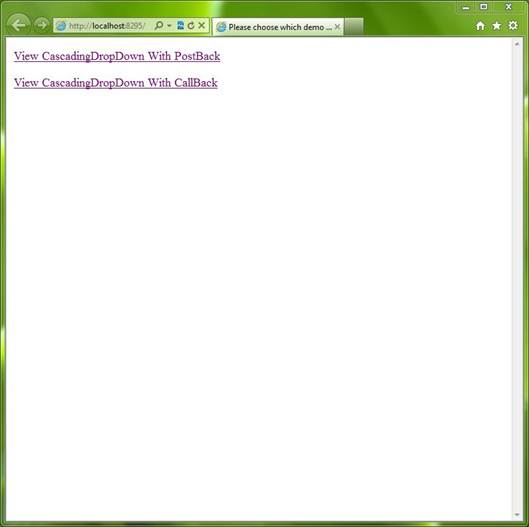
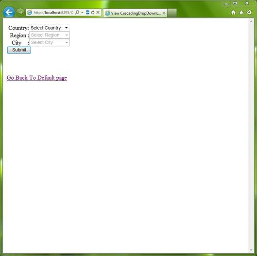
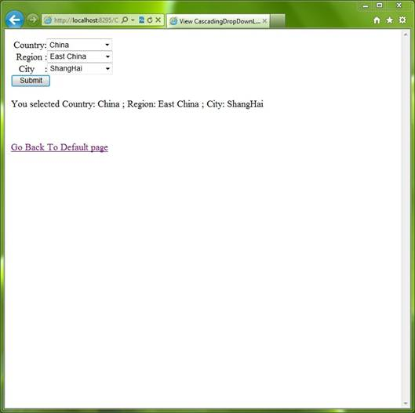

# ASP.NET cascading drop-down-list (CSASPNETCascadingDropDownList)
## Requires
- Visual Studio 2010
## License
- MS-LPL
## Technologies
- ASP.NET
## Topics
- Controls
- DropDownList
## Updated
- 03/04/2012
## Description

<h1>ASP.NET cascading drop-down-list (<a name="OLE_LINK1">CSASPNETCascadingDropDownList</a>)</h1>
<h2>Introduction</h2>

The example shows how to create Cascading DropDownList in two ways. You can view the Default.aspx page, and then you can find there&#39;re two links in this page :

��&nbsp;&nbsp;&nbsp;&nbsp;&nbsp;&nbsp;&nbsp;&nbsp;
Use ASP.NET DropDownList control with postback.

��&nbsp;&nbsp;&nbsp;&nbsp;&nbsp;&nbsp;&nbsp;&nbsp;
Use ASP.NET DropDownList control with callback. 

The CascadingDropDownListWithPostBack.aspx will save the selected option value in hidden text, and restore them when page is postback, the CascadingDropDownListWithCallBack.aspx page will create a XmlHttpRequest object and send callback
 to .aspx page when dropdownlist control options is changed.

<h2>Running the Sample</h2>

Please follow these demonstration steps below.

Step 1:&nbsp;Open the CSASPNETCascadingDropDownList.sln. Expand the CSASPNETCascadingDropDownList web application and press Ctrl &#43; F5 to show the default.aspx.

Step 2: We will see two links on default.aspx page, the two links point to CascadingDropDownListWithPostBack.aspx page and CascadingDropDownListWithCallBack.aspx page respectively. You can click one of them, and you may find these two
 web form pages appear to be similar to each other, but actually they achieve the same goal with different methods.

Step 3: There are three cascading dropdownlist controls and one button on the target page, please try to select the options which you like, and click submit button.

Step 4:&nbsp; The page will give the summary information for your selected options, just like the following screenshot.

Step 5: Now please click the ��Go Back to Default page�� link, you can test the CascadingDropDownListWithCallBack.aspx page now.

Step 6: Validation finished.

<h2>Using the Code</h2>

Code Logical: 

Step 1. Create a C# &quot;ASP.NET Empty Web Application&quot; in Visual Studio 2010. Name it as ��CSASPNETCascadingDropDownList&quot;. Add four web form pages in the root directory of the application, Default.aspx page is used to show
 different cascading dropdownlist pages, the CascadingDropDownListWithCallBack.aspx page is used to show the cascading dropdownlist with callback method, the CascadingDropDownListWithPostBack.aspx page is used to show the cascading dropdownlist with postback
 method, the GetDataForCallBack.aspx page is used to retrieve data in callback and write data to client-side application.

Step 2. The CascadingDropDownListWithCallBack.aspx page will use JavaScript functions to create XmlHttpRequest object for saving and restoring data, and we should add onChange event in Dropdownlist control for call ddlCountryOnChange()
 function.

<h3>The following code snippet is from Jscript.js file:</h3>

JavaScript

Edit|Remove

js

<pre id="codePreview" class="js">
var xmlHttp = null; // XMLHttpRequest object
var ddlCountry = null; // DropDownList for country
var ddlRegion = null; // DropDownList for region
var ddlCity = null;  // DropDownList for city
var hdfRegion = null; // Use to save region DropDownList options and restore it when page is rendering
var hdfCity = null;  // Use to save city DropDownList options and restore it when page is loadrenderinged
var hdfRegionSelectValue = null; // Use to save region DropDownList selected options and restore it when page is rendering
var hdfCitySelectValue = null; // Use to save city DropDownList selected options and restore it when page is rendering
var hdfCountrySelectValue = null;   // Use to save country DropDownList selected options and restore it when page is rendering

// Instance XMLHttpRequest
window.onload = function loadXMLHttp() {
    if (window.XMLHttpRequest) {
        xmlHttp = new XMLHttpRequest();
    } else if (window.ActiveXObject) {
        try {
            xmlHttp = new ActiveXObject(&quot;Microsoft.XMLHTTP&quot;);
        }
        catch (e) { }
    }

    ddlCountry = document.getElementById('ddlCountry');
    ddlRegion = document.getElementById('ddlRegion');
    ddlCity = document.getElementById('ddlCity');
    hdfRegion = document.getElementById('hdfRegion');
    hdfCity = document.getElementById('hdfCity');
    hdfRegionSelectValue = document.getElementById('hdfRegionSelectValue');
    hdfCitySelectValue = document.getElementById('hdfCitySelectValue');
    hdfCountrySelectValue = document.getElementById('hdfCountrySelectValue');
    ShowFirstOption(ddlCountry); // Add &quot;Please Select a xxxx&quot; option in the top of country DropDownList 
    RestoreDropdownlist(); // Restore dropdownlist when page is rendering

}

// Restore dropdownlist when page is rendering
function RestoreDropdownlist() {
    // Restore region dropdownlist
    if (hdfRegion.value != &quot;&quot;) {
        addOption(ddlRegion, hdfRegion.value);
        ddlRegion.selectedIndex = hdfRegionSelectValue.value;
    } // Restore city dropdownlist
    if (hdfCity.value != &quot;&quot;) {
        addOption(ddlCity, hdfCity.value);
        ddlCity.selectedIndex = hdfCitySelectValue.value;
    }
    ddlCountry.selectedIndex = hdfCountrySelectValue.value;
}

// Save selected options in hide field so that we can access it from codebehind class
function SaveSelectedData() {

    hdfCitySelectValue.value = ddlCity.selectedIndex;
    hdfCountrySelectValue.value = ddlCountry.selectedIndex;
    hdfRegionSelectValue.value = ddlRegion.selectedIndex;

    if (ddlCity != null && ddlCountry != null && ddlRegion != null
     && ddlCity.length &gt; 0 && ddlCountry.length &gt; 0 && ddlRegion.length &gt; 0
     && ddlCity.selectedIndex != '0' && ddlCountry.selectedIndex != '0' && ddlRegion.selectedIndex != '0') {

        var strResult = ddlCountry.options[ddlCountry.selectedIndex].value &#43; '; '
        &#43; ddlRegion.options[ddlRegion.selectedIndex].value &#43; '; '
        &#43; ddlCity.options[ddlCity.selectedIndex].value;

        document.getElementById('hdfResult').value = strResult;

    }
    else {
        document.getElementById('hdfResult').value = 'Please select option from DropDownList.';
    }
}

</pre>

&nbsp;

Then you can handle data binding event in code-behind file.

<h3>The following code is used to bind data with dropdownlist controls and handle on submit button.</h3>

C#

Edit|Remove

csharp

<pre id="codePreview" class="csharp">
/// &lt;summary&gt;
/// Page Load event
/// &lt;/summary&gt;
/// &lt;param name=&quot;sender&quot;&gt;&lt;/param&gt;
/// &lt;param name=&quot;e&quot;&gt;&lt;/param&gt;
protected void Page_Load(object sender, EventArgs e)
{
    // Register client onclick event for submit button
    btnSubmit.Attributes.Add(&quot;onclick&quot;, &quot;SaveSelectedData();&quot;);
    if (!IsPostBack)
    {
        // Bind country dropdownlist
        BindddlCountry();
        // Initialize hide field value
        hdfResult.Value = &quot;&quot;;
        hdfCity.Value = &quot;&quot;;
        hdfCitySelectValue.Value = &quot;0&quot;;
        hdfRegion.Value = &quot;&quot;;
        hdfRegionSelectValue.Value = &quot;&quot;;
    }
}

/// &lt;summary&gt;
/// Bind country dropdownlist
/// &lt;/summary&gt;
public void BindddlCountry()
{
    List&lt;string&gt; list = RetrieveDataFromXml.GetAllCountry();
    ddlCountry.DataSource = list;
    ddlCountry.DataBind();
}

/// &lt;summary&gt;
/// Submit button click event and show select result
/// &lt;/summary&gt;
/// &lt;param name=&quot;sender&quot;&gt;&lt;/param&gt;
/// &lt;param name=&quot;e&quot;&gt;&lt;/param&gt;
protected void btnSubmit_Click(object sender, EventArgs e)
{
    // Get result from hide field saved in client
    string strResult = hdfResult.Value;
    lblResult.Text = strResult;
}

</pre>

&nbsp;

Step 3. Then you need to use GetDataForCallback.aspx page to retrieve data and write data to the client.

<h3>The following code is used to retrieve and write data by callback method. </h3>

C#

Edit|Remove

csharp

<pre id="codePreview" class="csharp">
/// &lt;summary&gt;
/// Get region based on country value
/// &lt;/summary&gt;
/// &lt;param name=&quot;strValue&quot;&gt;The country value&lt;/param&gt;
public void RetrieveRegionByCountry(string strValue)
{
    List&lt;string&gt; list = RetrieveDataFromXml.GetRegionByCountry(strValue);
    WriteData(list);
}

/// &lt;summary&gt;
/// Get city based on region value
/// &lt;/summary&gt;
/// &lt;param name=&quot;strValue&quot;&gt;The region value&lt;/param&gt;
public void RetrieveCityByRegion(string strValue)
{
    List&lt;string&gt; list = RetrieveDataFromXml.GetCityByRegion(strValue);
    WriteData(list);
}

/// &lt;summary&gt;
/// Write data to client
/// &lt;/summary&gt;
/// &lt;param name=&quot;list&quot;&gt;The list contains value &lt;/param&gt;
public void WriteData(List&lt;string&gt; list)
{
    int iCount = list.Count;
    StringBuilder builder = new StringBuilder();
    if (iCount &gt; 0)
    {
        for (int i = 0; i &lt; iCount - 1; i&#43;&#43;)
        {
            builder.Append(list[i] &#43; &quot;,&quot;);
        }
        builder.Append(list[iCount - 1]);
    }

    Response.ContentType = &quot;text/xml&quot;;
    // Write data in string format &quot;###,###,###&quot; to client
    Response.Write(builder.ToString());
    Response.End();
}

</pre>

&nbsp;

Step 4. The next step, we need to implement cascading dropdownlist control, we must implement Dropdownlist��s SelectedIndexChanged event. Here we also need to add JavaScript functions to bind data with those controls.&nbsp;

<h3>The following code is showing how to implement with DropDownList SelectedIndexChanged event.</h3>

C#

Edit|Remove

csharp

<pre id="codePreview" class="csharp">
/// &lt;summary&gt;
/// Country dropdownlist SelectedIndexChanged event
/// &lt;/summary&gt;
/// &lt;param name=&quot;sender&quot;&gt;&lt;/param&gt;
/// &lt;param name=&quot;e&quot;&gt;&lt;/param&gt;
protected void ddlCountry_SelectedIndexChanged(object sender, EventArgs e)
{
    // Remove region dropdownlist items
    ddlRegion.Items.Clear();
    string strCountry = string.Empty;
    strCountry = ddlCountry.SelectedValue;
    List&lt;string&gt; list = null;

    // Bind Region dropdownlist based on country value
    if (ddlCountry.SelectedIndex != 0)
    {
        list = RetrieveDataFromXml.GetRegionByCountry(strCountry);
        if (list != null && list.Count != 0)
        {
            ddlRegion.Enabled = true;
        }

        ddlRegion.DataSource = list;
        ddlRegion.DataBind();
    }
    else
    {
        ddlRegion.Enabled = false;
    }

    ddlRegion.Items.Insert(0, new ListItem(&quot;Select Region&quot;, &quot;-1&quot;));

    // Clear city dropdownlist
    ddlCity.Enabled = false;
    ddlCity.Items.Clear();
    ddlCity.Items.Insert(0, new ListItem(&quot;Select City&quot;, &quot;-1&quot;));

    // Initialize city dropdownlist selected index
    hdfDdlCitySelectIndex.Value = &quot;0&quot;;
}

/// &lt;summary&gt;
/// Region dropdownlist SelectedIndexChanged event
/// &lt;/summary&gt;
/// &lt;param name=&quot;sender&quot;&gt;&lt;/param&gt;
/// &lt;param name=&quot;e&quot;&gt;&lt;/param&gt;
protected void ddlRegion_SelectedIndexChanged(object sender, EventArgs e)
{
    // Bind city dropdownlist based on region value
    string strRegion = string.Empty;
    strRegion = ddlRegion.SelectedValue;
    List&lt;string&gt; list = null;
    list = RetrieveDataFromXml.GetCityByRegion(strRegion);
    ddlCity.Items.Clear();
    ddlCity.DataSource = list;
    ddlCity.DataBind();
    ddlCity.Items.Insert(0, new ListItem(&quot;Select City&quot;, &quot;-1&quot;));

    // Initialize city dropdownlist selected index
    hdfDdlCitySelectIndex.Value = &quot;0&quot;;

    // Enable city dropdownlist when it has items
    if (list.Count &gt; 0)
    {
        ddlCity.Enabled = true;
    }
    else
    {
        ddlCity.Enabled = false;
    }
}

</pre>

&nbsp;

Step 5. Build the application and you can debug it.

<h2>More Information</h2>

��&nbsp;&nbsp;&nbsp;&nbsp;&nbsp;&nbsp;&nbsp;&nbsp;
<a href="http://msdn.microsoft.com/en-us/library/system.web.ui.webcontrols.dropdownlist.aspx">ASP.NET DropDownList Control</a>

��&nbsp;&nbsp;&nbsp;&nbsp;&nbsp;&nbsp;&nbsp;&nbsp;
<a href="http://msdn.microsoft.com/en-us/library/ms535874(VS.85).aspx">XMLHttpRequest Object</a>

��&nbsp;&nbsp;&nbsp;&nbsp;&nbsp;&nbsp;&nbsp;&nbsp;
<a href="http://msdn.microsoft.com/en-us/library/system.xml.xmldocument.aspx">XmlDocument Class</a>

