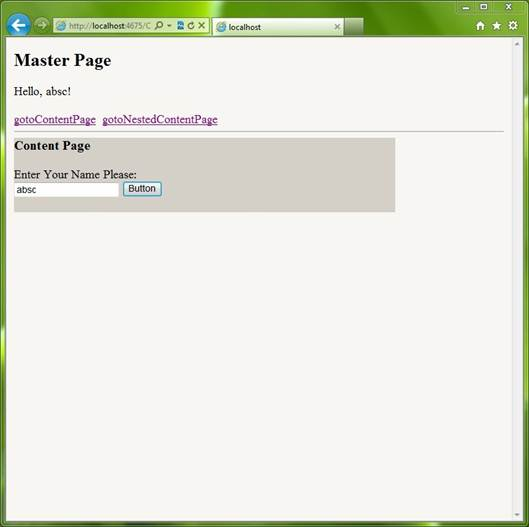

# ASP.NET master page demo (CSASPNETMasterPage)
## Requires
- Visual Studio 2010
## License
- MS-LPL
## Technologies
- ASP.NET
## Topics
- Master Page
## Updated
- 03/04/2012
## Description

<h1>ASP.NET master page demo (CSASPNETMasterPage)</h1>
<h2>Introduction</h2>

The project illustrates how to use Master Page. ASP.NET defines two new specialized types of pages: Master Page and Content Page. A Master page is a page template. Like an ordinary ASP.NET web page, it can contain any combination of HTML.
 In addition, Master Page includes a special control called ContentPlaceHolder which works as a holder of Content Page. On the other hand, each Content Page references a single Master Page and acquires its content. Both Master Page and Content Page work together
 can allow developers easier to build websites with a standard appearance.

<h2>Running the Sample</h2>

Please follow these demonstration steps below.

Step 1:&nbsp;Open the CSASPNETMasterPage.sln. Expand the 
CSASPNETMasterPage web application and press Ctrl &#43; F5 to show the ContentPage.aspx.

Step 2: We can find a little complex web page in browser, the page includes a master page and a content page, we can input some text in content page��s TextBox control and it will display in master page, the content page is embedded in
 master page. 

Step 3: Click gotoNestedContentPage link, we can see the content page is changed. There is another master page as follows, and this master page includes two content pages, you can change the page by clicking the links in left.

Step 4: Validation finished.

<h2>Using the Code</h2>

Code Logical : 

Step 1. Create a C# &quot;ASP.NET Empty Web Application&quot; in Visual Studio 2010. Name it as ��CSASPNETMasterPage&quot;.&nbsp;
Create three web form pages and two master pages, the ��Master.master�� page is the main master page, it includes all content pages and child master pages inside, the ��ContentPage.aspx�� page is the content page with some server controls, the ��NestedMaster.master��,
 ��NestedContentPageA.aspx��, ��NestedContentPageB.aspx�� pages are nested in Master.master page.

Step 2. The Master page includes a ContentPlaceHolder control for nesting in content page; the two Hyperlinks will redirect you to different content pages with ContentPage.aspx and NestedMasterPage.master.

<h3>The following code showing the Master.master page HTML markup and use ContentPlaceHolder to embed content page:</h3>

HTML

Edit|Remove

html
<pre class="hidden">
&lt;html xmlns=&quot;http://www.w3.org/1999/xhtml&quot;&gt;
&lt;head runat=&quot;server&quot;&gt;
    &lt;title&gt;&lt;/title&gt;
&lt;/head&gt;
&lt;body style=&quot;background-color:#F7F6F3&quot;&gt;
    &lt;form id=&quot;form1&quot; runat=&quot;server&quot;&gt;
    

        <h2>Master Page</h2>
        

            &lt;asp:Label ID=&quot;lbHello&quot; runat=&quot;server&quot;&gt;&lt;/asp:Label&gt;
        

        &lt;asp:HyperLink ID=&quot;linkToContentPage&quot; runat=&quot;server&quot; 
                       NavigateUrl=&quot;~/ContentPage.aspx&quot; 
                       Text=&quot;gotoContentPage&quot;&gt;&lt;/asp:HyperLink&gt;&nbsp;

        &lt;asp:HyperLink ID=&quot;linkToNestedContentPage&quot; runat=&quot;server&quot; 
                       NavigateUrl=&quot;~/NestedContentPageA.aspx&quot;
                       Text=&quot;gotoNestedContentPage&quot;&gt;&lt;/asp:HyperLink&gt;
        

        &lt;%--Content Page Begin--%&gt;
        &lt;asp:ContentPlaceHolder ID=&quot;MainContentHolder&quot; runat=&quot;server&quot;&gt;
        &lt;/asp:ContentPlaceHolder&gt;
        &lt;%--Content Page End--%&gt;
      
    

    &lt;/form&gt;
&lt;/body&gt;
&lt;/html&gt;

</pre>
<pre id="codePreview" class="html">
&lt;html xmlns=&quot;http://www.w3.org/1999/xhtml&quot;&gt;
&lt;head runat=&quot;server&quot;&gt;
    &lt;title&gt;&lt;/title&gt;
&lt;/head&gt;
&lt;body style=&quot;background-color:#F7F6F3&quot;&gt;
    &lt;form id=&quot;form1&quot; runat=&quot;server&quot;&gt;
    

        <h2>Master Page</h2>
        

            &lt;asp:Label ID=&quot;lbHello&quot; runat=&quot;server&quot;&gt;&lt;/asp:Label&gt;
        

        &lt;asp:HyperLink ID=&quot;linkToContentPage&quot; runat=&quot;server&quot; 
                       NavigateUrl=&quot;~/ContentPage.aspx&quot; 
                       Text=&quot;gotoContentPage&quot;&gt;&lt;/asp:HyperLink&gt;&nbsp;

        &lt;asp:HyperLink ID=&quot;linkToNestedContentPage&quot; runat=&quot;server&quot; 
                       NavigateUrl=&quot;~/NestedContentPageA.aspx&quot;
                       Text=&quot;gotoNestedContentPage&quot;&gt;&lt;/asp:HyperLink&gt;
        

        &lt;%--Content Page Begin--%&gt;
        &lt;asp:ContentPlaceHolder ID=&quot;MainContentHolder&quot; runat=&quot;server&quot;&gt;
        &lt;/asp:ContentPlaceHolder&gt;
        &lt;%--Content Page End--%&gt;
      
    

    &lt;/form&gt;
&lt;/body&gt;
&lt;/html&gt;

</pre>

&nbsp;

Step 3. The 
NestedMaster page is similar to Master page, you need to change Hyperlink��s NavigateUrl property and write different message in content pages. The another thing we need to handle is that we have to pass the massage in ContentPage to Master page, here
 we use Master.FindControl(&quot;lbHello&quot;) method to find master page��s controls.

<h3>The following code is used to find master page��s control and assign value to Label control.</h3>

C#

Edit|Remove

csharp
<pre class="hidden">
protected void Button1_Click(object sender, EventArgs e)
{
    Label lbMasterPageHello = Master.FindControl(&quot;lbHello&quot;) as Label;

    if (lbMasterPageHello != null)
    {
        lbMasterPageHello.Text = &quot;Hello, &quot; &#43; txtName.Text &#43; &quot;!&quot;;
    }
}

</pre>
<pre id="codePreview" class="csharp">
protected void Button1_Click(object sender, EventArgs e)
{
    Label lbMasterPageHello = Master.FindControl(&quot;lbHello&quot;) as Label;

    if (lbMasterPageHello != null)
    {
        lbMasterPageHello.Text = &quot;Hello, &quot; &#43; txtName.Text &#43; &quot;!&quot;;
    }
}

</pre>

&nbsp;

Step 4. Build the application and you can debug it.

<h2>More Information</h2>

��&nbsp;&nbsp;&nbsp;&nbsp;&nbsp;&nbsp;&nbsp;&nbsp;
<a href="http://msdn.microsoft.com/en-us/library/wtxbf3hh.aspx">ASP.NET Master Pages Overview</a>

��&nbsp;&nbsp;&nbsp;&nbsp;&nbsp;&nbsp;&nbsp;&nbsp;
<a href="http://msdn.microsoft.com/en-us/library/x2b3ktt7.aspx">Nested ASP.NET Master Pages</a>

��&nbsp;&nbsp;&nbsp;&nbsp;&nbsp;&nbsp;&nbsp;&nbsp;
<a href="http://msdn.microsoft.com/en-us/library/fft2ye18.aspx">Create Content Pages for an ASP.NET Master Page</a>

��&nbsp;&nbsp;&nbsp;&nbsp;&nbsp;&nbsp;&nbsp;&nbsp;
<a href="http://msdn.microsoft.com/en-us/library/xxwa0ff0.aspx">How to: Reference ASP.NET Master Page Content</a>

