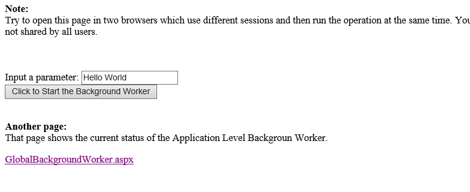

# Background worker thread in ASP.NET (CSASPNETBackgroundWorker)
## Requires
- Visual Studio 2012
## License
- MS-LPL
## Technologies
- ASP.NET
## Topics
- threading
- backgroundworker
## Updated
- 12/09/2012
## Description

<h1>Background worker thread in ASP.NET (CSASPNETBackgroundWorker)</h1>
<h2>Introduction</h2>

Sometimes we need to do some time-consuming operations in web page. The web page will be freezed until the operation is finished. In this case, we want the operation to run in the background, and also we may want to display the progress
 of the running operation in&nbsp; web page. And sometimes, we may want to schedule some operations (send email/report ect.). In these cases, we hope the operations can be ran at the specific time.

This project creates a class named &quot;BackgroundWorker&quot; to achieve these goals. It
creates a page named &quot;Default.aspx&quot; to run the long time operation. And it creates a Background Worker to do the schedule when application starts up, then
it uses &quot;GlobalBackgroundWorker.aspx&quot; page to check the progress.

<h2>Running the Sample </h2>

Step 1:&nbsp;&nbsp;
Open the CSASPNETBackgroundWorker.sln. 

Step 2:&nbsp;&nbsp;
Expand the CSASPNETBackgroundWorker web application and press Ctrl &#43; F5 to show the Default.aspx.

Step 3:&nbsp;&nbsp;
Session based Background Worker. 
 
a. Open Default.aspx, and then click the button to run the operation in background.

 
b. Open Default.aspx in two browsers then click the buttons at the same time. You will see that two Background Workers work independently.

Step 4:&nbsp;&nbsp;
Application Level Background Worker. 
 
a. Open GlobalBackgroundWorker.aspx. You will see that the Background Worker is running.

 
b. Close the browser, wait for 10 seconds and then open the page again. . You will see that the Background Worker is still running even we closed the browser.

Step 5:&nbsp;&nbsp;
Validation finished.

<h2>Using the Code </h2>

Step 1:&nbsp;&nbsp;
Create a C# &quot;ASP.NET Empty Web Application&quot; in Visual Studio 2012 or Visual Web Developer 2012. Name it as &quot;CSASPNETBackgroundWorker&quot;.

Step 2:&nbsp;&nbsp;
&nbsp;Add two web forms in the root directory, name them as &quot;Default.aspx&quot;, &quot; GlobalBackgroundWorker.aspx&quot;.

Step 3:&nbsp;&nbsp;
Create a class file and name it as &quot;BackgroundWorker&quot;. It starts an operation (method) in a separated thread.

C#

Edit|Remove

csharp

<pre id="codePreview" class="csharp">
_innerThread = new Thread(() =&gt;
&nbsp;&nbsp; {
&nbsp;&nbsp;&nbsp;&nbsp;&nbsp;&nbsp; _progress = 0;
&nbsp;&nbsp;&nbsp;&nbsp;&nbsp;&nbsp; DoWork.Invoke(ref _progress, ref _result, arguments);
&nbsp;&nbsp;&nbsp;&nbsp;&nbsp;&nbsp; _progress = 100;
&nbsp;&nbsp; });
&nbsp;&nbsp; _innerThread.Start();

</pre>

&nbsp;

Step 4:&nbsp;&nbsp;
In the page named &quot;Default.aspx&quot;. It uses UpdatePanel to achieve partial refreshing. And it uses Timer control to update the operation progress.

HTML

Edit|Remove

html

<pre id="codePreview" class="html">
&lt;!-- UpdateUpanel let the progress can be updated without updating the whole page (partial update). --&gt;
&nbsp;&nbsp;&nbsp; &lt;asp:UpdatePanel ID=&quot;UpdatePanel1&quot; runat=&quot;server&quot;&gt;
&nbsp;&nbsp;&nbsp;&nbsp;&nbsp;&nbsp;&nbsp; &lt;ContentTemplate&gt;
&nbsp;&nbsp;&nbsp;&nbsp;&nbsp;&nbsp;&nbsp;&nbsp;&nbsp;&nbsp;&nbsp; 
&nbsp;&nbsp;&nbsp;&nbsp;&nbsp;&nbsp;&nbsp;&nbsp;&nbsp;&nbsp;&nbsp;&nbsp;&lt;!-- The timer which used to update the progress. --&gt;
&nbsp;&nbsp;&nbsp;&nbsp;&nbsp;&nbsp;&nbsp;&nbsp;&nbsp;&nbsp;&nbsp; &lt;asp:Timer ID=&quot;Timer1&quot; runat=&quot;server&quot; Interval=&quot;100&quot; Enabled=&quot;false&quot; ontick=&quot;Timer1_Tick&quot;&gt;&lt;/asp:Timer&gt;

&nbsp;&nbsp;&nbsp;&nbsp;&nbsp;&nbsp;&nbsp;&nbsp;&nbsp;&nbsp;&nbsp; &lt;!-- The Label which used to display the progress and the result --&gt;
&nbsp;&nbsp;&nbsp;&nbsp;&nbsp; &nbsp;&nbsp;&nbsp;&nbsp;&nbsp;&nbsp;&lt;asp:Label ID=&quot;lbProgress&quot; runat=&quot;server&quot; Text=&quot;&quot;&gt;&lt;/asp:Label&gt; 

&nbsp;&nbsp;&nbsp;&nbsp;&nbsp;&nbsp;&nbsp;&nbsp;&nbsp;&nbsp;&nbsp; &lt;!-- Start the operation by inputting value and clicking the button --&gt;
&nbsp;&nbsp;&nbsp;&nbsp;&nbsp;&nbsp;&nbsp;&nbsp;&nbsp;&nbsp;&nbsp; Input a parameter: &lt;asp:TextBox ID=&quot;txtParameter&quot; runat=&quot;server&quot; Text=&quot;Hello World&quot;&gt;&lt;/asp:TextBox&gt; 
&nbsp;&nbsp;&nbsp;&nbsp;&nbsp;&nbsp;&nbsp;&nbsp;&nbsp;&nbsp;&nbsp; &lt;asp:Button ID=&quot;btnStart&quot; runat=&quot;server&quot; Text=&quot;Click to Start the Background Worker&quot; onclick=&quot;btnStart_Click&quot; /&gt;

&nbsp;&nbsp;&nbsp;&nbsp;&nbsp;&nbsp;&nbsp; &lt;/ContentTemplate&gt;
&nbsp;&nbsp;&nbsp; &lt;/asp:UpdatePanel&gt;

</pre>

&nbsp;

In btnStart_Click() method which handles button click event. It creates a Background Worker and saves it to Session State. So that the Background Worker is bound to current Session.

C#

Edit|Remove

csharp

<pre id="codePreview" class="csharp">
BackgroundWorker worker = new BackgroundWorker();
&nbsp;&nbsp;&nbsp;&nbsp;&nbsp;&nbsp; worker.DoWork &#43;= new BackgroundWorker.DoWorkEventHandler(worker_DoWork);
&nbsp;&nbsp;&nbsp;&nbsp;&nbsp;&nbsp; worker.RunWorker(txtParameter.Text);

&nbsp;&nbsp;&nbsp;&nbsp;&nbsp;&nbsp; // It needs Session Mode is &quot;InProc&quot;
&nbsp;&nbsp;&nbsp;&nbsp;&nbsp;&nbsp; // to keep the Background Worker working.
&nbsp;&nbsp;&nbsp;&nbsp;&nbsp;&nbsp; Session[&quot;worker&quot;] = worker;

</pre>

&nbsp;

Step 5:&nbsp;&nbsp;
In the Global class, you will find Application_Start() method creates a Background Worker and then saves it to Application State. Therefore, the Background Worker will keep running in background and it is shared by all users.

C#

Edit|Remove

csharp

<pre id="codePreview" class="csharp">
BackgroundWorker worker = new BackgroundWorker();
&nbsp;&nbsp;&nbsp;&nbsp;&nbsp;&nbsp; worker.DoWork &#43;= new BackgroundWorker.DoWorkEventHandler(worker_DoWork);
&nbsp;&nbsp;&nbsp;&nbsp;&nbsp;&nbsp; worker.RunWorker(null);

&nbsp;&nbsp;&nbsp;&nbsp;&nbsp;&nbsp; // This Background Worker is Applicatoin Level,
&nbsp;&nbsp;&nbsp;&nbsp;&nbsp;&nbsp; // so it will keep working and it is shared by all users.
&nbsp;&nbsp;&nbsp;&nbsp;&nbsp;&nbsp; Application[&quot;worker&quot;] = worker;

</pre>

&nbsp;

Step 6:&nbsp;&nbsp;
Build the application and you can debug it.

<h2>More Information</h2>

Using Threads and Threading 
<a href="http://msdn.microsoft.com/en-us/library/e1dx6b2h.aspx">http://msdn.microsoft.com/en-us/library/e1dx6b2h.aspx</a> 
UpdatePanel Control Overview 
<a href="http://msdn.microsoft.com/en-us/library/bb386454.aspx">http://msdn.microsoft.com/en-us/library/bb386454.aspx</a> 
Timer Control Overview 
<a href="http://msdn.microsoft.com/en-us/library/bb398865.aspx">http://msdn.microsoft.com/en-us/library/bb398865.aspx</a> 
Events (C# Programming Guide) 
<a href="http://msdn.microsoft.com/en-us/library/awbftdfh.aspx">http://msdn.microsoft.com/en-us/library/awbftdfh.aspx</a>

