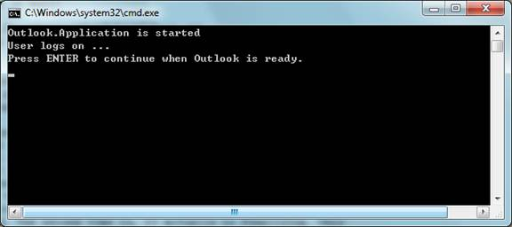

# C# app automates Outlook (CSAutomateOutlook)
## Requires
- Visual Studio 2010
## License
- MS-LPL
## Technologies
- Office
## Topics
- Outlook
- Automation
## Updated
- 03/01/2012
## Description

<h1>CONSOLE APPLICATION (CSAutomateOutlook)</h1>
<h2>Introduction</h2>

The CSAutomateOutlook example demonstrates the use of Visual C# code to automate Microsoft Outlook to log on with your profile, enumerate contacts, send a mail, log off, close the Microsoft Outlook application and then clean up unmanaged
 COM resources.&nbsp; 

<h2>Running the Sample</h2>

The following steps walk through a demonstration of the Outlook automation sample that starts a Microsoft Outlook instance, logs on with your profile, enumerates the contact items, creates and sends a new mail item, logs off and quits
 the Microsoft Outlook application cleanly. 

Step1. After you successfully build the sample project in Visual Studio 2010, you will get the application: CSAutomateOutlook.exe.

Step2. Open Windows Task Manager (Ctrl&#43;Shift&#43;Esc) to confirm that no outlook.exe is running.

Step3. Run the application. It should print the following content in the console window if no error is thrown.

Outlook would ask you to input your profile and password. When Outlook is ready, press ENTER in the console window of CSAutomateOutlook. The application will then enumerate your contacts and print the contacts:

Next, CSAutomateOutlook automates Outlook to create and display or send a new mail item.

In the new mail item, the ��To�� line is set as codefxf@microsoft.com, which is the feedback channel of All-In-One Code Framework. The ��Subject��
 is set to &quot;Feedback of All-In-One Code Framework&quot; and the email body shows &quot;Feedback:&quot; in bold.

After you input your feedback and click the Send button, the mail item is sent and CSAutomateOutlook automates Outlook to log off the current profile and quit itself.

Step4. In Windows Task Manager, confirm that the outlook.exe process does not exist, i.e. the Microsoft Outlook intance was closed and cleaned up properly.

<h2>Using the Code</h2>

Step1. Create a Console application and reference the Outlook Primary Interop Assembly (PIA). To reference the Outlook PIA, right-click the project file
and click the &quot;Add Reference...&quot; button. In the Add Reference dialog, navigate to the .NET tab, find <a class="libraryLink" href="http://msdn.microsoft.com/en-US/library/Microsoft.Office.Interop.Outlook.aspx" target="_blank" title="Auto generated link to Microsoft.Office.Interop.Outlook">Microsoft.Office.Interop.Outlook</a> 12.0.0.0 and click OK.

Step2. Import and rename the Outlook interop namepace: 

C#

Edit|Remove

csharp

<pre id="codePreview" class="csharp">
using Outlook = <a class="libraryLink" href="http://msdn.microsoft.com/en-US/library/Microsoft.Office.Interop.Outlook.aspx" target="_blank" title="Auto generated link to Microsoft.Office.Interop.Outlook">Microsoft.Office.Interop.Outlook</a>;

</pre>

&nbsp;

Step3. Initialize the current thread as STA 

C#

Edit|Remove

csharp

<pre id="codePreview" class="csharp">
[STAThread]
    static void Main(string[] args)
    {
    }

</pre>

&nbsp;

Step4. Start up an Outlook application by creating an Outlook.Application object.

C#

Edit|Remove

csharp

<pre id="codePreview" class="csharp">
oOutlook = new Outlook.Application();

</pre>

&nbsp;

In Vista with UAC enabled, if the automation client is run as administrator, the application may throw the error 0x80010001. Akash well explained the problem in the blog:

<a href="http://blogs.msdn.com/akashb/archive/2008/11/03/unable-to-instantiate-outlook-object-from-visual-studio-2008-on-vista-with-uac-on.aspx">http://blogs.msdn.com/akashb/archive/2008/11/03/unable-to-instantiate-outlook-object-from-visual-studio-2008-on-vista-with-uac-on.aspx</a>

Step5. Get the namespace and the logon. 

C#

Edit|Remove

csharp

<pre id="codePreview" class="csharp">
oNS = oOutlook.GetNamespace(&quot;MAPI&quot;);    
// Log on by using a dialog box to choose the profile.
oNS.Logon(missing, missing, true, true);

// Alternative logon method that uses a specific profile.
// If you use this logon method, change the profile name to an 
// appropriate value. The second parameter of Logon is the password 
// (if any) associated with the profile. This parameter exists only 
// for backwards compatibility and for security reasons, and it is 
// not recommended for use.
//oNS.Logon(&quot;YourValidProfile&quot;, missing, false, true);

</pre>

&nbsp;

Step6. Enumerate the contact items. 

C#

Edit|Remove

csharp

<pre id="codePreview" class="csharp">
oCtFolder = (Outlook.Folder)oNS.GetDefaultFolder(
        Outlook.OlDefaultFolders.olFolderContacts);
    oCts = oCtFolder.Items;
    // Enumerate the contact items. 
    for (int i = 1; i &lt;= oCts.Count; i&#43;&#43;)
    {
        object oItem = oCts[i];

        if (oItem is Outlook.ContactItem)
        {
            Outlook.ContactItem oCt = (Outlook.ContactItem)oItem;
            Console.WriteLine(oCt.Email1Address);
            // Do not need to Marshal.ReleaseComObject oCt because 
            // (Outlook.ContactItem)oItem is a simple .NET type 
            // casting, instead of a COM QueryInterface.
        }
        else if (oItem is Outlook.DistListItem)
        {
            Outlook.DistListItem oDl = (Outlook.DistListItem)oItem;
            Console.WriteLine(oDl.DLName);
            // Do not need to Marshal.ReleaseComObject oDl because 
            // (Outlook.DistListItem)oItem is a simple .NET type 
            // casting, instead of a COM QueryInterface.
        }

        // Release the COM object of the Outlook item.
        Marshal.FinalReleaseComObject(oItem);
        oItem = null;
    }

</pre>

&nbsp;

Be careful with foreach loops. See: http://tiny.cc/uXw8S. 

Step7. Create and send a new mail item. 

C#

Edit|Remove

csharp

<pre id="codePreview" class="csharp">
    Outlook.MailItem oMail = (Outlook.MailItem)oOutlook.CreateItem( Outlook.OlItemType.olMailItem);
    oMail.Display(true);
    // [-or-]
    //((Outlook._MailItem)oMail).Send();

</pre>

&nbsp;

Step8. User logs off and quits Outlook. 

C#

Edit|Remove

csharp

<pre id="codePreview" class="csharp">
oNS.Logoff();
((Outlook._Application)oOutlook).Quit();

</pre>

&nbsp;

Step9. Clean up the unmanaged COM resources. To get Outlook terminated rightly, we need to call Marshal.FinalReleaseComObject() on each COM object we used. We can either explicitly call Marshal.FinalReleaseComObject on all accessor objects:

and/or force a garbage collection as soon as the calling function is off the stack (at which point these objects are no longer rooted) and then call GC.WaitForPendingFinalizers.

For more readings, please refer to this blog:<b>
<a href="http://blogs.msdn.com/mstehle/archive/2007/12/07/oom-net-part-2-outlook-item-leaks.aspx">Outlook Item Leaks</a></b>

<h2>More Information
</h2>

��&nbsp;&nbsp;&nbsp;&nbsp;&nbsp;&nbsp;&nbsp;&nbsp;
<a href="http://msdn.microsoft.com/en-us/library/bb177050.aspx">MSDN: Outlook 2007 Developer Reference</a>

��&nbsp;&nbsp;&nbsp;&nbsp;&nbsp;&nbsp;&nbsp;&nbsp;
<a href="http://support.microsoft.com/kb/310259">How to use the Microsoft Outlook Object Library to retrieve an appointment by using Visual C#</a>

��&nbsp;&nbsp;&nbsp;&nbsp;&nbsp;&nbsp;&nbsp;&nbsp;
<a href="http://support.microsoft.com/kb/819398">How to automate Outlook and Word by using Visual C# .NET to create a pre-populated e-mail message that can be edited</a>

��&nbsp;&nbsp;&nbsp;&nbsp;&nbsp;&nbsp;&nbsp;&nbsp;
<a href="http://www.outlookcode.com/article.aspx?ID=43">Writing .NET Code for Outlook</a>

