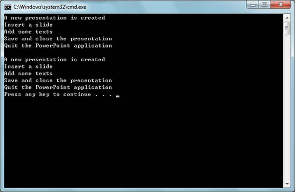

# C# app automates PowerPoint (CSAutomatePowerPoint)
## Requires
- Visual Studio 2010
## License
- MS-LPL
## Technologies
- Office
## Topics
- Automation
- PowerPoint
## Updated
- 03/01/2012
## Description

<h1>CONSOLE APPLICATION (CSAutomatePowerPoint)</h1>
<h2>Introduction</h2>

The CSAutomatePowerPoint example demonstrates the use of Visual C# codes to create a Microsoft PowerPoint instance, add a new presentation, insert a new slide, add some texts to the slide, save the presentation, quit PowerPoint and then
 clean up unmanaged COM resources. Office automation is based on Component Object Model (COM). When you call a COM object of Office from managed code, a Runtime Callable Wrapper (RCW) is automatically created. The RCW marshals calls between
 the .NET application and the COM object. The RCW keeps a reference count on the COM object. If all references have not been released on the RCW, the COM object of Office does not quit and may cause the Office application not to quit after your automation.
 In order to make sure that the Office application quits cleanly, the sample demonstrates two solutions.

Solution1.AutomatePowerPoint demonstrates automating Microsoft PowerPoint application by using Microsoft PowerPoint Primary Interop Assembly (PIA) and explicitly assigning each COM accessor object to a new variable that you would explicitly
 call Marshal.FinalReleaseComObject to release it at the end. 

Solution2.AutomatePowerPoint demonstrates automating Microsoft PowerPoint application by using Microsoft PowerPoint PIA and forcing a garbage collection as soon as the automation function is off the stack (at which point the RCW objects
 are no longer rooted) to clean up RCWs and release COM objects.&nbsp;

<h2>Running the Sample</h2>

The following steps walk through a demonstration of the PowerPoint automation sample that starts a Microsoft PowerPoint instance, adds a new presentation, inserts a slide, adds some texts to the slide, saves the presentation, quits PowerPoint
 and then cleans up unmanaged COM resources. 

Step1. After you successfully build the sample project in Visual Studio 2010, you will get the application: CSAutomatePowerPoint.exe.

Step2. Open Windows Task Manager (Ctrl&#43;Shift&#43;Esc) to confirm that no powerpnt.exe is running.

Step3. Run the application. It should print the following content in the console window if no error is thrown.

Then, you will see two new presentations in the directory of the application:

Sample1.pptx and Sample2.pptx. Both presentations contain only one slide with the following title.

&nbsp; 

Step4. In Windows Task Manager, confirm that the powerpnt.exe process does not exist, i.e. the Microsoft PowerPoint intance was closed and cleaned up

properly. 

<h2>Using the Code</h2>

Step1. Create a Console application and reference the PowerPoint Primary&nbsp;
Interop Assembly (PIA) and Office 12. To reference the PowerPoint PIA and Office 12, right-click the project file and click the &quot;Add Reference...&quot; button. In the Add Reference dialog, navigate to the .NET tab, find Microsoft.Office.Interop.PowerPoint
 12.0.0.0 and Office 12.0.0.0 and click OK. 

Step2. Import and rename the Excel interop and the Office namepaces:

C#

Edit|Remove

csharp
<pre class="hidden">
using Office = Microsoft.Office.Core;
using Word = Microsoft.Office.Interop.Word;

</pre>
<pre id="codePreview" class="csharp">
using Office = Microsoft.Office.Core;
using Word = Microsoft.Office.Interop.Word;

</pre>

&nbsp;

Step3. Start up a PowerPoint application by creating a PowerPoint.Application object.

C#

Edit|Remove

csharp
<pre class="hidden">
oPowerPoint = new PowerPoint.Application();

</pre>
<pre id="codePreview" class="csharp">
oPowerPoint = new PowerPoint.Application();

</pre>

&nbsp;

By default PowerPoint is invisible, till you make it visible.&nbsp;&nbsp;&nbsp;&nbsp;&nbsp;&nbsp;&nbsp;&nbsp;&nbsp;&nbsp;&nbsp;&nbsp;&nbsp;

C#

Edit|Remove

csharp
<pre class="hidden">
    // Make the PowerPoint instance invisible
    oPowerPoint.Visible = Office.MsoTriState.msoFalse;
    // Or make the PowerPoint instance visible
    oPowerPoint.Visible = Office.MsoTriState.msoTrue;

</pre>
<pre id="codePreview" class="csharp">
    // Make the PowerPoint instance invisible
    oPowerPoint.Visible = Office.MsoTriState.msoFalse;
    // Or make the PowerPoint instance visible
    oPowerPoint.Visible = Office.MsoTriState.msoTrue;

</pre>

&nbsp;

Step4. Get the Presentations collection from Application.Presentations and call its Add function to add a new presentation. The Add function returns a Presentation object.

C#

Edit|Remove

csharp
<pre class="hidden">
oPres = oPowerPoint.Presentations;
oPre = oPres.Add(Office.MsoTriState.msoTrue);

</pre>
<pre id="codePreview" class="csharp">
oPres = oPowerPoint.Presentations;
oPre = oPres.Add(Office.MsoTriState.msoTrue);

</pre>

&nbsp;

Step5. Insert a slide by calling the Add method on the Presentation.Slides collection, and add some texts to the slide.

C#

Edit|Remove

csharp
<pre class="hidden">
    oSlides = oPre.Slides;
    oSlide = oSlides.Add(1, PowerPoint.PpSlideLayout.ppLayoutText);    
    oShapes = oSlide.Shapes;
    oShape = oShapes[1];
    oTxtFrame = oShape.TextFrame;
    oTxtRange = oTxtFrame.TextRange;
    oTxtRange.Text = &quot;All-In-One Code Framework&quot;;

</pre>
<pre id="codePreview" class="csharp">
    oSlides = oPre.Slides;
    oSlide = oSlides.Add(1, PowerPoint.PpSlideLayout.ppLayoutText);    
    oShapes = oSlide.Shapes;
    oShape = oShapes[1];
    oTxtFrame = oShape.TextFrame;
    oTxtRange = oTxtFrame.TextRange;
    oTxtRange.Text = &quot;All-In-One Code Framework&quot;;

</pre>

&nbsp;

Step6. Save the presentation as a pptx file and close it. 

C#

Edit|Remove

csharp
<pre class="hidden">
    string fileName = Path.GetDirectoryName(
        Assembly.GetExecutingAssembly().Location) &#43; &quot;\\Sample1.pptx&quot;;
    oPre.SaveAs(fileName, 
        PowerPoint.PpSaveAsFileType.ppSaveAsOpenXMLPresentation, 
        Office.MsoTriState.msoTriStateMixed);
    oPre.Close();

</pre>
<pre id="codePreview" class="csharp">
    string fileName = Path.GetDirectoryName(
        Assembly.GetExecutingAssembly().Location) &#43; &quot;\\Sample1.pptx&quot;;
    oPre.SaveAs(fileName, 
        PowerPoint.PpSaveAsFileType.ppSaveAsOpenXMLPresentation, 
        Office.MsoTriState.msoTriStateMixed);
    oPre.Close();

</pre>

&nbsp;

Step7. Quit the PowerPoint application. 

C#

Edit|Remove

csharp
<pre class="hidden">
oPowerPoint.Quit();

</pre>
<pre id="codePreview" class="csharp">
oPowerPoint.Quit();

</pre>

&nbsp;

Step8. Clean up the unmanaged COM resource. To get PowerPoint terminated rightly, we need to call Marshal.FinalReleaseComObject() on each COM object we used. We can either explicitly call Marshal.FinalReleaseComObject on all accessor
 objects: 

C#

Edit|Remove

csharp
<pre class="hidden">
   // See Solution1.AutomatePowerPoint
    if (oTxtRange != null)
    {
        Marshal.FinalReleaseComObject(oTxtRange);
        oTxtRange = null;
    }
    if (oTxtFrame != null)
    {
        Marshal.FinalReleaseComObject(oTxtFrame);
        oTxtFrame = null;
    }
    if (oShape != null)
    {
        Marshal.FinalReleaseComObject(oShape);
        oShape = null;
    }
    if (oShapes != null)
    {
        Marshal.FinalReleaseComObject(oShapes);
        oShapes = null;
    }
    if (oSlide != null)
    {
        Marshal.FinalReleaseComObject(oSlide);
        oSlide = null;
    }
    if (oSlides != null)
    {
        Marshal.FinalReleaseComObject(oSlides);
        oSlides = null;
    }
    if (oPre != null)
    {
        Marshal.FinalReleaseComObject(oPre);
        oPre = null;
    }
    if (oPres != null)
    {
        Marshal.FinalReleaseComObject(oPres);
        oPres = null;
    }
    if (oPowerPoint != null)
    {
        Marshal.FinalReleaseComObject(oPowerPoint);
        oPowerPoint = null;
    }

</pre>
<pre id="codePreview" class="csharp">
   // See Solution1.AutomatePowerPoint
    if (oTxtRange != null)
    {
        Marshal.FinalReleaseComObject(oTxtRange);
        oTxtRange = null;
    }
    if (oTxtFrame != null)
    {
        Marshal.FinalReleaseComObject(oTxtFrame);
        oTxtFrame = null;
    }
    if (oShape != null)
    {
        Marshal.FinalReleaseComObject(oShape);
        oShape = null;
    }
    if (oShapes != null)
    {
        Marshal.FinalReleaseComObject(oShapes);
        oShapes = null;
    }
    if (oSlide != null)
    {
        Marshal.FinalReleaseComObject(oSlide);
        oSlide = null;
    }
    if (oSlides != null)
    {
        Marshal.FinalReleaseComObject(oSlides);
        oSlides = null;
    }
    if (oPre != null)
    {
        Marshal.FinalReleaseComObject(oPre);
        oPre = null;
    }
    if (oPres != null)
    {
        Marshal.FinalReleaseComObject(oPres);
        oPres = null;
    }
    if (oPowerPoint != null)
    {
        Marshal.FinalReleaseComObject(oPowerPoint);
        oPowerPoint = null;
    }

</pre>

&nbsp;

and/or force a garbage collection as soon as the calling function is off the stack (at which point these objects are no longer rooted) and then call GC.WaitForPendingFinalizers.

C#

Edit|Remove

csharp
<pre class="hidden">
    // See Solution2.AutomatePowerPoint
    GC.Collect();
    GC.WaitForPendingFinalizers();
    // GC needs to be called twice in order to get the Finalizers called 
    // - the first time in, it simply makes a list of what is to be 
    // finalized, the second time in, it actually is finalizing. Only 
    // then will the object do its automatic ReleaseComObject.
    GC.Collect();
    GC.WaitForPendingFinalizers();

</pre>
<pre id="codePreview" class="csharp">
    // See Solution2.AutomatePowerPoint
    GC.Collect();
    GC.WaitForPendingFinalizers();
    // GC needs to be called twice in order to get the Finalizers called 
    // - the first time in, it simply makes a list of what is to be 
    // finalized, the second time in, it actually is finalizing. Only 
    // then will the object do its automatic ReleaseComObject.
    GC.Collect();
    GC.WaitForPendingFinalizers();

</pre>

&nbsp;

<h2>More Information </h2>

��&nbsp;&nbsp;&nbsp;&nbsp;&nbsp;&nbsp;&nbsp;&nbsp;
<a href="http://msdn.microsoft.com/en-us/library/bb265982.aspx">MSDN: PowerPoint 2007 Developer Reference</a>

