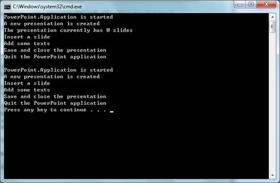

# C++ app automates PowerPoint (CppAutomatePowerPoint)
## Requires
- Visual Studio 2010
## License
- MS-LPL
## Technologies
- Office
## Topics
- Automation
- PowerPoint
## Updated
- 03/01/2012
## Description

<h1>CONSOLE APPLICATION (CppAutomatePowerPoint)</h1>
<h2>Introduction</h2>

The CppAutomatePowerPoint example demonstrates how to write VC&#43;&#43; code to create a Microsoft PowerPoint instance, create a new presentation, insert a new slide, add some texts to the slide, save the presentation, quit PowerPoint and then
 clean up unmanaged COM resources. 

There are three basic ways you can write VC&#43;&#43; automation codes:

1. Automating PowerPoint using the #import directive and smart pointers

The code in Solution1.h/cpp demonstrates the use of #import to automate PowerPoint. #import (http://msdn.microsoft.com/en-us/library/8etzzkb6.aspx), a new directive that became available with Visual C&#43;&#43; 5.0,
 creates VC&#43;&#43; &quot;smart pointers&quot; from a specified type library. It is very powerful, but often not recommended because of reference-counting problems that typically occur when

used with the Microsoft Office applications. Unlike the direct API approach in Solution2.h/cpp, smart pointers enable us to benefit from the type info to early/late bind the object. #import takes care of adding the messy guids to the
 project and the COM APIs are encapsulated in custom classes that the #import directive generates.

2. Automating PowerPoint using C&#43;&#43; and the COM APIs 

The code in Solution2.h/cpp demontrates the use of C/C&#43;&#43; and the COM APIs to automate PowerPoint. The raw automation is much more difficult, but it is sometimes necessary to avoid the overhead with MFC, or
 problems with #import. Basically, you work with such APIs as 
CoCreateInstance(), and COM interfaces such as IDispatch and
IUnknown. 

3. Automating PowerPoint with MFC 

With MFC, Visual C&#43;&#43; Class Wizard can generate &quot;wrapper classes&quot; from the type libraries. These classes simplify the use of the COM servers. Automating PowerPoint with MFC is not covered in this sample.&nbsp;

<h2>Running the Sample</h2>

The following steps walk through a demonstration of the PowerPoint automation sample that starts a Microsoft PowerPoint instance, adds a new presentation, inserts a slide, adds some texts to the slide, saves the presentation, quits PowerPoint
 and then cleans up unmanaged COM resources. 

Step1. After you successfully build the sample project in Visual Studio 2010, you will get the application: CppAutomatePowerPoint.exe.

Step2. Open Windows Task Manager (Ctrl&#43;Shift&#43;Esc) to confirm that no powerpnt.exe is running.

Step3. Run the application. It should print the following content in the console window if no error is thrown.

Then, you will see two new presentation files in the directory of the application: Sample1.pptx and Sample2.pptx. Both presentations contain only one slide with the following title.

Step4. In Windows Task Manager, confirm that the powerpnt.exe process does not exist, i.e. the Microsoft PowerPoint intance was closed and cleaned up properly.

<h2>Using the code </h2>
<h3>A. Automating Word using the #import directive and smart pointers (Solution1.h/cpp)
</h3>

Step1. Import the type library of the target COM server using the #import directive.

Step2. Build the project. If the build is successful, the compiler generates the .tlh and .tli files that encapsulate the COM server based on the type library specified in the #import directive. It serves as a class wrapper we
can now use to create the COM class and access its properties, methods, etc.

Step3. Initializes the COM library on the current thread and identifies the concurrency model as single-thread apartment (STA) by calling CoInitializeEx, or CoInitialize.

Step4. Create the PowerPoint.Application COM object using the smart pointer.
The class name is the original interface name (i.e. PowerPoint::_Application) with a &quot;Ptr&quot; suffix. We can use either the constructor of the smart pointer class or its CreateInstance method to create the COM object.

Step5. Automate the PowerPoint COM object through the smart pointers. In this example, you can find the basic operations in PowerPoint automation like
Create a new Presentation. (i.e. Application.Presentations.Add)

&nbsp;&nbsp;&nbsp;&nbsp;&nbsp;&nbsp;&nbsp;&nbsp;&nbsp;&nbsp;&nbsp;&nbsp;&nbsp;&nbsp;&nbsp;
Insert a slide. 

&nbsp;&nbsp;&nbsp;&nbsp;&nbsp;&nbsp;&nbsp;&nbsp;&nbsp;&nbsp;&nbsp;&nbsp;&nbsp;&nbsp;&nbsp;
Add some texts, 

&nbsp;&nbsp;&nbsp;&nbsp;&nbsp;&nbsp;&nbsp;&nbsp;&nbsp;&nbsp;&nbsp;&nbsp;&nbsp;&nbsp;&nbsp;
Save the presentation as a pptx file and close it. 

Step6. Quit the PowerPoint application. (i.e. Application.Quit())

Step7. It is said that the smart pointers are released automatically, so we do not need to manually release the COM object.

Step8. It is necessary to catch the COM errors if the type library was&nbsp;
imported without raw_interfaces_only and when the raw interfaces (e.g. raw_Quit) are not used. For example:

C#

Edit|Remove

csharp

<pre id="codePreview" class="csharp">
#import &quot;XXXX.tlb&quot;
try
{
    spPpApp-&gt;Quit();
}
catch (_com_error &err)
{
}

</pre>

&nbsp;

Step9. Uninitialize COM for this thread by calling CoUninitialize.

<h3>B. Automating PowerPoint using C&#43;&#43; and the COM APIs (Solution2.h/cpp) </h3>

Step1. Add the automation helper function, AutoWrap. 

Step2. Initialize COM by calling CoInitializeEx, or CoInitialize.

Step3. Get CLSID of the PowerPoint COM server using the API CLSIDFromProgID.

Step4. Start the PowerPoint COM server and get the IDispatch interface using the API CoCreateInstance.

Step5. Automate the PowerPoint COM object with the help of AutoWrap. In this example, you can find the basic operations in PowerPoint automation like
Create a new Presentation. (i.e. Application.Presentations.Add)

&nbsp;&nbsp;&nbsp;&nbsp;&nbsp;&nbsp;&nbsp;&nbsp;&nbsp;&nbsp;&nbsp;&nbsp;&nbsp;&nbsp;&nbsp;
Insert a slide. 

&nbsp;&nbsp;&nbsp;&nbsp;&nbsp;&nbsp;&nbsp;&nbsp;&nbsp;&nbsp;&nbsp;&nbsp;&nbsp;&nbsp;&nbsp;
Add some texts, 

&nbsp;&nbsp;&nbsp;&nbsp;&nbsp;&nbsp;&nbsp;&nbsp;&nbsp;&nbsp;&nbsp;&nbsp;&nbsp;&nbsp;&nbsp;
Save the presentation as a pptx file and close it. 

Step6. Quit the PowerPoint application. (i.e. Application.Quit())

Step7. Release the COM objects. 

Step8. Uninitialize COM for this thread by calling CoUninitialize.

<h2>More Information </h2>

��&nbsp;&nbsp;&nbsp;&nbsp;&nbsp;&nbsp;&nbsp;&nbsp;
<a href="http://msdn.microsoft.com/en-us/library/bb265982.aspx">MSDN: PowerPoint 2007 Developer Reference</a>

