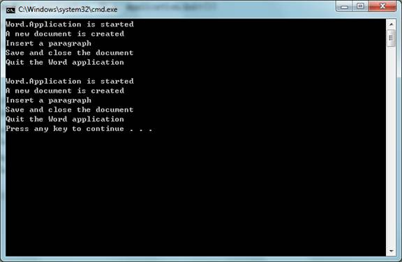

# C++ app automates Word (CppAutomateWord)
## Requires
- Visual Studio 2010
## License
- MS-LPL
## Technologies
- Office
## Topics
- Automation
- Word
## Updated
- 03/01/2012
## Description

<h1>CONSOLE APPLICATION (CppAutomateWord)</h1>
<h2>Introduction</h2>

The CppAutomateWord example demonstrates how to write VC&#43;&#43; code to create a&nbsp;
Microsoft Word instance, create a new document, insert a paragraph, save the document, close the Microsoft Word application and then clean up unmanaged COM resources.

There are three basic ways you can write VC&#43;&#43; automation code:

1. Automating Word using the #import directive and smart pointers

The code in Solution1.h/cpp demonstrates the use of #import to automate
Word. #import (http://msdn.microsoft.com/en-us/library/8etzzkb6.aspx), a new&nbsp;
directive that became available with Visual C&#43;&#43; 5.0, creates VC&#43;&#43; &quot;smart pointers&quot; from a specified type library. It is very powerful, but often not recommended because of reference-counting problems that typically occur when used with the
 Microsoft Office applications. Unlike the direct API approach in Solution2.h/cpp, smart pointers enable us to benefit from the type info to early/late bind the object. #import takes care of adding the messy guids to

the project and the COM APIs are encapsulated in custom classes that the #import directive generates.

2. Automating Word using C&#43;&#43; and the COM APIs 

The code in Solution2.h/cpp demontrates the use of C/C&#43;&#43; and the COM APIs to automate Word. The raw automation is much more difficult, but it is sometimes necessary to avoid the overhead with MFC, or problems with #import. Basically,
 you work with such APIs as CoCreateInstance(), and COM interfaces such as IDispatch and IUnknown.

3. Automating Word with MFC 

With MFC, Visual C&#43;&#43; Class Wizard can generate &quot;wrapper classes&quot; from the type libraries. These classes simplify the use of the COM servers. Automating Word with MFC is not covered in this sample.&nbsp;

<h2>Running the Sample</h2>

The following steps walk through a demonstration of the Word automation sample that starts a Microsoft Word instance, creates a new document, inserts a paragraph, saves the document, and quits the Microsoft Word application cleanly.

Step1. After you successfully build the sample project in Visual Studio 2010, you will get the application: CppAutomateWord.exe.

Step2. Open Windows Task Manager (Ctrl&#43;Shift&#43;Esc) to confirm that no winword.exe is running.

Step3. Run the application. It should print the following content in the console window if no error is thrown.

&nbsp; 

Then, you will see two new documents in the directory of the application: Sample1.docx and Sample2.docx. Both documents have the following content.

Step4. In Windows Task Manager, confirm that the winword.exe process does not exist, i.e. the Microsoft Word intance was closed and cleaned up properly.

<h2>Using the code </h2>
<h3>A. Automating Word using the #import directive and smart pointers (Solution1.h/cpp)
</h3>

Step1. Import the type library of the target COM server using the #import directive.

C#

Edit|Remove

csharp

<pre id="codePreview" class="csharp">
#import &quot;libid:2DF8D04C-5BFA-101B-BDE5-00AA0044DE52&quot; \
        rename(&quot;RGB&quot;, &quot;MSORGB&quot;) \
        rename(&quot;DocumentProperties&quot;, &quot;MSODocumentProperties&quot;)
    // [-or-]
    //#import &quot;C:\\Program Files\\Common Files\\Microsoft Shared\\OFFICE12\\MSO.DLL&quot; \
    //    rename(&quot;RGB&quot;, &quot;MSORGB&quot;) \
    //    rename(&quot;DocumentProperties&quot;, &quot;MSODocumentProperties&quot;)

    using namespace Office;

    #import &quot;libid:0002E157-0000-0000-C000-000000000046&quot;
    // [-or-]
    //#import &quot;C:\\Program Files\\Common Files\\Microsoft Shared\\VBA\\VBA6\\VBE6EXT.OLB&quot;

    using namespace VBIDE;

    #import &quot;libid:00020905-0000-0000-C000-000000000046&quot; \
        rename(&quot;ExitWindows&quot;, &quot;WordExitWindows&quot;) \
        rename(&quot;FindText&quot;, &quot;WordFindText&quot;)
        // [-or-]
    //#import &quot;C:\\Program Files\\Microsoft Office\\Office12\\MSWORD.OLB&quot; \
    //    rename(&quot;ExitWindows&quot;, &quot;WordExitWindows&quot;)
    //    rename(&quot;FindText&quot;, &quot;WordFindText&quot;)

</pre>

&nbsp;

Step2. Build the project. If the build is successful, the compiler generates the .tlh and .tli files that encapsulate the COM server based on the type library specified in the #import directive. It serves as a class wrapper we
can now use to create the COM class and access its properties, methods, etc.

Step3. Initializes the COM library on the current thread and identifies the concurrency model as single-thread apartment (STA) by calling CoInitializeEx, or CoInitialize.

Step4. Create the Word.Application COM object using the smart pointer. The class name is the original interface name (i.e. Word::_Application) with a &quot;Ptr&quot; suffix. We can use either the constructor of the smart pointer class
 or its CreateInstance method to create the COM object. 

Step5. Automate the Word COM object through the smart pointers. In this example, you can find the basic operations in Word automation like

&nbsp;&nbsp;&nbsp;&nbsp;&nbsp;&nbsp;&nbsp;&nbsp;&nbsp;&nbsp;&nbsp;&nbsp;&nbsp;&nbsp;&nbsp;
Create a new Document. (i.e. Application.Documents.Add) 

&nbsp;&nbsp;&nbsp;&nbsp;&nbsp;&nbsp;&nbsp;&nbsp;&nbsp;&nbsp;&nbsp;&nbsp;&nbsp;&nbsp;&nbsp;
Insert a paragraph. 

&nbsp;&nbsp;&nbsp;&nbsp;&nbsp;&nbsp;&nbsp;&nbsp;&nbsp;&nbsp;&nbsp;&nbsp;&nbsp;&nbsp;&nbsp;
Save the document as a docx file and close it. 

Step6. Quit the Word application. (i.e. Application.Quit())

Step7. It is said that the smart pointers are released automatically, so we do not need to manually release the COM objects.

Step8. It is necessary to catch the COM errors if the type library was&nbsp;
imported without raw_interfaces_only and when the raw interfaces (e.g. raw_Quit) are not used. For example:

C#

Edit|Remove

csharp

<pre id="codePreview" class="csharp">
#import &quot;XXXX.tlb&quot;
try
{
    spWordApp-&gt;Quit();
}
catch (_com_error &err)
{
}

</pre>

&nbsp;

Step9. Uninitialize COM for this thread by calling 
CoUninitialize. 

<h3>B. Automating Word using C&#43;&#43; and the COM APIs (Solution2.h/cpp) </h3>

Step1. Add the automation helper function, 
AutoWrap. 

Step2. Initializes the COM library on the current thread and identifies the concurrency model as single-thread apartment (STA) by calling
CoInitializeEx, or CoInitialize.

Step3. Get CLSID of the Word COM server using the API 
CLSIDFromProgID.

Step4. Start the Word COM server and get the IDispatch interface using the API
CoCreateInstance. 

Step5. Automate the Word COM object with the help of AutoWrap. In this example, you can find the basic operations in Word automation like

&nbsp;&nbsp;&nbsp;&nbsp;&nbsp;&nbsp;&nbsp;&nbsp;&nbsp;&nbsp;&nbsp;&nbsp;&nbsp;&nbsp;&nbsp;
Create a new Document. (i.e. Application.Documents.Add) 

&nbsp;&nbsp;&nbsp;&nbsp;&nbsp;&nbsp;&nbsp;&nbsp;&nbsp;&nbsp;&nbsp;&nbsp;&nbsp;&nbsp;&nbsp;
Insert a paragraph. 

&nbsp;&nbsp;&nbsp;&nbsp;&nbsp;&nbsp;&nbsp;&nbsp;&nbsp;&nbsp;&nbsp;&nbsp;&nbsp;&nbsp;&nbsp;
Save the document as a docx file and close it. 

Step6. Quit the Word application. (i.e. 
Application.Quit()) 

Step7. Release the COM objects. 

Step8. Uninitialize COM for this thread by calling 
CoUninitialize. 

<h2>More Information </h2>

��&nbsp;&nbsp;&nbsp;&nbsp;&nbsp;&nbsp;&nbsp;&nbsp;
<a href="http://msdn.microsoft.com/en-us/library/bb244391.aspx">MSDN: Word 2007 Developer Reference</a>

��&nbsp;&nbsp;&nbsp;&nbsp;&nbsp;&nbsp;&nbsp;&nbsp;
<a href="http://support.microsoft.com/kb/238393">How To Use Visual C&#43;&#43; to Access
DocumentProperties with Automation</a> 

��&nbsp;&nbsp;&nbsp;&nbsp;&nbsp;&nbsp;&nbsp;&nbsp;
<a href="http://support.microsoft.com/kb/183599">How to catch Word application events by using Visual C&#43;&#43;</a>

