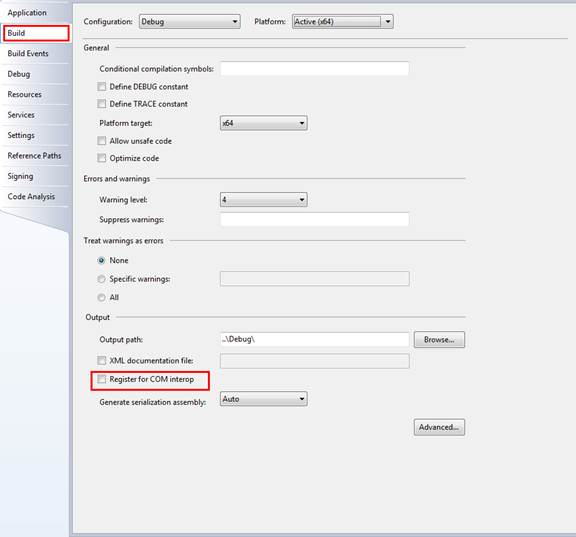

# C++ app invokes COM server (CppCOMClient)
## Requires
- Visual Studio 2010
## License
- MS-LPL
## Technologies
- COM
- Windows SDK
## Topics
- COM
## Updated
- 03/01/2012
## Description

<h2>CONSOLE APPLICATION (CppCOMClient)
</h2>
<h2>Introduction</h2>

There are three basic ways you can use Automation or consume a COM server in a native client: MFC, #import, and C/C&#43;&#43;.

<h3>1. C/C&#43;&#43;</h3>

The code in RawAPI.h/cpp demontrates the use of C/C&#43;&#43; and the COM APIs to consume the COM object ATLDllCOMServer.SimpleObject. The raw automation is much more difficult, but it is sometimes necessary to avoid the overhead
with MFC, or problems with #import. Basically, you work with such APIs as 
CoCreateInstance(), and COM interfaces such as
IDispatch and IUnknown.

<h3>2. #import</h3>

The code in ImportDirective.h/cpp demonstrates the use of #import to automate
a COM server, more specifically, a COM server written in .NET: 
CSDllCOMServer. #import (http://msdn.microsoft.com/en-us/library/8etzzkb6.aspx), a
new&nbsp; directive that became available with Visual C&#43;&#43; 5.0, creates VC&#43;&#43; &quot;smart pointers&quot; from a specified type library. It is very powerful, but often not recommended because of reference-counting
 problems that typically occur when used with the Microsoft Office applications. Unlike the direct API approach in RawAPI.h/cpp, smart pointers enable us to benefit from the type info to early/late bind the object. #import takes care of adding the messy guids
 to the project and the COM APIs are encapsulated in custom classes that the #import directive
generates.The differences between early binding and late binding via smart pointers:
Smart pointers make creating an object that supports early binding easy, so
does it make creating a late bound object. The only difference between early binding and late binding via smart pointer is the .tlh and .tli files generated by the #import directive. If the
 target object supports early binding, the .tlh and .tli files will make use of the custom interface (not
IDispatch) to call the target property/method directly. If the target COM object only support late binding, the smart pointer takes care of converting
your method calls into GetIDsOfNames()s and Invoke()s of the
IDispatch interface.

<h3>3. MFC</h3>

With MFC, Visual C&#43;&#43; ClassWizard can generate &quot;wrapper classes&quot; from the type
libraries. These classes simplify the use of the COM servers. Please refer to
the sample MFCCOMClient. 

<h2>Building the sample </h2>

NOTE: If you select win32/x86 platform, just build the solution as normal. If you choose x64 platform, please configure your Visual Studio as follows:

1.&nbsp;&nbsp;&nbsp;&nbsp;&nbsp;&nbsp;
Right-click ��CSDllCOMServer�� project and choose ��Properties��. Make sure the checkbox ��Register for COM
interop�� is unchecked. 

&nbsp;&nbsp;&nbsp;&nbsp;&nbsp;&nbsp;&nbsp;&nbsp;&nbsp;&nbsp;&nbsp;&nbsp;&nbsp;&nbsp;&nbsp;&nbsp;&nbsp;&nbsp;&nbsp;&nbsp;&nbsp;&nbsp;&nbsp;&nbsp;&nbsp;&nbsp;&nbsp;&nbsp;&nbsp;&nbsp;

2.&nbsp;&nbsp;&nbsp;&nbsp;&nbsp;&nbsp;
Click ��Build Events��, then add post-build event command line: &quot;%Windir%\Microsoft.NET\Framework64\v4.0.30319\regasm&quot; &quot;/tlb:$(TargetDir)CSDllCOMServer.lib&quot;
 &quot;$(TargetPath)&quot; 

3.&nbsp;&nbsp;&nbsp;&nbsp;&nbsp;&nbsp;
Save the changes and build the solution. 

<h2>Running the sample </h2>

If you build the solution successfully, just press Ctrl &#43; F5 to run it.

&nbsp;&nbsp;&nbsp;&nbsp;&nbsp;&nbsp;&nbsp;&nbsp;&nbsp;&nbsp;&nbsp;&nbsp;&nbsp;&nbsp;&nbsp;&nbsp;&nbsp;&nbsp;&nbsp;&nbsp;&nbsp;&nbsp;&nbsp;&nbsp;&nbsp;&nbsp;&nbsp;&nbsp;&nbsp;

<h2>Using the code </h2>
<h3>A. Creating the ATLDllCOMServer.SimpleObject COM object using C&#43;&#43;
and&nbsp; the COM APIs (RawAPI.h/cpp)
</h3>

Step1. Add the automation helper function, AutoWrap.

Step2. Initialize COM by calling CoInitializeEx, or CoInitialize.

Step3. Get CLSID of the COM server using the API CLSIDFromProgID.

Step4. Start the server and get the IDispatch interface using the API CoCreateInstance.

Step5. Consume the COM object with the help of AutoWrap.

Step6. Release the COM object 

Step7. Uninitialize COM for this thread by calling CoUninitialize.

<h3>B. Creating the CSDllCOMServer.ISimpleObject COM object using the #import directive and smart pointers (ImportDirecive.h/cpp)
</h3>

Step1. Import the type library of the target COM server using the #import directive. If the COM object is a .NET component, mscorlib.tlb is also required to be imported.

Step2. Build the project. If the build is successful, the compiler generates the .tlh and .tli files that encapsulate the COM server based on the type library specified in the #import directive. It serves as a class wrapper
 we can now use to create the COM class and access its properties, methods, etc. 

Step3. Create a COM object using the smart pointer. The class name is the original interface name (i.e.
ISimpleObject) with a &quot;Ptr&quot; suffix. We can use either the constructor of the smart pointer class or its CreateInstance method to create the COM object.

Step4. Call the COM object's properties, methods through the smart pointer like this:

C&#43;&#43;

Edit|Remove

cplusplus
<pre class="hidden">
spSimpleObj-&gt;FloatProperty = 1.2f;

</pre>
<pre id="codePreview" class="cplusplus">
spSimpleObj-&gt;FloatProperty = 1.2f;

</pre>

&nbsp;

To access the methods of the smart pointer class itself (e.g. QueryInterface),use the dot syntax spSimpleObj.QueryInterface().

Step5. It is necessary to catch the COM errors if the type library was&nbsp;
imported without raw_interfaces_only and when the raw interfaces (e.g. raw_HelloWorld) are not used. For example:

The above code snippet is equivalent to: 

C&#43;&#43;

Edit|Remove

cplusplus
<pre class="hidden">
    #import &quot;XXXX.tlb&quot;
    _bstr_t result;
    HRESULT hr = spSimpleObj-&gt;raw_HelloWorld(result.GetAddress());
    if (FAILED(hr)
    {
    }

</pre>
<pre id="codePreview" class="cplusplus">
    #import &quot;XXXX.tlb&quot;
    _bstr_t result;
    HRESULT hr = spSimpleObj-&gt;raw_HelloWorld(result.GetAddress());
    if (FAILED(hr)
    {
    }

</pre>

&nbsp;

And it is also the same as: 

C&#43;&#43;

Edit|Remove

cplusplus
<pre class="hidden">
#import &quot;XXXX.tlb&quot; raw_interfaces_only
_bstr_t result;
HRESULT hr = spSimpleObj-&gt;HelloWorld(result.GetAddress());
if (FAILED(hr)
{
}

</pre>
<pre id="codePreview" class="cplusplus">
#import &quot;XXXX.tlb&quot; raw_interfaces_only
_bstr_t result;
HRESULT hr = spSimpleObj-&gt;HelloWorld(result.GetAddress());
if (FAILED(hr)
{
}

</pre>

&nbsp;

Step6. It is said that the smart pointers are released automatically, so we do not need to manually release the COM object.

Step7. Uninitialize COM for this thread by calling
CoUninitialize. 

<h2>More Information</h2>

��&nbsp;&nbsp;&nbsp;&nbsp;&nbsp;&nbsp;&nbsp;&nbsp;
<a href="http://www.amazon.com/COM-Programming-Example-ActiveX-CD-ROM/dp/1929629036">COM Programming by Example: Using MFC, ActiveX, ATL, ADO, and COM&#43; By John E. Swanke</a>

��&nbsp;&nbsp;&nbsp;&nbsp;&nbsp;&nbsp;&nbsp;&nbsp;
<a href="http://msdn.microsoft.com/en-us/library/2w30w8zx.aspx">COM Interop Sample: COM Client and .NET Server</a>

