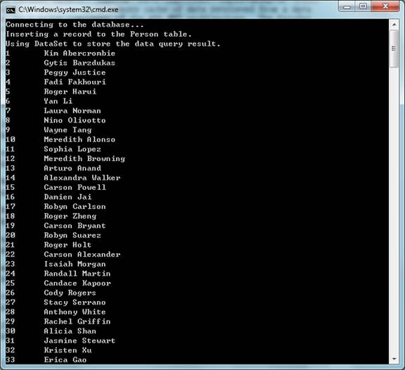

# C++ app uses ADO.NET to access database (CppUseADONET)
## Requires
- Visual Studio 2008
## License
- MS-LPL
## Technologies
- ADO.NET
## Topics
- Interop
- Data Platform
## Updated
- 03/01/2012
## Description

<h1>CONSOLE APPLICATION (CppUseADONET)</h1>
<h2>Introduction</h2>

The CppUseADONET example demonstrates the Microsoft ADO.NET technology to

access databases using Visual C&#43;&#43; in both managed code and unmanaged code.

It shows the basic structure of connecting to a data source, issuing SQL

commands, using DataSet object and performing the cleanup.&nbsp;

<h2>Running the Sample</h2>

<h2>Using the code </h2>

1. Enable the support of CLR in Project Properties / Configuration
&nbsp;Properties / General / Set Common Language Runtime Support as &quot;Common
&nbsp;&nbsp;&nbsp;Language Runtime Support (/clr)&quot;. 

2. Connect to data source.&nbsp; (System::Data::SqlClient::SqlConnection-&gt;Open)

C&#43;&#43;

Edit|Remove

cplusplus
<pre class="hidden">
void CreateConnection()
{
    con = gcnew SqlConnection(conStr);
    con-&gt;Open();
}

</pre>
<pre id="codePreview" class="cplusplus">
void CreateConnection()
{
    con = gcnew SqlConnection(conStr);
    con-&gt;Open();
}

</pre>

&nbsp;

3. Build and Execute an ADO.NET Command. 

&nbsp;&nbsp; (System::Data::SqlCommand-&gt;ExecuteNonQuery) It can be a SQL statement (SELECT/UPDATE/INSERT/DELETE), or a stored procedure call.&nbsp;&nbsp;

C&#43;&#43;

Edit|Remove

cplusplus
<pre class="hidden">
void AddRow(wchar_t *lastName, wchar_t *firstName, SAFEARRAY *image)
    {
        // 1. Inialize the SqlCommand object.
        cmd = gcnew SqlCommand();

        // 2. Assign the connection to the SqlCommand.
        cmd-&gt;Connection = con;

        // 3. Set the SQL command text.
        // SQL statement or the name of the stored procedure.
        cmd-&gt;CommandText = &quot;INSERT INTO Person(LastName, FirstName, &quot; &#43; 
            &quot;HireDate, EnrollmentDate, Picture) VALUES (@LastName, &quot; &#43; 
            &quot;@FirstName, @HireDate, @EnrollmentDate, @Picture)&quot;;

        // 4. Set the command type.
        // CommandType::Text for ordinary SQL statements;
        // CommandType::StoredProcedure for stored procedures.
        cmd-&gt;CommandType = CommandType::Text;

        // 5. Append the parameters.
        // DBNull::Value for SQL-Nullable fields.
        cmd-&gt;Parameters-&gt;Add(&quot;@LastName&quot;, SqlDbType::NVarChar, 50)-&gt;Value = 
            Marshal::PtrToStringUni((IntPtr)lastName);
        cmd-&gt;Parameters-&gt;Add(&quot;@FirstName&quot;, SqlDbType::NVarChar, 50)-&gt;Value = 
            Marshal::PtrToStringUni((IntPtr)firstName);
        cmd-&gt;Parameters-&gt;Add(&quot;@HireDate&quot;, SqlDbType::DateTime)-&gt;Value = 
            DBNull::Value;
        cmd-&gt;Parameters-&gt;Add(&quot;@EnrollmentDate&quot;, SqlDbType::DateTime)-&gt;Value
            = DateTime::Now;
        if (image == NULL)
        {
            cmd-&gt;Parameters-&gt;Add(&quot;@Picture&quot;, SqlDbType::Image)-&gt;Value = 
                DBNull::Value;
        }
        else
        {
            // Convert the SAFEARRAY to an array of bytes.
            int len = image-&gt;rgsabound[0].cElements;
            array&lt;byte&gt; ^arr = gcnew array&lt;byte&gt;(len);
            int *pData;
            SafeArrayAccessData(image, (void **)&pData);
            Marshal::Copy(IntPtr(pData), arr, 0, len);
            SafeArrayUnaccessData(image);
            cmd-&gt;Parameters-&gt;Add(&quot;@Picture&quot;, SqlDbType::Image)-&gt;Value = arr;
        }

        // 6. Execute the command.
        cmd-&gt;ExecuteNonQuery();
    }

</pre>
<pre id="codePreview" class="cplusplus">
void AddRow(wchar_t *lastName, wchar_t *firstName, SAFEARRAY *image)
    {
        // 1. Inialize the SqlCommand object.
        cmd = gcnew SqlCommand();

        // 2. Assign the connection to the SqlCommand.
        cmd-&gt;Connection = con;

        // 3. Set the SQL command text.
        // SQL statement or the name of the stored procedure.
        cmd-&gt;CommandText = &quot;INSERT INTO Person(LastName, FirstName, &quot; &#43; 
            &quot;HireDate, EnrollmentDate, Picture) VALUES (@LastName, &quot; &#43; 
            &quot;@FirstName, @HireDate, @EnrollmentDate, @Picture)&quot;;

        // 4. Set the command type.
        // CommandType::Text for ordinary SQL statements;
        // CommandType::StoredProcedure for stored procedures.
        cmd-&gt;CommandType = CommandType::Text;

        // 5. Append the parameters.
        // DBNull::Value for SQL-Nullable fields.
        cmd-&gt;Parameters-&gt;Add(&quot;@LastName&quot;, SqlDbType::NVarChar, 50)-&gt;Value = 
            Marshal::PtrToStringUni((IntPtr)lastName);
        cmd-&gt;Parameters-&gt;Add(&quot;@FirstName&quot;, SqlDbType::NVarChar, 50)-&gt;Value = 
            Marshal::PtrToStringUni((IntPtr)firstName);
        cmd-&gt;Parameters-&gt;Add(&quot;@HireDate&quot;, SqlDbType::DateTime)-&gt;Value = 
            DBNull::Value;
        cmd-&gt;Parameters-&gt;Add(&quot;@EnrollmentDate&quot;, SqlDbType::DateTime)-&gt;Value
            = DateTime::Now;
        if (image == NULL)
        {
            cmd-&gt;Parameters-&gt;Add(&quot;@Picture&quot;, SqlDbType::Image)-&gt;Value = 
                DBNull::Value;
        }
        else
        {
            // Convert the SAFEARRAY to an array of bytes.
            int len = image-&gt;rgsabound[0].cElements;
            array&lt;byte&gt; ^arr = gcnew array&lt;byte&gt;(len);
            int *pData;
            SafeArrayAccessData(image, (void **)&pData);
            Marshal::Copy(IntPtr(pData), arr, 0, len);
            SafeArrayUnaccessData(image);
            cmd-&gt;Parameters-&gt;Add(&quot;@Picture&quot;, SqlDbType::Image)-&gt;Value = arr;
        }

        // 6. Execute the command.
        cmd-&gt;ExecuteNonQuery();
    }

</pre>

&nbsp;

4. Use the DataSet Object.&nbsp; (System::Data::SqlClient::SqlDataAdapter-&gt;Fill)

&nbsp;&nbsp; The DataSet, which is an in-memory cache of data retrieved from a data
&nbsp;&nbsp;source, is a major component of the ADO.NET architecture.&nbsp;
The DataSet consists of a collection of DataTable objects that you can relate to each
&nbsp;other with DataRelation objects. 

C&#43;&#43;

Edit|Remove

cplusplus
<pre class="hidden">
void FillDataSet(wchar_t *command)
    {
        // 1. Inialize the DataSet object.
        ds = gcnew DataSet();

        // 2. Create a SELECT SQL command.
        String ^ strSelectCmd = Marshal::PtrToStringUni((IntPtr)command);
        
        // 3. Inialize the SqlDataAdapter object.
        // SqlDataAdapter represents a set of data commands and a 
        // database connection that are used to fill the DataSet and 
        // update a SQL Server database. 
        da = gcnew SqlDataAdapter(strSelectCmd, con);

        // 4. Fill the DataSet object.
        // Fill the DataTable in DataSet with the rows selected by the SQL 
        // command.
        da-&gt;Fill(ds);
    }

</pre>
<pre id="codePreview" class="cplusplus">
void FillDataSet(wchar_t *command)
    {
        // 1. Inialize the DataSet object.
        ds = gcnew DataSet();

        // 2. Create a SELECT SQL command.
        String ^ strSelectCmd = Marshal::PtrToStringUni((IntPtr)command);
        
        // 3. Inialize the SqlDataAdapter object.
        // SqlDataAdapter represents a set of data commands and a 
        // database connection that are used to fill the DataSet and 
        // update a SQL Server database. 
        da = gcnew SqlDataAdapter(strSelectCmd, con);

        // 4. Fill the DataSet object.
        // Fill the DataTable in DataSet with the rows selected by the SQL 
        // command.
        da-&gt;Fill(ds);
    }

</pre>

&nbsp;

5. Clean up objects before exit.&nbsp; 

&nbsp;&nbsp; (System::Data::SqlClient::SqlConnection-&gt;Close)

C&#43;&#43;

Edit|Remove

cplusplus
<pre class="hidden">
void CloseConnection()
{
    con-&gt;Close();
}

</pre>
<pre id="codePreview" class="cplusplus">
void CloseConnection()
{
    con-&gt;Close();
}

</pre>

&nbsp;

<h2>More Information </h2>

��&nbsp;&nbsp;&nbsp;&nbsp;&nbsp;&nbsp;&nbsp;&nbsp;
<a href="http://msdn.microsoft.com/en-us/library/e80y5yhx.aspx">ADO.NET Introduction</a>

��&nbsp;&nbsp;&nbsp;&nbsp;&nbsp;&nbsp;&nbsp;&nbsp;
<a href="http://msdn.microsoft.com/en-us/library/9ctka9db.aspx">Data Access Using ADO.NET in C&#43;&#43;</a>

��&nbsp;&nbsp;&nbsp;&nbsp;&nbsp;&nbsp;&nbsp;&nbsp;
<a href="http://msdn.microsoft.com/en-us/library/ms235266.aspx">How to: Marshal a VARIANT for ADO.NET</a>

��&nbsp;&nbsp;&nbsp;&nbsp;&nbsp;&nbsp;&nbsp;&nbsp;
<a href="http://msdn.microsoft.com/en-us/library/ms235208.aspx">How to: Marshal Unicode Strings for ADO.NET</a>

��&nbsp;&nbsp;&nbsp;&nbsp;&nbsp;&nbsp;&nbsp;&nbsp;
<a href="http://msdn.microsoft.com/en-us/library/0adb9zxe.aspx">C/C&#43;&#43; Preprocessor Reference (managed, unmanaged)</a>

��&nbsp;&nbsp;&nbsp;&nbsp;&nbsp;&nbsp;&nbsp;&nbsp;
<a href="http://msdn.microsoft.com/en-us/library/k8d11d4s.aspx">/clr (Comman Language Runtime Compilation)</a>

��&nbsp;&nbsp;&nbsp;&nbsp;&nbsp;&nbsp;&nbsp;&nbsp;
<a href="http://msdn.microsoft.com/en-us/library/system.data.dataset.aspx">MSDN: DataSet</a>

��&nbsp;&nbsp;&nbsp;&nbsp;&nbsp;&nbsp;&nbsp;&nbsp;
<a href="http://msdn.microsoft.com/en-us/library/system.data.sqlclient.sqldataadapter.aspx">MSDN: SqlDataAdapter</a>

