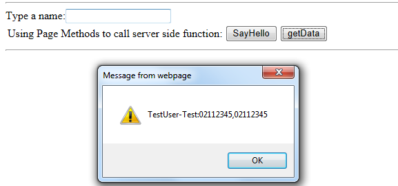

# Call server side function without web service
## Requires
- Visual Studio 2012
## License
- Apache License, Version 2.0
## Technologies
- ASP.NET
## Topics
- ASP.NET
## Updated
- 06/13/2013
## Description

<h1>Call server side function without web service (VBASPNETStaticCodeByPageMethod)</h1>
<h2>Introduction</h2>

This sample code will demonstrate how to call server side function without web service. ASP.NET Ajax extensions came with full support for script services. But sometimes you don't want to build a web service for a small
 piece of code or for basic functionality. This is why the PageMethods feature was created. The PageMethods feature enables the using of code-behind page methods on the clientside. The PageMethods can only be added to the page itself so don't try to add them
 to user controls or custom controls - it won't work.

<h2>Running the Sample</h2>

Please follow the steps below. 

Step 1: Open the VBASPNETStaticCodeByPageMethod.sln file. 

Step 2: Press &quot;Ctrl&#43;F5&quot; to view Default page in browser. 

Type a name and then click the SayHello button you will see as shown below: 

 
 

 
Step 3: Click the getData button and then you will see shown below: 

 
Step 4: Validation is completed.

<h2>Using the Code</h2>

&nbsp;Code Logical: 
&nbsp;&nbsp;&nbsp; 

Step 1: Create a VB &quot;ASP.NET Web Application&quot; in Visual Studio 2012 or Visual Web Developer and name it as &quot;VBASPNETStaticCodeByPageMethod&quot;.

Step 2: Add a Jscript File to project by followed the steps below:
 
Right-click at the project file &gt;&gt;Add&gt;&gt;New Item…&gt;&gt;Web&gt;&gt;Jscript File

Have selected the Jscript template, then type script as &quot;name&quot; and then click Add button.&nbsp;
After that, paste this segment code to it.

JavaScript

Edit|Remove

js

<pre id="codePreview" class="js">
// Gets the session state value.
function getSayHello(src) {
    var name = document.getElementById(src.id).value;
    PageMethods.sayHello(name,
        OnSucceeded);
}

// Callback function invoked on successful 
// completion of the page method.
function OnSucceeded(result) {   
       alert(result);
    
}

</pre>

&nbsp;

Then add script reference of the script.js 

HTML

Edit|Remove

html

<pre id="codePreview" class="html">
&lt;asp:ScriptManager ID=&quot;ScriptManager1&quot; runat=&quot;server&quot; EnablePageMethods=&quot;true&quot;&gt;
      &lt;Scripts&gt;
          &lt;asp:ScriptReference Path=&quot;script.js&quot; /&gt;
      &lt;/Scripts&gt;
  &lt;/asp:ScriptManager&gt;

</pre>

&nbsp;

Create a static method at code-behind. 

VB

Edit|Remove

vb

<pre id="codePreview" class="vb">
&lt;WebMethod()&gt; _
Public Shared Function sayHello(ByVal name As String) As String
        Return &quot;Hello,&quot; & name
    End Function

</pre>

&nbsp;

<b style="">[Note]</b>
&nbsp;We need to add the System.Web.Services.WebMethod at top of the method. 
&nbsp;Then add a button at the page as below: 

HTML

Edit|Remove

html

<pre id="codePreview" class="html">
&lt;input type=&quot;button&quot; onclick=&quot;getSayHello(&lt;%=tbInput.ClientID %&gt;)&quot; value=&quot;SayHello&quot; /&gt;

</pre>

&nbsp;

This is a routine call: the passed parameter of the client side and server side is a string or number, etc..

Step 4: PageMethod also have usage that is similar to the Default ModelBinder. 
First, add the following code in code-behind: 

VB

Edit|Remove

vb

<pre id="codePreview" class="vb">
&lt;WebMethod()&gt; _
   Public Shared Function getData(ByVal t As TestUser) As Object
       Return New With { _
        Key .Name = t.Name & &quot;-Test&quot;, _
        Key .Value = t.Phone _
       }
   End Function

</pre>

&nbsp;

VB

Edit|Remove

vb

<pre id="codePreview" class="vb">
Public Class TestUser
        Public Property Name() As String
            Get
                Return m_Name
            End Get
            Set(ByVal value As String)
                m_Name = value
            End Set
        End Property
        Private m_Name As String
        Public Property BirthDate() As DateTime
            Get
                Return m_BirthDate
            End Get
            Set(ByVal value As DateTime)
                m_BirthDate = value
            End Set
        End Property
        Private m_BirthDate As DateTime
        Public Property Phone() As IList(Of String)
            Get
                Return m_Phone
            End Get
            Set(ByVal value As IList(Of String))
                m_Phone = value
            End Set
        End Property
        Private m_Phone As IList(Of String)
    End Class

</pre>

&nbsp;

Write a javascript to call PageMethod in aspx.

JavaScript

Edit|Remove

js

<pre id="codePreview" class="js">
&lt;script type=&quot;text/javascript&quot;&gt;
       function getData() {
           var data = {
               Name: &quot;TestUser&quot;,
               BirthDate: new Date(),
               Phone: [&quot;13612345678&quot;, &quot;02112345&quot;]
           };
           PageMethods.getData(data, function(returnValue) {
               alert(returnValue.Name &#43; &quot;:&quot; &#43; returnValue.Value);
           });
       }
       
    
   &lt;/script&gt;

</pre>

&nbsp;

Then add a button at the page as shown below:

HTML

Edit|Remove

html

<pre id="codePreview" class="html">
&lt;input type=&quot;button&quot; onclick=&quot;getData()&quot; value=&quot;getData&quot; /&gt;

</pre>

&nbsp;

 
&nbsp;Step 5: You can test and debug it.

<h2>More Information 
Calling Static Methods in an ASP.NET Web Page
</h2>

&nbsp;<a href="http://www.asp.net/Ajax/Documentation/Live/tutorials/ExposingWebServicesToAJAXTutorial.aspx">http://www.asp.net/Ajax/Documentation/Live/tutorials/ExposingWebServicesToAJAXTutorial.aspx</a> 
ASP.NET Ajax PageMethods 
<a href="http://blogs.microsoft.co.il/blogs/gilf/archive/2008/10/04/asp-net-ajax-pagemethods.aspx">http://blogs.microsoft.co.il/blogs/gilf/archive/2008/10/04/asp-net-ajax-pagemethods.aspx</a>

