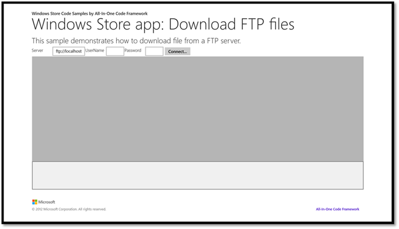
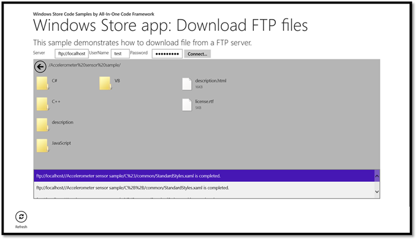

# Download FTP file in Windows Store app
## Requires
- Visual Studio 2012
## License
- MS-LPL
## Technologies
- Windows 8
## Topics
- FTP
## Updated
- 04/16/2013
## Description

<h1></h1>
<h1>Download a file from FTP server in a Windows Store app (VBWindowsStoreAppFTPDownloader)
</h1>
<h2>Introduction </h2>

This sample demonstrates how to download a file from
IIS FTP server in a Windows Store
app. It also supplies functions to list the sub folders and files in the server.

To list the sub folders and files in the server, we can use a
<strong>WebRequest</strong> with the <strong>LIST</strong> method, and then parse the response.

To download a small file, we can use a <strong>WebRequest</strong> with the
<strong>RETR</strong> method. For large file, it is better to use <strong>BackgroundDownloader</strong>.

This app need following capabilities:

&uuml;&nbsp;
Internet (Client)

&uuml;&nbsp;
Private Networks (Client and Server)

&uuml;&nbsp;
Enterprise Authentication

Different FTP server may have different response to the LIST command, this app works for the IIS FTP Server, and it will use the default proxy setting to connect to FTP Server.

<h2>Running the Sample </h2>

1.&nbsp;&nbsp;&nbsp;&nbsp;&nbsp;&nbsp;
Open this sample in VS2012 on Win8 machine, and press F5 to run it.

2.&nbsp;&nbsp;&nbsp;&nbsp;&nbsp;&nbsp;
After the app is launched, you will see following screen.

&nbsp;

3.&nbsp;&nbsp;&nbsp;&nbsp;&nbsp;&nbsp;Type the server name, username and password, and then click the Connect button.

&nbsp;<strong> 
</strong>

4.&nbsp;&nbsp;&nbsp;&nbsp;&nbsp;
Click a folder, and you will be navigated to the sub folder.

5.&nbsp;&nbsp;&nbsp;&nbsp;&nbsp;&nbsp;Select one or more items, the AppBar will be opened, and then you can click Download button to
 download the files.

6.&nbsp;&nbsp;&nbsp; When a file is downloaded, a notification will show.

&nbsp;

<h2>Using the Code </h2>

1.&nbsp;&nbsp;&nbsp;&nbsp;&nbsp;&nbsp;
List files and sub folder.

a.&nbsp;&nbsp;&nbsp;&nbsp;&nbsp;&nbsp;
When run the FTP LIST protocol method to get a detailed listing of the files on an FTP server, the server will response many records of information. Each record represents a file or a directory.

VB

Edit|Remove

vb

<pre id="codePreview" class="vb">Public Async Function ListFtpContentAsync(ByVal url As Uri, ByVal credential As ICredentials) As Task(Of IEnumerable(Of FTPFileSystem))
&nbsp;&nbsp;&nbsp; Dim currentUri As Uri = url

&nbsp;&nbsp;&nbsp; ' This request is FtpWebRequest in fact.
&nbsp;&nbsp;&nbsp; Dim request As WebRequest = WebRequest.Create(currentUri)
&nbsp;&nbsp;&nbsp; If credential IsNot Nothing Then
&nbsp;&nbsp;&nbsp;&nbsp;&nbsp;&nbsp;&nbsp; request.Credentials = credential
&nbsp;&nbsp;&nbsp; End If

&nbsp;&nbsp;&nbsp; ' Set the method to LIST.
&nbsp;&nbsp;&nbsp; request.Method = &quot;LIST&quot;

&nbsp;&nbsp;&nbsp; ' Get response.
&nbsp;&nbsp;&nbsp; Using response As WebResponse = Await request.GetResponseAsync()

&nbsp;&nbsp;&nbsp;&nbsp;&nbsp;&nbsp;&nbsp; ' Get response stream.
&nbsp;&nbsp;&nbsp;&nbsp;&nbsp;&nbsp;&nbsp; Using responseStream As Stream = response.GetResponseStream()

&nbsp;&nbsp;&nbsp;&nbsp;&nbsp;&nbsp;&nbsp;&nbsp;&nbsp;&nbsp;&nbsp; Using reader As New StreamReader(responseStream)
&nbsp;&nbsp;&nbsp;&nbsp;&nbsp;&nbsp;&nbsp;&nbsp;&nbsp;&nbsp;&nbsp;&nbsp;&nbsp;&nbsp;&nbsp; Dim subDirs As New List(Of FTP.FTPFileSystem)()

&nbsp;&nbsp;&nbsp;&nbsp;&nbsp;&nbsp;&nbsp;&nbsp;&nbsp;&nbsp;&nbsp;&nbsp;&nbsp;&nbsp;&nbsp; Dim item As String = reader.ReadLine()

&nbsp;&nbsp;&nbsp;&nbsp;&nbsp;&nbsp;&nbsp;&nbsp;&nbsp;&nbsp; &nbsp;&nbsp;&nbsp;&nbsp;&nbsp;' Find out the FTP Directory Listing Style from the recordString.
&nbsp;&nbsp;&nbsp;&nbsp;&nbsp;&nbsp;&nbsp;&nbsp;&nbsp;&nbsp;&nbsp;&nbsp;&nbsp;&nbsp;&nbsp; Dim style As FTP.FTPDirectoryListingStyle = FTP.FTPDirectoryListingStyle.MSDOS
&nbsp;&nbsp;&nbsp;&nbsp;&nbsp;&nbsp;&nbsp;&nbsp;&nbsp;&nbsp;&nbsp;&nbsp;&nbsp;&nbsp;&nbsp; If Not String.IsNullOrEmpty(item) Then
&nbsp;&nbsp;&nbsp;&nbsp;&nbsp;&nbsp;&nbsp;&nbsp;&nbsp;&nbsp;&nbsp;&nbsp;&nbsp;&nbsp;&nbsp;&nbsp;&nbsp;&nbsp;&nbsp; style = FTP.FTPFileSystem.GetDirectoryListingStyle(item)
&nbsp;&nbsp;&nbsp;&nbsp;&nbsp;&nbsp;&nbsp;&nbsp;&nbsp;&nbsp;&nbsp;&nbsp;&nbsp;&nbsp;&nbsp; End If
&nbsp;&nbsp;&nbsp;&nbsp;&nbsp;&nbsp;&nbsp;&nbsp;&nbsp;&nbsp;&nbsp;&nbsp;&nbsp;&nbsp;&nbsp; Do While Not String.IsNullOrEmpty(item)
&nbsp;&nbsp;&nbsp;&nbsp;&nbsp;&nbsp;&nbsp;&nbsp;&nbsp;&nbsp;&nbsp;&nbsp;&nbsp;&nbsp;&nbsp;&nbsp;&nbsp;&nbsp;&nbsp; subDirs.Add(FTP.FTPFileSystem.ParseRecordString(currentUri, item, style))
&nbsp;&nbsp;&nbsp;&nbsp;&nbsp;&nbsp;&nbsp;&nbsp;&nbsp;&nbsp;&nbsp;&nbsp;&nbsp;&nbsp;&nbsp;&nbsp;&nbsp;&nbsp;&nbsp; item = reader.ReadLine()
&nbsp;&nbsp;&nbsp;&nbsp;&nbsp;&nbsp;&nbsp;&nbsp;&nbsp;&nbsp;&nbsp;&nbsp;&nbsp;&nbsp;&nbsp; Loop

&nbsp;&nbsp;&nbsp;&nbsp;&nbsp;&nbsp;&nbsp;&nbsp;&nbsp;&nbsp;&nbsp;&nbsp;&nbsp;&nbsp;&nbsp; Return subDirs
&nbsp;&nbsp;&nbsp;&nbsp;&nbsp;&nbsp;&nbsp;&nbsp;&nbsp;&nbsp;&nbsp; End Using
&nbsp;&nbsp;&nbsp;&nbsp;&nbsp;&nbsp;&nbsp; End Using
&nbsp;&nbsp;&nbsp; End Using

End Function

</pre>

&nbsp;

&nbsp;

b.&nbsp;&nbsp;&nbsp;&nbsp;&nbsp;
Parse record string.

Depended on the FTP Directory Listing Style of the server,the record is like

&nbsp;&nbsp;&nbsp;&nbsp;&nbsp;&nbsp;&nbsp;&nbsp;&nbsp;&nbsp;&nbsp;&nbsp;&nbsp;&nbsp;&nbsp;&nbsp;&nbsp;&nbsp;&nbsp;&nbsp;&nbsp;&nbsp;&nbsp;&nbsp;&nbsp;&nbsp;&nbsp;&nbsp;&nbsp;&nbsp;&nbsp;&nbsp;&nbsp;&nbsp;&nbsp;&nbsp;&nbsp;&nbsp;&nbsp;&nbsp;&nbsp;&nbsp;&nbsp;&nbsp;&nbsp;&nbsp;&nbsp;&nbsp;&nbsp;&nbsp;&nbsp;&nbsp;&nbsp;&nbsp;&nbsp;&nbsp;
i.&nbsp;&nbsp;&nbsp;&nbsp;&nbsp;&nbsp;&nbsp;&nbsp;&nbsp;&nbsp;&nbsp;
MSDOS

Directory:&nbsp;&nbsp;&nbsp;&nbsp;&nbsp;
12-13-10&nbsp; 12:41PM&nbsp; &lt;DIR&gt;&nbsp;
Folder A

File:&nbsp;&nbsp;&nbsp;&nbsp;&nbsp;&nbsp;&nbsp;&nbsp;&nbsp;&nbsp;&nbsp;&nbsp;&nbsp;&nbsp;&nbsp;&nbsp;&nbsp;
12-13-10&nbsp; 12:41PM&nbsp; [Size] File B&nbsp;

&nbsp;

&nbsp;&nbsp;&nbsp;&nbsp;&nbsp;&nbsp;&nbsp;&nbsp;&nbsp;&nbsp;&nbsp;&nbsp;&nbsp;&nbsp;&nbsp;&nbsp;&nbsp;&nbsp;&nbsp;&nbsp;&nbsp;&nbsp;&nbsp;&nbsp;&nbsp;&nbsp;&nbsp;&nbsp;&nbsp;&nbsp;&nbsp;&nbsp;&nbsp;&nbsp;&nbsp;&nbsp;&nbsp;&nbsp;&nbsp;&nbsp;&nbsp;&nbsp;&nbsp;&nbsp;&nbsp;&nbsp;&nbsp;&nbsp;&nbsp;&nbsp;&nbsp;&nbsp;&nbsp;&nbsp;
ii.&nbsp;&nbsp;&nbsp;&nbsp;&nbsp;&nbsp;&nbsp;&nbsp;&nbsp;&nbsp;&nbsp;
UNIX

Directory:&nbsp;&nbsp;&nbsp;
drwxrwxrwx 1 owner group 0 Dec 1 12:00 Folder A

File:&nbsp;&nbsp;&nbsp;&nbsp;&nbsp;&nbsp;&nbsp;&nbsp;&nbsp;&nbsp;&nbsp;&nbsp;&nbsp;&nbsp;&nbsp;&nbsp;
-rwxrwxrwx 1 owner group [Size] Dec 1 12:00 File B

VB

Edit|Remove

vb

<pre id="codePreview" class="vb">''' &lt;summary&gt;
''' Find out the FTP Directory Listing Style from the recordString.
''' &lt;/summary&gt;
Public Shared Function GetDirectoryListingStyle(ByVal recordString As String) As FTPDirectoryListingStyle
&nbsp;&nbsp;&nbsp; Dim regex As Regex = New <a class="libraryLink" href="http://msdn.microsoft.com/en-US/library/System.Text.RegularExpressions.Regex.aspx" target="_blank" title="Auto generated link to System.Text.RegularExpressions.Regex">System.Text.RegularExpressions.Regex</a>(&quot;^[d-]([r-][w-][x-]){3}$&quot;)

&nbsp;&nbsp;&nbsp; Dim header As String = recordString.Substring(0, 10)

&nbsp;&nbsp;&nbsp; ' If the style is UNIX, then the header is like &quot;drwxrwxrwx&quot;.
&nbsp;&nbsp;&nbsp; If regex.IsMatch(header) Then
&nbsp;&nbsp;&nbsp;&nbsp;&nbsp;&nbsp;&nbsp; Return FTPDirectoryListingStyle.UNIX
&nbsp;&nbsp;&nbsp; Else
&nbsp;&nbsp;&nbsp;&nbsp;&nbsp;&nbsp;&nbsp; Return FTPDirectoryListingStyle.MSDOS
&nbsp;&nbsp;&nbsp; End If
End Function

''' &lt;summary&gt;
''' Get an FTPFileSystem from the recordString. 
''' &lt;/summary&gt;
Public Shared Function ParseRecordString(ByVal baseUrl As Uri, ByVal recordString As String, ByVal type As FTPDirectoryListingStyle) As FTPFileSystem
&nbsp;&nbsp;&nbsp; Dim fileSystem As FTPFileSystem = Nothing

&nbsp;&nbsp;&nbsp; If type = FTPDirectoryListingStyle.UNIX Then
&nbsp;&nbsp;&nbsp;&nbsp;&nbsp;&nbsp;&nbsp; fileSystem = ParseUNIXRecordString(recordString)
&nbsp;&nbsp;&nbsp; Else
&nbsp;&nbsp;&nbsp;&nbsp;&nbsp;&nbsp;&nbsp; fileSystem = ParseMSDOSRecordString(recordString)
&nbsp;&nbsp;&nbsp; End If

&nbsp;&nbsp;&nbsp; Dim encodedName As String = <a class="libraryLink" href="http://msdn.microsoft.com/en-US/library/System.Net.WebUtility.UrlEncode.aspx" target="_blank" title="Auto generated link to System.Net.WebUtility.UrlEncode">System.Net.WebUtility.UrlEncode</a>(fileSystem.Name)
&nbsp;&nbsp;&nbsp; encodedName = encodedName.Replace(&quot;&#43;&quot;, &quot;%20&quot;)
&nbsp;&nbsp;&nbsp; encodedName = encodedName.Replace(&quot;%2b&quot;, &quot;&#43;&quot;)

&nbsp;&nbsp;&nbsp; ' Add &quot;/&quot; to the url if it is a directory
&nbsp;&nbsp;&nbsp; fileSystem.Url = New Uri(baseUrl, encodedName &amp; (If(fileSystem.IsDirectory, &quot;/&quot;, String.Empty)))

&nbsp;&nbsp;&nbsp; Return fileSystem
End Function

''' &lt;summary&gt;
''' The recordString is like
''' Directory: drwxrwxrwx&nbsp;&nbsp; 1 owner&nbsp;&nbsp;&nbsp; group&nbsp;&nbsp;&nbsp;&nbsp;&nbsp;&nbsp;&nbsp;&nbsp;&nbsp;&nbsp;&nbsp;&nbsp;&nbsp;&nbsp; 0 Dec 13 11:25 Folder A
''' File:&nbsp;&nbsp;&nbsp;&nbsp;&nbsp; -rwxrwxrwx&nbsp;&nbsp; 1 owner&nbsp;&nbsp;&nbsp; group&nbsp;&nbsp;&nbsp;&nbsp;&nbsp;&nbsp;&nbsp;&nbsp;&nbsp;&nbsp;&nbsp;&nbsp;&nbsp;&nbsp; 1024 Dec 13 11:25 File B
''' NOTE: The date segment does not contains year.
''' &lt;/summary&gt;
Shared Function ParseUNIXRecordString(ByVal recordString As String) As FTPFileSystem
&nbsp;&nbsp;&nbsp; Dim fileSystem As New FTPFileSystem()

&nbsp;&nbsp;&nbsp; fileSystem.OriginalRecordString = recordString.Trim()
&nbsp;&nbsp;&nbsp; fileSystem.DirectoryListingStyle = FTPDirectoryListingStyle.UNIX

&nbsp;&nbsp;&nbsp; ' The segments is like &quot;drwxrwxrwx&quot;, &quot;&quot;,&nbsp; &quot;&quot;, &quot;1&quot;, &quot;owner&quot;, &quot;&quot;, &quot;&quot;, &quot;&quot;, 
&nbsp;&nbsp;&nbsp;&nbsp;' &quot;group&quot;, &quot;&quot;, &quot;&quot;, &quot;&quot;, &quot;&quot;, &quot;&quot;, &quot;&quot;, &quot;&quot;, &quot;&quot;, &quot;&quot;, &quot;&quot;, &quot;&quot;, &quot;&quot;, &quot;&quot;, &quot;&quot;, &quot;&quot;, 
&nbsp;&nbsp;&nbsp;&nbsp;' &quot;0&quot;, &quot;Dec&quot;, &quot;13&quot;, &quot;11:25&quot;, &quot;Folder&quot;, &quot;A&quot;.
&nbsp;&nbsp;&nbsp; Dim segments() As String = fileSystem.OriginalRecordString.Split(&quot; &quot;c)

&nbsp;&nbsp;&nbsp; Dim index As Integer = 0

&nbsp;&nbsp;&nbsp; ' The permission segment is like &quot;drwxrwxrwx&quot;.
&nbsp;&nbsp;&nbsp; Dim permissionsegment As String = segments(index)

&nbsp;&nbsp;&nbsp; ' If the property start with 'd', then it means a directory.
&nbsp;&nbsp;&nbsp; fileSystem.IsDirectory = permissionsegment.Chars(0) = &quot;d&quot;c

&nbsp;&nbsp;&nbsp; ' Skip the empty segments.
&nbsp;&nbsp;&nbsp; index &#43;= 1
&nbsp;&nbsp;&nbsp; Do While segments(index) = String.Empty
&nbsp;&nbsp;&nbsp;&nbsp;&nbsp;&nbsp;&nbsp; index &#43;= 1
&nbsp;&nbsp;&nbsp; Loop

&nbsp;&nbsp;&nbsp; ' Skip the directories segment.

&nbsp;&nbsp;&nbsp; ' Skip the empty segments.
&nbsp;&nbsp;&nbsp; index &#43;= 1
&nbsp;&nbsp;&nbsp; Do While segments(index) = String.Empty
&nbsp;&nbsp;&nbsp;&nbsp;&nbsp;&nbsp;&nbsp; index &#43;= 1
&nbsp;&nbsp;&nbsp; Loop

&nbsp;&nbsp;&nbsp; ' Skip the owner segment.

&nbsp;&nbsp;&nbsp; ' Skip the empty segments.
&nbsp;&nbsp;&nbsp; index &#43;= 1
&nbsp;&nbsp;&nbsp; Do While segments(index) = String.Empty
&nbsp;&nbsp;&nbsp;&nbsp;&nbsp;&nbsp;&nbsp; index &#43;= 1
&nbsp;&nbsp;&nbsp; Loop

&nbsp;&nbsp;&nbsp; ' Skip the group segment.

&nbsp;&nbsp;&nbsp; ' Skip the empty segments.
&nbsp;&nbsp;&nbsp; index &#43;= 1
&nbsp;&nbsp;&nbsp; Do While segments(index) = String.Empty
&nbsp;&nbsp;&nbsp;&nbsp;&nbsp;&nbsp;&nbsp; index &#43;= 1
&nbsp;&nbsp;&nbsp; Loop

&nbsp;&nbsp;&nbsp; ' If this fileSystem is a file, then the size is larger than 0. 
&nbsp;&nbsp;&nbsp;&nbsp;fileSystem.Size = Long.Parse(segments(index))

&nbsp;&nbsp;&nbsp; ' Skip the empty segments.
&nbsp;&nbsp;&nbsp; index &#43;= 1
&nbsp;&nbsp;&nbsp; Do While segments(index) = String.Empty
&nbsp;&nbsp;&nbsp; &nbsp;&nbsp;&nbsp;&nbsp;index &#43;= 1
&nbsp;&nbsp;&nbsp; Loop

&nbsp;&nbsp;&nbsp; ' The month segment.
&nbsp;&nbsp;&nbsp; Dim monthsegment As String = segments(index)

&nbsp;&nbsp;&nbsp; ' Skip the empty segments.
&nbsp;&nbsp;&nbsp; index &#43;= 1
&nbsp;&nbsp;&nbsp; Do While segments(index) = String.Empty
&nbsp;&nbsp;&nbsp;&nbsp;&nbsp;&nbsp;&nbsp; index &#43;= 1
&nbsp;&nbsp;&nbsp; Loop

&nbsp;&nbsp;&nbsp; ' The day segment.
&nbsp;&nbsp;&nbsp; Dim daysegment As String = segments(index)

&nbsp;&nbsp;&nbsp; ' Skip the empty segments.
&nbsp;&nbsp;&nbsp; index &#43;= 1
&nbsp;&nbsp;&nbsp; Do While segments(index) = String.Empty
&nbsp;&nbsp;&nbsp;&nbsp;&nbsp;&nbsp;&nbsp; index &#43;= 1
&nbsp;&nbsp;&nbsp; Loop

&nbsp;&nbsp;&nbsp; ' The time segment.
&nbsp;&nbsp;&nbsp; Dim timesegment As String = segments(index)

&nbsp;&nbsp;&nbsp; fileSystem.ModifiedTime = Date.Parse(String.Format(&quot;{0} {1} {2} &quot;, timesegment, monthsegment, daysegment))

&nbsp;&nbsp;&nbsp; ' Skip the empty segments.
&nbsp;&nbsp;&nbsp; index &#43;= 1
&nbsp;&nbsp;&nbsp; Do While segments(index) = String.Empty
&nbsp;&nbsp;&nbsp;&nbsp;&nbsp;&nbsp;&nbsp; index &#43;= 1
&nbsp;&nbsp;&nbsp; Loop

&nbsp;&nbsp;&nbsp; ' Calculate the index of the file name part in the original string.
&nbsp;&nbsp;&nbsp; Dim filenameIndex As Integer = 0

&nbsp;&nbsp;&nbsp; For i As Integer = 0 To index - 1
&nbsp;&nbsp;&nbsp;&nbsp;&nbsp;&nbsp;&nbsp; ' &quot;&quot; represents ' ' in the original string.
&nbsp;&nbsp;&nbsp;&nbsp;&nbsp;&nbsp;&nbsp; If segments(i) = String.Empty Then
&nbsp;&nbsp;&nbsp;&nbsp;&nbsp;&nbsp;&nbsp;&nbsp;&nbsp;&nbsp;&nbsp; filenameIndex &#43;= 1
&nbsp;&nbsp;&nbsp;&nbsp;&nbsp;&nbsp;&nbsp; Else
&nbsp;&nbsp;&nbsp;&nbsp;&nbsp;&nbsp;&nbsp;&nbsp;&nbsp;&nbsp;&nbsp; filenameIndex &#43;= segments(i).Length &#43; 1
&nbsp;&nbsp;&nbsp;&nbsp;&nbsp;&nbsp;&nbsp; End If
&nbsp;&nbsp;&nbsp; Next i
&nbsp;&nbsp;&nbsp; ' The file name may include many segments because the name can contain ' '.&nbsp;&nbsp;&nbsp;&nbsp;&nbsp;&nbsp;&nbsp;&nbsp;&nbsp; 
&nbsp;&nbsp;&nbsp;&nbsp;fileSystem.Name = fileSystem.OriginalRecordString.Substring(filenameIndex).Trim()

&nbsp;&nbsp;&nbsp; Return fileSystem
End Function

''' &lt;summary&gt;
''' 12-13-10&nbsp; 12:41PM&nbsp;&nbsp;&nbsp;&nbsp;&nbsp;&nbsp; &lt;DIR&gt;&nbsp;&nbsp;&nbsp;&nbsp;&nbsp;&nbsp;&nbsp;&nbsp;&nbsp; Folder A
''' &lt;/summary&gt;
''' &lt;param name=&quot;recordString&quot;&gt;&lt;/param&gt;
''' &lt;returns&gt;&lt;/returns&gt;
Shared Function ParseMSDOSRecordString(ByVal recordString As String) As FTPFileSystem
&nbsp;&nbsp;&nbsp; Dim fileSystem As New FTPFileSystem()

&nbsp;&nbsp;&nbsp; fileSystem.OriginalRecordString = recordString.Trim()
&nbsp;&nbsp;&nbsp; fileSystem.DirectoryListingStyle = FTPDirectoryListingStyle.MSDOS

&nbsp;&nbsp;&nbsp; ' The segments is like &quot;12-13-10&quot;,&nbsp; &quot;&quot;, &quot;12:41PM&quot;, &quot;&quot;, &quot;&quot;,&quot;&quot;, &quot;&quot;,
&nbsp;&nbsp;&nbsp; ' &quot;&quot;, &quot;&quot;, &quot;&lt;DIR&gt;&quot;, &quot;&quot;, &quot;&quot;, &quot;&quot;, &quot;&quot;, &quot;&quot;, &quot;&quot;, &quot;&quot;, &quot;&quot;, &quot;&quot;, &quot;Folder&quot;, &quot;A&quot;.
&nbsp;&nbsp;&nbsp; Dim segments() As String = fileSystem.OriginalRecordString.Split(&quot; &quot;c)

&nbsp;&nbsp;&nbsp; Dim index As Integer = 0

&nbsp;&nbsp;&nbsp; ' The date segment is like &quot;12-13-10&quot; instead of &quot;12-13-2010&quot; if Four-digit years
&nbsp;&nbsp;&nbsp; ' is not checked in IIS.
&nbsp;&nbsp;&nbsp; Dim dateSegment As String = segments(index)
&nbsp;&nbsp;&nbsp; Dim dateSegments() As String = dateSegment.Split(New Char() {&quot;-&quot;c}, StringSplitOptions.RemoveEmptyEntries)

&nbsp;&nbsp;&nbsp; Dim month As Integer = Integer.Parse(dateSegments(0))
&nbsp;&nbsp;&nbsp; Dim day As Integer = Integer.Parse(dateSegments(1))
&nbsp;&nbsp;&nbsp; Dim year As Integer = Integer.Parse(dateSegments(2))

&nbsp;&nbsp;&nbsp; ' If year &gt;=50 and year &lt;100, then&nbsp; it means the year 19**
&nbsp;&nbsp;&nbsp; If year &gt;= 50 AndAlso year &lt; 100 Then
&nbsp;&nbsp;&nbsp;&nbsp;&nbsp;&nbsp;&nbsp; year &#43;= 1900

&nbsp;&nbsp;&nbsp;&nbsp;&nbsp;&nbsp;&nbsp; ' If year &lt;50, then it means the year 20**
&nbsp;&nbsp;&nbsp; ElseIf year &lt; 50 Then
&nbsp;&nbsp;&nbsp;&nbsp;&nbsp;&nbsp;&nbsp; year &#43;= 2000
&nbsp;&nbsp;&nbsp; End If

&nbsp;&nbsp;&nbsp; ' Skip the empty segments.
&nbsp;&nbsp;&nbsp; index &#43;= 1
&nbsp;&nbsp;&nbsp; Do While segments(index) = String.Empty
&nbsp;&nbsp;&nbsp;&nbsp;&nbsp;&nbsp;&nbsp; index &#43;= 1
&nbsp;&nbsp;&nbsp; Loop

 &nbsp;&nbsp;&nbsp;' The time segment.
&nbsp;&nbsp;&nbsp; Dim timesegment As String = segments(index)

&nbsp;&nbsp;&nbsp; fileSystem.ModifiedTime = Date.Parse(String.Format(&quot;{0}-{1}-{2} {3}&quot;, year, month, day, timesegment))

&nbsp;&nbsp;&nbsp; ' Skip the empty segments.
&nbsp;&nbsp;&nbsp; index &#43;= 1
&nbsp;&nbsp;&nbsp; Do While segments(index) = String.Empty
&nbsp;&nbsp;&nbsp;&nbsp;&nbsp;&nbsp;&nbsp; index &#43;= 1
&nbsp;&nbsp;&nbsp; Loop

&nbsp;&nbsp;&nbsp; ' The size or directory segment.
&nbsp;&nbsp;&nbsp; ' If this segment is &quot;&lt;DIR&gt;&quot;, then it means a directory, else it means the
&nbsp;&nbsp;&nbsp; ' file size.
&nbsp;&nbsp;&nbsp; Dim sizeOrDirSegment As String = segments(index)

&nbsp;&nbsp;&nbsp; fileSystem.IsDirectory = sizeOrDirSegment.Equals(&quot;&lt;DIR&gt;&quot;, StringComparison.OrdinalIgnoreCase)

&nbsp;&nbsp;&nbsp; ' If this fileSystem is a file, then the size is larger than 0. 
&nbsp;&nbsp;&nbsp;&nbsp;If Not fileSystem.IsDirectory Then
&nbsp;&nbsp;&nbsp;&nbsp;&nbsp;&nbsp;&nbsp; fileSystem.Size = Long.Parse(sizeOrDirSegment)
&nbsp;&nbsp;&nbsp; End If

&nbsp;&nbsp;&nbsp; ' Skip the empty segments.
&nbsp;&nbsp;&nbsp; index &#43;= 1
&nbsp;&nbsp;&nbsp; Do While segments(index) = String.Empty
&nbsp;&nbsp;&nbsp;&nbsp;&nbsp;&nbsp;&nbsp; index &#43;= 1
&nbsp;&nbsp;&nbsp; Loop

&nbsp;&nbsp;&nbsp; ' Calculate the index of the file name part in the original string.
&nbsp;&nbsp;&nbsp; Dim filenameIndex As Integer = 0

&nbsp;&nbsp;&nbsp; For i As Integer = 0 To index - 1
&nbsp;&nbsp;&nbsp;&nbsp;&nbsp;&nbsp;&nbsp; ' &quot;&quot; represents ' ' in the original string.
&nbsp;&nbsp;&nbsp;&nbsp;&nbsp;&nbsp;&nbsp; If segments(i) = String.Empty Then
&nbsp;&nbsp;&nbsp;&nbsp;&nbsp;&nbsp;&nbsp;&nbsp;&nbsp;&nbsp;&nbsp; filenameIndex &#43;= 1
&nbsp;&nbsp;&nbsp;&nbsp;&nbsp;&nbsp;&nbsp; Else
&nbsp;&nbsp;&nbsp;&nbsp;&nbsp;&nbsp;&nbsp;&nbsp;&nbsp;&nbsp;&nbsp; filenameIndex &#43;= segments(i).Length &#43; 1
&nbsp;&nbsp;&nbsp;&nbsp;&nbsp;&nbsp;&nbsp; End If
&nbsp;&nbsp;&nbsp; Next i
&nbsp;&nbsp;&nbsp; ' The file name may include many segments because the name can contain ' '.&nbsp;&nbsp;&nbsp;&nbsp;&nbsp;&nbsp;&nbsp;&nbsp;&nbsp; 
&nbsp;&nbsp;&nbsp;&nbsp;fileSystem.Name = fileSystem.OriginalRecordString.Substring(filenameIndex).Trim()

&nbsp;&nbsp;&nbsp; Return fileSystem
End Function
&nbsp;&nbsp; 

</pre>

&nbsp;

&nbsp;

<strong>2.&nbsp;&nbsp;&nbsp;&nbsp;&nbsp;&nbsp;
</strong>Download files<strong> </strong>

a.&nbsp;&nbsp;&nbsp;&nbsp;&nbsp;&nbsp;
If the file is less than 1MB, download it using WebRequest.

VB

Edit|Remove

vb

<pre id="codePreview" class="vb">''' &lt;summary&gt;
''' Download a single file from FTP server using WebRequest.
''' &lt;/summary&gt;
Public Async Function DownloadFTPFileAsync(ByVal item As FTPFileSystem, ByVal targetFile As StorageFile, ByVal credential As ICredentials) As Task(Of DownloadCompletedEventArgs)

&nbsp;&nbsp;&nbsp; ' This request is FtpWebRequest in fact.
&nbsp;&nbsp;&nbsp; Dim request As WebRequest = WebRequest.Create(item.Url)

&nbsp;&nbsp;&nbsp; If credential IsNot Nothing Then
&nbsp;&nbsp;&nbsp;&nbsp;&nbsp;&nbsp;&nbsp; request.Credentials = credential
&nbsp;&nbsp;&nbsp; End If

&nbsp;&nbsp;&nbsp; ' Set the method to Download File
&nbsp;&nbsp;&nbsp; request.Method = &quot;RETR&quot;

&nbsp;&nbsp;&nbsp; ' Open the file for write.
&nbsp;&nbsp;&nbsp; Using fileStream As IRandomAccessStream = Await targetFile.OpenAsync(FileAccessMode.ReadWrite)

&nbsp;&nbsp;&nbsp;&nbsp;&nbsp;&nbsp;&nbsp; ' Get response.
&nbsp;&nbsp;&nbsp;&nbsp;&nbsp;&nbsp;&nbsp; Using response As WebResponse = Await request.GetResponseAsync()

&nbsp;&nbsp;&nbsp;&nbsp;&nbsp;&nbsp;&nbsp;&nbsp;&nbsp;&nbsp;&nbsp; ' Get response stream.
&nbsp;&nbsp;&nbsp;&nbsp;&nbsp;&nbsp;&nbsp;&nbsp;&nbsp;&nbsp;&nbsp; Using responseStream As Stream = response.GetResponseStream()
&nbsp;&nbsp;&nbsp;&nbsp;&nbsp;&nbsp;&nbsp;&nbsp;&nbsp;&nbsp;&nbsp;&nbsp;&nbsp;&nbsp;&nbsp; Dim downloadBuffer(2047) As Byte
&nbsp;&nbsp;&nbsp;&nbsp;&nbsp;&nbsp;&nbsp;&nbsp;&nbsp;&nbsp;&nbsp;&nbsp;&nbsp;&nbsp;&nbsp; Dim bytesSize As Integer = 0

&nbsp;&nbsp;&nbsp; &nbsp;&nbsp;&nbsp;&nbsp;&nbsp;&nbsp;&nbsp;&nbsp;&nbsp;&nbsp;&nbsp;&nbsp;' Download the file until the download is completed.
&nbsp;&nbsp;&nbsp;&nbsp;&nbsp;&nbsp;&nbsp;&nbsp;&nbsp;&nbsp;&nbsp;&nbsp;&nbsp;&nbsp;&nbsp; Do

&nbsp;&nbsp;&nbsp;&nbsp;&nbsp;&nbsp;&nbsp;&nbsp;&nbsp;&nbsp;&nbsp;&nbsp;&nbsp;&nbsp;&nbsp;&nbsp;&nbsp;&nbsp;&nbsp; ' Read a buffer of data from the stream.
&nbsp;&nbsp;&nbsp;&nbsp;&nbsp;&nbsp;&nbsp;&nbsp;&nbsp;&nbsp;&nbsp;&nbsp;&nbsp;&nbsp;&nbsp;&nbsp;&nbsp;&nbsp;&nbsp; bytesSize = responseStream.Read(downloadBuffer, 0, downloadBuffer.Length)
&nbsp;&nbsp;&nbsp;&nbsp;&nbsp;&nbsp;&nbsp;&nbsp;&nbsp;&nbsp;&nbsp;&nbsp;&nbsp;&nbsp;&nbsp; &nbsp;&nbsp;&nbsp;&nbsp;If bytesSize = 0 Then
&nbsp;&nbsp;&nbsp;&nbsp;&nbsp;&nbsp;&nbsp;&nbsp;&nbsp;&nbsp;&nbsp;&nbsp;&nbsp;&nbsp;&nbsp;&nbsp;&nbsp;&nbsp;&nbsp;&nbsp;&nbsp;&nbsp;&nbsp; Exit Do
&nbsp;&nbsp;&nbsp;&nbsp;&nbsp;&nbsp;&nbsp;&nbsp;&nbsp;&nbsp;&nbsp;&nbsp;&nbsp;&nbsp;&nbsp;&nbsp;&nbsp;&nbsp;&nbsp; End If

&nbsp;&nbsp;&nbsp;&nbsp;&nbsp;&nbsp;&nbsp;&nbsp;&nbsp;&nbsp;&nbsp;&nbsp;&nbsp;&nbsp;&nbsp;&nbsp;&nbsp;&nbsp;&nbsp; ' Write buffer to the file.
&nbsp;&nbsp;&nbsp;&nbsp;&nbsp;&nbsp;&nbsp;&nbsp;&nbsp;&nbsp;&nbsp;&nbsp;&nbsp;&nbsp;&nbsp;&nbsp;&nbsp;&nbsp;&nbsp; Await fileStream.WriteAsync(downloadBuffer.AsBuffer())
&nbsp;&nbsp;&nbsp;&nbsp;&nbsp;&nbsp;&nbsp;&nbsp;&nbsp;&nbsp;&nbsp;&nbsp;&nbsp;&nbsp;&nbsp; Loop
&nbsp;&nbsp;&nbsp;&nbsp;&nbsp;&nbsp;&nbsp;&nbsp;&nbsp;&nbsp;&nbsp; End Using
&nbsp;&nbsp;&nbsp; &nbsp;&nbsp;&nbsp;&nbsp;End Using
&nbsp;&nbsp;&nbsp; End Using

&nbsp;&nbsp;&nbsp; Return New DownloadCompletedEventArgs With {.RequestFile = item.Url, .LocalFile = targetFile}
End Function
&nbsp;&nbsp; 

</pre>

&nbsp;

&nbsp;

b.&nbsp;&nbsp;&nbsp;&nbsp;&nbsp;
Download large file using BackgroundDownloader. 

VB

Edit|Remove

vb

<pre id="codePreview" class="vb">' Create a BackgroundDownloader
Dim downloader As New BackgroundDownloader()
Dim download As DownloadOperation = downloader.CreateDownload(urlWithCredential, targetFile)
Await download.StartAsync().AsTask(progressCallback)

</pre>

&nbsp;

&nbsp;

<h2>More Information </h2>

&bull;&nbsp;&nbsp;&nbsp;&nbsp;&nbsp;&nbsp;&nbsp;&nbsp;
BackgroundDownloader class (Windows)

<a href="http://msdn.microsoft.com/en-us/library/windows/apps/windows.networking.backgroundtransfer.backgrounddownloader(v=win.10).aspx">http://msdn.microsoft.com/en-us/library/windows/apps/windows.networking.backgroundtransfer.backgrounddownloader(v=win.10).aspx</a>

&bull;&nbsp;&nbsp;&nbsp;&nbsp;&nbsp;&nbsp;&nbsp;&nbsp;
Background Transfer sample

<a href="http://code.msdn.microsoft.com/windowsapps/Background-Transfer-Sample-d7833f61">http://code.msdn.microsoft.com/windowsapps/Background-Transfer-Sample-d7833f61</a>

&bull;&nbsp;&nbsp;&nbsp;&nbsp;&nbsp;&nbsp;&nbsp;&nbsp;
WebRequest Class

<a href="http://msdn.microsoft.com/en-us/library/5t9y35bd.aspx">http://msdn.microsoft.com/en-us/library/5t9y35bd.aspx</a>

&nbsp;

