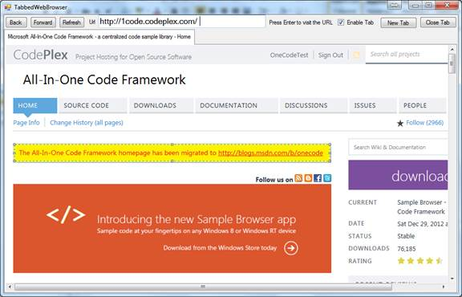
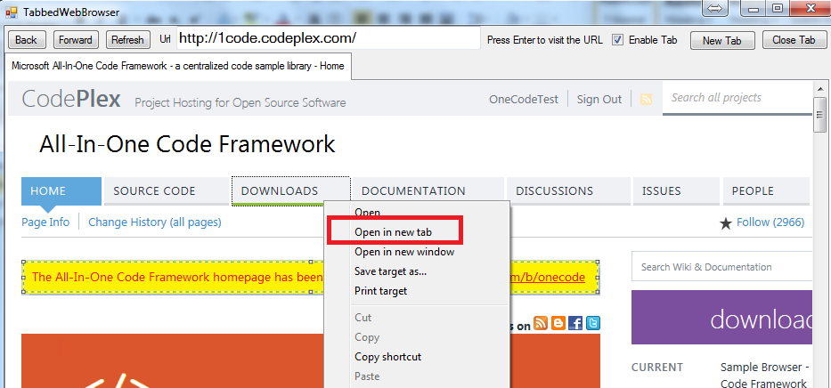

# Extended WebBrowser control supporting tabs
## Requires
- Visual Studio 2012
## License
- Apache License, Version 2.0
## Technologies
- Internet Explorer
- Internet Explorer Development
## Topics
- WebBrowser
## Updated
- 07/28/2013
## Description

<h1>How to Create a Tabbed WebBrowser (CSTabbedWebBrowser)</h1>
<h2>Introduction</h2>

The sample demonstrates how to create a tabbed 
WebBrowser. 

The &quot;Open in new Tab&quot; context command is disabled in
WebBorwser by default, you can add a value *.exe=1 (* means the process name) to the key HKCU\Software\Microsoft\Internet Explorer\Main\FeatureControl\FEATURE_TABBED_BROWSING.

This menu will only take effect after the application is restarted. See http://msdn.microsoft.com/en-us/library/ms537636(VS.85).aspx

<h2>Running the Sample</h2>

Press F5 to run the sample, the following is the result.

Step1. Type http://1code.codeplex.com/ in the 
Url, and press Enter. 

Step2. Right click the &quot;Downloads&quot; in the header of the page, and then click &quot;Open in new tab&quot;. This application will open the link in a new tab.

If the &quot;Open in new tab&quot; is disabled, check &quot;Enable Tab&quot; and restart the application.

<h2>Using the Code</h2>

1. Design a class WebBrowserEx that inherits 
class &nbsp;<a class="libraryLink" href="http://msdn.microsoft.com/en-US/library/System.Windows.Forms.WebBrowser.aspx" target="_blank" title="Auto generated link to System.Windows.Forms.WebBrowser">System.Windows.Forms.WebBrowser</a>. This class can handle NewWindow3 event.

&nbsp;&nbsp; The interface DWebBrowserEvents2 designates an event sink interface that an application must implement to receive event notifications from a
WebBrowser control or from the Windows Internet Explorer application. The event notifications include NewWindow3 event that will be used in this application.

2. Design a class WebBrowserTabPage that inherits the
the <a class="libraryLink" href="http://msdn.microsoft.com/en-US/library/System.Windows.Forms.TabPage.aspx" target="_blank" title="Auto generated link to System.Windows.Forms.TabPage">System.Windows.Forms.TabPage</a> class and contains a
WebBrowserEx property. An instance of this class could be
add to a tab control directly. 

&nbsp;&nbsp;&nbsp;&nbsp;&nbsp;&nbsp; 

3. Create a UserControl that contains a 
<a class="libraryLink" href="http://msdn.microsoft.com/en-US/library/System.Windows.Forms.TabControl.aspx" target="_blank" title="Auto generated link to System.Windows.Forms.TabControl">System.Windows.Forms.TabControl</a> instance. This UserControl supplies the method to create/close the
WebBrowserTabPage in the TabControl. It also supplies a Property
IsTabEnabled to get or set whether the &quot;Open in new Tab&quot; context menu in
WebBrowser is enabled. 

4. In the MainForm, it supplies controls to enable/disable tab, create/close the tab, and make the
WebBrowser GoBack, 
GoForward or Refresh.

<a href="http://msdn.microsoft.com/en-us/library/aa768283(VS.85).aspx">DWebBrowserEvents2 interface</a>

<a href="http://msdn.microsoft.com/en-us/library/ms537636(VS.85).aspx">Tabbed Browsing for Developers</a>

<a href="http://msdn.microsoft.com/en-us/library/system.windows.forms.webbrowser.createsink.aspx">WebBrowser.CreateSink Method</a>

