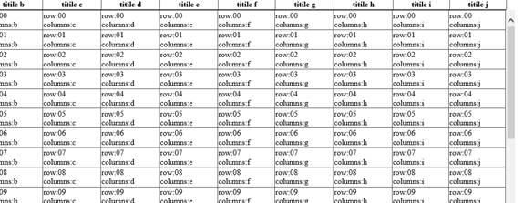

# Fix the position of GridView header
## Requires
- Visual Studio 2012
## License
- Apache License, Version 2.0
## Technologies
- ASP.NET
## Topics
- Controls
- GridView
## Updated
- 06/13/2013
## Description

<h1>How to fix the header of GridView via 
JQuery (CSASPNETFixedHeaderGridView)</h1>
<h2>Introduction</h2>

As we know, GridView usually has many rows with a vertical scroll bar. When users scroll using vertical bar, the header of the GridView will move and disappear. This sample illustrates how to fix the header of GridView via JQuery, and
 this approach can also cross multiple browsers at client side.

<h2>Running the Sample</h2>

Step 1:&nbsp;&nbsp;&nbsp;&nbsp;&nbsp;&nbsp;&nbsp;&nbsp;&nbsp;&nbsp;&nbsp;&nbsp;&nbsp;&nbsp;
Open the CSASPNETFixedHeaderGridView.sln.

Step 2:&nbsp;&nbsp;&nbsp;&nbsp;&nbsp;&nbsp;&nbsp;&nbsp;&nbsp;&nbsp;&nbsp;&nbsp;&nbsp;&nbsp;
Expand the CSASPNETFixedHeaderGridView web application and press Ctrl &#43; F5 to show the Default.aspx page.

Step 3:&nbsp;&nbsp;&nbsp;&nbsp;&nbsp;&nbsp;&nbsp;&nbsp;&nbsp;&nbsp;&nbsp;&nbsp;&nbsp;&nbsp;
You will see a GridView control on the page, please scroll the vertical scroll bar, the header line of the GridView not move with the scroll bar.

Step 4:&nbsp;&nbsp;&nbsp;&nbsp;&nbsp;&nbsp;&nbsp;&nbsp;&nbsp;&nbsp;&nbsp;&nbsp;&nbsp;&nbsp;
Please browser this page with some other browsers, such as Chrome,&nbsp;&nbsp;&nbsp;&nbsp;&nbsp;&nbsp;
FireFox, Safari, etc.

Step 5:&nbsp;&nbsp;&nbsp;&nbsp;&nbsp;&nbsp;&nbsp;&nbsp;&nbsp;&nbsp;&nbsp;&nbsp;&nbsp;&nbsp;
The validation is complete.

<h2>Using the Code</h2>

Step 1:&nbsp;&nbsp;&nbsp;&nbsp;&nbsp;&nbsp;&nbsp;&nbsp;&nbsp;&nbsp;&nbsp;&nbsp;&nbsp;
Create a C# &quot;ASP.NET Empty Web Application&quot; in Visual Studio 2010 or Visual Web Developer 2010. Name it as &quot;CSASPNETFixedHeaderGridView&quot;.

Step 2:&nbsp;&nbsp;&nbsp;&nbsp;&nbsp;&nbsp;&nbsp;&nbsp;&nbsp;&nbsp;&nbsp;&nbsp;&nbsp;
Add one web form and named it as &quot;Default.aspx&quot;.

Step 3:&nbsp;&nbsp;&nbsp;&nbsp;&nbsp;&nbsp;&nbsp;&nbsp;&nbsp;&nbsp;&nbsp;&nbsp;&nbsp;
Create a folder named &quot;JScript&quot; and copy the code of sample file in your JS files. You can also download of them from these websites:&nbsp;&nbsp;&nbsp;&nbsp;&nbsp;&nbsp;&nbsp;&nbsp;&nbsp;&nbsp;&nbsp;&nbsp;
http://docs.jquery.com/Downloading_jQuery&nbsp;&nbsp; &nbsp;&nbsp;&nbsp;&nbsp;&nbsp;&nbsp;&nbsp;&nbsp;&nbsp;&nbsp;&nbsp;&nbsp;&nbsp;&nbsp;
<a href="http://plugins.jquery.com/project/fixedtableheader">http://plugins.jquery.com/project/fixedtableheader</a>

Step 4:&nbsp;&nbsp;&nbsp;&nbsp;&nbsp;&nbsp;&nbsp;&nbsp;&nbsp;&nbsp;&nbsp;&nbsp;&nbsp;
Add a GridView on Default.aspx page, and add create a data table as&nbsp;&nbsp;&nbsp;&nbsp;&nbsp;&nbsp;&nbsp;&nbsp;
GridView's data source. Here we give the code of Default.aspx.cs file.

C#

Edit|Remove

csharp

<pre id="codePreview" class="csharp">
// Define a data table as GridView's data source.
&nbsp;&nbsp;&nbsp;&nbsp;&nbsp;&nbsp;&nbsp;&nbsp;&nbsp;&nbsp;&nbsp; DataTable tab = new DataTable();
&nbsp;&nbsp;&nbsp;&nbsp;&nbsp;&nbsp;&nbsp;&nbsp;&nbsp;&nbsp;&nbsp; tab.Columns.Add(&quot;a&quot;, Type.GetType(&quot;System.String&quot;));
&nbsp;&nbsp;&nbsp;&nbsp;&nbsp;&nbsp;&nbsp;&nbsp;&nbsp;&nbsp;&nbsp; tab.Columns.Add(&quot;b&quot;, Type.GetType(&quot;System.String&quot;));
&nbsp;&nbsp;&nbsp;&nbsp;&nbsp;&nbsp;&nbsp;&nbsp;&nbsp;&nbsp;&nbsp; tab.Columns.Add(&quot;c&quot;, Type.GetType(&quot;System.String&quot;));
&nbsp;&nbsp;&nbsp;&nbsp;&nbsp;&nbsp;&nbsp;&nbsp;&nbsp;&nbsp;&nbsp; tab.Columns.Add(&quot;d&quot;, Type.GetType(&quot;System.String&quot;));
&nbsp;&nbsp;&nbsp;&nbsp;&nbsp;&nbsp;&nbsp;&nbsp;&nbsp;&nbsp;&nbsp; tab.Columns.Add(&quot;e&quot;, Type.GetType(&quot;System.String&quot;));
&nbsp;&nbsp;&nbsp;&nbsp;&nbsp;&nbsp;&nbsp;&nbsp;&nbsp;&nbsp;&nbsp; tab.Columns.Add(&quot;f&quot;, Type.GetType(&quot;System.String&quot;));
&nbsp;&nbsp;&nbsp;&nbsp;&nbsp;&nbsp;&nbsp;&nbsp;&nbsp;&nbsp;&nbsp; tab.Columns.Add(&quot;g&quot;, Type.GetType(&quot;System.String&quot;));
&nbsp;&nbsp;&nbsp;&nbsp;&nbsp;&nbsp;&nbsp;&nbsp;&nbsp;&nbsp;&nbsp; tab.Columns.Add(&quot;h&quot;, Type.GetType(&quot;System.String&quot;));
&nbsp;&nbsp;&nbsp;&nbsp;&nbsp;&nbsp;&nbsp;&nbsp;&nbsp;&nbsp;&nbsp; tab.Columns.Add(&quot;i&quot;, Type.GetType(&quot;System.String&quot;));
&nbsp;&nbsp;&nbsp;&nbsp;&nbsp;&nbsp;&nbsp;&nbsp;&nbsp;&nbsp;&nbsp; tab.Columns.Add(&quot;j&quot;, Type.GetType(&quot;System.String&quot;));
&nbsp;&nbsp;&nbsp;&nbsp;&nbsp;&nbsp;&nbsp;&nbsp;&nbsp;&nbsp;&nbsp; for (int i = 0; i &lt; 35; i&#43;&#43;)
&nbsp;&nbsp;&nbsp;&nbsp;&nbsp;&nbsp;&nbsp;&nbsp;&nbsp;&nbsp;&nbsp; {
&nbsp;&nbsp;&nbsp;&nbsp;&nbsp;&nbsp;&nbsp;&nbsp;&nbsp;&nbsp;&nbsp;&nbsp;&nbsp;&nbsp;&nbsp; DataRow dr = tab.NewRow();
&nbsp;&nbsp;&nbsp;&nbsp;&nbsp;&nbsp;&nbsp;&nbsp;&nbsp;&nbsp;&nbsp;&nbsp;&nbsp;&nbsp;&nbsp; dr[&quot;a&quot;] = string.Format(&quot;row:{0} columns:a&quot;, i.ToString().PadLeft(2,'0'));
&nbsp;&nbsp;&nbsp;&nbsp;&nbsp;&nbsp;&nbsp;&nbsp;&nbsp;&nbsp;&nbsp;&nbsp;&nbsp;&nbsp;&nbsp; dr[&quot;b&quot;] = string.Format(&quot;row:{0} columns:b&quot;, i.ToString().PadLeft(2, '0'));
&nbsp; &nbsp;&nbsp;&nbsp;&nbsp;&nbsp;&nbsp;&nbsp;&nbsp;&nbsp;&nbsp;&nbsp;&nbsp;&nbsp;&nbsp;dr[&quot;c&quot;] = string.Format(&quot;row:{0} columns:c&quot;, i.ToString().PadLeft(2, '0'));
&nbsp;&nbsp;&nbsp;&nbsp;&nbsp;&nbsp;&nbsp;&nbsp;&nbsp;&nbsp;&nbsp;&nbsp;&nbsp;&nbsp;&nbsp; dr[&quot;d&quot;] = string.Format(&quot;row:{0} columns:d&quot;, i.ToString().PadLeft(2, '0'));
&nbsp;&nbsp;&nbsp;&nbsp;&nbsp;&nbsp;&nbsp;&nbsp;&nbsp;&nbsp;&nbsp;&nbsp;&nbsp;&nbsp;&nbsp; dr[&quot;e&quot;] = string.Format(&quot;row:{0} columns:e&quot;, i.ToString().PadLeft(2, '0'));
&nbsp;&nbsp;&nbsp;&nbsp;&nbsp;&nbsp;&nbsp;&nbsp;&nbsp;&nbsp;&nbsp;&nbsp;&nbsp;&nbsp;&nbsp; dr[&quot;f&quot;] = string.Format(&quot;row:{0} columns:f&quot;, i.ToString().PadLeft(2, '0'));
&nbsp;&nbsp;&nbsp;&nbsp;&nbsp;&nbsp;&nbsp;&nbsp;&nbsp;&nbsp;&nbsp;&nbsp;&nbsp;&nbsp;&nbsp; dr[&quot;g&quot;] = string.Format(&quot;row:{0} columns:g&quot;, i.ToString().PadLeft(2, '0'));
&nbsp;&nbsp;&nbsp;&nbsp;&nbsp;&nbsp;&nbsp;&nbsp;&nbsp;&nbsp;&nbsp;&nbsp;&nbsp;&nbsp;&nbsp; dr[&quot;h&quot;] = string.Format(&quot;row:{0} columns:h&quot;, i.ToString().PadLeft(2, '0'));
&nbsp;&nbsp;&nbsp;&nbsp;&nbsp;&nbsp;&nbsp;&nbsp;&nbsp;&nbsp;&nbsp;&nbsp;&nbsp;&nbsp;&nbsp; dr[&quot;i&quot;] = string.Format(&quot;row:{0} columns:i&quot;, i.ToString().PadLeft(2, '0'));
&nbsp;&nbsp;&nbsp;&nbsp;&nbsp;&nbsp;&nbsp;&nbsp;&nbsp;&nbsp;&nbsp;&nbsp;&nbsp;&nbsp;&nbsp; dr[&quot;j&quot;] = string.Format(&quot;row:{0} columns:j&quot;, i.ToString().PadLeft(2, '0'));
&nbsp;&nbsp;&nbsp;&nbsp;&nbsp;&nbsp;&nbsp;&nbsp;&nbsp;&nbsp;&nbsp;&nbsp;&nbsp;&nbsp;&nbsp; tab.Rows.Add(dr);
&nbsp;&nbsp;&nbsp;&nbsp;&nbsp;&nbsp;&nbsp;&nbsp;&nbsp;&nbsp;&nbsp; }

&nbsp;&nbsp;&nbsp;&nbsp;&nbsp;&nbsp;&nbsp;&nbsp;&nbsp;&nbsp;&nbsp; // Data bind method.
&nbsp;&nbsp;&nbsp;&nbsp;&nbsp;&nbsp;&nbsp;&nbsp;&nbsp;&nbsp;&nbsp; gvwList.DataSource = tab;
&nbsp;&nbsp;&nbsp;&nbsp;&nbsp;&nbsp;&nbsp;&nbsp;&nbsp;&nbsp;&nbsp; gvwList.DataBind();

</pre>

&nbsp;

Step 5:&nbsp;&nbsp;&nbsp;&nbsp;&nbsp;&nbsp;&nbsp;&nbsp;&nbsp;&nbsp;&nbsp;&nbsp;&nbsp;
Now we need bind the specifically columns of data table to GridView's columns,&nbsp;&nbsp;&nbsp;&nbsp;&nbsp;&nbsp;&nbsp;
The code of Default.aspx page will be like this:

HTML

Edit|Remove

html

<pre id="codePreview" class="html">
&lt;Columns&gt;
&nbsp;&nbsp;&nbsp;&nbsp;&nbsp;&nbsp;&nbsp;&nbsp;&nbsp;&nbsp;&nbsp;&nbsp; &lt;asp:BoundField DataField=&quot;a&quot; FooterText=&quot;titile a&quot; 
&nbsp;&nbsp;&nbsp;&nbsp;&nbsp;&nbsp;&nbsp;&nbsp;&nbsp;HeaderText=&quot;titile a&quot; /&gt;
&nbsp;&nbsp;&nbsp;&nbsp;&nbsp;&nbsp;&nbsp;&nbsp;&nbsp;&nbsp;&nbsp;&nbsp; &lt;asp:BoundField DataField=&quot;b&quot; FooterText=&quot;titile b&quot; 
&nbsp;&nbsp;&nbsp;&nbsp;&nbsp;&nbsp;&nbsp;&nbsp;&nbsp;HeaderText=&quot;titile b&quot; /&gt;
&nbsp; &nbsp;&nbsp;&nbsp;&nbsp;&nbsp;&nbsp;&nbsp;&nbsp;&nbsp;&nbsp;&nbsp;&lt;asp:BoundField DataField=&quot;c&quot; FooterText=&quot;titile c&quot; 
&nbsp;&nbsp;&nbsp;&nbsp;&nbsp;&nbsp;&nbsp;&nbsp;&nbsp;HeaderText=&quot;titile c&quot; /&gt;
&nbsp;&nbsp;&nbsp;&nbsp;&nbsp;&nbsp;&nbsp;&nbsp;&nbsp;&nbsp;&nbsp;&nbsp; &lt;asp:BoundField DataField=&quot;d&quot; FooterText=&quot;titile d&quot; 
&nbsp;&nbsp;&nbsp;&nbsp;&nbsp;&nbsp;&nbsp;&nbsp;&nbsp;HeaderText=&quot;titile d&quot; /&gt;
&nbsp;&nbsp;&nbsp;&nbsp;&nbsp;&nbsp;&nbsp;&nbsp;&nbsp;&nbsp;&nbsp;&nbsp; &lt;asp:BoundField DataField=&quot;e&quot; FooterText=&quot;titile e&quot; 
&nbsp;&nbsp;&nbsp;&nbsp;&nbsp;&nbsp;&nbsp;&nbsp;&nbsp;HeaderText=&quot;titile e&quot; /&gt;
&nbsp;&nbsp;&nbsp;&nbsp;&nbsp;&nbsp;&nbsp;&nbsp;&nbsp;&nbsp;&nbsp;&nbsp; &lt;asp:BoundField DataField=&quot;f&quot; FooterText=&quot;titile f&quot; 
&nbsp;&nbsp;&nbsp;&nbsp;&nbsp;&nbsp;&nbsp;&nbsp;&nbsp;HeaderText=&quot;titile f&quot; /&gt;
&nbsp;&nbsp;&nbsp;&nbsp;&nbsp;&nbsp;&nbsp;&nbsp;&nbsp;&nbsp;&nbsp;&nbsp; &lt;asp:BoundField DataField=&quot;g&quot; FooterText=&quot;titile g&quot; 
&nbsp;&nbsp;&nbsp;&nbsp;&nbsp;&nbsp;&nbsp;&nbsp;&nbsp;HeaderText=&quot;titile g&quot; /&gt;
&nbsp;&nbsp;&nbsp;&nbsp;&nbsp;&nbsp;&nbsp;&nbsp;&nbsp;&nbsp; &nbsp;&nbsp;&lt;asp:BoundField DataField=&quot;h&quot; FooterText=&quot;titile h&quot; 
&nbsp;&nbsp;&nbsp;&nbsp;&nbsp;&nbsp;&nbsp;&nbsp;&nbsp;HeaderText=&quot;titile h&quot; /&gt;
&nbsp;&nbsp;&nbsp;&nbsp;&nbsp;&nbsp;&nbsp;&nbsp;&nbsp;&nbsp;&nbsp;&nbsp; &lt;asp:BoundField DataField=&quot;i&quot; FooterText=&quot;titile i&quot; 
&nbsp;&nbsp;&nbsp;&nbsp;&nbsp;&nbsp;&nbsp;&nbsp;&nbsp;HeaderText=&quot;titile i&quot; /&gt;
&nbsp;&nbsp;&nbsp;&nbsp;&nbsp;&nbsp;&nbsp;&nbsp;&nbsp;&nbsp;&nbsp;&nbsp; &lt;asp:BoundField DataField=&quot;j&quot; FooterText=&quot;titile j&quot; 
&nbsp;&nbsp;&nbsp;&nbsp;&nbsp;&nbsp;&nbsp;&nbsp;&nbsp;HeaderText=&quot;titile j&quot; /&gt;
&nbsp;&nbsp;&nbsp;&nbsp;&nbsp;&nbsp;&nbsp;&nbsp; &lt;/Columns&gt;

</pre>

&nbsp;

Step 6:&nbsp;&nbsp;&nbsp;&nbsp;&nbsp;&nbsp;&nbsp;&nbsp;&nbsp;&nbsp;&nbsp;&nbsp;&nbsp;
The last of step, involve the JQuery libraries and write the JQuery function to fixed the header of GridView control.The JQuery code will be like this:

JavaScript

Edit|Remove

js

<pre id="codePreview" class="js">
&lt;script src=&quot;JScript/jquery-1.4.4.min.js&quot; type=&quot;text/javascript&quot;&gt;&lt;/script&gt;
&nbsp;&nbsp;&nbsp;&nbsp;&nbsp;&nbsp;&nbsp;&nbsp;&nbsp;&nbsp; &lt;script src=&quot;JScript/ScrollableGridPlugin.js&quot; type=&quot;text/javascript&quot;&gt;&lt;/script&gt;
&nbsp;&nbsp;&nbsp;&nbsp;&nbsp;&nbsp;&nbsp;&nbsp;&nbsp;&nbsp; &lt;script type = &quot;text/javascript&quot;&gt;
&nbsp;&nbsp;&nbsp;&nbsp;&nbsp;&nbsp;&nbsp;&nbsp;&nbsp;&nbsp;&nbsp;&nbsp;&nbsp;&nbsp; $(document).ready(function () {
&nbsp;&nbsp;&nbsp;&nbsp;&nbsp;&nbsp;&nbsp;&nbsp;&nbsp;&nbsp;&nbsp; &nbsp;&nbsp;&nbsp;&nbsp;&nbsp;&nbsp;&nbsp;//Invoke Scrollable function.
&nbsp;&nbsp;&nbsp;&nbsp;&nbsp;&nbsp;&nbsp;&nbsp;&nbsp;&nbsp;&nbsp;&nbsp;&nbsp;&nbsp;&nbsp;&nbsp;&nbsp;&nbsp; $('#&lt;%=gvwList.ClientID %&gt;').Scrollable({
&nbsp;&nbsp;&nbsp;&nbsp;&nbsp;&nbsp;&nbsp;&nbsp;&nbsp;&nbsp;&nbsp;&nbsp;&nbsp;&nbsp;&nbsp;&nbsp;&nbsp;&nbsp; ScrollHeight: 600,&nbsp;&nbsp;&nbsp;&nbsp;&nbsp;&nbsp;&nbsp; 
&nbsp;&nbsp;&nbsp;&nbsp;&nbsp;&nbsp;&nbsp;&nbsp;&nbsp;&nbsp;&nbsp;&nbsp;&nbsp;&nbsp;&nbsp;&nbsp;&nbsp;&nbsp;&nbsp;});
&nbsp;&nbsp;&nbsp;&nbsp;&nbsp;&nbsp;&nbsp;&nbsp;&nbsp;&nbsp;&nbsp;&nbsp;&nbsp;&nbsp; });

&nbsp;&nbsp;&nbsp;&nbsp;&nbsp;&nbsp;&nbsp;&nbsp;&nbsp;&nbsp; &lt;/script&gt;

</pre>

&nbsp;

Step 7:&nbsp;&nbsp;&nbsp;&nbsp;&nbsp;&nbsp;&nbsp;&nbsp;&nbsp;&nbsp;&nbsp;&nbsp;&nbsp;
Build the application and you can debug it.

<h2>More Information</h2>

MSDN: JQuery 
<a href="http://wiki.asp.net/page.aspx/1047/jquery/">http://wiki.asp.net/page.aspx/1047/jquery/</a> 
MSDN: GridView Class 
<a href="http://msdn.microsoft.com/en-us/library/system.web.ui.webcontrols.gridview.aspx">http://msdn.microsoft.com/en-us/library/system.web.ui.webcontrols.gridview.aspx</a>

