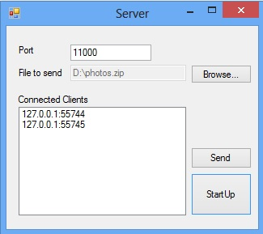
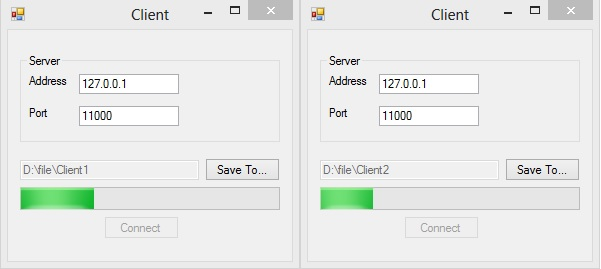
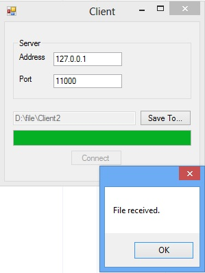

# Fixed size large file transfer with asynchrony sockets in NET
## Requires
- Visual Studio 2012
## License
- Apache License, Version 2.0
## Technologies
- Networking
- Windows Desktop App Development
## Topics
- Socket
## Updated
- 06/13/2013
## Description

<b style="">How to transfer large size file by using asynchronous Sockets API in .NET</b><b>
 (CSSocketTransferFile)</b>

<b>Introduction
</b>

​The sample demonstrates how to transfer large size
 file
with asynchronous sockets API in .NET. In a typical .NET application, we
 can use POST methods to transfer files in a
HTTPRequest
 message, but with request body size limit.
Instead, .NET Socket API provides us an elegant and asynchronous way to transfer large files between the client and server.
In this sample, you will see large data are pushed from server to the clients by using BeginSend, BeginReceive methods of the .NET Socket class.

<b>Running the Sample
</b>

1． 
Open this sample in Microsoft Visual Studio and build the solution.

2．
After you successfully build the sample project in Microsoft Visual Studio, you will get Server.exe under the .\CSSocketTransferFile\Server\bin\Debug folder and Client.exe under the .\CSSocketTransferFile\Client\bin\Debug
 folder. Server.exe is responsible for sending files to the client, while Client.exe will receive the file transferred from the server.

3． 
Launch Server.exe, specify a valid TCP port in the Port TextBox.

4． 
Click &quot;Browse…&quot; button to select a file to be used to transfer.

5． 
Click &quot;StartUp&quot; button to let the server listen to the 
specified Port.

6． 
When you click &quot;StartUp&quot; button to start the server, the system will show a Windows Security Alert dialog, please select a network and click the &quot;Allow access&quot; button.

7．
Launch multiple clients and specify the IP Address (this
 example uses the Ipv4 protocol) and port of the server
 and then click the &quot;Save To…&quot; button to select a directory used to store the file received from the server.

8．
Click the Connect button to connect to the specified server.

9．
Select the clients you want to send the file on the lbxServer and then click the Send button on the Server form to send the file from the server to clients.

&nbsp;

10.&nbsp;&nbsp;
&nbsp;&nbsp;Send Completely.

<b>Using the Code
</b>

1.
Asynchronously communicate with
Server 
by using BeginConnect method of the Socket object.

C#

Edit|Remove

csharp
<pre class="hidden">
/// &lt;summary&gt;
 /// Start connect to the server.
 /// &lt;/summary&gt;
 public static void StartClient()
 {
&nbsp;&nbsp;&nbsp;&nbsp; connected = false;
&nbsp;&nbsp;&nbsp;&nbsp; if (IpAddress == null)
&nbsp;&nbsp;&nbsp;&nbsp; {
&nbsp;&nbsp;&nbsp;&nbsp;&nbsp;&nbsp;&nbsp;&nbsp; MessageBox.Show(Properties.Resources.InvalidAddressMsg);
&nbsp;&nbsp;&nbsp;&nbsp;&nbsp;&nbsp;&nbsp;&nbsp; return;
&nbsp;&nbsp;&nbsp;&nbsp; }

&nbsp;&nbsp;&nbsp;&nbsp; IPEndPoint remoteEP = new IPEndPoint(IpAddress, Port);

&nbsp;&nbsp;&nbsp;&nbsp; // Use IPv4 as the network protocol,if you want to support IPV6 protocol, you can update here.
&nbsp;&nbsp;&nbsp;&nbsp; Socket clientSocket = new Socket(AddressFamily.InterNetwork, SocketType.Stream, ProtocolType.Tcp);

&nbsp;&nbsp;&nbsp;&nbsp; // Begin to connect the server.
&nbsp;&nbsp;&nbsp;&nbsp; clientSocket.BeginConnect(remoteEP, new AsyncCallback(ConnectCallback), clientSocket);
&nbsp;&nbsp;&nbsp;&nbsp; connectDone.WaitOne();

&nbsp;&nbsp;&nbsp;&nbsp; if (connected)
&nbsp;&nbsp;&nbsp;&nbsp; {
&nbsp;&nbsp;&nbsp;&nbsp;&nbsp;&nbsp;&nbsp;&nbsp; // Begin to receive the file after connecting to server successfully.
&nbsp;&nbsp;&nbsp;&nbsp;&nbsp;&nbsp;&nbsp;&nbsp; Receive(clientSocket);
&nbsp;&nbsp;&nbsp;&nbsp;&nbsp;&nbsp;&nbsp;&nbsp; receiveDone.WaitOne();

&nbsp;&nbsp;&nbsp;&nbsp;&nbsp;&nbsp;&nbsp;&nbsp; // Notify the user whether receive the file completely.
&nbsp;&nbsp;&nbsp;&nbsp;&nbsp;&nbsp;&nbsp;&nbsp; Client.BeginInvoke(new FileReceiveDoneHandler(Client.FileReceiveDone));

&nbsp;&nbsp;&nbsp;&nbsp;&nbsp;&nbsp;&nbsp;&nbsp; // Close the socket.
&nbsp;&nbsp;&nbsp;&nbsp;&nbsp;&nbsp;&nbsp;&nbsp; clientSocket.Shutdown(SocketShutdown.Both);
&nbsp;&nbsp;&nbsp;&nbsp;&nbsp;&nbsp;&nbsp;&nbsp; clientSocket.Close();
&nbsp;&nbsp;&nbsp;&nbsp; }
&nbsp;&nbsp;&nbsp;&nbsp; else
&nbsp;&nbsp;&nbsp;&nbsp; {
&nbsp;&nbsp;&nbsp;&nbsp;&nbsp;&nbsp;&nbsp;&nbsp; Thread.CurrentThread.Abort();
&nbsp;&nbsp;&nbsp;&nbsp; }
 }

</pre>
<pre id="codePreview" class="csharp">
/// &lt;summary&gt;
 /// Start connect to the server.
 /// &lt;/summary&gt;
 public static void StartClient()
 {
&nbsp;&nbsp;&nbsp;&nbsp; connected = false;
&nbsp;&nbsp;&nbsp;&nbsp; if (IpAddress == null)
&nbsp;&nbsp;&nbsp;&nbsp; {
&nbsp;&nbsp;&nbsp;&nbsp;&nbsp;&nbsp;&nbsp;&nbsp; MessageBox.Show(Properties.Resources.InvalidAddressMsg);
&nbsp;&nbsp;&nbsp;&nbsp;&nbsp;&nbsp;&nbsp;&nbsp; return;
&nbsp;&nbsp;&nbsp;&nbsp; }

&nbsp;&nbsp;&nbsp;&nbsp; IPEndPoint remoteEP = new IPEndPoint(IpAddress, Port);

&nbsp;&nbsp;&nbsp;&nbsp; // Use IPv4 as the network protocol,if you want to support IPV6 protocol, you can update here.
&nbsp;&nbsp;&nbsp;&nbsp; Socket clientSocket = new Socket(AddressFamily.InterNetwork, SocketType.Stream, ProtocolType.Tcp);

&nbsp;&nbsp;&nbsp;&nbsp; // Begin to connect the server.
&nbsp;&nbsp;&nbsp;&nbsp; clientSocket.BeginConnect(remoteEP, new AsyncCallback(ConnectCallback), clientSocket);
&nbsp;&nbsp;&nbsp;&nbsp; connectDone.WaitOne();

&nbsp;&nbsp;&nbsp;&nbsp; if (connected)
&nbsp;&nbsp;&nbsp;&nbsp; {
&nbsp;&nbsp;&nbsp;&nbsp;&nbsp;&nbsp;&nbsp;&nbsp; // Begin to receive the file after connecting to server successfully.
&nbsp;&nbsp;&nbsp;&nbsp;&nbsp;&nbsp;&nbsp;&nbsp; Receive(clientSocket);
&nbsp;&nbsp;&nbsp;&nbsp;&nbsp;&nbsp;&nbsp;&nbsp; receiveDone.WaitOne();

&nbsp;&nbsp;&nbsp;&nbsp;&nbsp;&nbsp;&nbsp;&nbsp; // Notify the user whether receive the file completely.
&nbsp;&nbsp;&nbsp;&nbsp;&nbsp;&nbsp;&nbsp;&nbsp; Client.BeginInvoke(new FileReceiveDoneHandler(Client.FileReceiveDone));

&nbsp;&nbsp;&nbsp;&nbsp;&nbsp;&nbsp;&nbsp;&nbsp; // Close the socket.
&nbsp;&nbsp;&nbsp;&nbsp;&nbsp;&nbsp;&nbsp;&nbsp; clientSocket.Shutdown(SocketShutdown.Both);
&nbsp;&nbsp;&nbsp;&nbsp;&nbsp;&nbsp;&nbsp;&nbsp; clientSocket.Close();
&nbsp;&nbsp;&nbsp;&nbsp; }
&nbsp;&nbsp;&nbsp;&nbsp; else
&nbsp;&nbsp;&nbsp;&nbsp; {
&nbsp;&nbsp;&nbsp;&nbsp;&nbsp;&nbsp;&nbsp;&nbsp; Thread.CurrentThread.Abort();
&nbsp;&nbsp;&nbsp;&nbsp; }
 }

</pre>

&nbsp;

2.
Asynchronously communicate with
Server 
by using BeginReceive method of the Socket object.

C#

Edit|Remove

csharp
<pre class="hidden">
/// &lt;summary&gt;
 /// Receive the file send by the server.
 /// &lt;/summary&gt;
 /// &lt;param name=&quot;clientSocket&quot;&gt;&lt;/param&gt;
 private static void Receive(Socket clientSocket)
 {
&nbsp;&nbsp;&nbsp;&nbsp; StateObject state = new StateObject();
&nbsp;&nbsp;&nbsp;&nbsp; state.WorkSocket = clientSocket;

&nbsp;&nbsp;&nbsp;&nbsp; ReceiveFileInfo(clientSocket);

&nbsp;&nbsp;&nbsp;&nbsp; int progressLen = checked((int)(fileLen / StateObject.BufferSize &#43; 1));
&nbsp;&nbsp;&nbsp;&nbsp; object[] length = new object[1];
&nbsp;&nbsp;&nbsp;&nbsp; length[0] = progressLen;
&nbsp;&nbsp;&nbsp;&nbsp; Client.BeginInvoke(new SetProgressLengthHandler(Client.SetProgressLength), length);

&nbsp;&nbsp;&nbsp;&nbsp; // Begin to receive the file from the server.
&nbsp;&nbsp;&nbsp;&nbsp; try
&nbsp;&nbsp;&nbsp;&nbsp; {
&nbsp;&nbsp;&nbsp;&nbsp;&nbsp;&nbsp;&nbsp;&nbsp; clientSocket.BeginReceive(state.Buffer, 0, StateObject.BufferSize, 0, new AsyncCallback(ReceiveCallback), state);
&nbsp;&nbsp;&nbsp;&nbsp; }
&nbsp;&nbsp;&nbsp;&nbsp; catch
&nbsp;&nbsp;&nbsp;&nbsp; {
&nbsp;&nbsp;&nbsp;&nbsp;&nbsp;&nbsp;&nbsp;&nbsp; if (!clientSocket.Connected)
&nbsp;&nbsp;&nbsp;&nbsp;&nbsp;&nbsp;&nbsp;&nbsp; {
&nbsp;&nbsp;&nbsp;&nbsp;&nbsp;&nbsp;&nbsp;&nbsp;&nbsp;&nbsp;&nbsp;&nbsp; HandleDisconnectException();
&nbsp;&nbsp;&nbsp;&nbsp;&nbsp;&nbsp;&nbsp;&nbsp; }
&nbsp;&nbsp;&nbsp;&nbsp; }
 }

</pre>
<pre id="codePreview" class="csharp">
/// &lt;summary&gt;
 /// Receive the file send by the server.
 /// &lt;/summary&gt;
 /// &lt;param name=&quot;clientSocket&quot;&gt;&lt;/param&gt;
 private static void Receive(Socket clientSocket)
 {
&nbsp;&nbsp;&nbsp;&nbsp; StateObject state = new StateObject();
&nbsp;&nbsp;&nbsp;&nbsp; state.WorkSocket = clientSocket;

&nbsp;&nbsp;&nbsp;&nbsp; ReceiveFileInfo(clientSocket);

&nbsp;&nbsp;&nbsp;&nbsp; int progressLen = checked((int)(fileLen / StateObject.BufferSize &#43; 1));
&nbsp;&nbsp;&nbsp;&nbsp; object[] length = new object[1];
&nbsp;&nbsp;&nbsp;&nbsp; length[0] = progressLen;
&nbsp;&nbsp;&nbsp;&nbsp; Client.BeginInvoke(new SetProgressLengthHandler(Client.SetProgressLength), length);

&nbsp;&nbsp;&nbsp;&nbsp; // Begin to receive the file from the server.
&nbsp;&nbsp;&nbsp;&nbsp; try
&nbsp;&nbsp;&nbsp;&nbsp; {
&nbsp;&nbsp;&nbsp;&nbsp;&nbsp;&nbsp;&nbsp;&nbsp; clientSocket.BeginReceive(state.Buffer, 0, StateObject.BufferSize, 0, new AsyncCallback(ReceiveCallback), state);
&nbsp;&nbsp;&nbsp;&nbsp; }
&nbsp;&nbsp;&nbsp;&nbsp; catch
&nbsp;&nbsp;&nbsp;&nbsp; {
&nbsp;&nbsp;&nbsp;&nbsp;&nbsp;&nbsp;&nbsp;&nbsp; if (!clientSocket.Connected)
&nbsp;&nbsp;&nbsp;&nbsp;&nbsp;&nbsp;&nbsp;&nbsp; {
&nbsp;&nbsp;&nbsp;&nbsp;&nbsp;&nbsp;&nbsp;&nbsp;&nbsp;&nbsp;&nbsp;&nbsp; HandleDisconnectException();
&nbsp;&nbsp;&nbsp;&nbsp;&nbsp;&nbsp;&nbsp;&nbsp; }
&nbsp;&nbsp;&nbsp;&nbsp; }
 }

</pre>

&nbsp;

3. For the large size file, we can't get the entire file at once. For this case we can
iteratively
call
the BeginReceive method in the Callback function of the BeginReceive.

C#

Edit|Remove

csharp
<pre class="hidden">
private static void ReceiveCallback(IAsyncResult ar)
 {
&nbsp;&nbsp;&nbsp;&nbsp; StateObject state = (StateObject)ar.AsyncState;
&nbsp;&nbsp;&nbsp;&nbsp; Socket clientSocket = state.WorkSocket;
&nbsp;&nbsp;&nbsp;&nbsp; BinaryWriter writer;

&nbsp;&nbsp;&nbsp;&nbsp; int bytesRead = clientSocket.EndReceive(ar);
&nbsp;&nbsp;&nbsp; &nbsp;if (bytesRead &gt; 0)
&nbsp;&nbsp;&nbsp;&nbsp; {
&nbsp;&nbsp;&nbsp;&nbsp;&nbsp;&nbsp;&nbsp;&nbsp; //If the file doesn't exist, create a file with the filename got from server. If the file exists, append to the file.
&nbsp;&nbsp;&nbsp;&nbsp;&nbsp;&nbsp;&nbsp;&nbsp; if (!File.Exists(fileSavePath))
&nbsp;&nbsp;&nbsp;&nbsp;&nbsp;&nbsp;&nbsp;&nbsp; {
&nbsp;&nbsp;&nbsp;&nbsp;&nbsp;&nbsp;&nbsp;&nbsp;&nbsp;&nbsp;&nbsp;&nbsp; writer = new BinaryWriter(File.Open(fileSavePath, FileMode.Create));
&nbsp;&nbsp;&nbsp;&nbsp;&nbsp;&nbsp;&nbsp;&nbsp; }
&nbsp;&nbsp;&nbsp;&nbsp;&nbsp;&nbsp;&nbsp;&nbsp; else
&nbsp;&nbsp;&nbsp;&nbsp;&nbsp;&nbsp;&nbsp;&nbsp; {
&nbsp;&nbsp;&nbsp;&nbsp;&nbsp;&nbsp;&nbsp;&nbsp;&nbsp;&nbsp;&nbsp;&nbsp; writer = new BinaryWriter(File.Open(fileSavePath, FileMode.Append));
&nbsp;&nbsp;&nbsp;&nbsp;&nbsp;&nbsp;&nbsp;&nbsp; }

&nbsp;&nbsp;&nbsp;&nbsp;&nbsp;&nbsp;&nbsp;&nbsp; writer.Write(state.Buffer, 0, bytesRead);
&nbsp;&nbsp;&nbsp;&nbsp;&nbsp;&nbsp;&nbsp;&nbsp; writer.Flush();
&nbsp;&nbsp;&nbsp;&nbsp;&nbsp;&nbsp;&nbsp;&nbsp; writer.Close();

&nbsp;&nbsp;&nbsp;&nbsp;&nbsp;&nbsp;&nbsp;&nbsp; // Notify the progressBar to change the position.
&nbsp;&nbsp;&nbsp;&nbsp;&nbsp;&nbsp;&nbsp;&nbsp; Client.BeginInvoke(new ProgressChangeHandler(Client.ProgressChanged));

&nbsp;&nbsp;&nbsp;&nbsp;&nbsp;&nbsp;&nbsp;&nbsp; // Recursively receive the rest file.
&nbsp;&nbsp;&nbsp;&nbsp;&nbsp;&nbsp;&nbsp;&nbsp; try
&nbsp;&nbsp;&nbsp;&nbsp;&nbsp;&nbsp;&nbsp;&nbsp; {
&nbsp;&nbsp;&nbsp;&nbsp;&nbsp;&nbsp;&nbsp;&nbsp;&nbsp;&nbsp;&nbsp;&nbsp; clientSocket.BeginReceive(state.Buffer, 0, StateObject.BufferSize, 0, new AsyncCallback(ReceiveCallback), state);
&nbsp;&nbsp;&nbsp;&nbsp;&nbsp;&nbsp;&nbsp;&nbsp; }
&nbsp;&nbsp;&nbsp;&nbsp;&nbsp;&nbsp;&nbsp;&nbsp; catch
&nbsp;&nbsp;&nbsp;&nbsp;&nbsp;&nbsp;&nbsp;&nbsp; {
&nbsp;&nbsp;&nbsp;&nbsp;&nbsp;&nbsp;&nbsp;&nbsp;&nbsp;&nbsp;&nbsp;&nbsp; if (!clientSocket.Connected)
&nbsp;&nbsp;&nbsp;&nbsp;&nbsp;&nbsp;&nbsp;&nbsp;&nbsp;&nbsp;&nbsp;&nbsp; {
&nbsp;&nbsp;&nbsp;&nbsp;&nbsp;&nbsp;&nbsp;&nbsp;&nbsp;&nbsp;&nbsp;&nbsp;&nbsp;&nbsp;&nbsp;&nbsp; MessageBox.Show(Properties.Resources.DisconnectMsg);
&nbsp;&nbsp;&nbsp;&nbsp;&nbsp;&nbsp;&nbsp;&nbsp;&nbsp;&nbsp;&nbsp;&nbsp; }
&nbsp;&nbsp;&nbsp;&nbsp;&nbsp;&nbsp;&nbsp;&nbsp; }
&nbsp;&nbsp;&nbsp;&nbsp; }
&nbsp;&nbsp;&nbsp;&nbsp; else
&nbsp;&nbsp;&nbsp;&nbsp; {
&nbsp;&nbsp;&nbsp;&nbsp;&nbsp;&nbsp;&nbsp;&nbsp; // Signal if all the file received.
&nbsp;&nbsp;&nbsp;&nbsp;&nbsp;&nbsp;&nbsp;&nbsp; receiveDone.Set();
&nbsp;&nbsp;&nbsp;&nbsp; }
 }

</pre>
<pre id="codePreview" class="csharp">
private static void ReceiveCallback(IAsyncResult ar)
 {
&nbsp;&nbsp;&nbsp;&nbsp; StateObject state = (StateObject)ar.AsyncState;
&nbsp;&nbsp;&nbsp;&nbsp; Socket clientSocket = state.WorkSocket;
&nbsp;&nbsp;&nbsp;&nbsp; BinaryWriter writer;

&nbsp;&nbsp;&nbsp;&nbsp; int bytesRead = clientSocket.EndReceive(ar);
&nbsp;&nbsp;&nbsp; &nbsp;if (bytesRead &gt; 0)
&nbsp;&nbsp;&nbsp;&nbsp; {
&nbsp;&nbsp;&nbsp;&nbsp;&nbsp;&nbsp;&nbsp;&nbsp; //If the file doesn't exist, create a file with the filename got from server. If the file exists, append to the file.
&nbsp;&nbsp;&nbsp;&nbsp;&nbsp;&nbsp;&nbsp;&nbsp; if (!File.Exists(fileSavePath))
&nbsp;&nbsp;&nbsp;&nbsp;&nbsp;&nbsp;&nbsp;&nbsp; {
&nbsp;&nbsp;&nbsp;&nbsp;&nbsp;&nbsp;&nbsp;&nbsp;&nbsp;&nbsp;&nbsp;&nbsp; writer = new BinaryWriter(File.Open(fileSavePath, FileMode.Create));
&nbsp;&nbsp;&nbsp;&nbsp;&nbsp;&nbsp;&nbsp;&nbsp; }
&nbsp;&nbsp;&nbsp;&nbsp;&nbsp;&nbsp;&nbsp;&nbsp; else
&nbsp;&nbsp;&nbsp;&nbsp;&nbsp;&nbsp;&nbsp;&nbsp; {
&nbsp;&nbsp;&nbsp;&nbsp;&nbsp;&nbsp;&nbsp;&nbsp;&nbsp;&nbsp;&nbsp;&nbsp; writer = new BinaryWriter(File.Open(fileSavePath, FileMode.Append));
&nbsp;&nbsp;&nbsp;&nbsp;&nbsp;&nbsp;&nbsp;&nbsp; }

&nbsp;&nbsp;&nbsp;&nbsp;&nbsp;&nbsp;&nbsp;&nbsp; writer.Write(state.Buffer, 0, bytesRead);
&nbsp;&nbsp;&nbsp;&nbsp;&nbsp;&nbsp;&nbsp;&nbsp; writer.Flush();
&nbsp;&nbsp;&nbsp;&nbsp;&nbsp;&nbsp;&nbsp;&nbsp; writer.Close();

&nbsp;&nbsp;&nbsp;&nbsp;&nbsp;&nbsp;&nbsp;&nbsp; // Notify the progressBar to change the position.
&nbsp;&nbsp;&nbsp;&nbsp;&nbsp;&nbsp;&nbsp;&nbsp; Client.BeginInvoke(new ProgressChangeHandler(Client.ProgressChanged));

&nbsp;&nbsp;&nbsp;&nbsp;&nbsp;&nbsp;&nbsp;&nbsp; // Recursively receive the rest file.
&nbsp;&nbsp;&nbsp;&nbsp;&nbsp;&nbsp;&nbsp;&nbsp; try
&nbsp;&nbsp;&nbsp;&nbsp;&nbsp;&nbsp;&nbsp;&nbsp; {
&nbsp;&nbsp;&nbsp;&nbsp;&nbsp;&nbsp;&nbsp;&nbsp;&nbsp;&nbsp;&nbsp;&nbsp; clientSocket.BeginReceive(state.Buffer, 0, StateObject.BufferSize, 0, new AsyncCallback(ReceiveCallback), state);
&nbsp;&nbsp;&nbsp;&nbsp;&nbsp;&nbsp;&nbsp;&nbsp; }
&nbsp;&nbsp;&nbsp;&nbsp;&nbsp;&nbsp;&nbsp;&nbsp; catch
&nbsp;&nbsp;&nbsp;&nbsp;&nbsp;&nbsp;&nbsp;&nbsp; {
&nbsp;&nbsp;&nbsp;&nbsp;&nbsp;&nbsp;&nbsp;&nbsp;&nbsp;&nbsp;&nbsp;&nbsp; if (!clientSocket.Connected)
&nbsp;&nbsp;&nbsp;&nbsp;&nbsp;&nbsp;&nbsp;&nbsp;&nbsp;&nbsp;&nbsp;&nbsp; {
&nbsp;&nbsp;&nbsp;&nbsp;&nbsp;&nbsp;&nbsp;&nbsp;&nbsp;&nbsp;&nbsp;&nbsp;&nbsp;&nbsp;&nbsp;&nbsp; MessageBox.Show(Properties.Resources.DisconnectMsg);
&nbsp;&nbsp;&nbsp;&nbsp;&nbsp;&nbsp;&nbsp;&nbsp;&nbsp;&nbsp;&nbsp;&nbsp; }
&nbsp;&nbsp;&nbsp;&nbsp;&nbsp;&nbsp;&nbsp;&nbsp; }
&nbsp;&nbsp;&nbsp;&nbsp; }
&nbsp;&nbsp;&nbsp;&nbsp; else
&nbsp;&nbsp;&nbsp;&nbsp; {
&nbsp;&nbsp;&nbsp;&nbsp;&nbsp;&nbsp;&nbsp;&nbsp; // Signal if all the file received.
&nbsp;&nbsp;&nbsp;&nbsp;&nbsp;&nbsp;&nbsp;&nbsp; receiveDone.Set();
&nbsp;&nbsp;&nbsp;&nbsp; }
 }

</pre>

&nbsp;

4.
Asynchronously communicate with
Client 
by using BeginAccept method of the Socket object.

C#

Edit|Remove

csharp
<pre class="hidden">
/// &lt;summary&gt;
/// Server start to listen the client connection.
/// &lt;/summary&gt;
public static void StartListening()
{
&nbsp;&nbsp;&nbsp; IPEndPoint localEndPoint = new IPEndPoint(IPAddress.Any, port);

&nbsp;&nbsp;&nbsp; // Use IPv4 as the network protocol,if you want to support IPV6 protocol, you can update here.
&nbsp;&nbsp;&nbsp; Socket listener = new Socket(AddressFamily.InterNetwork, SocketType.Stream, ProtocolType.Tcp);

&nbsp;&nbsp;&nbsp; try
&nbsp;&nbsp;&nbsp; {
&nbsp;&nbsp;&nbsp;&nbsp;&nbsp;&nbsp;&nbsp; listener.Bind(localEndPoint);
&nbsp;&nbsp;&nbsp; }
&nbsp;&nbsp;&nbsp; catch (SocketException ex)
&nbsp;&nbsp;&nbsp; {
&nbsp;&nbsp;&nbsp;&nbsp;&nbsp;&nbsp;&nbsp; MessageBox.Show(ex.Message);
&nbsp;&nbsp;&nbsp;&nbsp;&nbsp;&nbsp;&nbsp; return;
&nbsp;&nbsp;&nbsp; }

&nbsp;&nbsp;&nbsp; listener.Listen(c_clientSockets);

&nbsp;&nbsp;&nbsp; //loop listening the client.
&nbsp;&nbsp;&nbsp; while (true)
&nbsp;&nbsp;&nbsp; {
&nbsp;&nbsp;&nbsp;&nbsp;&nbsp;&nbsp;&nbsp; allDone.Reset();
&nbsp;&nbsp;&nbsp;&nbsp;&nbsp;&nbsp;&nbsp; listener.BeginAccept(new AsyncCallback(AcceptCallback), listener);
&nbsp;&nbsp;&nbsp;&nbsp;&nbsp;&nbsp;&nbsp; allDone.WaitOne();
&nbsp;&nbsp;&nbsp; }
}

</pre>
<pre id="codePreview" class="csharp">
/// &lt;summary&gt;
/// Server start to listen the client connection.
/// &lt;/summary&gt;
public static void StartListening()
{
&nbsp;&nbsp;&nbsp; IPEndPoint localEndPoint = new IPEndPoint(IPAddress.Any, port);

&nbsp;&nbsp;&nbsp; // Use IPv4 as the network protocol,if you want to support IPV6 protocol, you can update here.
&nbsp;&nbsp;&nbsp; Socket listener = new Socket(AddressFamily.InterNetwork, SocketType.Stream, ProtocolType.Tcp);

&nbsp;&nbsp;&nbsp; try
&nbsp;&nbsp;&nbsp; {
&nbsp;&nbsp;&nbsp;&nbsp;&nbsp;&nbsp;&nbsp; listener.Bind(localEndPoint);
&nbsp;&nbsp;&nbsp; }
&nbsp;&nbsp;&nbsp; catch (SocketException ex)
&nbsp;&nbsp;&nbsp; {
&nbsp;&nbsp;&nbsp;&nbsp;&nbsp;&nbsp;&nbsp; MessageBox.Show(ex.Message);
&nbsp;&nbsp;&nbsp;&nbsp;&nbsp;&nbsp;&nbsp; return;
&nbsp;&nbsp;&nbsp; }

&nbsp;&nbsp;&nbsp; listener.Listen(c_clientSockets);

&nbsp;&nbsp;&nbsp; //loop listening the client.
&nbsp;&nbsp;&nbsp; while (true)
&nbsp;&nbsp;&nbsp; {
&nbsp;&nbsp;&nbsp;&nbsp;&nbsp;&nbsp;&nbsp; allDone.Reset();
&nbsp;&nbsp;&nbsp;&nbsp;&nbsp;&nbsp;&nbsp; listener.BeginAccept(new AsyncCallback(AcceptCallback), listener);
&nbsp;&nbsp;&nbsp;&nbsp;&nbsp;&nbsp;&nbsp; allDone.WaitOne();
&nbsp;&nbsp;&nbsp; }
}

</pre>

&nbsp;

&nbsp;5.
Asynchronously communicate with
Client 
by using
BeginSend method of the Socket object. For the large sized file, we can't read it to the memory at once, so we
 can Blocking read file and send to the clients.

C#

Edit|Remove

csharp
<pre class="hidden">
// Blocking read file and send to the clients asynchronously.
using (FileStream stream = new FileStream(FileToSend, FileMode.Open))
{
&nbsp;&nbsp;&nbsp; do
&nbsp;&nbsp;&nbsp; {
&nbsp;&nbsp;&nbsp;&nbsp;&nbsp;&nbsp;&nbsp; sendDone.Reset();
&nbsp;&nbsp;&nbsp;&nbsp;&nbsp;&nbsp;&nbsp; signal = 0;
&nbsp;&nbsp;&nbsp;&nbsp;&nbsp;&nbsp;&nbsp; stream.Flush();
&nbsp;&nbsp;&nbsp;&nbsp;&nbsp;&nbsp;&nbsp; readBytes = stream.Read(buffer,0,c_bufferSize);

&nbsp;&nbsp;&nbsp;&nbsp;&nbsp;&nbsp;&nbsp; if (ClientsToSend.Count == 0)
&nbsp;&nbsp;&nbsp;&nbsp;&nbsp;&nbsp;&nbsp; {
&nbsp;&nbsp;&nbsp;&nbsp;&nbsp;&nbsp;&nbsp;&nbsp;&nbsp;&nbsp;&nbsp; sendDone.Set();
&nbsp;&nbsp;&nbsp;&nbsp;&nbsp;&nbsp;&nbsp; }

&nbsp;&nbsp;&nbsp;&nbsp;&nbsp;&nbsp;&nbsp; foreach (KeyValuePair&lt;Socket,IPEndPoint&gt; kvp in ClientsToSend)
&nbsp;&nbsp;&nbsp;&nbsp;&nbsp;&nbsp;&nbsp; {
&nbsp;&nbsp;&nbsp;&nbsp;&nbsp;&nbsp;&nbsp;&nbsp;&nbsp;&nbsp;&nbsp; Socket handler = kvp.Key;
 &nbsp;&nbsp;&nbsp;&nbsp;&nbsp;&nbsp;&nbsp;&nbsp;&nbsp;&nbsp;&nbsp;IPEndPoint ipEndPoint = kvp.Value;
&nbsp;&nbsp;&nbsp;&nbsp;&nbsp;&nbsp;&nbsp;&nbsp;&nbsp;&nbsp;&nbsp; try
&nbsp;&nbsp;&nbsp;&nbsp;&nbsp;&nbsp;&nbsp;&nbsp;&nbsp;&nbsp;&nbsp; {
&nbsp;&nbsp;&nbsp;&nbsp;&nbsp;&nbsp;&nbsp;&nbsp;&nbsp;&nbsp;&nbsp;&nbsp;&nbsp;&nbsp;&nbsp; handler.BeginSend(buffer, 0, readBytes, SocketFlags.None, new AsyncCallback(SendCallback), handler);
&nbsp;&nbsp;&nbsp;&nbsp;&nbsp;&nbsp;&nbsp;&nbsp;&nbsp;&nbsp;&nbsp; }
&nbsp;&nbsp;&nbsp;&nbsp;&nbsp;&nbsp;&nbsp;&nbsp;&nbsp;&nbsp;&nbsp; catch
&nbsp;&nbsp;&nbsp;&nbsp;&nbsp;&nbsp;&nbsp;&nbsp;&nbsp;&nbsp;&nbsp; {
&nbsp;&nbsp;&nbsp;&nbsp;&nbsp;&nbsp;&nbsp;&nbsp;&nbsp;&nbsp;&nbsp;&nbsp;&nbsp;&nbsp;&nbsp; if (!handler.Connected)
&nbsp;&nbsp;&nbsp;&nbsp;&nbsp;&nbsp;&nbsp;&nbsp;&nbsp;&nbsp;&nbsp;&nbsp;&nbsp;&nbsp;&nbsp; {
&nbsp;&nbsp;&nbsp;&nbsp;&nbsp;&nbsp;&nbsp;&nbsp;&nbsp;&nbsp;&nbsp;&nbsp;&nbsp;&nbsp;&nbsp;&nbsp;&nbsp;&nbsp;&nbsp; closedSockets.Add(handler);
&nbsp;&nbsp;&nbsp;&nbsp;&nbsp;&nbsp;&nbsp;&nbsp;&nbsp;&nbsp;&nbsp;&nbsp;&nbsp;&nbsp;&nbsp;&nbsp;&nbsp;&nbsp;&nbsp; signal&#43;&#43;;
&nbsp;&nbsp;&nbsp;&nbsp;&nbsp;&nbsp;&nbsp;&nbsp;&nbsp;&nbsp;&nbsp;&nbsp;&nbsp;&nbsp;&nbsp;&nbsp;&nbsp;&nbsp;&nbsp; removedItems.Add(ipEndPoint.ToString());

&nbsp;&nbsp;&nbsp;&nbsp;&nbsp;&nbsp;&nbsp;&nbsp;&nbsp;&nbsp;&nbsp;&nbsp;&nbsp;&nbsp;&nbsp;&nbsp;&nbsp;&nbsp;&nbsp; // Signal if all the clients are disconnected.
&nbsp;&nbsp;&nbsp;&nbsp;&nbsp;&nbsp;&nbsp; &nbsp;&nbsp;&nbsp;&nbsp;&nbsp;&nbsp;&nbsp;&nbsp;&nbsp;&nbsp;&nbsp;&nbsp;if (signal &gt;= ClientsToSend.Count)
&nbsp;&nbsp;&nbsp;&nbsp;&nbsp;&nbsp;&nbsp;&nbsp;&nbsp;&nbsp;&nbsp;&nbsp;&nbsp;&nbsp;&nbsp;&nbsp;&nbsp;&nbsp;&nbsp; {
&nbsp;&nbsp;&nbsp;&nbsp;&nbsp;&nbsp;&nbsp;&nbsp;&nbsp;&nbsp;&nbsp;&nbsp;&nbsp;&nbsp;&nbsp;&nbsp;&nbsp;&nbsp;&nbsp;&nbsp;&nbsp;&nbsp;&nbsp; sendDone.Set();
&nbsp;&nbsp;&nbsp;&nbsp;&nbsp;&nbsp;&nbsp;&nbsp;&nbsp;&nbsp;&nbsp;&nbsp;&nbsp;&nbsp;&nbsp;&nbsp;&nbsp;&nbsp;&nbsp; }
&nbsp;&nbsp;&nbsp;&nbsp;&nbsp;&nbsp;&nbsp;&nbsp;&nbsp;&nbsp;&nbsp;&nbsp;&nbsp;&nbsp;&nbsp; }
&nbsp;&nbsp;&nbsp;&nbsp;&nbsp;&nbsp;&nbsp;&nbsp;&nbsp;&nbsp;&nbsp; }
&nbsp;&nbsp;&nbsp;&nbsp;&nbsp;&nbsp;&nbsp; }
&nbsp;&nbsp;&nbsp;&nbsp;&nbsp;&nbsp;&nbsp; sendDone.WaitOne();

&nbsp;&nbsp;&nbsp;&nbsp;&nbsp;&nbsp;&nbsp; // Remove the clients which are disconnected.
&nbsp;&nbsp;&nbsp;&nbsp;&nbsp;&nbsp;&nbsp; RemoveClient(closedSockets);
&nbsp;&nbsp;&nbsp;&nbsp;&nbsp;&nbsp;&nbsp; RemoveClientItem(removedItems);
&nbsp;&nbsp;&nbsp;&nbsp;&nbsp;&nbsp;&nbsp; closedSockets.Clear();
&nbsp;&nbsp;&nbsp;&nbsp;&nbsp;&nbsp;&nbsp; removedItems.Clear();
&nbsp;&nbsp;&nbsp; }
&nbsp;&nbsp;&nbsp; while (readBytes &gt; 0);
}

</pre>
<pre id="codePreview" class="csharp">
// Blocking read file and send to the clients asynchronously.
using (FileStream stream = new FileStream(FileToSend, FileMode.Open))
{
&nbsp;&nbsp;&nbsp; do
&nbsp;&nbsp;&nbsp; {
&nbsp;&nbsp;&nbsp;&nbsp;&nbsp;&nbsp;&nbsp; sendDone.Reset();
&nbsp;&nbsp;&nbsp;&nbsp;&nbsp;&nbsp;&nbsp; signal = 0;
&nbsp;&nbsp;&nbsp;&nbsp;&nbsp;&nbsp;&nbsp; stream.Flush();
&nbsp;&nbsp;&nbsp;&nbsp;&nbsp;&nbsp;&nbsp; readBytes = stream.Read(buffer,0,c_bufferSize);

&nbsp;&nbsp;&nbsp;&nbsp;&nbsp;&nbsp;&nbsp; if (ClientsToSend.Count == 0)
&nbsp;&nbsp;&nbsp;&nbsp;&nbsp;&nbsp;&nbsp; {
&nbsp;&nbsp;&nbsp;&nbsp;&nbsp;&nbsp;&nbsp;&nbsp;&nbsp;&nbsp;&nbsp; sendDone.Set();
&nbsp;&nbsp;&nbsp;&nbsp;&nbsp;&nbsp;&nbsp; }

&nbsp;&nbsp;&nbsp;&nbsp;&nbsp;&nbsp;&nbsp; foreach (KeyValuePair&lt;Socket,IPEndPoint&gt; kvp in ClientsToSend)
&nbsp;&nbsp;&nbsp;&nbsp;&nbsp;&nbsp;&nbsp; {
&nbsp;&nbsp;&nbsp;&nbsp;&nbsp;&nbsp;&nbsp;&nbsp;&nbsp;&nbsp;&nbsp; Socket handler = kvp.Key;
 &nbsp;&nbsp;&nbsp;&nbsp;&nbsp;&nbsp;&nbsp;&nbsp;&nbsp;&nbsp;&nbsp;IPEndPoint ipEndPoint = kvp.Value;
&nbsp;&nbsp;&nbsp;&nbsp;&nbsp;&nbsp;&nbsp;&nbsp;&nbsp;&nbsp;&nbsp; try
&nbsp;&nbsp;&nbsp;&nbsp;&nbsp;&nbsp;&nbsp;&nbsp;&nbsp;&nbsp;&nbsp; {
&nbsp;&nbsp;&nbsp;&nbsp;&nbsp;&nbsp;&nbsp;&nbsp;&nbsp;&nbsp;&nbsp;&nbsp;&nbsp;&nbsp;&nbsp; handler.BeginSend(buffer, 0, readBytes, SocketFlags.None, new AsyncCallback(SendCallback), handler);
&nbsp;&nbsp;&nbsp;&nbsp;&nbsp;&nbsp;&nbsp;&nbsp;&nbsp;&nbsp;&nbsp; }
&nbsp;&nbsp;&nbsp;&nbsp;&nbsp;&nbsp;&nbsp;&nbsp;&nbsp;&nbsp;&nbsp; catch
&nbsp;&nbsp;&nbsp;&nbsp;&nbsp;&nbsp;&nbsp;&nbsp;&nbsp;&nbsp;&nbsp; {
&nbsp;&nbsp;&nbsp;&nbsp;&nbsp;&nbsp;&nbsp;&nbsp;&nbsp;&nbsp;&nbsp;&nbsp;&nbsp;&nbsp;&nbsp; if (!handler.Connected)
&nbsp;&nbsp;&nbsp;&nbsp;&nbsp;&nbsp;&nbsp;&nbsp;&nbsp;&nbsp;&nbsp;&nbsp;&nbsp;&nbsp;&nbsp; {
&nbsp;&nbsp;&nbsp;&nbsp;&nbsp;&nbsp;&nbsp;&nbsp;&nbsp;&nbsp;&nbsp;&nbsp;&nbsp;&nbsp;&nbsp;&nbsp;&nbsp;&nbsp;&nbsp; closedSockets.Add(handler);
&nbsp;&nbsp;&nbsp;&nbsp;&nbsp;&nbsp;&nbsp;&nbsp;&nbsp;&nbsp;&nbsp;&nbsp;&nbsp;&nbsp;&nbsp;&nbsp;&nbsp;&nbsp;&nbsp; signal&#43;&#43;;
&nbsp;&nbsp;&nbsp;&nbsp;&nbsp;&nbsp;&nbsp;&nbsp;&nbsp;&nbsp;&nbsp;&nbsp;&nbsp;&nbsp;&nbsp;&nbsp;&nbsp;&nbsp;&nbsp; removedItems.Add(ipEndPoint.ToString());

&nbsp;&nbsp;&nbsp;&nbsp;&nbsp;&nbsp;&nbsp;&nbsp;&nbsp;&nbsp;&nbsp;&nbsp;&nbsp;&nbsp;&nbsp;&nbsp;&nbsp;&nbsp;&nbsp; // Signal if all the clients are disconnected.
&nbsp;&nbsp;&nbsp;&nbsp;&nbsp;&nbsp;&nbsp; &nbsp;&nbsp;&nbsp;&nbsp;&nbsp;&nbsp;&nbsp;&nbsp;&nbsp;&nbsp;&nbsp;&nbsp;if (signal &gt;= ClientsToSend.Count)
&nbsp;&nbsp;&nbsp;&nbsp;&nbsp;&nbsp;&nbsp;&nbsp;&nbsp;&nbsp;&nbsp;&nbsp;&nbsp;&nbsp;&nbsp;&nbsp;&nbsp;&nbsp;&nbsp; {
&nbsp;&nbsp;&nbsp;&nbsp;&nbsp;&nbsp;&nbsp;&nbsp;&nbsp;&nbsp;&nbsp;&nbsp;&nbsp;&nbsp;&nbsp;&nbsp;&nbsp;&nbsp;&nbsp;&nbsp;&nbsp;&nbsp;&nbsp; sendDone.Set();
&nbsp;&nbsp;&nbsp;&nbsp;&nbsp;&nbsp;&nbsp;&nbsp;&nbsp;&nbsp;&nbsp;&nbsp;&nbsp;&nbsp;&nbsp;&nbsp;&nbsp;&nbsp;&nbsp; }
&nbsp;&nbsp;&nbsp;&nbsp;&nbsp;&nbsp;&nbsp;&nbsp;&nbsp;&nbsp;&nbsp;&nbsp;&nbsp;&nbsp;&nbsp; }
&nbsp;&nbsp;&nbsp;&nbsp;&nbsp;&nbsp;&nbsp;&nbsp;&nbsp;&nbsp;&nbsp; }
&nbsp;&nbsp;&nbsp;&nbsp;&nbsp;&nbsp;&nbsp; }
&nbsp;&nbsp;&nbsp;&nbsp;&nbsp;&nbsp;&nbsp; sendDone.WaitOne();

&nbsp;&nbsp;&nbsp;&nbsp;&nbsp;&nbsp;&nbsp; // Remove the clients which are disconnected.
&nbsp;&nbsp;&nbsp;&nbsp;&nbsp;&nbsp;&nbsp; RemoveClient(closedSockets);
&nbsp;&nbsp;&nbsp;&nbsp;&nbsp;&nbsp;&nbsp; RemoveClientItem(removedItems);
&nbsp;&nbsp;&nbsp;&nbsp;&nbsp;&nbsp;&nbsp; closedSockets.Clear();
&nbsp;&nbsp;&nbsp;&nbsp;&nbsp;&nbsp;&nbsp; removedItems.Clear();
&nbsp;&nbsp;&nbsp; }
&nbsp;&nbsp;&nbsp; while (readBytes &gt; 0);
}

</pre>

&nbsp;

<b>More Information
</b>

&bull;&nbsp;&nbsp;&nbsp;&nbsp;&nbsp;&nbsp;&nbsp;&nbsp;
<a href="http://msdn.microsoft.com/en-us/library/system.net.sockets.socket.aspx">Socket</a>

&bull;&nbsp;&nbsp;&nbsp;&nbsp;&nbsp;&nbsp;&nbsp;&nbsp;
<a href="http://www.albahari.com/threading">Threading in C#</a>

