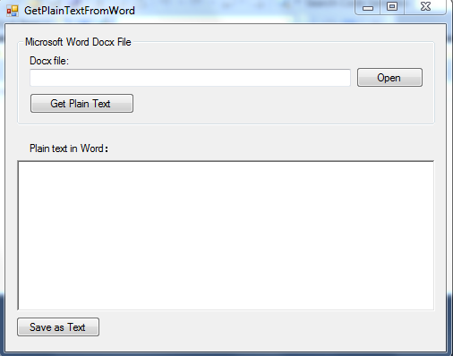
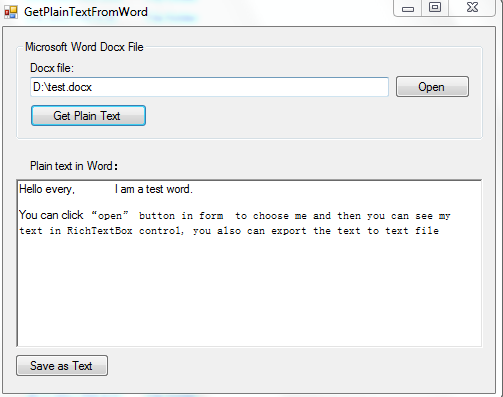

# Get Plain Text of a Word Document using Open XML (CSOpenXmlGetPlainText)
## Requires
- Visual Studio 2010
## License
- MS-LPL
## Technologies
- Office Development
## Topics
- Word
- Open XML
## Updated
- 12/03/2012
## Description

<h1>How to get Plain Text of a Word Document using Open XML (CSOpenXmlGetPlainText)</h1>
<h2>Introduction</h2>

This sample demonstrates how to 
extract the plain text from word document and export it to text files. 

The sample also can keep the basic style of the document, like white space and new line. Customers don't need to install Office Software and also can read the plain text of a word document.

<h2>Building the Sample</h2>

Before building the sample , please make sure you have installed <a href="http://www.microsoft.com/en-us/download/details.aspx?id=5124">
Open XML SDK 2.0 for Microsoft Office</a>&lt;o:p&gt;.&lt;/o:p&gt;

<h2>Running the Sample</h2>

The following steps walk through a demonstration of Getting plain text of a word document.

Step1. Open CSOpenXmlGetPlainText.sln and then click F5 to run this project. You will see the following form:

Step2. Click &quot;Open&quot; button to choose an existing word document

Step3. Click &quot;Get Plain Text&quot; button to extract plain text from a word document and display the text in
<b style="">RichTextBox</b> Control. 

Step4. Click &quot;Save as Text&quot; button to export the text in RichTextBox to a text file, if the process success, users can get successful message box.

<h2>Using the Code </h2>

Step1. Create Windows Form project. On the File Menu, choose New, Project, in the templates pane, select Windows Forms Application and enter the name of the project.

Step2. Add the Open xml reference to the project. To reference the Open XML, right click the project file and click the &quot;Add Reference…&quot; button. In the Add Reference dialog, navigate to the .Net tab, find DocumentFormat.OpenXml
 and click OK. 

Step3. Create <b style="">GetWordPlainText </b>class to read word document using Open XML. Import the Open XML namespace in this class.

C#

Edit|Remove

csharp

<pre id="codePreview" class="csharp">
using DocumentFormat.OpenXml;
using DocumentFormat.OpenXml.Packaging;

</pre>

&nbsp;

Step4. Create ReadWordDocument method to read plain text of a word document

C#

Edit|Remove

csharp

<pre id="codePreview" class="csharp">
       /// &lt;summary&gt;
       ///  Read Word Document
       /// &lt;/summary&gt;
       /// &lt;returns&gt;Plain Text in document &lt;/returns&gt;
       public string ReadWordDocument()
       {
           StringBuilder sb = new StringBuilder();
           OpenXmlElement element = package.MainDocumentPart.Document.Body;
           if (element == null)
           {
               return string.Empty;
           }

           sb.Append(GetPlainText(element));
           return sb.ToString();
       }

       /// &lt;summary&gt;
       ///  Read Plain Text in all XmlElements of word document
       /// &lt;/summary&gt;
       /// &lt;param name=&quot;element&quot;&gt;XmlElement in document&lt;/param&gt;
       /// &lt;returns&gt;Plain Text in XmlElement&lt;/returns&gt;
       public string GetPlainText(OpenXmlElement element)
       {
           StringBuilder PlainTextInWord = new StringBuilder();
           foreach (OpenXmlElement section in element.Elements())
           {             
               switch (section.LocalName)
               {
                   // Text
                   case &quot;t&quot;: 
                       PlainTextInWord.Append(section.InnerText);
                      break;

                   case &quot;cr&quot;:                          // Carriage return
                   case &quot;br&quot;:                          // Page break
                      PlainTextInWord.Append(Environment.NewLine);
                      break;

                   // Tab
                   case &quot;tab&quot;:
                      PlainTextInWord.Append(&quot;\t&quot;);
                      break;

                   // Paragraph
                   case &quot;p&quot;:
                       PlainTextInWord.Append(GetPlainText(section));
                       PlainTextInWord.AppendLine(Environment.NewLine);
                       break;

                   default:
                       PlainTextInWord.Append(GetPlainText(section));
                       break;
               }
           }

           return PlainTextInWord.ToString();
       }

</pre>

&nbsp;

Step5. Click &quot;Open&quot; button to choose an existing word document

C#

Edit|Remove

csharp

<pre id="codePreview" class="csharp">
      /// &lt;summary&gt;
      ///  Handle the btnOpen Click event to load an Word file.
      /// &lt;/summary&gt;
      /// &lt;param name=&quot;sender&quot;&gt;&lt;/param&gt;
      /// &lt;param name=&quot;e&quot;&gt;&lt;/param&gt;
      private void btnOpen_Click(object sender, EventArgs e)
      {
          SelectWordFile(); 
      }

      /// &lt;summary&gt;
      /// Show an OpenFileDialog to select a Word document.
      /// &lt;/summary&gt;
      /// &lt;returns&gt;
      /// The file name.
      /// &lt;/returns&gt;
      private string SelectWordFile()
      {
          string fileName = null;
          using (OpenFileDialog dialog = new OpenFileDialog())
          {
              dialog.Filter = &quot;Word document (*.docx)|*.docx&quot;;
              dialog.InitialDirectory = Environment.CurrentDirectory;

              // Retore the directory before closing
              dialog.RestoreDirectory = true;
              if (dialog.ShowDialog()== DialogResult.OK)
              {
                  fileName = dialog.FileName;
                  tbxFile.Text = dialog.FileName;
                  rtbText.Clear();
              }
          }

          return fileName;
      }

</pre>

&nbsp;

Step6. Click &quot;Get Plain text&quot; to call ReadWordDocument in GetWordPlainText class

C#

Edit|Remove

csharp

<pre id="codePreview" class="csharp">
       /// &lt;summary&gt;
       /// Get Plain Text from Word file
       /// &lt;/summary&gt;
       /// &lt;param name=&quot;sender&quot;&gt;&lt;/param&gt;
       /// &lt;param name=&quot;e&quot;&gt;&lt;/param&gt;
       private void btnGetPlainText_Click(object sender, EventArgs e)
       {
           try
           {
               getWordPlainText = new GetWordPlainText(tbxFile.Text);
               this.rtbText.Clear();
               this.rtbText.Text = getWordPlainText.ReadWordDocument();

               // After read text in word document successfully&iuml;&frac14;&#338;make &quot;save as text&quot; button to be enabled.
               this.btnSaveas.Enabled = true;
           }
           catch (Exception ex)
           {
               MessageBox.Show(ex.Message, &quot;Error&quot;, MessageBoxButtons.OK, MessageBoxIcon.Warning);
           }
           finally
           {
               if (getWordPlainText != null)
               {
                   getWordPlainText.Dispose();
               }
           }
       }

</pre>

&nbsp;

Step7. Click &quot;Save as Text&quot; to save the text to text file.

C#

Edit|Remove

csharp

<pre id="codePreview" class="csharp">
      /// &lt;summary&gt;
      ///  Save the text to text file
      /// &lt;/summary&gt;
      /// &lt;param name=&quot;sender&quot;&gt;&lt;/param&gt;
      /// &lt;param name=&quot;e&quot;&gt;&lt;/param&gt;
      private void btnSaveas_Click(object sender, EventArgs e)
      {
          using (SaveFileDialog savefileDialog = new SaveFileDialog())
          {
              savefileDialog.Filter = &quot;txt document(*.txt)|*.txt&quot;;

              // default file name extension
              savefileDialog.DefaultExt = &quot;.txt&quot;;

              // Retore the directory before closing
              savefileDialog.RestoreDirectory = true;
              if (savefileDialog.ShowDialog() == DialogResult.OK)
              {
                  string filename = savefileDialog.FileName;
                  rtbText.SaveFile(filename, RichTextBoxStreamType.PlainText);
                  MessageBox.Show(&quot;Save Text file successfully, the file path is&iuml;&frac14;&#353; &quot; &#43; filename);
              }
          }
      }

</pre>

&nbsp;

<a href="http://msdn.microsoft.com/en-us/library/bb448854.aspx" target="_top">Open XML SDK 2.0</a>

<a href="http://msdn.microsoft.com/en-us/library/cc850833.aspx">Word Processing</a>

<a href="http://msdn.microsoft.com/en-us/office/bb265236">Open XML Developer Center</a>

