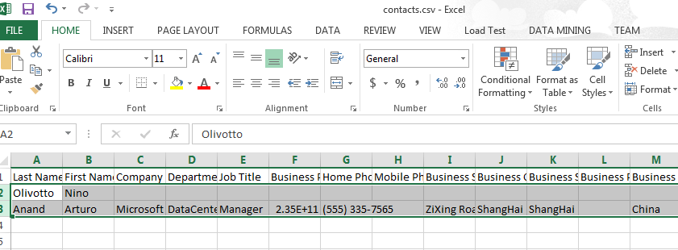

# How to Export Contacts in Office 365 Exchange Online
## Requires
- Visual Studio 2012
## License
- Apache License, Version 2.0
## Technologies
- Exchange Online
- Office 365
## Topics
- CSV
- O365
- export contacts
## Updated
- 09/21/2016
## Description

<strong>&nbsp;</strong><em></em>

<h1>How to Export Contacts in Office 365 Exchange Online (CSO365ExportContacts)</h1>
<h2>Introduction</h2>

Outlook Web App (OWA) allows us to import multiple contacts in a very simple way. However, it does not allow to export contacts. In this application, we will demonstrate how to export contacts from Office 365 Exchange Online.

1. Get all the contacts from Office 365 Exchange Online.

2. Write the head title to the CSV file.

3. Write the contacts into the CSV file.

<h2>Running the Sample</h2>

Press F5 to run the sample, the following is the result.

First, we use our account to connect the Exchange Online.

Then, we need to input a path of folder that stores the CSV file.

After that, we will create the file that contains the contacts.

Now you can find the file contacts.csv under the folder:

Then you can import the file into the other accounts.

<h2>Using the Code</h2>

1. Get the contact properties than you want to write into CSV file.

The name of property is different with the column title of the file, so we store the property definitions and the column titles in the Dictionary. The key of the dictionary is the property definition, and the value is the column title of the CSV file.

C#

Edit|Remove

csharp

<pre class="csharp" id="codePreview">public static Dictionary&lt;PropertyDefinitionBase, String&gt; GetSchemaList()
{
&nbsp;&nbsp;&nbsp; Dictionary&lt;PropertyDefinitionBase, String&gt; schemaList = 
&nbsp;&nbsp;&nbsp;&nbsp;&nbsp;&nbsp;&nbsp;&nbsp;new Dictionary&lt;PropertyDefinitionBase, string&gt;();
&nbsp;&nbsp;&nbsp; schemaList.Add(ContactSchema.Surname, &quot;Last Name&quot;);
&nbsp;&nbsp;&nbsp; schemaList.Add(ContactSchema.GivenName, &quot;First Name&quot;);
&nbsp;&nbsp;&nbsp; schemaList.Add(ContactSchema.CompanyName, &quot;Company&quot;);
&nbsp;&nbsp;&nbsp; schemaList.Add(ContactSchema.Department, &quot;Department&quot;);
&nbsp;&nbsp;&nbsp; schemaList.Add(ContactSchema.JobTitle, &quot;Job Title&quot;);
&nbsp;&nbsp;&nbsp; schemaList.Add(ContactSchema.BusinessPhone, &quot;Business Phone&quot;);
&nbsp;&nbsp;&nbsp; schemaList.Add(ContactSchema.HomePhone, &quot;Home Phone&quot;);
&nbsp;&nbsp;&nbsp; schemaList.Add(ContactSchema.MobilePhone, &quot;Mobile Phone&quot;);
&nbsp;&nbsp;&nbsp; schemaList.Add(ContactSchema.BusinessAddressStreet, &quot;Business Street&quot;);
&nbsp;&nbsp;&nbsp; schemaList.Add(ContactSchema.BusinessAddressCity, &quot;Business City&quot;);
&nbsp;&nbsp;&nbsp; schemaList.Add(ContactSchema.BusinessAddressState, &quot;Business State&quot;);
&nbsp;&nbsp;&nbsp; schemaList.Add(ContactSchema.BusinessAddressPostalCode, &quot;Business Postal Code&quot;);
&nbsp;&nbsp;&nbsp; schemaList.Add(ContactSchema.BusinessAddressCountryOrRegion, &quot;Business Country/Region&quot;);
&nbsp;&nbsp;&nbsp; schemaList.Add(ContactSchema.HomeAddressStreet, &quot;Home Street&quot;);
&nbsp;&nbsp;&nbsp; schemaList.Add(ContactSchema.HomeAddressCity, &quot;Home City&quot;);
&nbsp;&nbsp;&nbsp; schemaList.Add(ContactSchema.HomeAddressState, &quot;Home State&quot;);
&nbsp;&nbsp;&nbsp; schemaList.Add(ContactSchema.HomeAddressPostalCode, &quot;Home Postal Code&quot;);
&nbsp;&nbsp;&nbsp; schemaList.Add(ContactSchema.HomeAddressCountryOrRegion, &quot;Home Country/Region&quot;);
&nbsp;&nbsp;&nbsp; schemaList.Add(ContactSchema.EmailAddress1, &quot;Email Address&quot;);

&nbsp;&nbsp;&nbsp; return schemaList;
}

</pre>

&nbsp;

2. After get all the contacts from Office 365 Exchange Online, we need to input the path of folder that stores the CSV file.

C#

Edit|Remove

csharp

<pre class="csharp" id="codePreview">private static String GetFolderPath()
{
&nbsp;&nbsp;&nbsp; do
&nbsp;&nbsp;&nbsp; {
&nbsp;&nbsp;&nbsp;&nbsp;&nbsp;&nbsp;&nbsp; Console.Write(&quot;Please input the floder path:&quot;);

&nbsp;&nbsp;&nbsp;&nbsp;&nbsp;&nbsp;&nbsp; String path = Console.ReadLine();
&nbsp;&nbsp;&nbsp;&nbsp;&nbsp;&nbsp;&nbsp; List&lt;String&gt; files = new List&lt;String&gt;();
&nbsp;&nbsp;&nbsp;&nbsp;&nbsp;&nbsp;&nbsp; if (Directory.Exists(path))
&nbsp;&nbsp;&nbsp;&nbsp;&nbsp;&nbsp;&nbsp; {
&nbsp;&nbsp;&nbsp;&nbsp;&nbsp;&nbsp;&nbsp;&nbsp;&nbsp;&nbsp;&nbsp; return path;
&nbsp;&nbsp;&nbsp;&nbsp;&nbsp;&nbsp;&nbsp; }

&nbsp;&nbsp;&nbsp;&nbsp;&nbsp;&nbsp;&nbsp; Console.WriteLine(&quot;The path is invaild.&quot;);
&nbsp;&nbsp;&nbsp; } while (true);
}

</pre>

&nbsp;

3. Then we write the contacts into the file.

C#

Edit|Remove

csharp

<pre class="csharp" id="codePreview">public static void WriteContacts(StreamWriter writer, PropertyDefinitionBase proerty, Contact contact)
&nbsp; {
&nbsp;&nbsp;&nbsp;&nbsp;&nbsp; if (proerty.Equals(ContactSchema.Surname))
&nbsp;&nbsp;&nbsp;&nbsp;&nbsp; {
&nbsp;&nbsp;&nbsp;&nbsp;&nbsp;&nbsp;&nbsp;&nbsp;&nbsp; if (!String.IsNullOrWhiteSpace(contact.Surname))
&nbsp;&nbsp;&nbsp;&nbsp;&nbsp;&nbsp;&nbsp;&nbsp;&nbsp; {
&nbsp;&nbsp;&nbsp;&nbsp;&nbsp;&nbsp;&nbsp;&nbsp;&nbsp;&nbsp;&nbsp;&nbsp;&nbsp; writer.Write(&quot;\&quot;{0}\&quot;&quot;, contact.Surname);
&nbsp;&nbsp;&nbsp;&nbsp;&nbsp;&nbsp;&nbsp;&nbsp;&nbsp; }
&nbsp;&nbsp;&nbsp;&nbsp;&nbsp; }
&nbsp;&nbsp;&nbsp;&nbsp;&nbsp; else if (proerty.Equals(ContactSchema.GivenName))
&nbsp;&nbsp;&nbsp;&nbsp;&nbsp; {
&nbsp;&nbsp;&nbsp;&nbsp;&nbsp;&nbsp;&nbsp;&nbsp;&nbsp; if (!String.IsNullOrWhiteSpace(contact.GivenName))
&nbsp;&nbsp;&nbsp;&nbsp;&nbsp;&nbsp;&nbsp;&nbsp;&nbsp; {
&nbsp;&nbsp;&nbsp;&nbsp;&nbsp;&nbsp;&nbsp;&nbsp;&nbsp;&nbsp;&nbsp;&nbsp;&nbsp; writer.Write(&quot;\&quot;{0}\&quot;&quot;, contact.GivenName);
&nbsp;&nbsp;&nbsp;&nbsp;&nbsp;&nbsp;&nbsp;&nbsp;&nbsp; }
&nbsp;&nbsp;&nbsp;&nbsp;&nbsp; }
&nbsp;&nbsp;&nbsp;&nbsp;&nbsp; else if (proerty.Equals(ContactSchema.CompanyName))
.............................

&nbsp; }

</pre>

&nbsp;

&nbsp;

<h2>More Information</h2>

<a href="http://msdn.microsoft.com/en-us/library/dd633709(v=exchg.80).aspx">EWS Managed API 2.0</a>

<a href="http://msdn.microsoft.com/en-us/library/exchange/microsoft.exchange.webservices.data.contact(v=exchg.80).aspx">Contact class</a>

Microsoft All-In-One Code Framework is a free, centralized code sample library driven by developers' real-world pains and needs. The goal is to provide customer-driven code samples for all Microsoft development technologies,
 and reduce developers' efforts in solving typical programming tasks. Our team listens to developers&rsquo; pains in the MSDN forums, social media and various DEV communities. We write code samples based on developers&rsquo; frequently asked programming tasks,
 and allow developers to download them with a short sample publishing cycle. Additionally, we offer a free code sample request service. It is a proactive way for our developer community to obtain code samples directly from Microsoft.

