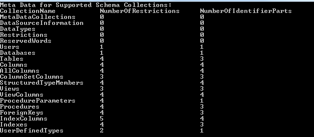
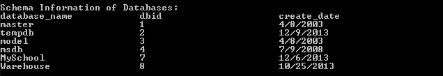
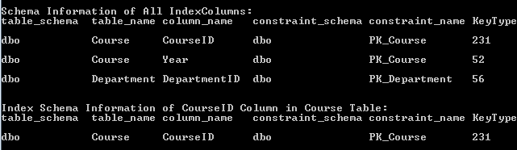

# How to Get Schema Information from Database
## Requires
- Visual Studio 2012
## License
- Apache License, Version 2.0
## Technologies
- ADO.NET
- Data Access
- .NET Development
## Topics
- Schema
- restriction
## Updated
- 09/21/2016
## Description

<strong>&nbsp;</strong><em>&nbsp;</em>

How to Get Schema Information from Database

Introduction

Sometimes we may need the schema information of the database, tables or some columns. In this application, we will demonstrate how to get schema information from database:

1. In this application, we will use the SqlConnection.GetSchema Method.

2. We will use the Schema Restrictions to get the specified information.

3. We will get the schema information of the database, tables, some columns and so on.

Building the Sample

Before you run the sample, you need to finish the following steps:

Step1. Please choose one way of the following ways to build the database:

&bull;&nbsp;Attach the database file MySchool.mdf under the folder _External_Dependecies
 to your SQL Server 2008 database instance.

&bull;&nbsp;Run the MySchool.sql script under the folder _External_Dependecies in your SQL
 Server 2008 database instance.

Step2. Modify the connection string in the Project Properties-&gt;Settings according-&gt; MySchoolConnectionString to your SQL Server 2008 database instance name.

Running the Sample

Press F5 to run the sample.

First, you can view the metadata of all the supported schema collections.

Then you can get the schema information of databases in your instance.

You can get the schema information of tables in a certain database.

You can also get the schema information of a specified table.

Beside specify the table name, you can also specify the table catalog, table schema, table type to get the schema information of the specified tables.

Like the tables mentioned above, you can get the columns
or the specified column

and get the index columns or the specified index column.

Using the Code

a. Get the Meta Data for Supported Schema Collections

C#VB

Edit|Remove

csharpvb

<pre class="csharp" id="codePreview">DataTable metaDataTable = conn.GetSchema(&quot;MetaDataCollections&quot;);
</pre>

&nbsp;

&nbsp;You can also directly use the
conn.GetSchema() method.

b. Get the schema information of Databases in your instance

C#VB

Edit|Remove

csharpvb

<pre class="csharp" id="codePreview">DataTable databasesSchemaTable = conn.GetSchema(&quot;Databases&quot;);
</pre>

&nbsp;

&nbsp;

c. Get the schema information of Tables

You can get the schema information of the tables in the current database.

&nbsp;

C#VB

Edit|Remove

csharpvb

<pre class="csharp" id="codePreview">DataTable allTablesSchemaTable = conn.GetSchema(&quot;Tables&quot;);
</pre>

&nbsp;

You can also specify the table catalog, table schema, table name, table type to get the specified table(s).

C#VB

Edit|Remove

csharpvb

<pre class="csharp" id="codePreview">String[] tableRestrictions = new String[4];
tableRestrictions[2] = &quot;Course&quot;;
DataTable courseTableSchemaTable = conn.GetSchema(&quot;Tables&quot;, tableRestrictions);
</pre>

&nbsp;

&nbsp;

More Information

<a href="http://msdn.microsoft.com/en-us/library/cc716722(VS.110).aspx" style="text-decoration:none">Schema Restrictions</a>

<a href="http://msdn.microsoft.com/en-us/library/ms254969(VS.110).aspx" style="text-decoration:none">SQL Server Schema Collections</a>

<a href="http://msdn.microsoft.com/en-us/library/ms136367(VS.110).aspx" style="text-decoration:none">SqlConnection.GetSchema Method (String, String[]</a>)

