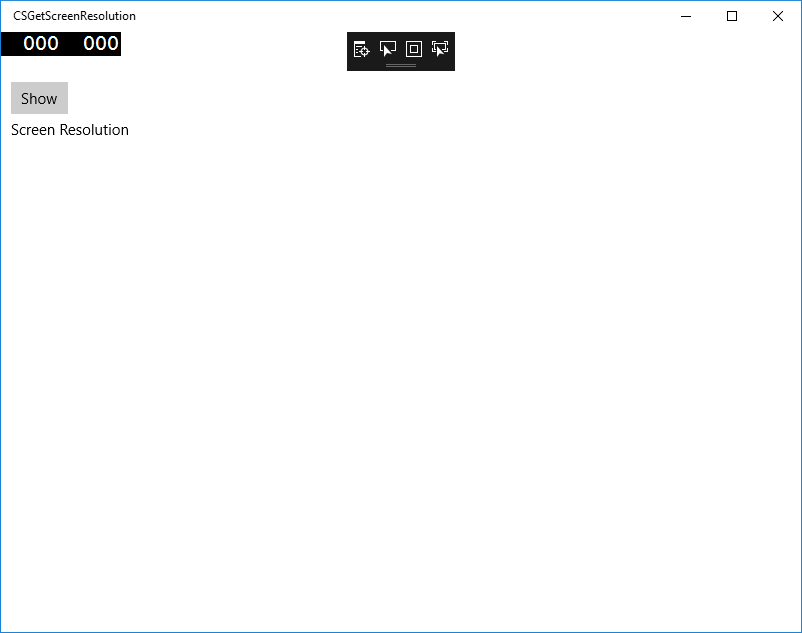
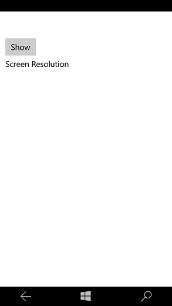

# How to Get Screen Resolution in Win10 UWP App
## Requires
- Visual Studio 2015
## License
- Apache License, Version 2.0
## Technologies
- Universal Windows App Development
- Universal Windows Platform
- UWP
## Topics
- Universal Windows App Development
- screen resolution
## Updated
- 11/14/2016
## Description

<strong>&nbsp;</strong><em>&nbsp;</em>

How to Get Screen Resolution in Win10 UWP App

Introduction

The sample demonstrates how to get screen resolution in Win10 UWP app.

Building the Sample

This sample should be run in Microsoft Visual Studio 2015 version
and Windows 10. Before you start, make sure you 
have installed Visual Studio 2015 
in Windows 10.

Start Microsoft Visual Studio and select 
File &gt; Open &gt; Project/Solution.

&bull;&nbsp;Go to the directory to which the sample was unzipped. Then go to the subdirectory named for the sample and double-click the Visual
 Studio 2015 Solution (.sln) file. 

&bull;&nbsp;Select
Build &gt; Build Solution
to build the sample.

&nbsp;

Running the Sample

Desktop 

In the target device menu on the Standard toolbar, make sure that
Local Machine is selected. Do one of the following:

&bull;&nbsp;Click the
Start Debugging button on the toolbar.

&bull;&nbsp;Click
Start Debugging in the
Debug menu.

&bull;&nbsp;Press F5.

&nbsp;The app window will be opened.

&nbsp;

Mobile 

In the target device menu on the Standard toolbar, select one of the Windows 10 mobile emulators and do one of the following:

&bull;&nbsp;Click the
Start Debugging button on the toolbar.

&bull;&nbsp;Click
Start Debugging in the
Debug menu.

&bull;&nbsp;Press F5.

The app will be 
opened in the emulator.

&nbsp;Using the Code

&nbsp;MainPage.xaml:

&nbsp;

XAML

Edit|Remove

xaml

<pre class="xaml">&lt;Grid&nbsp;Background=&quot;{ThemeResource&nbsp;ApplicationPageBackgroundThemeBrush}&quot;&gt;&nbsp;
&nbsp;&nbsp;&nbsp;&nbsp;&lt;Button&nbsp;x:Name=&quot;btnShow&quot;&nbsp;Content=&quot;Show&quot;&nbsp;HorizontalAlignment=&quot;Left&quot;&nbsp;Margin=&quot;10,50,0,0&quot;&nbsp;VerticalAlignment=&quot;Top&quot;&nbsp;Click=&quot;btnShow_Click&quot;/&gt;&nbsp;
&nbsp;&nbsp;&nbsp;&nbsp;&lt;TextBlock&nbsp;x:Name=&quot;txtInfo&quot;&nbsp;HorizontalAlignment=&quot;Left&quot;&nbsp;Margin=&quot;10,87,0,0&quot;&nbsp;TextWrapping=&quot;Wrap&quot;&nbsp;Text=&quot;Screen&nbsp;Resolution&quot;&nbsp;VerticalAlignment=&quot;Top&quot;&nbsp;Height=&quot;221&quot;&nbsp;Width=&quot;340&quot;/&gt;&nbsp;
&lt;/Grid&gt;&nbsp;
</pre>

MainPage.xaml.cs

&nbsp;

&nbsp;

C#

Edit|Remove

csharp

<pre class="csharp">///&nbsp;&lt;summary&gt;&nbsp;
///&nbsp;btnShow&nbsp;click&nbsp;event&nbsp;
///&nbsp;Get&nbsp;the&nbsp;screen&nbsp;resolution&nbsp;and&nbsp;show&nbsp;the&nbsp;information&nbsp;in&nbsp;the&nbsp;textblock.&nbsp;
///&nbsp;&lt;/summary&gt;&nbsp;
///&nbsp;&lt;param&nbsp;name=&quot;sender&quot;&gt;&lt;/param&gt;&nbsp;
///&nbsp;&lt;param&nbsp;name=&quot;e&quot;&gt;&lt;/param&gt;&nbsp;
private&nbsp;void&nbsp;btnShow_Click(object&nbsp;sender,&nbsp;RoutedEventArgs&nbsp;e)&nbsp;
{&nbsp;
&nbsp;&nbsp;&nbsp;&nbsp;//&nbsp;Clean&nbsp;the&nbsp;TextBlock&nbsp;
&nbsp;&nbsp;&nbsp;&nbsp;this.txtInfo.Text&nbsp;=&nbsp;string.Empty;&nbsp;
&nbsp;&nbsp;&nbsp;&nbsp;//Add&nbsp;the&nbsp;screen&nbsp;resolution&nbsp;information&nbsp;to&nbsp;the&nbsp;textblock.&nbsp;
&nbsp;&nbsp;&nbsp;&nbsp;if&nbsp;(App.ScreenResolutionSize&nbsp;!=&nbsp;Size.Empty)&nbsp;
&nbsp;&nbsp;&nbsp;&nbsp;{&nbsp;
&nbsp;&nbsp;&nbsp;&nbsp;&nbsp;&nbsp;&nbsp;&nbsp;var&nbsp;fullSize&nbsp;=&nbsp;App.ScreenResolutionSize;&nbsp;
&nbsp;&nbsp;&nbsp;&nbsp;&nbsp;&nbsp;&nbsp;&nbsp;this.txtInfo.Text&nbsp;=&nbsp;string.Format(&quot;The&nbsp;screen&nbsp;resolution&nbsp;is:&nbsp;{0}x{1}&quot;,&nbsp;fullSize.Width,&nbsp;fullSize.Height);&nbsp;
&nbsp;&nbsp;&nbsp;&nbsp;}&nbsp;
&nbsp;&nbsp;&nbsp;&nbsp;var&nbsp;windowSize&nbsp;=&nbsp;ScreenResolutionHelper.GetScreenResolutionInfo();&nbsp;
&nbsp;&nbsp;&nbsp;&nbsp;//Add&nbsp;the&nbsp;application&nbsp;window's&nbsp;resolution&nbsp;information&nbsp;to&nbsp;the&nbsp;textblock.&nbsp;
&nbsp;&nbsp;&nbsp;&nbsp;if&nbsp;(windowSize&nbsp;!=&nbsp;null)&nbsp;
&nbsp;&nbsp;&nbsp;&nbsp;{&nbsp;
&nbsp;&nbsp;&nbsp;&nbsp;&nbsp;&nbsp;&nbsp;&nbsp;this.txtInfo.Text&nbsp;&#43;=&nbsp;(string.IsNullOrEmpty(this.txtInfo.Text)&nbsp;?&nbsp;string.Empty&nbsp;:&nbsp;Environment.NewLine)&nbsp;
&nbsp;&nbsp;&nbsp;&nbsp;&nbsp;&nbsp;&nbsp;&nbsp;&nbsp;&nbsp;&nbsp;&nbsp;&#43;&nbsp;string.Format(&quot;The&nbsp;application&nbsp;window's&nbsp;resolution&nbsp;is:&nbsp;{0}x{1}&quot;,&nbsp;windowSize.Width,&nbsp;windowSize.Height);&nbsp;
&nbsp;&nbsp;&nbsp;&nbsp;}&nbsp;
}&nbsp;
&nbsp;
public&nbsp;class&nbsp;ScreenResolutionHelper&nbsp;
{&nbsp;
&nbsp;&nbsp;&nbsp;&nbsp;///&nbsp;&lt;summary&gt;&nbsp;
&nbsp;&nbsp;&nbsp;&nbsp;///&nbsp;Get&nbsp;screen&nbsp;resolution.&nbsp;
&nbsp;&nbsp;&nbsp;&nbsp;///&nbsp;If&nbsp;you&nbsp;want&nbsp;to&nbsp;get&nbsp;the&nbsp;resolution&nbsp;on&nbsp;every&nbsp;page&nbsp;in&nbsp;your&nbsp;solution,&nbsp;you&nbsp;need&nbsp;to&nbsp;call&nbsp;this&nbsp;method&nbsp;from&nbsp;app.xaml.cs&nbsp;and&nbsp;save&nbsp;the&nbsp;data&nbsp;as&nbsp;a&nbsp;global&nbsp;variable.&nbsp;
&nbsp;&nbsp;&nbsp;&nbsp;///&nbsp;If&nbsp;you&nbsp;have&nbsp;more&nbsp;than&nbsp;one&nbsp;computer&nbsp;monitor,&nbsp;you&nbsp;can&nbsp;only&nbsp;get&nbsp;the&nbsp;main&nbsp;monitor's&nbsp;screen&nbsp;resolution.&nbsp;
&nbsp;&nbsp;&nbsp;&nbsp;///&nbsp;&lt;/summary&gt;&nbsp;
&nbsp;&nbsp;&nbsp;&nbsp;///&nbsp;&lt;returns&gt;&lt;/returns&gt;&nbsp;
&nbsp;&nbsp;&nbsp;&nbsp;public&nbsp;static&nbsp;Size&nbsp;GetScreenResolutionInfo()&nbsp;
&nbsp;&nbsp;&nbsp;&nbsp;{&nbsp;
&nbsp;&nbsp;&nbsp;&nbsp;&nbsp;&nbsp;&nbsp;&nbsp;var&nbsp;applicationView&nbsp;=&nbsp;ApplicationView.GetForCurrentView();&nbsp;
&nbsp;&nbsp;&nbsp;&nbsp;&nbsp;&nbsp;&nbsp;&nbsp;var&nbsp;displayInformation&nbsp;=&nbsp;DisplayInformation.GetForCurrentView();&nbsp;
&nbsp;&nbsp;&nbsp;&nbsp;&nbsp;&nbsp;&nbsp;&nbsp;var&nbsp;bounds&nbsp;=&nbsp;applicationView.VisibleBounds;&nbsp;
&nbsp;&nbsp;&nbsp;&nbsp;&nbsp;&nbsp;&nbsp;&nbsp;var&nbsp;scale&nbsp;=&nbsp;displayInformation.RawPixelsPerViewPixel;&nbsp;
&nbsp;&nbsp;&nbsp;&nbsp;&nbsp;&nbsp;&nbsp;&nbsp;var&nbsp;size&nbsp;=&nbsp;new&nbsp;Size(bounds.Width&nbsp;*&nbsp;scale,&nbsp;bounds.Height&nbsp;*&nbsp;scale);&nbsp;
&nbsp;&nbsp;&nbsp;&nbsp;&nbsp;&nbsp;&nbsp;&nbsp;return&nbsp;size;&nbsp;
&nbsp;&nbsp;&nbsp;&nbsp;}&nbsp;
}</pre>

&nbsp;App.xaml.cs

&nbsp;

&nbsp;

C#

Edit|Remove

csharp

<pre class="csharp">///&nbsp;&lt;summary&gt;&nbsp;
///&nbsp;strore&nbsp;the&nbsp;screen&nbsp;resolution&nbsp;size.&nbsp;
///&nbsp;&lt;/summary&gt;&nbsp;
public&nbsp;static&nbsp;Size&nbsp;ScreenResolutionSize;&nbsp;
&nbsp;
protected&nbsp;override&nbsp;void&nbsp;OnLaunched(LaunchActivatedEventArgs&nbsp;e)&nbsp;
{&nbsp;
&nbsp;&nbsp;&nbsp;&nbsp;//&hellip;&hellip;&nbsp;
&nbsp;&nbsp;&nbsp;&nbsp;Window.Current.Activate();&nbsp;
&nbsp;&nbsp;&nbsp;&nbsp;ScreenResolutionSize&nbsp;=&nbsp;ScreenResolutionHelper.GetScreenResolutionInfo();&nbsp;
}</pre>

&nbsp;More Information

&nbsp;

&nbsp;&bull;&nbsp;ApplicationView class reference:
<a href="https://msdn.microsoft.com/en-us/library/windows/apps/windows.ui.viewmanagement.applicationview.aspx" style="text-decoration:none">https://msdn.microsoft.com/en-us/library/windows/apps/windows.ui.viewmanagement.applicationview.aspx</a>

&bull;&nbsp;DisplayInformation
 class reference: <a href="https://msdn.microsoft.com/en-us/library/windows/apps/windows.graphics.display.displayinformation.aspx" style="text-decoration:none">https://msdn.microsoft.com/en-us/library/windows/apps/windows.graphics.display.displayinformation.aspx</a>

&nbsp;

Microsoft All-In-One Code Framework is a free, centralized code sample library driven by developers' real-world pains and needs. The goal is to provide customer-driven code samples for all Microsoft development technologies,
 and reduce developers' efforts in solving typical programming tasks. Our team listens to developers&rsquo; pains in the MSDN forums, social media and various DEV communities. We write code samples based on developers&rsquo; frequently asked programming tasks,
 and allow developers to download them with a short sample publishing cycle. Additionally, we offer a free code sample request service. It is a proactive way for our developer community to obtain code samples directly from Microsoft.

