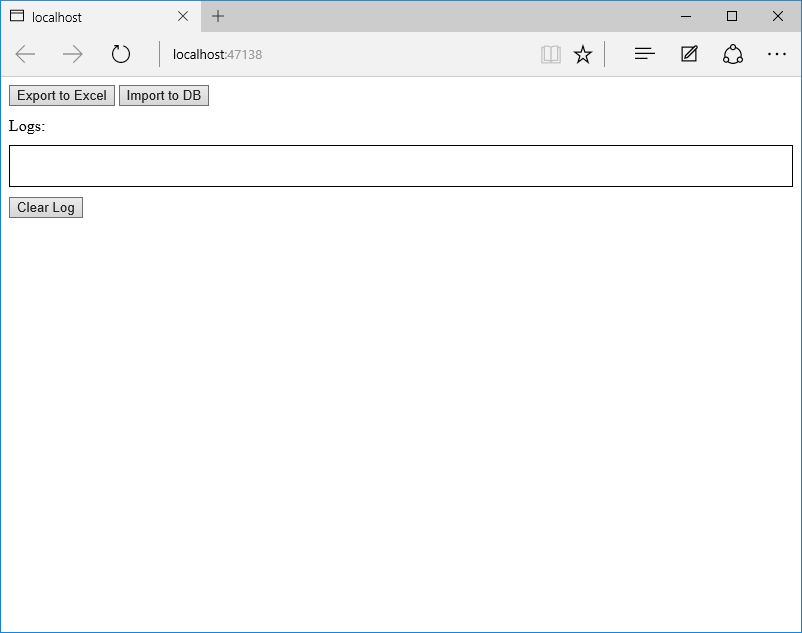
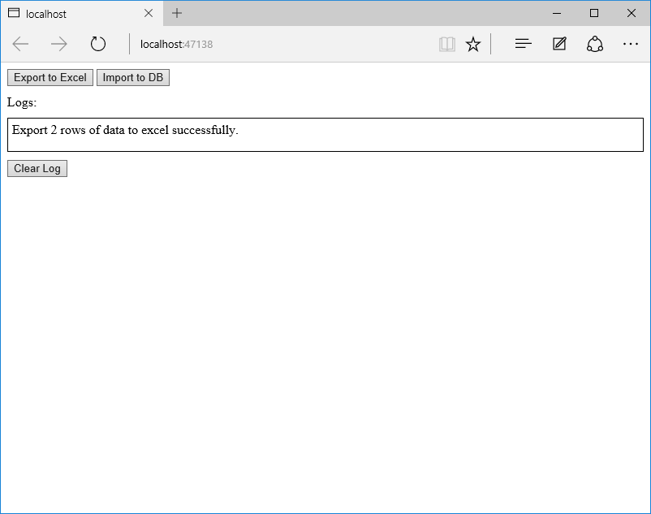
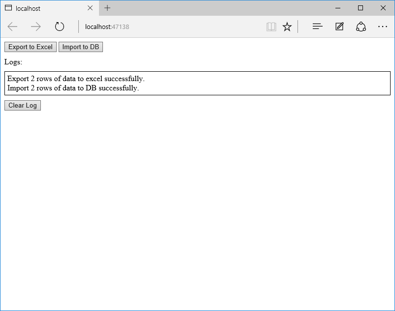

# How to Import/Export Azure Excel file to/from Azure Sql Server in ASP.NET
## License
- Apache License, Version 2.0
## Technologies
- ASP.NET
- Azure
- Office
- Excel
- .NET
- ASP.NET MVC
- Storage
- Cloud
- ASP.NET MVC 5
- Web App Development
- Azure SQL Database
- Azure Data Services
## Topics
- Excel
- Web App
- MVC 5
- Azure SQL Database
- Azure Storage Blob
- Import/Export data
## Updated
- 09/22/2016
## Description

<strong>&nbsp;</strong><em>&nbsp;</em>

How to Import/Export Azure Excel file to/from Azure SQL Server in ASP.NET

Introduction

This sample demonstrates how to import the worksheet Azure Excel file blob to DB on the Azure SQL Server and how to export it from DB to Azure Excel blob.

&nbsp;

<h2><strong>Download the sample</strong></h2>

<a href="https://github.com/Azure-Samples/storage-blobs-dotnet-export-import-excel-blob-to-from-db/archive/master.zip">storage-blobs-dotnet-export-import-excel-blob-to-from-db</a>

&nbsp;

Sample prerequisites

&bull;&nbsp;Microsoft Visual Studio 2015 version

&bull;&nbsp;<a href="https://www.microsoft.com/en-us/download/details.aspx?id=30425" style="text-decoration:none">Open
 XML SDK 2.5 for Microsoft Office</a>

&bull;&nbsp;An Azure storage account

&bull;&nbsp;Azure SQL Server

Building the sample

Before you build the project, make sure you have installed WindowsAzure.Storage package in the project.

The following steps can help you to install it:

&bull;&nbsp;Open the solution CSWebAppAzureExcelImportExport.sln.

&bull;&nbsp;Right click the project and select [Manage NuGet Packages&hellip;].

&bull;&nbsp;Search WindowsAzure.Storage at the Browse tab page. Find the right package and then install it.

 

You also need to set your Azure information in Helper.cs file:

&nbsp;

C#

Edit|Remove

csharp

<pre class="csharp">StorageCredentials&nbsp;cred&nbsp;=&nbsp;new&nbsp;StorageCredentials(&quot;[Your&nbsp;storage&nbsp;account&nbsp;name]&quot;,&nbsp;&quot;[Your&nbsp;storage&nbsp;account&nbsp;key]&quot;);&nbsp;
CloudBlobContainer&nbsp;container&nbsp;=&nbsp;new&nbsp;CloudBlobContainer(new&nbsp;Uri(&quot;http://[Your&nbsp;storage&nbsp;account&nbsp;name].blob.core.windows.net/[Your&nbsp;container&nbsp;name]&nbsp;/&quot;),&nbsp;cred);&nbsp;
string&nbsp;connectionStr&nbsp;=&nbsp;&quot;Azure&nbsp;SQL&nbsp;Server&nbsp;Connection&nbsp;String&quot;;</pre>

&nbsp;

Run CreateTable.sql in the SQLScripts folder on your Azure SQL Server DB to create the test table and test data. Otherwise, you can set your data table info first in Helper.cs file if you want to test your own data:

&nbsp;

C#

Edit|Remove

csharp

<pre class="csharp">List&lt;string&gt;&nbsp;columns&nbsp;=&nbsp;new&nbsp;List&lt;string&gt;()&nbsp;{&nbsp;&quot;{column1}&rdquo;,&nbsp;&quot;{column2}&quot;,&nbsp;&quot;{column3}&quot;};&nbsp;
string&nbsp;tableName&nbsp;=&nbsp;&quot;{table&nbsp;name}&quot;;</pre>

&nbsp;

Running the sample

Do one of the following to start debugging:

&bull;&nbsp;Click the Start Debugging button on the toolbar.

&bull;&nbsp;Click Start Debugging in the Debug menu.

&bull;&nbsp;Press F5.

&nbsp;

You will see this page:

&nbsp;

&nbsp;

Click button &ldquo;Export to Excel&rdquo;:

 

&nbsp;

Click button &ldquo;Import to DB&rdquo;

 

 

&nbsp;

You can click the button &ldquo;Clear Log&rdquo; to clear the logs.

&nbsp;

Using the code

Index.cshtml

&nbsp;

HTML

Edit|Remove

html

<pre class="html">&lt;body&gt;&nbsp;
&nbsp;&nbsp;&nbsp;&nbsp;&lt;div&gt;&nbsp;
&nbsp;&nbsp;&nbsp;&nbsp;&nbsp;&nbsp;&nbsp;&nbsp;&lt;input&nbsp;id=&quot;btnExport&quot;&nbsp;type=&quot;button&quot;&nbsp;value=&quot;Export&nbsp;to&nbsp;Excel&quot;&nbsp;/&gt;&nbsp;
&nbsp;&nbsp;&nbsp;&nbsp;&nbsp;&nbsp;&nbsp;&nbsp;&lt;input&nbsp;id=&quot;btnImport&quot;&nbsp;type=&quot;button&quot;&nbsp;value=&quot;Import&nbsp;to&nbsp;DB&quot;&nbsp;/&gt;&nbsp;
&nbsp;&nbsp;&nbsp;&nbsp;&lt;/div&gt;&nbsp;
&nbsp;&nbsp;&nbsp;&nbsp;&lt;div&nbsp;style=&quot;margin-top:10px&quot;&gt;Logs:&lt;/div&gt;&nbsp;
&nbsp;&nbsp;&nbsp;&nbsp;&lt;div&nbsp;id=&quot;divLog&quot;&nbsp;style=&quot;margin-top:10px;min-height:30px;border:1px&nbsp;solid;padding:5px&quot;&gt;&nbsp;
&nbsp;&nbsp;&nbsp;&nbsp;&lt;/div&gt;&nbsp;
&nbsp;&nbsp;&nbsp;&nbsp;&lt;div&nbsp;style=&quot;margin-top:10px&quot;&gt;&nbsp;
&nbsp;&nbsp;&nbsp;&nbsp;&nbsp;&nbsp;&nbsp;&nbsp;&lt;input&nbsp;id=&quot;btnClear&quot;&nbsp;type=&quot;button&quot;&nbsp;value=&quot;Clear&nbsp;Log&quot;&nbsp;/&gt;&nbsp;
&nbsp;&nbsp;&nbsp;&nbsp;&lt;/div&gt;&nbsp;
&nbsp;&nbsp;&nbsp;&nbsp;&lt;script&gt;&nbsp;
&nbsp;
&nbsp;&nbsp;&nbsp;&nbsp;&nbsp;&nbsp;&nbsp;&nbsp;$(&quot;#btnImport&quot;).bind(&quot;click&quot;,&nbsp;
&nbsp;&nbsp;&nbsp;&nbsp;&nbsp;&nbsp;&nbsp;&nbsp;&nbsp;&nbsp;&nbsp;&nbsp;function&nbsp;()&nbsp;{&nbsp;
&nbsp;&nbsp;&nbsp;&nbsp;&nbsp;&nbsp;&nbsp;&nbsp;&nbsp;&nbsp;&nbsp;&nbsp;&nbsp;&nbsp;&nbsp;&nbsp;$.post(&quot;/Home/ImportToDB&quot;,&nbsp;function&nbsp;(data)&nbsp;{&nbsp;
&nbsp;&nbsp;&nbsp;&nbsp;&nbsp;&nbsp;&nbsp;&nbsp;&nbsp;&nbsp;&nbsp;&nbsp;&nbsp;&nbsp;&nbsp;&nbsp;&nbsp;&nbsp;&nbsp;&nbsp;$(&quot;#divLog&quot;).append(&quot;&lt;div&gt;&quot;&nbsp;&#43;&nbsp;data&nbsp;&#43;&nbsp;&quot;&lt;/div&gt;&quot;);&nbsp;
&nbsp;&nbsp;&nbsp;&nbsp;&nbsp;&nbsp;&nbsp;&nbsp;&nbsp;&nbsp;&nbsp;&nbsp;&nbsp;&nbsp;&nbsp;&nbsp;});&nbsp;
&nbsp;&nbsp;&nbsp;&nbsp;&nbsp;&nbsp;&nbsp;&nbsp;&nbsp;&nbsp;&nbsp;&nbsp;}&nbsp;
&nbsp;&nbsp;&nbsp;&nbsp;&nbsp;&nbsp;&nbsp;&nbsp;);&nbsp;
&nbsp;&nbsp;&nbsp;&nbsp;&nbsp;&nbsp;&nbsp;&nbsp;$(&quot;#btnExport&quot;).bind(&quot;click&quot;,&nbsp;
&nbsp;&nbsp;&nbsp;&nbsp;&nbsp;&nbsp;&nbsp;&nbsp;&nbsp;&nbsp;&nbsp;&nbsp;function&nbsp;()&nbsp;{&nbsp;
&nbsp;&nbsp;&nbsp;&nbsp;&nbsp;&nbsp;&nbsp;&nbsp;&nbsp;&nbsp;&nbsp;&nbsp;&nbsp;&nbsp;&nbsp;&nbsp;$.post(&quot;/Home/ExportToExcel&quot;,&nbsp;function&nbsp;(data)&nbsp;{&nbsp;
&nbsp;&nbsp;&nbsp;&nbsp;&nbsp;&nbsp;&nbsp;&nbsp;&nbsp;&nbsp;&nbsp;&nbsp;&nbsp;&nbsp;&nbsp;&nbsp;&nbsp;&nbsp;&nbsp;&nbsp;$(&quot;#divLog&quot;).append(&quot;&lt;div&gt;&quot;&nbsp;&#43;&nbsp;data&nbsp;&#43;&nbsp;&quot;&lt;/div&gt;&quot;);&nbsp;
&nbsp;&nbsp;&nbsp;&nbsp;&nbsp;&nbsp;&nbsp;&nbsp;&nbsp;&nbsp;&nbsp;&nbsp;&nbsp;&nbsp;&nbsp;&nbsp;});&nbsp;
&nbsp;&nbsp;&nbsp;&nbsp;&nbsp;&nbsp;&nbsp;&nbsp;&nbsp;&nbsp;&nbsp;&nbsp;}&nbsp;
&nbsp;&nbsp;&nbsp;&nbsp;&nbsp;&nbsp;&nbsp;&nbsp;);&nbsp;
&nbsp;&nbsp;&nbsp;&nbsp;&nbsp;&nbsp;&nbsp;&nbsp;$(&quot;#btnClear&quot;).bind(&quot;click&quot;,&nbsp;
&nbsp;&nbsp;&nbsp;&nbsp;&nbsp;&nbsp;&nbsp;&nbsp;&nbsp;&nbsp;&nbsp;&nbsp;function&nbsp;()&nbsp;{&nbsp;
&nbsp;&nbsp;&nbsp;&nbsp;&nbsp;&nbsp;&nbsp;&nbsp;&nbsp;&nbsp;&nbsp;&nbsp;&nbsp;&nbsp;&nbsp;&nbsp;$(&quot;#divLog&quot;).empty();&nbsp;
&nbsp;&nbsp;&nbsp;&nbsp;&nbsp;&nbsp;&nbsp;&nbsp;&nbsp;&nbsp;&nbsp;&nbsp;}&nbsp;
&nbsp;&nbsp;&nbsp;&nbsp;&nbsp;&nbsp;&nbsp;&nbsp;);&nbsp;
&nbsp;&nbsp;&nbsp;&nbsp;&lt;/script&gt;&nbsp;
&lt;/body&gt;</pre>

Helper.cs

&nbsp;

C#

Edit|Remove

csharp

<pre class="csharp">public&nbsp;static&nbsp;string&nbsp;DBExportToExcel()&nbsp;
{&nbsp;
&nbsp;&nbsp;&nbsp;&nbsp;string&nbsp;result&nbsp;=&nbsp;string.Empty;&nbsp;
&nbsp;&nbsp;&nbsp;&nbsp;try&nbsp;
&nbsp;&nbsp;&nbsp;&nbsp;{&nbsp;
&nbsp;&nbsp;&nbsp;&nbsp;&nbsp;&nbsp;&nbsp;&nbsp;//Get&nbsp;datatable&nbsp;from&nbsp;db&nbsp;
&nbsp;&nbsp;&nbsp;&nbsp;&nbsp;&nbsp;&nbsp;&nbsp;DataSet&nbsp;ds&nbsp;=&nbsp;new&nbsp;DataSet();&nbsp;
&nbsp;&nbsp;&nbsp;&nbsp;&nbsp;&nbsp;&nbsp;&nbsp;SqlConnection&nbsp;connection&nbsp;=&nbsp;new&nbsp;SqlConnection(connectionStr);&nbsp;&nbsp;&nbsp;&nbsp;&nbsp;&nbsp;&nbsp;&nbsp;&nbsp;&nbsp;&nbsp;&nbsp;&nbsp;&nbsp;&nbsp;&nbsp;&nbsp;
&nbsp;&nbsp;&nbsp;&nbsp;&nbsp;&nbsp;&nbsp;&nbsp;SqlCommand&nbsp;cmd&nbsp;=&nbsp;new&nbsp;SqlCommand($&quot;SELECT&nbsp;{string.Join(&quot;,&quot;,&nbsp;columns)}&nbsp;FROM&nbsp;{tableName}&quot;,&nbsp;connection);&nbsp;
&nbsp;&nbsp;&nbsp;&nbsp;&nbsp;&nbsp;&nbsp;&nbsp;using&nbsp;(SqlDataAdapter&nbsp;adapter&nbsp;=&nbsp;new&nbsp;SqlDataAdapter(cmd))&nbsp;
&nbsp;&nbsp;&nbsp;&nbsp;&nbsp;&nbsp;&nbsp;&nbsp;{&nbsp;
&nbsp;&nbsp;&nbsp;&nbsp;&nbsp;&nbsp;&nbsp;&nbsp;&nbsp;&nbsp;&nbsp;&nbsp;adapter.Fill(ds);&nbsp;
&nbsp;&nbsp;&nbsp;&nbsp;&nbsp;&nbsp;&nbsp;&nbsp;}&nbsp;
&nbsp;&nbsp;&nbsp;&nbsp;&nbsp;&nbsp;&nbsp;&nbsp;//Check&nbsp;directory&nbsp;
&nbsp;&nbsp;&nbsp;&nbsp;&nbsp;&nbsp;&nbsp;&nbsp;if&nbsp;(!Directory.Exists(directoryPath))&nbsp;
&nbsp;&nbsp;&nbsp;&nbsp;&nbsp;&nbsp;&nbsp;&nbsp;{&nbsp;
&nbsp;&nbsp;&nbsp;&nbsp;&nbsp;&nbsp;&nbsp;&nbsp;&nbsp;&nbsp;&nbsp;&nbsp;Directory.CreateDirectory(directoryPath);&nbsp;
&nbsp;&nbsp;&nbsp;&nbsp;&nbsp;&nbsp;&nbsp;&nbsp;}&nbsp;
&nbsp;&nbsp;&nbsp;&nbsp;&nbsp;&nbsp;&nbsp;&nbsp;//&nbsp;Delete&nbsp;the&nbsp;file&nbsp;if&nbsp;it&nbsp;exists&nbsp;
&nbsp;&nbsp;&nbsp;&nbsp;&nbsp;&nbsp;&nbsp;&nbsp;string&nbsp;filePath&nbsp;=&nbsp;$&quot;{directoryPath}//{excelName}&quot;;&nbsp;
&nbsp;&nbsp;&nbsp;&nbsp;&nbsp;&nbsp;&nbsp;&nbsp;if&nbsp;(File.Exists(filePath))&nbsp;
&nbsp;&nbsp;&nbsp;&nbsp;&nbsp;&nbsp;&nbsp;&nbsp;{&nbsp;
&nbsp;&nbsp;&nbsp;&nbsp;&nbsp;&nbsp;&nbsp;&nbsp;&nbsp;&nbsp;&nbsp;&nbsp;File.Delete(filePath);&nbsp;
&nbsp;&nbsp;&nbsp;&nbsp;&nbsp;&nbsp;&nbsp;&nbsp;}&nbsp;
&nbsp;
&nbsp;&nbsp;&nbsp;&nbsp;&nbsp;&nbsp;&nbsp;&nbsp;if&nbsp;(ds.Tables.Count&nbsp;&gt;&nbsp;0&nbsp;&amp;&amp;&nbsp;ds.Tables[0]&nbsp;!=&nbsp;null&nbsp;||&nbsp;ds.Tables[0].Columns.Count&nbsp;&gt;&nbsp;0)&nbsp;
&nbsp;&nbsp;&nbsp;&nbsp;&nbsp;&nbsp;&nbsp;&nbsp;{&nbsp;
&nbsp;&nbsp;&nbsp;&nbsp;&nbsp;&nbsp;&nbsp;&nbsp;&nbsp;&nbsp;&nbsp;&nbsp;DataTable&nbsp;table&nbsp;=&nbsp;ds.Tables[0];&nbsp;
&nbsp;
&nbsp;&nbsp;&nbsp;&nbsp;&nbsp;&nbsp;&nbsp;&nbsp;&nbsp;&nbsp;&nbsp;&nbsp;using&nbsp;(var&nbsp;spreadsheetDocument&nbsp;=&nbsp;SpreadsheetDocument.Create(filePath,&nbsp;SpreadsheetDocumentType.Workbook))&nbsp;
&nbsp;&nbsp;&nbsp;&nbsp;&nbsp;&nbsp;&nbsp;&nbsp;&nbsp;&nbsp;&nbsp;&nbsp;{&nbsp;
&nbsp;&nbsp;&nbsp;&nbsp;&nbsp;&nbsp;&nbsp;&nbsp;&nbsp;&nbsp;&nbsp;&nbsp;&nbsp;&nbsp;&nbsp;&nbsp;//&nbsp;Create&nbsp;SpreadsheetDocument&nbsp;
&nbsp;&nbsp;&nbsp;&nbsp;&nbsp;&nbsp;&nbsp;&nbsp;&nbsp;&nbsp;&nbsp;&nbsp;&nbsp;&nbsp;&nbsp;&nbsp;WorkbookPart&nbsp;workbookPart&nbsp;=&nbsp;spreadsheetDocument.AddWorkbookPart();&nbsp;
&nbsp;&nbsp;&nbsp;&nbsp;&nbsp;&nbsp;&nbsp;&nbsp;&nbsp;&nbsp;&nbsp;&nbsp;&nbsp;&nbsp;&nbsp;&nbsp;workbookPart.Workbook&nbsp;=&nbsp;new&nbsp;Workbook();&nbsp;
&nbsp;&nbsp;&nbsp;&nbsp;&nbsp;&nbsp;&nbsp;&nbsp;&nbsp;&nbsp;&nbsp;&nbsp;&nbsp;&nbsp;&nbsp;&nbsp;var&nbsp;sheetPart&nbsp;=&nbsp;spreadsheetDocument.WorkbookPart.AddNewPart&lt;WorksheetPart&gt;();&nbsp;
&nbsp;&nbsp;&nbsp;&nbsp;&nbsp;&nbsp;&nbsp;&nbsp;&nbsp;&nbsp;&nbsp;&nbsp;&nbsp;&nbsp;&nbsp;&nbsp;var&nbsp;sheetData&nbsp;=&nbsp;new&nbsp;SheetData();&nbsp;
&nbsp;&nbsp;&nbsp;&nbsp;&nbsp;&nbsp;&nbsp;&nbsp;&nbsp;&nbsp;&nbsp;&nbsp;&nbsp;&nbsp;&nbsp;&nbsp;sheetPart.Worksheet&nbsp;=&nbsp;new&nbsp;Worksheet(sheetData);&nbsp;
&nbsp;&nbsp;&nbsp;&nbsp;&nbsp;&nbsp;&nbsp;&nbsp;&nbsp;&nbsp;&nbsp;&nbsp;&nbsp;&nbsp;&nbsp;&nbsp;Sheets&nbsp;sheets&nbsp;=&nbsp;spreadsheetDocument.WorkbookPart.Workbook.AppendChild&lt;Sheets&gt;(new&nbsp;Sheets());&nbsp;
&nbsp;&nbsp;&nbsp;&nbsp;&nbsp;&nbsp;&nbsp;&nbsp;&nbsp;&nbsp;&nbsp;&nbsp;&nbsp;&nbsp;&nbsp;&nbsp;string&nbsp;relationshipId&nbsp;=&nbsp;spreadsheetDocument.WorkbookPart.GetIdOfPart(sheetPart);&nbsp;
&nbsp;&nbsp;&nbsp;&nbsp;&nbsp;&nbsp;&nbsp;&nbsp;&nbsp;&nbsp;&nbsp;&nbsp;&nbsp;&nbsp;&nbsp;&nbsp;Sheet&nbsp;sheet&nbsp;=&nbsp;new&nbsp;Sheet()&nbsp;{&nbsp;Id&nbsp;=&nbsp;relationshipId,&nbsp;SheetId&nbsp;=&nbsp;1,&nbsp;Name&nbsp;=&nbsp;table.TableName&nbsp;};&nbsp;
&nbsp;&nbsp;&nbsp;&nbsp;&nbsp;&nbsp;&nbsp;&nbsp;&nbsp;&nbsp;&nbsp;&nbsp;&nbsp;&nbsp;&nbsp;&nbsp;sheets.Append(sheet);&nbsp;
&nbsp;
&nbsp;&nbsp;&nbsp;&nbsp;&nbsp;&nbsp;&nbsp;&nbsp;&nbsp;&nbsp;&nbsp;&nbsp;&nbsp;&nbsp;&nbsp;&nbsp;//Add&nbsp;header&nbsp;to&nbsp;sheetData&nbsp;
&nbsp;&nbsp;&nbsp;&nbsp;&nbsp;&nbsp;&nbsp;&nbsp;&nbsp;&nbsp;&nbsp;&nbsp;&nbsp;&nbsp;&nbsp;&nbsp;Row&nbsp;headerRow&nbsp;=&nbsp;new&nbsp;Row();&nbsp;
&nbsp;&nbsp;&nbsp;&nbsp;&nbsp;&nbsp;&nbsp;&nbsp;&nbsp;&nbsp;&nbsp;&nbsp;&nbsp;&nbsp;&nbsp;&nbsp;List&lt;String&gt;&nbsp;columns&nbsp;=&nbsp;new&nbsp;List&lt;string&gt;();&nbsp;
&nbsp;&nbsp;&nbsp;&nbsp;&nbsp;&nbsp;&nbsp;&nbsp;&nbsp;&nbsp;&nbsp;&nbsp;&nbsp;&nbsp;&nbsp;&nbsp;foreach&nbsp;(DataColumn&nbsp;column&nbsp;in&nbsp;table.Columns)&nbsp;
&nbsp;&nbsp;&nbsp;&nbsp;&nbsp;&nbsp;&nbsp;&nbsp;&nbsp;&nbsp;&nbsp;&nbsp;&nbsp;&nbsp;&nbsp;&nbsp;{&nbsp;
&nbsp;&nbsp;&nbsp;&nbsp;&nbsp;&nbsp;&nbsp;&nbsp;&nbsp;&nbsp;&nbsp;&nbsp;&nbsp;&nbsp;&nbsp;&nbsp;&nbsp;&nbsp;&nbsp;&nbsp;columns.Add(column.ColumnName);&nbsp;
&nbsp;
&nbsp;&nbsp;&nbsp;&nbsp;&nbsp;&nbsp;&nbsp;&nbsp;&nbsp;&nbsp;&nbsp;&nbsp;&nbsp;&nbsp;&nbsp;&nbsp;&nbsp;&nbsp;&nbsp;&nbsp;Cell&nbsp;cell&nbsp;=&nbsp;new&nbsp;Cell();&nbsp;
&nbsp;&nbsp;&nbsp;&nbsp;&nbsp;&nbsp;&nbsp;&nbsp;&nbsp;&nbsp;&nbsp;&nbsp;&nbsp;&nbsp;&nbsp;&nbsp;&nbsp;&nbsp;&nbsp;&nbsp;cell.DataType&nbsp;=&nbsp;CellValues.String;&nbsp;
&nbsp;&nbsp;&nbsp;&nbsp;&nbsp;&nbsp;&nbsp;&nbsp;&nbsp;&nbsp;&nbsp;&nbsp;&nbsp;&nbsp;&nbsp;&nbsp;&nbsp;&nbsp;&nbsp;&nbsp;cell.CellValue&nbsp;=&nbsp;new&nbsp;CellValue(column.ColumnName);&nbsp;
&nbsp;&nbsp;&nbsp;&nbsp;&nbsp;&nbsp;&nbsp;&nbsp;&nbsp;&nbsp;&nbsp;&nbsp;&nbsp;&nbsp;&nbsp;&nbsp;&nbsp;&nbsp;&nbsp;&nbsp;headerRow.AppendChild(cell);&nbsp;
&nbsp;&nbsp;&nbsp;&nbsp;&nbsp;&nbsp;&nbsp;&nbsp;&nbsp;&nbsp;&nbsp;&nbsp;&nbsp;&nbsp;&nbsp;&nbsp;}&nbsp;
&nbsp;&nbsp;&nbsp;&nbsp;&nbsp;&nbsp;&nbsp;&nbsp;&nbsp;&nbsp;&nbsp;&nbsp;&nbsp;&nbsp;&nbsp;&nbsp;sheetData.AppendChild(headerRow);&nbsp;
&nbsp;
&nbsp;&nbsp;&nbsp;&nbsp;&nbsp;&nbsp;&nbsp;&nbsp;&nbsp;&nbsp;&nbsp;&nbsp;&nbsp;&nbsp;&nbsp;&nbsp;//Add&nbsp;cells&nbsp;to&nbsp;sheetData&nbsp;
&nbsp;&nbsp;&nbsp;&nbsp;&nbsp;&nbsp;&nbsp;&nbsp;&nbsp;&nbsp;&nbsp;&nbsp;&nbsp;&nbsp;&nbsp;&nbsp;foreach&nbsp;(DataRow&nbsp;row&nbsp;in&nbsp;table.Rows)&nbsp;
&nbsp;&nbsp;&nbsp;&nbsp;&nbsp;&nbsp;&nbsp;&nbsp;&nbsp;&nbsp;&nbsp;&nbsp;&nbsp;&nbsp;&nbsp;&nbsp;{&nbsp;
&nbsp;&nbsp;&nbsp;&nbsp;&nbsp;&nbsp;&nbsp;&nbsp;&nbsp;&nbsp;&nbsp;&nbsp;&nbsp;&nbsp;&nbsp;&nbsp;&nbsp;&nbsp;&nbsp;&nbsp;Row&nbsp;newRow&nbsp;=&nbsp;new&nbsp;Row();&nbsp;
&nbsp;&nbsp;&nbsp;&nbsp;&nbsp;&nbsp;&nbsp;&nbsp;&nbsp;&nbsp;&nbsp;&nbsp;&nbsp;&nbsp;&nbsp;&nbsp;&nbsp;&nbsp;&nbsp;&nbsp;columns.ForEach(col&nbsp;=&gt;&nbsp;
&nbsp;&nbsp;&nbsp;&nbsp;&nbsp;&nbsp;&nbsp;&nbsp;&nbsp;&nbsp;&nbsp;&nbsp;&nbsp;&nbsp;&nbsp;&nbsp;&nbsp;&nbsp;&nbsp;&nbsp;{&nbsp;
&nbsp;&nbsp;&nbsp;&nbsp;&nbsp;&nbsp;&nbsp;&nbsp;&nbsp;&nbsp;&nbsp;&nbsp;&nbsp;&nbsp;&nbsp;&nbsp;&nbsp;&nbsp;&nbsp;&nbsp;&nbsp;&nbsp;&nbsp;&nbsp;Cell&nbsp;cell&nbsp;=&nbsp;new&nbsp;Cell();&nbsp;
&nbsp;&nbsp;&nbsp;&nbsp;&nbsp;&nbsp;&nbsp;&nbsp;&nbsp;&nbsp;&nbsp;&nbsp;&nbsp;&nbsp;&nbsp;&nbsp;&nbsp;&nbsp;&nbsp;&nbsp;&nbsp;&nbsp;&nbsp;&nbsp;//If&nbsp;value&nbsp;is&nbsp;DBNull,&nbsp;do&nbsp;not&nbsp;set&nbsp;value&nbsp;to&nbsp;cell&nbsp;
&nbsp;&nbsp;&nbsp;&nbsp;&nbsp;&nbsp;&nbsp;&nbsp;&nbsp;&nbsp;&nbsp;&nbsp;&nbsp;&nbsp;&nbsp;&nbsp;&nbsp;&nbsp;&nbsp;&nbsp;&nbsp;&nbsp;&nbsp;&nbsp;if&nbsp;(row[col]&nbsp;!=&nbsp;<a class="libraryLink" href="https://msdn.microsoft.com/en-US/library/System.DBNull.Value.aspx" target="_blank" title="Auto generated link to System.DBNull.Value">System.DBNull.Value</a>)&nbsp;
&nbsp;&nbsp;&nbsp;&nbsp;&nbsp;&nbsp;&nbsp;&nbsp;&nbsp;&nbsp;&nbsp;&nbsp;&nbsp;&nbsp;&nbsp;&nbsp;&nbsp;&nbsp;&nbsp;&nbsp;&nbsp;&nbsp;&nbsp;&nbsp;{&nbsp;
&nbsp;&nbsp;&nbsp;&nbsp;&nbsp;&nbsp;&nbsp;&nbsp;&nbsp;&nbsp;&nbsp;&nbsp;&nbsp;&nbsp;&nbsp;&nbsp;&nbsp;&nbsp;&nbsp;&nbsp;&nbsp;&nbsp;&nbsp;&nbsp;&nbsp;&nbsp;&nbsp;&nbsp;cell.DataType&nbsp;=&nbsp;CellValues.String;&nbsp;
&nbsp;&nbsp;&nbsp;&nbsp;&nbsp;&nbsp;&nbsp;&nbsp;&nbsp;&nbsp;&nbsp;&nbsp;&nbsp;&nbsp;&nbsp;&nbsp;&nbsp;&nbsp;&nbsp;&nbsp;&nbsp;&nbsp;&nbsp;&nbsp;&nbsp;&nbsp;&nbsp;&nbsp;cell.CellValue&nbsp;=&nbsp;new&nbsp;CellValue(row[col].ToString());&nbsp;
&nbsp;&nbsp;&nbsp;&nbsp;&nbsp;&nbsp;&nbsp;&nbsp;&nbsp;&nbsp;&nbsp;&nbsp;&nbsp;&nbsp;&nbsp;&nbsp;&nbsp;&nbsp;&nbsp;&nbsp;&nbsp;&nbsp;&nbsp;&nbsp;}&nbsp;
&nbsp;&nbsp;&nbsp;&nbsp;&nbsp;&nbsp;&nbsp;&nbsp;&nbsp;&nbsp;&nbsp;&nbsp;&nbsp;&nbsp;&nbsp;&nbsp;&nbsp;&nbsp;&nbsp;&nbsp;&nbsp;&nbsp;&nbsp;&nbsp;newRow.AppendChild(cell);&nbsp;
&nbsp;&nbsp;&nbsp;&nbsp;&nbsp;&nbsp;&nbsp;&nbsp;&nbsp;&nbsp;&nbsp;&nbsp;&nbsp;&nbsp;&nbsp;&nbsp;&nbsp;&nbsp;&nbsp;&nbsp;});&nbsp;
&nbsp;&nbsp;&nbsp;&nbsp;&nbsp;&nbsp;&nbsp;&nbsp;&nbsp;&nbsp;&nbsp;&nbsp;&nbsp;&nbsp;&nbsp;&nbsp;&nbsp;&nbsp;&nbsp;&nbsp;sheetData.AppendChild(newRow);&nbsp;
&nbsp;&nbsp;&nbsp;&nbsp;&nbsp;&nbsp;&nbsp;&nbsp;&nbsp;&nbsp;&nbsp;&nbsp;&nbsp;&nbsp;&nbsp;&nbsp;}&nbsp;
&nbsp;&nbsp;&nbsp;&nbsp;&nbsp;&nbsp;&nbsp;&nbsp;&nbsp;&nbsp;&nbsp;&nbsp;&nbsp;&nbsp;&nbsp;&nbsp;result&nbsp;=&nbsp;$&quot;Export&nbsp;{table.Rows.Count}&nbsp;rows&nbsp;of&nbsp;data&nbsp;to&nbsp;excel&nbsp;successfully.&quot;;&nbsp;
&nbsp;&nbsp;&nbsp;&nbsp;&nbsp;&nbsp;&nbsp;&nbsp;&nbsp;&nbsp;&nbsp;&nbsp;}&nbsp;
&nbsp;&nbsp;&nbsp;&nbsp;&nbsp;&nbsp;&nbsp;&nbsp;}&nbsp;
&nbsp;
&nbsp;&nbsp;&nbsp;&nbsp;&nbsp;&nbsp;&nbsp;&nbsp;//&nbsp;Write&nbsp;the&nbsp;excel&nbsp;to&nbsp;Azure&nbsp;storage&nbsp;container&nbsp;
&nbsp;&nbsp;&nbsp;&nbsp;&nbsp;&nbsp;&nbsp;&nbsp;using&nbsp;(FileStream&nbsp;fileStream&nbsp;=&nbsp;File.Open(filePath,&nbsp;FileMode.Open))&nbsp;
&nbsp;&nbsp;&nbsp;&nbsp;&nbsp;&nbsp;&nbsp;&nbsp;{&nbsp;
&nbsp;&nbsp;&nbsp;&nbsp;&nbsp;&nbsp;&nbsp;&nbsp;&nbsp;&nbsp;&nbsp;&nbsp;bool&nbsp;exists&nbsp;=&nbsp;container.CreateIfNotExists();&nbsp;
&nbsp;&nbsp;&nbsp;&nbsp;&nbsp;&nbsp;&nbsp;&nbsp;&nbsp;&nbsp;&nbsp;&nbsp;var&nbsp;blob&nbsp;=&nbsp;container.GetBlockBlobReference(excelName);&nbsp;
&nbsp;&nbsp;&nbsp;&nbsp;&nbsp;&nbsp;&nbsp;&nbsp;&nbsp;&nbsp;&nbsp;&nbsp;blob.DeleteIfExists();&nbsp;
&nbsp;&nbsp;&nbsp;&nbsp;&nbsp;&nbsp;&nbsp;&nbsp;&nbsp;&nbsp;&nbsp;&nbsp;blob.UploadFromStream(fileStream);&nbsp;
&nbsp;&nbsp;&nbsp;&nbsp;&nbsp;&nbsp;&nbsp;&nbsp;}&nbsp;
&nbsp;&nbsp;&nbsp;&nbsp;}&nbsp;
&nbsp;&nbsp;&nbsp;&nbsp;catch&nbsp;(Exception&nbsp;ex)&nbsp;
&nbsp;&nbsp;&nbsp;&nbsp;{&nbsp;
&nbsp;&nbsp;&nbsp;&nbsp;&nbsp;&nbsp;&nbsp;&nbsp;result&nbsp;=$&quot;Export&nbsp;action&nbsp;failed.&nbsp;Error&nbsp;Message:&nbsp;{ex.Message}&quot;;&nbsp;
&nbsp;&nbsp;&nbsp;&nbsp;}&nbsp;
&nbsp;&nbsp;&nbsp;&nbsp;return&nbsp;result;&nbsp;
}</pre>

C#

Edit|Remove

csharp

<pre class="csharp">public&nbsp;static&nbsp;string&nbsp;ExcelImportToDB()&nbsp;
{&nbsp;
&nbsp;&nbsp;&nbsp;&nbsp;string&nbsp;result&nbsp;=&nbsp;string.Empty;&nbsp;
&nbsp;&nbsp;&nbsp;&nbsp;try&nbsp;
&nbsp;&nbsp;&nbsp;&nbsp;{&nbsp;
&nbsp;&nbsp;&nbsp;&nbsp;&nbsp;&nbsp;&nbsp;&nbsp;//Check&nbsp;directory&nbsp;
&nbsp;&nbsp;&nbsp;&nbsp;&nbsp;&nbsp;&nbsp;&nbsp;if&nbsp;(!Directory.Exists(directoryPath))&nbsp;
&nbsp;&nbsp;&nbsp;&nbsp;&nbsp;&nbsp;&nbsp;&nbsp;{&nbsp;
&nbsp;&nbsp;&nbsp;&nbsp;&nbsp;&nbsp;&nbsp;&nbsp;&nbsp;&nbsp;&nbsp;&nbsp;Directory.CreateDirectory(directoryPath);&nbsp;
&nbsp;&nbsp;&nbsp;&nbsp;&nbsp;&nbsp;&nbsp;&nbsp;}&nbsp;
&nbsp;&nbsp;&nbsp;&nbsp;&nbsp;&nbsp;&nbsp;&nbsp;//&nbsp;Delete&nbsp;the&nbsp;file&nbsp;if&nbsp;it&nbsp;exists&nbsp;
&nbsp;&nbsp;&nbsp;&nbsp;&nbsp;&nbsp;&nbsp;&nbsp;string&nbsp;filePath&nbsp;=&nbsp;$&quot;{directoryPath}//{excelName}&quot;;&nbsp;
&nbsp;&nbsp;&nbsp;&nbsp;&nbsp;&nbsp;&nbsp;&nbsp;if&nbsp;(File.Exists(filePath))&nbsp;
&nbsp;&nbsp;&nbsp;&nbsp;&nbsp;&nbsp;&nbsp;&nbsp;{&nbsp;
&nbsp;&nbsp;&nbsp;&nbsp;&nbsp;&nbsp;&nbsp;&nbsp;&nbsp;&nbsp;&nbsp;&nbsp;File.Delete(filePath);&nbsp;
&nbsp;&nbsp;&nbsp;&nbsp;&nbsp;&nbsp;&nbsp;&nbsp;}&nbsp;
&nbsp;&nbsp;&nbsp;&nbsp;&nbsp;&nbsp;&nbsp;&nbsp;//&nbsp;Download&nbsp;blob&nbsp;to&nbsp;server&nbsp;disk.&nbsp;
&nbsp;&nbsp;&nbsp;&nbsp;&nbsp;&nbsp;&nbsp;&nbsp;container.CreateIfNotExists();&nbsp;
&nbsp;&nbsp;&nbsp;&nbsp;&nbsp;&nbsp;&nbsp;&nbsp;CloudBlockBlob&nbsp;blob&nbsp;=&nbsp;container.GetBlockBlobReference(excelName);&nbsp;
&nbsp;&nbsp;&nbsp;&nbsp;&nbsp;&nbsp;&nbsp;&nbsp;blob.DownloadToFile(filePath,&nbsp;FileMode.Create);&nbsp;
&nbsp;
&nbsp;&nbsp;&nbsp;&nbsp;&nbsp;&nbsp;&nbsp;&nbsp;DataTable&nbsp;dt&nbsp;=&nbsp;new&nbsp;DataTable();&nbsp;
&nbsp;&nbsp;&nbsp;&nbsp;&nbsp;&nbsp;&nbsp;&nbsp;using&nbsp;(SpreadsheetDocument&nbsp;spreadSheetDocument&nbsp;=&nbsp;SpreadsheetDocument.Open(filePath,&nbsp;false))&nbsp;
&nbsp;&nbsp;&nbsp;&nbsp;&nbsp;&nbsp;&nbsp;&nbsp;{&nbsp;
&nbsp;&nbsp;&nbsp;&nbsp;&nbsp;&nbsp;&nbsp;&nbsp;&nbsp;&nbsp;&nbsp;&nbsp;//Get&nbsp;sheet&nbsp;data&nbsp;
&nbsp;&nbsp;&nbsp;&nbsp;&nbsp;&nbsp;&nbsp;&nbsp;&nbsp;&nbsp;&nbsp;&nbsp;WorkbookPart&nbsp;workbookPart&nbsp;=&nbsp;spreadSheetDocument.WorkbookPart;&nbsp;
&nbsp;&nbsp;&nbsp;&nbsp;&nbsp;&nbsp;&nbsp;&nbsp;&nbsp;&nbsp;&nbsp;&nbsp;IEnumerable&lt;Sheet&gt;&nbsp;sheets&nbsp;=&nbsp;spreadSheetDocument.WorkbookPart.Workbook.GetFirstChild&lt;Sheets&gt;().Elements&lt;Sheet&gt;();&nbsp;
&nbsp;&nbsp;&nbsp;&nbsp;&nbsp;&nbsp;&nbsp;&nbsp;&nbsp;&nbsp;&nbsp;&nbsp;string&nbsp;relationshipId&nbsp;=&nbsp;sheets.First().Id.Value;&nbsp;
&nbsp;&nbsp;&nbsp;&nbsp;&nbsp;&nbsp;&nbsp;&nbsp;&nbsp;&nbsp;&nbsp;&nbsp;WorksheetPart&nbsp;worksheetPart&nbsp;=&nbsp;(WorksheetPart)spreadSheetDocument.WorkbookPart.GetPartById(relationshipId);&nbsp;
&nbsp;&nbsp;&nbsp;&nbsp;&nbsp;&nbsp;&nbsp;&nbsp;&nbsp;&nbsp;&nbsp;&nbsp;Worksheet&nbsp;workSheet&nbsp;=&nbsp;worksheetPart.Worksheet;&nbsp;
&nbsp;&nbsp;&nbsp;&nbsp;&nbsp;&nbsp;&nbsp;&nbsp;&nbsp;&nbsp;&nbsp;&nbsp;SheetData&nbsp;sheetData&nbsp;=&nbsp;workSheet.GetFirstChild&lt;SheetData&gt;();&nbsp;
&nbsp;&nbsp;&nbsp;&nbsp;&nbsp;&nbsp;&nbsp;&nbsp;&nbsp;&nbsp;&nbsp;&nbsp;IEnumerable&lt;Row&gt;&nbsp;rows&nbsp;=&nbsp;sheetData.Descendants&lt;Row&gt;();&nbsp;
&nbsp;
&nbsp;&nbsp;&nbsp;&nbsp;&nbsp;&nbsp;&nbsp;&nbsp;&nbsp;&nbsp;&nbsp;&nbsp;//&nbsp;Set&nbsp;columns&nbsp;
&nbsp;&nbsp;&nbsp;&nbsp;&nbsp;&nbsp;&nbsp;&nbsp;&nbsp;&nbsp;&nbsp;&nbsp;foreach&nbsp;(Cell&nbsp;cell&nbsp;in&nbsp;rows.ElementAt(0))&nbsp;
&nbsp;&nbsp;&nbsp;&nbsp;&nbsp;&nbsp;&nbsp;&nbsp;&nbsp;&nbsp;&nbsp;&nbsp;{&nbsp;
&nbsp;&nbsp;&nbsp;&nbsp;&nbsp;&nbsp;&nbsp;&nbsp;&nbsp;&nbsp;&nbsp;&nbsp;&nbsp;&nbsp;&nbsp;&nbsp;dt.Columns.Add(cell.CellValue.InnerXml);&nbsp;
&nbsp;&nbsp;&nbsp;&nbsp;&nbsp;&nbsp;&nbsp;&nbsp;&nbsp;&nbsp;&nbsp;&nbsp;}&nbsp;
&nbsp;
&nbsp;&nbsp;&nbsp;&nbsp;&nbsp;&nbsp;&nbsp;&nbsp;&nbsp;&nbsp;&nbsp;&nbsp;//Write&nbsp;data&nbsp;to&nbsp;datatable&nbsp;
&nbsp;&nbsp;&nbsp;&nbsp;&nbsp;&nbsp;&nbsp;&nbsp;&nbsp;&nbsp;&nbsp;&nbsp;foreach&nbsp;(Row&nbsp;row&nbsp;in&nbsp;rows.Skip(1))&nbsp;
&nbsp;&nbsp;&nbsp;&nbsp;&nbsp;&nbsp;&nbsp;&nbsp;&nbsp;&nbsp;&nbsp;&nbsp;{&nbsp;
&nbsp;&nbsp;&nbsp;&nbsp;&nbsp;&nbsp;&nbsp;&nbsp;&nbsp;&nbsp;&nbsp;&nbsp;&nbsp;&nbsp;&nbsp;&nbsp;DataRow&nbsp;newRow&nbsp;=&nbsp;dt.NewRow();&nbsp;
&nbsp;&nbsp;&nbsp;&nbsp;&nbsp;&nbsp;&nbsp;&nbsp;&nbsp;&nbsp;&nbsp;&nbsp;&nbsp;&nbsp;&nbsp;&nbsp;for&nbsp;(int&nbsp;i&nbsp;=&nbsp;0;&nbsp;i&nbsp;&lt;&nbsp;row.Descendants&lt;Cell&gt;().Count();&nbsp;i&#43;&#43;)&nbsp;
&nbsp;&nbsp;&nbsp;&nbsp;&nbsp;&nbsp;&nbsp;&nbsp;&nbsp;&nbsp;&nbsp;&nbsp;&nbsp;&nbsp;&nbsp;&nbsp;{&nbsp;
&nbsp;&nbsp;&nbsp;&nbsp;&nbsp;&nbsp;&nbsp;&nbsp;&nbsp;&nbsp;&nbsp;&nbsp;&nbsp;&nbsp;&nbsp;&nbsp;&nbsp;&nbsp;&nbsp;&nbsp;if&nbsp;(row.Descendants&lt;Cell&gt;().ElementAt(i).CellValue&nbsp;!=&nbsp;null)&nbsp;
&nbsp;&nbsp;&nbsp;&nbsp;&nbsp;&nbsp;&nbsp;&nbsp;&nbsp;&nbsp;&nbsp;&nbsp;&nbsp;&nbsp;&nbsp;&nbsp;&nbsp;&nbsp;&nbsp;&nbsp;{&nbsp;
&nbsp;&nbsp;&nbsp;&nbsp;&nbsp;&nbsp;&nbsp;&nbsp;&nbsp;&nbsp;&nbsp;&nbsp;&nbsp;&nbsp;&nbsp;&nbsp;&nbsp;&nbsp;&nbsp;&nbsp;&nbsp;&nbsp;&nbsp;&nbsp;newRow[i]&nbsp;=&nbsp;row.Descendants&lt;Cell&gt;().ElementAt(i).CellValue.InnerXml;&nbsp;
&nbsp;&nbsp;&nbsp;&nbsp;&nbsp;&nbsp;&nbsp;&nbsp;&nbsp;&nbsp;&nbsp;&nbsp;&nbsp;&nbsp;&nbsp;&nbsp;&nbsp;&nbsp;&nbsp;&nbsp;}&nbsp;
&nbsp;&nbsp;&nbsp;&nbsp;&nbsp;&nbsp;&nbsp;&nbsp;&nbsp;&nbsp;&nbsp;&nbsp;&nbsp;&nbsp;&nbsp;&nbsp;&nbsp;&nbsp;&nbsp;&nbsp;else&nbsp;
&nbsp;&nbsp;&nbsp;&nbsp;&nbsp;&nbsp;&nbsp;&nbsp;&nbsp;&nbsp;&nbsp;&nbsp;&nbsp;&nbsp;&nbsp;&nbsp;&nbsp;&nbsp;&nbsp;&nbsp;{&nbsp;
&nbsp;&nbsp;&nbsp;&nbsp;&nbsp;&nbsp;&nbsp;&nbsp;&nbsp;&nbsp;&nbsp;&nbsp;&nbsp;&nbsp;&nbsp;&nbsp;&nbsp;&nbsp;&nbsp;&nbsp;&nbsp;&nbsp;&nbsp;&nbsp;newRow[i]&nbsp;=&nbsp;DBNull.Value;&nbsp;
&nbsp;&nbsp;&nbsp;&nbsp;&nbsp;&nbsp;&nbsp;&nbsp;&nbsp;&nbsp;&nbsp;&nbsp;&nbsp;&nbsp;&nbsp;&nbsp;&nbsp;&nbsp;&nbsp;&nbsp;}&nbsp;
&nbsp;&nbsp;&nbsp;&nbsp;&nbsp;&nbsp;&nbsp;&nbsp;&nbsp;&nbsp;&nbsp;&nbsp;&nbsp;&nbsp;&nbsp;&nbsp;}&nbsp;
&nbsp;&nbsp;&nbsp;&nbsp;&nbsp;&nbsp;&nbsp;&nbsp;&nbsp;&nbsp;&nbsp;&nbsp;&nbsp;&nbsp;&nbsp;&nbsp;dt.Rows.Add(newRow);&nbsp;
&nbsp;&nbsp;&nbsp;&nbsp;&nbsp;&nbsp;&nbsp;&nbsp;&nbsp;&nbsp;&nbsp;&nbsp;}&nbsp;
&nbsp;&nbsp;&nbsp;&nbsp;&nbsp;&nbsp;&nbsp;&nbsp;}&nbsp;
&nbsp;
&nbsp;&nbsp;&nbsp;&nbsp;&nbsp;&nbsp;&nbsp;&nbsp;//Bulk&nbsp;copy&nbsp;datatable&nbsp;to&nbsp;DB&nbsp;
&nbsp;&nbsp;&nbsp;&nbsp;&nbsp;&nbsp;&nbsp;&nbsp;SqlBulkCopy&nbsp;bulkCopy&nbsp;=&nbsp;new&nbsp;SqlBulkCopy(connectionStr);&nbsp;
&nbsp;&nbsp;&nbsp;&nbsp;&nbsp;&nbsp;&nbsp;&nbsp;try&nbsp;
&nbsp;&nbsp;&nbsp;&nbsp;&nbsp;&nbsp;&nbsp;&nbsp;{&nbsp;
&nbsp;&nbsp;&nbsp;&nbsp;&nbsp;&nbsp;&nbsp;&nbsp;&nbsp;&nbsp;&nbsp;&nbsp;columns.ForEach(col&nbsp;=&gt;&nbsp;{&nbsp;bulkCopy.ColumnMappings.Add(col,&nbsp;col);&nbsp;});&nbsp;
&nbsp;&nbsp;&nbsp;&nbsp;&nbsp;&nbsp;&nbsp;&nbsp;&nbsp;&nbsp;&nbsp;&nbsp;bulkCopy.DestinationTableName&nbsp;=&nbsp;tableName;&nbsp;
&nbsp;&nbsp;&nbsp;&nbsp;&nbsp;&nbsp;&nbsp;&nbsp;&nbsp;&nbsp;&nbsp;&nbsp;bulkCopy.WriteToServer(dt);&nbsp;
&nbsp;&nbsp;&nbsp;&nbsp;&nbsp;&nbsp;&nbsp;&nbsp;}&nbsp;
&nbsp;&nbsp;&nbsp;&nbsp;&nbsp;&nbsp;&nbsp;&nbsp;catch&nbsp;(Exception&nbsp;ex)&nbsp;
&nbsp;&nbsp;&nbsp;&nbsp;&nbsp;&nbsp;&nbsp;&nbsp;{&nbsp;
&nbsp;&nbsp;&nbsp;&nbsp;&nbsp;&nbsp;&nbsp;&nbsp;&nbsp;&nbsp;&nbsp;&nbsp;throw&nbsp;ex;&nbsp;
&nbsp;&nbsp;&nbsp;&nbsp;&nbsp;&nbsp;&nbsp;&nbsp;}&nbsp;
&nbsp;&nbsp;&nbsp;&nbsp;&nbsp;&nbsp;&nbsp;&nbsp;finally&nbsp;
&nbsp;&nbsp;&nbsp;&nbsp;&nbsp;&nbsp;&nbsp;&nbsp;{&nbsp;
&nbsp;&nbsp;&nbsp;&nbsp;&nbsp;&nbsp;&nbsp;&nbsp;&nbsp;&nbsp;&nbsp;&nbsp;bulkCopy.Close();&nbsp;
&nbsp;&nbsp;&nbsp;&nbsp;&nbsp;&nbsp;&nbsp;&nbsp;}&nbsp;
&nbsp;&nbsp;&nbsp;&nbsp;&nbsp;&nbsp;&nbsp;&nbsp;result&nbsp;=&nbsp;$&quot;Import&nbsp;{dt.Rows.Count}&nbsp;rows&nbsp;of&nbsp;data&nbsp;to&nbsp;DB&nbsp;successfully.&quot;;&nbsp;
&nbsp;&nbsp;&nbsp;&nbsp;}&nbsp;
&nbsp;&nbsp;&nbsp;&nbsp;catch&nbsp;(Exception&nbsp;ex)&nbsp;
&nbsp;&nbsp;&nbsp;&nbsp;{&nbsp;
&nbsp;&nbsp;&nbsp;&nbsp;&nbsp;&nbsp;&nbsp;&nbsp;result&nbsp;=&nbsp;$&quot;Import&nbsp;action&nbsp;failed.&nbsp;Error&nbsp;Message:&nbsp;{ex.Message}&quot;;&nbsp;
&nbsp;&nbsp;&nbsp;&nbsp;}&nbsp;
&nbsp;&nbsp;&nbsp;&nbsp;return&nbsp;result;&nbsp;
}&nbsp;</pre>

&nbsp;

More information

For more information about Open XML, see <a href="https://msdn.microsoft.com/en-us/library/office/bb456488.aspx" style="text-decoration:none">https://msdn.microsoft.com/en-us/library/office/bb456488.aspx</a>

About Azure SQL Database development, see <a href="https://azure.microsoft.com/en-us/documentation/articles/sql-database-develop-overview/" style="text-decoration:none">https://azure.microsoft.com/en-us/documentation/articles/sql-database-develop-overview/</a>

To learn more about SqlBulkCopy class, see <a href="https://msdn.microsoft.com/en-us/library/system.data.sqlclient.sqlbulkcopy(v=vs.110).aspx" style="text-decoration:none">https://msdn.microsoft.com/en-us/library/system.data.sqlclient.sqlbulkcopy(v=vs.110).aspx</a>

&nbsp;

&nbsp;

Microsoft All-In-One Code Framework is a free, centralized code sample library driven by developers' real-world pains and needs. The goal is to provide customer-driven code samples for all Microsoft development technologies,
 and reduce developers' efforts in solving typical programming tasks. Our team listens to developers&rsquo; pains in the MSDN forums, social media and various DEV communities. We write code samples based on developers&rsquo; frequently asked programming tasks,
 and allow developers to download them with a short sample publishing cycle. Additionally, we offer a free code sample request service. It is a proactive way for our developer community to obtain code samples directly from Microsoft.

