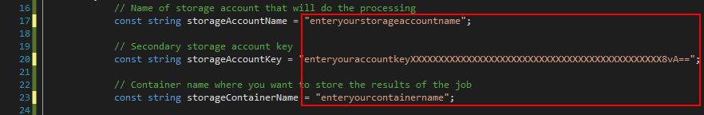
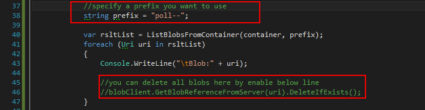

# How to List Azure Storage Blobs by Prefix
## Requires
- Visual Studio 2015
## License
- Apache License, Version 2.0
## Technologies
- Azure
- Storage
- Cloud
- Azure Data Services
## Topics
- Azure
- Storage
- Cloud
- Azure Data Services
## Updated
- 11/10/2016
## Description

List the blobs in a container with the specified prefix

Introduction

&nbsp; 
This is an example of how to list the blobs in a container whose names begin with the specified prefix. The ListBlobs method lists blobs and virtual directories in a container, optionally in segments of a specified
 or default size. You can optionally specify a blob prefix to list the blobs whose names&nbsp;begin with the same string. If you use a delimiter character in your blob names to create a virtual directory structure, the blob prefix&nbsp;will include all or part
 of the virtual directory structure (but not the container name). You can list blobs hierarchically in a manner similar to traversing a file system, or in a flat listing, where all blobs matching the specified prefix are returned by the listing operation. You
 can specify additional details to return with the listing, including copy properties, metadata, snapshots, and uncommitted blobs.

Prerequisites

&nbsp;

1. Azure Account&nbsp;
 
You need an Azure account. You can&nbsp;<a href="https://azure.microsoft.com/pricing/free-trial/?WT.mc_id=A261C142F" style="text-decoration:none">open a free Azure account</a>&nbsp;or&nbsp;<a href="https://azure.microsoft.com/pricing/member-offers/msdn-benefits-details/?WT.mc_id=A261C142F" style="text-decoration:none">Activate
 Visual Studio subscriber benefits</a>.

2. Visual Studio 2015&nbsp;
 
<a href="https://www.visualstudio.com/downloads/" style="text-decoration:none">https://www.visualstudio.com/downloads/</a>

3. Azure SDK&nbsp;
 
The tutorial is written for Visual Studio 2015 with the&nbsp;<a href="https://azure.microsoft.com/en-us/documentation/articles/dotnet-sdk/" style="text-decoration:none">Azure SDK for .NET 2.9</a>&nbsp;or
 later.&nbsp;<a href="http://go.microsoft.com/fwlink/?linkid=518003" style="text-decoration:none">Download the latest Azure SDK for Visual Studio 2015</a>. The
 SDK installs Visual Studio 2015 if you don't already have it.

&nbsp;

Run the sample

&nbsp;

Before you build the solution, please do some modification as below:
 
Please note that the delete operation cannot be undone. So make sure you have 
confirmed the code logic first.

1. Enter your storage account name, account key and container name as below lines.
 

 

2. Please specify your prefix if needed to meet your demands, and enable line 46 when you need to remove those blobs.
 

 

3. Add a threshold parameter for method ListBlobsFromContainer(). (please check the&nbsp;source code for details)

var rsltList = ListBlobsFromContainer(container, prefix,
5000);

&nbsp;

private 
static List&lt;Uri&gt; ListBlobsFromContainer(CloudBlobContainer container,
string prefix,
int threshold)

&nbsp;

if (lstBlobUri.Count &gt; threshold)

{

break;

}

&nbsp;

Microsoft All-In-One Code Framework is a free, centralized code sample library driven by developers' real-world pains and needs. The goal is to provide customer-driven code samples for all Microsoft development technologies,
 and reduce developers' efforts in solving typical programming tasks. Our team listens to developers&rsquo; pains in the MSDN forums, social media and various DEV communities. We write code samples based on developers&rsquo; frequently asked programming tasks,
 and allow developers to download them with a short sample publishing cycle. Additionally, we offer a free code sample request service. It is a proactive way for our developer community to obtain code samples directly from Microsoft.

