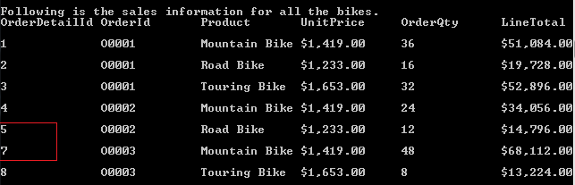

# How to Query in a DataSet with Multiple DataTables
## Requires
- Visual Studio 2012
## License
- Apache License, Version 2.0
## Technologies
- ADO.NET
- Data Access
- .NET Development
## Topics
- query dataset
- expression
## Updated
- 09/21/2016
## Description

<h1><em></em></h1>

複数の DataTable を使用して DataSet をクエリする方法&nbsp;&nbsp;&nbsp;

はじめに

データソースからデータを取得するには通常の SQL クエリを使用できますが、DataSet 内では SQL クエリを使用できません。このサンプルでは、DataSet 内で式を使用してクエリを行なう方法について説明します。

このサンプルでは、DataSet 内で式を使用してクエリを行なう方法について説明します。

1. 2 つの DataTable を持つ DataSet を作成します。

2. この 2 つのテーブル間に制約を作成します。

3. <a href="http://msdn.microsoft.com/ja-jp/library/way3dy9w.aspx" style="text-decoration:none">DataTable.Select メソッド</a>を使用してテーブルから行を取得します。

4. <a href="http://msdn.microsoft.com/ja-jp/library/system.data.datatable.compute.aspx" style="text-decoration:none">DataTable.Compute メソッド</a>を使用して、指定した行を計算します。

5. 前述のメソッドの中で<a href="http://msdn.microsoft.com/ja-jp/library/system.data.datacolumn.expression.aspx" style="text-decoration:none">式</a>を使用してクエリを行ないます。

サンプルの実行

F5 キーを押してサンプルを実行します。

アプリケーションによって、まず、データを&#26684;納する 3 つのテーブルが表示されます。

SalesPerson テーブル:

Order テーブル:

OrderDetail テーブル:

次に、SalesPerson テーブルの複数の Territory を基にして Order テーブルから行を選択した後、合計結果を計算します。
<strong></strong><em></em>

最後に、OrderDetail テーブルから行を選択し、Bike の売り上げ情報をすべて取得します。 <strong>
</strong><em></em>

<strong></strong><em></em>

6 番目の行は Helmet 製品で、今は表示できません。

コードの使用

1. テーブル間に制約を定義します。

Visual BasicC#

Edit|Remove

vbcsharp

<pre class="vb">salesSet.Relations.Add(&quot;OrderOrderDetail&quot;,&nbsp;orderTable.Columns(&quot;OrderId&quot;),&nbsp;
&nbsp;&nbsp;&nbsp;&nbsp;&nbsp;&nbsp;&nbsp;&nbsp;&nbsp;&nbsp;&nbsp;&nbsp;&nbsp;&nbsp;&nbsp;&nbsp;&nbsp;&nbsp;&nbsp;&nbsp;&nbsp;&nbsp;&nbsp;orderDetailTable.Columns(&quot;OrderId&quot;),&nbsp;True)&nbsp;
salesSet.Relations.Add(&quot;SalesPersonOrder&quot;,&nbsp;salesPersonTable.Columns(&quot;PersonId&quot;),&nbsp;
&nbsp;&nbsp;&nbsp;&nbsp;&nbsp;&nbsp;&nbsp;&nbsp;&nbsp;&nbsp;&nbsp;&nbsp;&nbsp;&nbsp;&nbsp;&nbsp;&nbsp;&nbsp;&nbsp;&nbsp;&nbsp;&nbsp;&nbsp;orderTable.Columns(&quot;SalesPerson&quot;),&nbsp;True)</pre>

&nbsp;2. 式列を作成します。

2 つ以上の列で演算を実行する必要がある場合は、DataTable.Compute メソッドを使用するのではなく、<a href="http://msdn.microsoft.com/ja-jp/library/system.data.datacolumn.aspx">DataColumn</a>
 を作成し、その Expression プロパティに該当する式を設定してください。

Visual BasicC#

Edit|Remove

vbcsharp

<pre class="vb">'&nbsp;子テーブルの列で集計&nbsp;Sum&nbsp;を使用して結果を取得します。&nbsp;
Dim&nbsp;colSub&nbsp;As&nbsp;New&nbsp;DataColumn(&quot;SubTotal&quot;,&nbsp;GetType(Decimal),&nbsp;&quot;Sum(Child.LineTotal)&quot;)&nbsp;
orderTable.Columns.Add(colSub)&nbsp;
'&nbsp;SubTotal&nbsp;式列を参照して税を計算します。&nbsp;
Dim&nbsp;colTax&nbsp;As&nbsp;New&nbsp;DataColumn(&quot;Tax&quot;,&nbsp;GetType(Decimal),&nbsp;&quot;SubTotal*0.1&quot;)&nbsp;
orderTable.Columns.Add(colTax)&nbsp;
'&nbsp;OrderId&nbsp;が&nbsp;&quot;Total&quot;&nbsp;の場合はすべての注文の支払い金額を計算し、それ以外の場合はこの注文の金額を計算します。&nbsp;
Dim&nbsp;colTotal&nbsp;As&nbsp;New&nbsp;DataColumn(&quot;TotalDue&quot;,&nbsp;GetType(Decimal),&nbsp;
&nbsp;&nbsp;&nbsp;&nbsp;&nbsp;&nbsp;&nbsp;&nbsp;&nbsp;&nbsp;&nbsp;&nbsp;&nbsp;&nbsp;&nbsp;&nbsp;&nbsp;&nbsp;&nbsp;&nbsp;&nbsp;&nbsp;&nbsp;&nbsp;&nbsp;&nbsp;&nbsp;&nbsp;&nbsp;&nbsp;&nbsp;&quot;IIF(OrderId='Total',Sum(SubTotal)&#43;Sum(Tax),SubTotal&#43;Tax)&quot;)&nbsp;
orderTable.Columns.Add(colTotal)&nbsp;
Dim&nbsp;totalRow&nbsp;As&nbsp;DataRow&nbsp;=&nbsp;orderTable.NewRow()&nbsp;
totalRow(&quot;OrderId&quot;)&nbsp;=&nbsp;&quot;Total&quot;&nbsp;
orderTable.Rows.Add(totalRow)</pre>

&nbsp;3. Select メソッドと Compute メソッドを使用します。

SalesPerson テーブルの Territory を基にして、Select メソッドを使用して行を取得します。また、Compute メソッドを使用して合計結果を取得します。

Visual BasicC#

Edit|Remove

vbcsharp

<pre class="vb">Dim&nbsp;territories()&nbsp;As&nbsp;String&nbsp;=&nbsp;{&quot;Europe&quot;,&nbsp;&quot;North&nbsp;America&quot;}&nbsp;
Console.WriteLine(&quot;Following&nbsp;is&nbsp;the&nbsp;sales&nbsp;information&nbsp;for&nbsp;every&nbsp;territories.&quot;)&nbsp;
For&nbsp;Each&nbsp;territory&nbsp;As&nbsp;String&nbsp;In&nbsp;territories&nbsp;
&nbsp;&nbsp;&nbsp;&nbsp;Dim&nbsp;expression&nbsp;As&nbsp;String&nbsp;=&nbsp;String.Format(&quot;Parent.Territory='{0}'&quot;,&nbsp;territory)&nbsp;
&nbsp;&nbsp;&nbsp;&nbsp;Dim&nbsp;total&nbsp;As&nbsp;Object&nbsp;=&nbsp;orderTable.Compute(&quot;Sum(TotalDue)&quot;,&nbsp;expression)&nbsp;
&nbsp;&nbsp;&nbsp;&nbsp;Console.WriteLine(&quot;Sales&nbsp;information&nbsp;in&nbsp;{0}(Total:{1:C}):&quot;,&nbsp;territory,&nbsp;total)&nbsp;
&nbsp;&nbsp;&nbsp;&nbsp;Dim&nbsp;territoryRows()&nbsp;As&nbsp;DataRow&nbsp;=&nbsp;orderTable.Select(expression)&nbsp;
&nbsp;&nbsp;&nbsp;&nbsp;ShowRows(territoryRows)&nbsp;
Next&nbsp;territory&nbsp;
</pre>

&nbsp;4. Select メソッドと Like を使用します。

Select メソッドと Like を使用してすべての Bike の売り上げ情報を取得します。

Visual BasicC#

Edit|Remove

vbcsharp

<pre class="vb">Console.WriteLine(&quot;Following&nbsp;is&nbsp;the&nbsp;sales&nbsp;information&nbsp;for&nbsp;all&nbsp;the&nbsp;bikes.&quot;)&nbsp;
Dim&nbsp;bikeRows()&nbsp;As&nbsp;DataRow&nbsp;=&nbsp;orderDetailTable.Select(&quot;Product&nbsp;like&nbsp;'*Bike'&quot;)&nbsp;
ShowRows(bikeRows)&nbsp;
&nbsp;
</pre>

&nbsp;詳細

<a href="http://msdn.microsoft.com/ja-jp/library/way3dy9w.aspx" style="text-decoration:none">DataTable.Select メソッド
 (String, String)</a>

<a href="http://msdn.microsoft.com/ja-jp/library/system.data.datatable.compute.aspx" style="text-decoration:none">DataTable.Compute
 メソッド</a>

<a href="http://msdn.microsoft.com/ja-jp/library/system.data.datacolumn.expression.aspx" style="text-decoration:none">DataColumn.Expression
 プロパティ</a> <strong></strong><em></em>

<strong></strong>

Microsoft All-In-One Code Framework is a free, centralized code sample library driven by developers' real-world pains and needs. The goal is to provide customer-driven code samples for all Microsoft development technologies, and
 reduce developers' efforts in solving typical programming tasks. Our team listens to developers&rsquo; pains in the MSDN forums, social media and various DEV communities. We write code samples based on developers&rsquo; frequently asked programming tasks,
 and allow developers to download them with a short sample publishing cycle. Additionally, we offer a free code sample request service. It is a proactive way for our developer community to obtain code samples directly from Microsoft.

<strong></strong><em></em>

