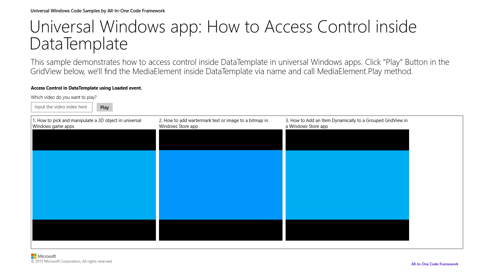

# How to access a control inside an XAML DataTemplate in universal Windows apps
## Requires
- Visual Studio 2013
## License
- Apache License, Version 2.0
## Technologies
- Windows Store app Development
- Windows Phone Development
- Windows 8.1
- Windows Phone 8.1
- universal windows app
## Topics
- DataTemplate
- Access named control
## Updated
- 05/19/2015
## Description

<h1>How to access a control inside an XAML DataTemplate in universal Windows apps</h1>
<h2>Introduction</h2>

DataTemplate is used in repeater controls such as ListView, HubSection and so on. We can access controls in DataTemplate via Binding, and run the similar operations between these controls. However, some customers need to reference controls inside DataTemplate
 by their name. This sample is to demonstrate how to achieve this.

<h2>Building the Sample</h2>

Open the solution file in Visual Studio 2013, then run the sample.

<h2>Running the Sample</h2>

We have three MediaElement controls inside a GridView which include three online videos. We can input the index of the video into the textbox, then click &ldquo;Play&rdquo; to play the matching MediaElement control.

&nbsp;

&nbsp;

<h2>Using the Code</h2>

We show you how to access controls inside DataTemplate via Loaded event. When the Grid inside GridView&rsquo;s DataTemplate loaded, we get this Grid control and add it into a collection.

<pre>

C#

Edit|Remove
csharp<pre class="hidden">private void Grid_Loaded(object sender, RoutedEventArgs e)
        {
            // Add the Grids inside DataTemplate into a List.
            // You can get the controls inside DataTemplate from m_renderedGrids.
            m_renderedGrids.Add(sender as Grid);
        }
 </pre>

<pre class="csharp">private&nbsp;void&nbsp;Grid_Loaded(object&nbsp;sender,&nbsp;RoutedEventArgs&nbsp;e)&nbsp;
&nbsp;&nbsp;&nbsp;&nbsp;&nbsp;&nbsp;&nbsp;&nbsp;{&nbsp;
&nbsp;&nbsp;&nbsp;&nbsp;&nbsp;&nbsp;&nbsp;&nbsp;&nbsp;&nbsp;&nbsp;&nbsp;//&nbsp;Add&nbsp;the&nbsp;Grids&nbsp;inside&nbsp;DataTemplate&nbsp;into&nbsp;a&nbsp;List.&nbsp;
&nbsp;&nbsp;&nbsp;&nbsp;&nbsp;&nbsp;&nbsp;&nbsp;&nbsp;&nbsp;&nbsp;&nbsp;//&nbsp;You&nbsp;can&nbsp;get&nbsp;the&nbsp;controls&nbsp;inside&nbsp;DataTemplate&nbsp;from&nbsp;m_renderedGrids.&nbsp;
&nbsp;&nbsp;&nbsp;&nbsp;&nbsp;&nbsp;&nbsp;&nbsp;&nbsp;&nbsp;&nbsp;&nbsp;m_renderedGrids.Add(sender&nbsp;as&nbsp;Grid);&nbsp;
&nbsp;&nbsp;&nbsp;&nbsp;&nbsp;&nbsp;&nbsp;&nbsp;}&nbsp;
&nbsp;</pre>

&nbsp;

 </pre>

When you click &ldquo;Play&rdquo;, we will get the Grid from the collection through the index. Then we will achieve the MediaElement from this Grid via visual tree.

&nbsp;

C#

Edit|Remove

csharp
<pre class="hidden">private void Button_Click(object sender, RoutedEventArgs e)
        {
            
            try
            {
                int index = int.Parse(tbVideoIndex.Text) - 1;
                Grid currentGrid = m_renderedGrids[index] as Grid;
 
                MediaElement myVideo = (MediaElement)GetChildren(currentGrid).First(x =&gt; x.Name == &quot;myVideo&quot;);
 
                myVideo.Play();
            }
            catch(Exception exception)
            {
                statusText.Text = exception.Message;
            }            
        }
 
        private List&lt;FrameworkElement&gt; GetChildren(DependencyObject parent)
        {
            List&lt;FrameworkElement&gt; controls = new List&lt;FrameworkElement&gt;();
 
            for(int i = 0; i&lt; VisualTreeHelper.GetChildrenCount(parent); &#43;&#43;i)
            {
                var child = VisualTreeHelper.GetChild(parent, i);
                if (child is FrameworkElement)
                {
                    controls.Add(child as FrameworkElement);
                }
                controls.AddRange(GetChildren(child));
            }
 
            return controls;
        }
 </pre>

<pre class="csharp">private&nbsp;void&nbsp;Button_Click(object&nbsp;sender,&nbsp;RoutedEventArgs&nbsp;e)&nbsp;
&nbsp;&nbsp;&nbsp;&nbsp;&nbsp;&nbsp;&nbsp;&nbsp;{&nbsp;
&nbsp;&nbsp;&nbsp;&nbsp;&nbsp;&nbsp;&nbsp;&nbsp;&nbsp;&nbsp;&nbsp;&nbsp;&nbsp;
&nbsp;&nbsp;&nbsp;&nbsp;&nbsp;&nbsp;&nbsp;&nbsp;&nbsp;&nbsp;&nbsp;&nbsp;try&nbsp;
&nbsp;&nbsp;&nbsp;&nbsp;&nbsp;&nbsp;&nbsp;&nbsp;&nbsp;&nbsp;&nbsp;&nbsp;{&nbsp;
&nbsp;&nbsp;&nbsp;&nbsp;&nbsp;&nbsp;&nbsp;&nbsp;&nbsp;&nbsp;&nbsp;&nbsp;&nbsp;&nbsp;&nbsp;&nbsp;int&nbsp;index&nbsp;=&nbsp;int.Parse(tbVideoIndex.Text)&nbsp;-&nbsp;1;&nbsp;
&nbsp;&nbsp;&nbsp;&nbsp;&nbsp;&nbsp;&nbsp;&nbsp;&nbsp;&nbsp;&nbsp;&nbsp;&nbsp;&nbsp;&nbsp;&nbsp;Grid&nbsp;currentGrid&nbsp;=&nbsp;m_renderedGrids[index]&nbsp;as&nbsp;Grid;&nbsp;
&nbsp;&nbsp;
&nbsp;&nbsp;&nbsp;&nbsp;&nbsp;&nbsp;&nbsp;&nbsp;&nbsp;&nbsp;&nbsp;&nbsp;&nbsp;&nbsp;&nbsp;&nbsp;MediaElement&nbsp;myVideo&nbsp;=&nbsp;(MediaElement)GetChildren(currentGrid).First(x&nbsp;=&gt;&nbsp;x.Name&nbsp;==&nbsp;&quot;myVideo&quot;);&nbsp;
&nbsp;&nbsp;
&nbsp;&nbsp;&nbsp;&nbsp;&nbsp;&nbsp;&nbsp;&nbsp;&nbsp;&nbsp;&nbsp;&nbsp;&nbsp;&nbsp;&nbsp;&nbsp;myVideo.Play();&nbsp;
&nbsp;&nbsp;&nbsp;&nbsp;&nbsp;&nbsp;&nbsp;&nbsp;&nbsp;&nbsp;&nbsp;&nbsp;}&nbsp;
&nbsp;&nbsp;&nbsp;&nbsp;&nbsp;&nbsp;&nbsp;&nbsp;&nbsp;&nbsp;&nbsp;&nbsp;catch(Exception&nbsp;exception)&nbsp;
&nbsp;&nbsp;&nbsp;&nbsp;&nbsp;&nbsp;&nbsp;&nbsp;&nbsp;&nbsp;&nbsp;&nbsp;{&nbsp;
&nbsp;&nbsp;&nbsp;&nbsp;&nbsp;&nbsp;&nbsp;&nbsp;&nbsp;&nbsp;&nbsp;&nbsp;&nbsp;&nbsp;&nbsp;&nbsp;statusText.Text&nbsp;=&nbsp;exception.Message;&nbsp;
&nbsp;&nbsp;&nbsp;&nbsp;&nbsp;&nbsp;&nbsp;&nbsp;&nbsp;&nbsp;&nbsp;&nbsp;}&nbsp;&nbsp;&nbsp;&nbsp;&nbsp;&nbsp;&nbsp;&nbsp;&nbsp;&nbsp;&nbsp;&nbsp;&nbsp;
&nbsp;&nbsp;&nbsp;&nbsp;&nbsp;&nbsp;&nbsp;&nbsp;}&nbsp;
&nbsp;&nbsp;
&nbsp;&nbsp;&nbsp;&nbsp;&nbsp;&nbsp;&nbsp;&nbsp;private&nbsp;List&lt;FrameworkElement&gt;&nbsp;GetChildren(DependencyObject&nbsp;parent)&nbsp;
&nbsp;&nbsp;&nbsp;&nbsp;&nbsp;&nbsp;&nbsp;&nbsp;{&nbsp;
&nbsp;&nbsp;&nbsp;&nbsp;&nbsp;&nbsp;&nbsp;&nbsp;&nbsp;&nbsp;&nbsp;&nbsp;List&lt;FrameworkElement&gt;&nbsp;controls&nbsp;=&nbsp;new&nbsp;List&lt;FrameworkElement&gt;();&nbsp;
&nbsp;&nbsp;
&nbsp;&nbsp;&nbsp;&nbsp;&nbsp;&nbsp;&nbsp;&nbsp;&nbsp;&nbsp;&nbsp;&nbsp;for(int&nbsp;i&nbsp;=&nbsp;0;&nbsp;i&lt;&nbsp;VisualTreeHelper.GetChildrenCount(parent);&nbsp;&#43;&#43;i)&nbsp;
&nbsp;&nbsp;&nbsp;&nbsp;&nbsp;&nbsp;&nbsp;&nbsp;&nbsp;&nbsp;&nbsp;&nbsp;{&nbsp;
&nbsp;&nbsp;&nbsp;&nbsp;&nbsp;&nbsp;&nbsp;&nbsp;&nbsp;&nbsp;&nbsp;&nbsp;&nbsp;&nbsp;&nbsp;&nbsp;var&nbsp;child&nbsp;=&nbsp;VisualTreeHelper.GetChild(parent,&nbsp;i);&nbsp;
&nbsp;&nbsp;&nbsp;&nbsp;&nbsp;&nbsp;&nbsp;&nbsp;&nbsp;&nbsp;&nbsp;&nbsp;&nbsp;&nbsp;&nbsp;&nbsp;if&nbsp;(child&nbsp;is&nbsp;FrameworkElement)&nbsp;
&nbsp;&nbsp;&nbsp;&nbsp;&nbsp;&nbsp;&nbsp;&nbsp;&nbsp;&nbsp;&nbsp;&nbsp;&nbsp;&nbsp;&nbsp;&nbsp;{&nbsp;
&nbsp;&nbsp;&nbsp;&nbsp;&nbsp;&nbsp;&nbsp;&nbsp;&nbsp;&nbsp;&nbsp;&nbsp;&nbsp;&nbsp;&nbsp;&nbsp;&nbsp;&nbsp;&nbsp;&nbsp;controls.Add(child&nbsp;as&nbsp;FrameworkElement);&nbsp;
&nbsp;&nbsp;&nbsp;&nbsp;&nbsp;&nbsp;&nbsp;&nbsp;&nbsp;&nbsp;&nbsp;&nbsp;&nbsp;&nbsp;&nbsp;&nbsp;}&nbsp;
&nbsp;&nbsp;&nbsp;&nbsp;&nbsp;&nbsp;&nbsp;&nbsp;&nbsp;&nbsp;&nbsp;&nbsp;&nbsp;&nbsp;&nbsp;&nbsp;controls.AddRange(GetChildren(child));&nbsp;
&nbsp;&nbsp;&nbsp;&nbsp;&nbsp;&nbsp;&nbsp;&nbsp;&nbsp;&nbsp;&nbsp;&nbsp;}&nbsp;
&nbsp;&nbsp;
&nbsp;&nbsp;&nbsp;&nbsp;&nbsp;&nbsp;&nbsp;&nbsp;&nbsp;&nbsp;&nbsp;&nbsp;return&nbsp;controls;&nbsp;
&nbsp;&nbsp;&nbsp;&nbsp;&nbsp;&nbsp;&nbsp;&nbsp;}&nbsp;
&nbsp;</pre>

&nbsp;

&nbsp;

&nbsp;

<h2>More Information</h2>

<a href="http://channel9.msdn.com/Series/Windows-Store-Developer-Solutions/Playing-Hide-and-Go-Seek-with-DataTemplated-Controls">Playing Hide and Go Seek with DataTemplated Controlsh</a>

Microsoft All-In-One Code Framework is a free, centralized code sample library driven by developers' real-world pains and needs. The goal is to provide customer-driven code samples for all Microsoft development technologies,
 and reduce developers' efforts in solving typical programming tasks. Our team listens to developers&rsquo; pains in the MSDN forums, social media and various DEV communities. We write code samples based on developers&rsquo; frequently asked programming tasks,
 and allow developers to download them with a short sample publishing cycle. Additionally, we offer a free code sample request service. It is a proactive way for our developer community to obtain code samples directly from Microsoft.

