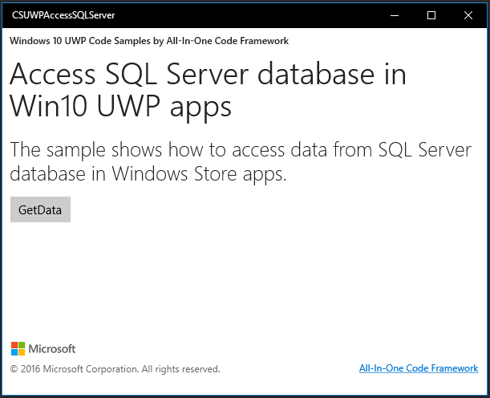
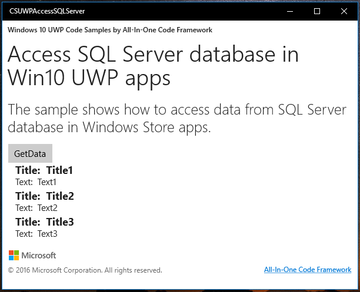

# How to access data from SQL Server database in Win10 UWP
## Requires
- Visual Studio 2015
## License
- Apache License, Version 2.0
## Technologies
- WCF
- SQL Server
- .NET
- Database
- Services
- Universal Windows App Development
## Topics
- WCF
- SQL Server
- UWP
## Updated
- 09/22/2016
## Description

<strong>&nbsp;</strong><em>&nbsp;</em>

How to access data from SQL Server database in Win10 UWP

Introduction

The Sample is upgraded from <a href="https://code.msdn.microsoft.com/How-to-access-data-from-5f2602ec" style="text-decoration:none">https://code.msdn.microsoft.com/How-to-access-data-from-5f2602ec</a>
 for UWP.

Besides, the Sample demonstrates how to access data from SQL Server database in Windows10 UWP app.
Please notice that we cannot directly access SQL Server Database from Windows 10 UWP app.
Instead, we have to create a Service layer to access the database.

Sample prerequisites

To open and run this sample, ensure that the following requisites has been
met:

&bull;&nbsp;Microsoft Windows 10(10.0.14393) or above.

&bull;&nbsp;Microsoft Visual Studio 2015 Update3 or later version(s).

&bull;&nbsp;Microsoft Visual Studio installed UWP developer component.

&bull;&nbsp;Microsoft Visual Studio installed Web developer component.

Building the sample

&bull;&nbsp;Open the sample solution &ldquo;CSUWPAccessSQLServer.sln&rdquo; using Visual Studio.

&bull;&nbsp;In Solution Explorer, right click project &ldquo;CSUWPAccessSQLServer&rdquo; and select
Set as StartUp Project.

<ul>
<li>Deploy you SQL Database, that contain a table called TestTable. The table should contain under field. &nbsp;&nbsp;
</li></ul>

&nbsp; &nbsp; Title varchar(255),&nbsp; &nbsp; 

&nbsp; &nbsp; Text varchar(MAX)

Then insert some data to this table.

<ul>
<li>Config Under sql connect string in Project: AccessSQLService -&gt; Service.svc.cs as your new database. &nbsp;
</li></ul>

Running the sample

&bull;&nbsp;Open the sample solution using Visual studio, then press
F5 Key or select Debug -&gt; Start Debugging in menu.

&bull;&nbsp;When the app is running, you can see this:

&bull;&nbsp;Click the button
GetData, the app will request to WCF service and get the data.

Using the code

&nbsp;In WCF Service

&nbsp;

Article.cs

&nbsp;

C#

Edit|Remove

csharp

<pre class="csharp">[DataContract]&nbsp;
public&nbsp;class&nbsp;Article&nbsp;
{&nbsp;
&nbsp;&nbsp;&nbsp;&nbsp;[DataMember]&nbsp;
&nbsp;&nbsp;&nbsp;&nbsp;public&nbsp;string&nbsp;Title&nbsp;{&nbsp;get;&nbsp;set;&nbsp;}&nbsp;
&nbsp;&nbsp;
&nbsp;&nbsp;&nbsp;&nbsp;[DataMember]&nbsp;
&nbsp;&nbsp;&nbsp;&nbsp;public&nbsp;string&nbsp;Text&nbsp;{&nbsp;get;&nbsp;set;&nbsp;}&nbsp;
}</pre>

&nbsp;

&nbsp;

IService.cs:

&nbsp;

C#

Edit|Remove

csharp

<pre class="csharp">[ServiceContract]&nbsp;
public&nbsp;interface&nbsp;IService&nbsp;
{&nbsp;
&nbsp;&nbsp;&nbsp;&nbsp;[OperationContract]&nbsp;
&nbsp;&nbsp;&nbsp;&nbsp;IList&lt;Article&gt;&nbsp;QueryArticle();&nbsp;
}</pre>

&nbsp;

Service.svc.cs

&nbsp;

C#

Edit|Remove

csharp

<pre class="csharp">public&nbsp;IList&lt;Article&gt;&nbsp;QueryArticle()&nbsp;
{&nbsp;
&nbsp;&nbsp;&nbsp;&nbsp;DataSet&nbsp;ds&nbsp;=&nbsp;new&nbsp;DataSet();&nbsp;
&nbsp;&nbsp;&nbsp;&nbsp;using&nbsp;(SqlConnection&nbsp;sqlCon&nbsp;=&nbsp;new&nbsp;SqlConnection(SqlConStr))&nbsp;
&nbsp;&nbsp;&nbsp;&nbsp;{&nbsp;
&nbsp;&nbsp;&nbsp;&nbsp;&nbsp;&nbsp;&nbsp;&nbsp;try&nbsp;
&nbsp;&nbsp;&nbsp;&nbsp;&nbsp;&nbsp;&nbsp;&nbsp;{&nbsp;
&nbsp;&nbsp;&nbsp;&nbsp;&nbsp;&nbsp;&nbsp;&nbsp;&nbsp;&nbsp;&nbsp;&nbsp;sqlCon.Open();&nbsp;
&nbsp;&nbsp;&nbsp;&nbsp;&nbsp;&nbsp;&nbsp;&nbsp;&nbsp;&nbsp;&nbsp;&nbsp;string&nbsp;sqlStr&nbsp;=&nbsp;&quot;select&nbsp;Title,&nbsp;Text&nbsp;from&nbsp;TestTable&quot;;&nbsp;
&nbsp;&nbsp;&nbsp;&nbsp;&nbsp;&nbsp;&nbsp;&nbsp;&nbsp;&nbsp;&nbsp;&nbsp;SqlDataAdapter&nbsp;sqlDa&nbsp;=&nbsp;new&nbsp;SqlDataAdapter(sqlStr,&nbsp;sqlCon);&nbsp;
&nbsp;&nbsp;&nbsp;&nbsp;&nbsp;&nbsp;&nbsp;&nbsp;&nbsp;&nbsp;&nbsp;&nbsp;sqlDa.Fill(ds);&nbsp;
&nbsp;&nbsp;&nbsp;&nbsp;&nbsp;&nbsp;&nbsp;&nbsp;}&nbsp;
&nbsp;&nbsp;&nbsp;&nbsp;&nbsp;&nbsp;&nbsp;&nbsp;catch&nbsp;
&nbsp;&nbsp;&nbsp;&nbsp;&nbsp;&nbsp;&nbsp;&nbsp;{&nbsp;
&nbsp;&nbsp;&nbsp;&nbsp;&nbsp;&nbsp;&nbsp;&nbsp;&nbsp;&nbsp;&nbsp;&nbsp;return&nbsp;null;&nbsp;
&nbsp;&nbsp;&nbsp;&nbsp;&nbsp;&nbsp;&nbsp;&nbsp;}&nbsp;
&nbsp;&nbsp;&nbsp;&nbsp;&nbsp;&nbsp;&nbsp;&nbsp;finally&nbsp;
&nbsp;&nbsp;&nbsp;&nbsp;&nbsp;&nbsp;&nbsp;&nbsp;{&nbsp;
&nbsp;&nbsp;&nbsp;&nbsp;&nbsp;&nbsp;&nbsp;&nbsp;&nbsp;&nbsp;&nbsp;&nbsp;sqlCon.Close();&nbsp;
&nbsp;&nbsp;&nbsp;&nbsp;&nbsp;&nbsp;&nbsp;&nbsp;}&nbsp;
&nbsp;&nbsp;&nbsp;&nbsp;}&nbsp;
&nbsp;&nbsp;
&nbsp;&nbsp;&nbsp;&nbsp;List&lt;Article&gt;&nbsp;articleList&nbsp;=&nbsp;new&nbsp;List&lt;Article&gt;();&nbsp;
&nbsp;&nbsp;&nbsp;&nbsp;DataTable&nbsp;dt&nbsp;=&nbsp;ds.Tables[0];&nbsp;
&nbsp;&nbsp;&nbsp;&nbsp;foreach&nbsp;(DataRow&nbsp;dr&nbsp;in&nbsp;dt.Rows)&nbsp;
&nbsp;&nbsp;&nbsp;&nbsp;{&nbsp;
&nbsp;&nbsp;&nbsp;&nbsp;&nbsp;&nbsp;&nbsp;&nbsp;articleList.Add(new&nbsp;Article()&nbsp;
&nbsp;&nbsp;&nbsp;&nbsp;&nbsp;&nbsp;&nbsp;&nbsp;&nbsp;&nbsp;&nbsp;&nbsp;{&nbsp;
&nbsp;&nbsp;&nbsp;&nbsp;&nbsp;&nbsp;&nbsp;&nbsp;&nbsp;&nbsp;&nbsp;&nbsp;&nbsp;&nbsp;&nbsp;&nbsp;Title&nbsp;=&nbsp;dr[&quot;Title&quot;]&nbsp;as&nbsp;string,&nbsp;
&nbsp;&nbsp;&nbsp;&nbsp;&nbsp;&nbsp;&nbsp;&nbsp;&nbsp;&nbsp;&nbsp;&nbsp;&nbsp;&nbsp;&nbsp;&nbsp;Text&nbsp;=&nbsp;dr[&quot;Text&quot;]&nbsp;as&nbsp;string&nbsp;
&nbsp;&nbsp;&nbsp;&nbsp;&nbsp;&nbsp;&nbsp;&nbsp;&nbsp;&nbsp;&nbsp;&nbsp;});&nbsp;
&nbsp;&nbsp;&nbsp;&nbsp;}&nbsp;
&nbsp;&nbsp;
&nbsp;&nbsp;&nbsp;&nbsp;return&nbsp;articleList;&nbsp;
}</pre>

&nbsp;

In UWP Client:

MainPage.xaml.cs

&nbsp;

C#

Edit|Remove

csharp

<pre class="csharp">private&nbsp;async&nbsp;void&nbsp;GetButton_Click(object&nbsp;sender,&nbsp;RoutedEventArgs&nbsp;e)&nbsp;
{&nbsp;
&nbsp;&nbsp;&nbsp;&nbsp;ServiceClient&nbsp;client&nbsp;=&nbsp;new&nbsp;ServiceClient();&nbsp;
&nbsp;&nbsp;&nbsp;&nbsp;IList&lt;Article&gt;&nbsp;articleList&nbsp;=&nbsp;await&nbsp;client.QueryArticleAsync();&nbsp;
&nbsp;&nbsp;
&nbsp;&nbsp;&nbsp;&nbsp;//set&nbsp;the&nbsp;result&nbsp;to&nbsp;UI&nbsp;
&nbsp;&nbsp;&nbsp;&nbsp;lvDataTemplates.ItemsSource&nbsp;=&nbsp;articleList;&nbsp;
}</pre>

&nbsp;

More information

Win8.1 Version: <a href="https://code.msdn.microsoft.com/How-to-access-data-from-5f2602ec" style="text-decoration:none">https://code.msdn.microsoft.com/How-to-access-data-from-5f2602ec</a>

&nbsp;

&nbsp;

Microsoft All-In-One Code Framework is a free, centralized code sample library driven by developers' real-world pains and needs. The goal is to provide customer-driven code samples for all Microsoft development technologies,
 and reduce developers' efforts in solving typical programming tasks. Our team listens to developers&rsquo; pains in the MSDN forums, social media and various DEV communities. We write code samples based on developers&rsquo; frequently asked programming tasks,
 and allow developers to download them with a short sample publishing cycle. Additionally, we offer a free code sample request service. It is a proactive way for our developer community to obtain code samples directly from Microsoft.

