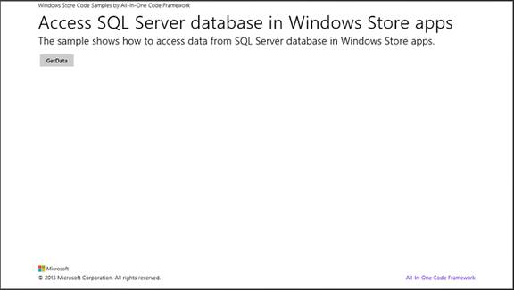
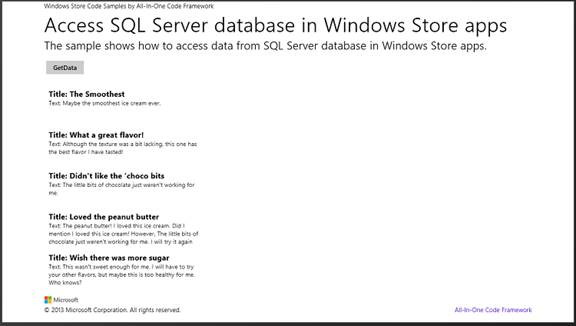

# How to access data from SQL Server database in Windows Store app
## Requires
- Visual Studio 2013
## License
- Apache License, Version 2.0
## Technologies
- Windows
- Windows 8
- App-Entwicklung für Windows
## Topics
- WinJS
- access data from SQL server
- Zugriff auf Daten aus SQL Server
## Updated
- 10/31/2016
## Description

<h1><em></em></h1>
<h1>如何從 Windows 市集應用程式中的 SQL Server 資料庫存取資料 (JSWindowsStoreAppAccessSQLServer)</h1>
<h2>簡介</h2>

​此範例示範如何從 Windows 市集應用程式中的 SQL Server 資料庫存取資料。我們無法直接從 Windows 市集應用程式存取 SQL Server 資料庫。我們必須建立服務層才能存取資料庫。

<h2>建置範例</h2>

1.&nbsp;&nbsp;&nbsp;&nbsp;&nbsp;&nbsp;啟動 Visual Studio 2013 並選取 [檔案] &gt; [開啟] &gt; [專案/方案]。

2.&nbsp;&nbsp;&nbsp;&nbsp;&nbsp;&nbsp;移至您下載此範例的目錄。移至該目錄並為範例命名，然後按兩下 Microsoft Visual Studio 方案 (.sln) 檔案。

3.&nbsp;&nbsp;&nbsp;&nbsp;&nbsp;&nbsp;按下 F7 或使用 [建置] &gt; [建置方案] 以建置範例。

<h2>執行範例 </h2>

按一下 ['GetData' ] 按鈕從 Web 服務取得結果，您會看到下列結果。<strong>&nbsp;</strong><em>&nbsp;</em>

<h2>使用程式碼</h2>

1. 使用 Visual Studio 2013 建立 Widnows 市集應用程式專案。

2. 將 WCF 服務應用程式專案新增至解決方案

3. 透過下列程式碼片段建立 WCF 服務。 

C#

Edit|Remove

csharp

<pre class="csharp">[ServiceContract]&nbsp;
&nbsp;&nbsp;&nbsp;&nbsp;publicinterface&nbsp;IService&nbsp;
&nbsp;&nbsp;&nbsp;&nbsp;{&nbsp;
&nbsp;&nbsp;&nbsp;&nbsp;&nbsp;&nbsp;&nbsp;&nbsp;//&nbsp;查詢資料&nbsp;
&nbsp;&nbsp;&nbsp;&nbsp;&nbsp;&nbsp;&nbsp;&nbsp;[OperationContract]&nbsp;
&nbsp;&nbsp;&nbsp;&nbsp;&nbsp;&nbsp;&nbsp;&nbsp;DataSet&nbsp;querySql();&nbsp;
&nbsp;&nbsp;&nbsp;&nbsp;}&nbsp;
publicclass&nbsp;Service&nbsp;:&nbsp;IService&nbsp;
&nbsp;&nbsp;&nbsp;&nbsp;{&nbsp;
&nbsp;&nbsp;&nbsp;&nbsp;&nbsp;&nbsp;&nbsp;&nbsp;///&nbsp;&lt;summary&gt;///&nbsp;查詢&nbsp;TestTable&nbsp;中的資料///&nbsp;&lt;/summary&gt;///&nbsp;&lt;returns&gt;&lt;/returns&gt;&nbsp;
&nbsp;&nbsp;&nbsp;&nbsp;&nbsp;&nbsp;&nbsp;&nbsp;&nbsp;
&nbsp;&nbsp;&nbsp;&nbsp;&nbsp;&nbsp;&nbsp;&nbsp;SqlConnection&nbsp;sqlCon&nbsp;=&nbsp;new&nbsp;SqlConnection(&quot;Data&nbsp;Source=(local);Initial&nbsp;Catalog=Test;Integrated&nbsp;Security&nbsp;=SSPI;&quot;);&nbsp;
&nbsp;&nbsp;&nbsp;&nbsp;&nbsp;&nbsp;&nbsp;&nbsp;public&nbsp;DataSet&nbsp;querySql()&nbsp;
&nbsp;&nbsp;&nbsp;&nbsp;&nbsp;&nbsp;&nbsp;&nbsp;{&nbsp;
&nbsp;&nbsp;&nbsp;&nbsp;&nbsp;&nbsp;&nbsp;&nbsp;&nbsp;&nbsp;&nbsp;&nbsp;try&nbsp;
&nbsp;&nbsp;&nbsp;&nbsp;&nbsp;&nbsp;&nbsp;&nbsp;&nbsp;&nbsp;&nbsp;&nbsp;{&nbsp;
&nbsp;&nbsp;&nbsp;&nbsp;&nbsp;&nbsp;&nbsp;&nbsp;&nbsp;&nbsp;&nbsp;&nbsp;&nbsp;&nbsp;&nbsp;&nbsp;sqlCon.Open();&nbsp;
&nbsp;&nbsp;&nbsp;&nbsp;&nbsp;&nbsp;&nbsp;&nbsp;&nbsp;&nbsp;&nbsp;&nbsp;&nbsp;&nbsp;&nbsp;&nbsp;string&nbsp;strSql&nbsp;=&nbsp;&quot;select&nbsp;Title,&nbsp;Text&nbsp;from&nbsp;TestTable&quot;;&nbsp;
&nbsp;&nbsp;&nbsp;&nbsp;&nbsp;&nbsp;&nbsp;&nbsp;&nbsp;&nbsp;&nbsp;&nbsp;&nbsp;&nbsp;&nbsp;&nbsp;DataSet&nbsp;ds&nbsp;=&nbsp;new&nbsp;DataSet();&nbsp;
&nbsp;&nbsp;&nbsp;&nbsp;&nbsp;&nbsp;&nbsp;&nbsp;&nbsp;&nbsp;&nbsp;&nbsp;&nbsp;&nbsp;&nbsp;&nbsp;SqlDataAdapter&nbsp;sqlDa&nbsp;=&nbsp;new&nbsp;SqlDataAdapter(strSql,sqlCon);&nbsp;
&nbsp;&nbsp;&nbsp;&nbsp;&nbsp;&nbsp;&nbsp;&nbsp;&nbsp;&nbsp;&nbsp;&nbsp;&nbsp;&nbsp;&nbsp;&nbsp;sqlDa.Fill(ds);&nbsp;
&nbsp;&nbsp;&nbsp;&nbsp;&nbsp;&nbsp;&nbsp;&nbsp;&nbsp;&nbsp;&nbsp;&nbsp;&nbsp;&nbsp;&nbsp;&nbsp;return&nbsp;ds;&nbsp;
&nbsp;&nbsp;&nbsp;&nbsp;&nbsp;&nbsp;&nbsp;&nbsp;&nbsp;&nbsp;&nbsp;&nbsp;}&nbsp;
&nbsp;&nbsp;&nbsp;&nbsp;&nbsp;&nbsp;&nbsp;&nbsp;&nbsp;&nbsp;&nbsp;&nbsp;finally&nbsp;
&nbsp;&nbsp;&nbsp;&nbsp;&nbsp;&nbsp;&nbsp;&nbsp;&nbsp;&nbsp;&nbsp;&nbsp;{&nbsp;
&nbsp;&nbsp;&nbsp;&nbsp;&nbsp;&nbsp;&nbsp;&nbsp;&nbsp;&nbsp;&nbsp;&nbsp;&nbsp;&nbsp;&nbsp;&nbsp;sqlCon.Close();&nbsp;
&nbsp;&nbsp;&nbsp;&nbsp;&nbsp;&nbsp;&nbsp;&nbsp;&nbsp;&nbsp;&nbsp;&nbsp;}&nbsp;
&nbsp;&nbsp;&nbsp;&nbsp;&nbsp;&nbsp;&nbsp;&nbsp;}&nbsp;
&nbsp;&nbsp;&nbsp;&nbsp;}&nbsp;
</pre>

4. 插入下列 JavaScript 程式碼片段以處理 [&quot;GetData&quot; ] 按鈕的 Click 事件。

JavaScript

Edit|Remove

js

<pre class="js">//&nbsp;[GetData]&nbsp;按鈕的事件處理常式function&nbsp;getDatabuttonclick()&nbsp;
&nbsp;&nbsp;&nbsp;{//&nbsp;清除錯誤訊息&nbsp;
&nbsp;&nbsp;&nbsp;&nbsp;&nbsp;&nbsp;&nbsp;document.getElementById('error').innerText&nbsp;=&nbsp;&quot;&quot;;&nbsp;
&nbsp;&nbsp;&nbsp;&nbsp;&nbsp;&nbsp;&nbsp;document.getElementById('getdatabtn').style.setAttribute(&quot;disabled&quot;,&nbsp;&quot;disabled&quot;);&nbsp;
&nbsp;&nbsp;&nbsp;&nbsp;&nbsp;&nbsp;&nbsp;var&nbsp;baseURI&nbsp;=&nbsp;&quot;http://localhost:42920/Service.svc/querySql&quot;;&nbsp;
&nbsp;&nbsp;&nbsp;&nbsp;&nbsp;&nbsp;&nbsp;var&nbsp;xmlDoc;&nbsp;
&nbsp;&nbsp;&nbsp;&nbsp;&nbsp;&nbsp;&nbsp;WinJS.xhr({&nbsp;
&nbsp;&nbsp;&nbsp;&nbsp;&nbsp;&nbsp;&nbsp;&nbsp;&nbsp;&nbsp;&nbsp;type:&quot;get&quot;,&nbsp;
&nbsp;&nbsp;&nbsp;&nbsp;&nbsp;&nbsp;&nbsp;&nbsp;&nbsp;&nbsp;&nbsp;url:&nbsp;baseURI&nbsp;
&nbsp;&nbsp;&nbsp;&nbsp;&nbsp;&nbsp;&nbsp;}).then(function&nbsp;(response)&nbsp;{if&nbsp;(eval('('&nbsp;&#43;&nbsp;response.responseText&nbsp;&#43;&nbsp;')').queryParam&nbsp;==&nbsp;true)&nbsp;{var&nbsp;items&nbsp;=&nbsp;[];&nbsp;
&nbsp;&nbsp;&nbsp;&nbsp;&nbsp;&nbsp;&nbsp;&nbsp;&nbsp;&nbsp;&nbsp;&nbsp;&nbsp;&nbsp;&nbsp;var&nbsp;resulttxt&nbsp;=&nbsp;eval('('&nbsp;&#43;&nbsp;response.responseText&nbsp;&#43;&nbsp;')').querySqlResult;&nbsp;&nbsp;&nbsp;&nbsp;&nbsp;&nbsp;&nbsp;&nbsp;&nbsp;&nbsp;&nbsp;&nbsp;&nbsp;&nbsp;&nbsp;&nbsp;
&nbsp;&nbsp;&nbsp;&nbsp;&nbsp;&nbsp;&nbsp;&nbsp;&nbsp;&nbsp;&nbsp;&nbsp;&nbsp;&nbsp;&nbsp;if&nbsp;(window.DOMParser)&nbsp;{var&nbsp;parser&nbsp;=&nbsp;new&nbsp;DOMParser();&nbsp;
&nbsp;&nbsp;&nbsp;&nbsp;&nbsp;&nbsp;&nbsp;&nbsp;&nbsp;&nbsp;&nbsp;&nbsp;&nbsp;&nbsp;&nbsp;&nbsp;&nbsp;&nbsp;&nbsp;xmlDoc&nbsp;=&nbsp;parser.parseFromString(resulttxt,&nbsp;&quot;text/xml&quot;);&nbsp;
&nbsp;&nbsp;&nbsp;&nbsp;&nbsp;&nbsp;&nbsp;&nbsp;&nbsp;&nbsp;&nbsp;&nbsp;&nbsp;&nbsp;&nbsp;&nbsp;&nbsp;&nbsp;&nbsp;
&nbsp;&nbsp;&nbsp;&nbsp;&nbsp;&nbsp;&nbsp;&nbsp;&nbsp;&nbsp;&nbsp;&nbsp;&nbsp;&nbsp;&nbsp;}else{//&nbsp;Internet&nbsp;Explorer&nbsp;
&nbsp;&nbsp;&nbsp;&nbsp;&nbsp;&nbsp;&nbsp;&nbsp;&nbsp;&nbsp;&nbsp;&nbsp;&nbsp;&nbsp;&nbsp;&nbsp;&nbsp;&nbsp;&nbsp;xmlDoc&nbsp;=&nbsp;new&nbsp;ActiveXObject(&quot;Microsoft.XMLDOM&quot;);&nbsp;
&nbsp;&nbsp;&nbsp;&nbsp;&nbsp;&nbsp;&nbsp;&nbsp;&nbsp;&nbsp;&nbsp;&nbsp;&nbsp;&nbsp;&nbsp;&nbsp;&nbsp;&nbsp;&nbsp;xmlDoc.async&nbsp;=&nbsp;false;&nbsp;
&nbsp;&nbsp;&nbsp;&nbsp;&nbsp;&nbsp;&nbsp;&nbsp;&nbsp;&nbsp;&nbsp;&nbsp;&nbsp;&nbsp;&nbsp;&nbsp;&nbsp;&nbsp;&nbsp;xmlDoc.loadXML(resulttxt);&nbsp;
&nbsp;&nbsp;&nbsp;&nbsp;&nbsp;&nbsp;&nbsp;&nbsp;&nbsp;&nbsp;&nbsp;&nbsp;&nbsp;&nbsp;&nbsp;}var&nbsp;nodes&nbsp;=&nbsp;xmlDoc.querySelectorAll(&quot;Table&quot;);&nbsp;
&nbsp;&nbsp;&nbsp;&nbsp;&nbsp;&nbsp;&nbsp;&nbsp;&nbsp;&nbsp;&nbsp;&nbsp;&nbsp;&nbsp;&nbsp;&nbsp;
&nbsp;&nbsp;&nbsp;&nbsp;&nbsp;&nbsp;&nbsp;&nbsp;&nbsp;&nbsp;&nbsp;&nbsp;&nbsp;&nbsp;&nbsp;for&nbsp;(var&nbsp;i&nbsp;=&nbsp;0;&nbsp;i&nbsp;&lt;&nbsp;nodes.length;&nbsp;i&#43;&#43;)&nbsp;
&nbsp;&nbsp;&nbsp;&nbsp;&nbsp;&nbsp;&nbsp;&nbsp;&nbsp;&nbsp;&nbsp;&nbsp;&nbsp;&nbsp;&nbsp;{var&nbsp;item&nbsp;=newObject();&nbsp;
&nbsp;&nbsp;&nbsp;&nbsp;&nbsp;&nbsp;&nbsp;&nbsp;&nbsp;&nbsp;&nbsp;&nbsp;&nbsp;&nbsp;&nbsp;&nbsp;&nbsp;&nbsp;&nbsp;item.Title=nodes[i].childNodes[0].textContent;&nbsp;
&nbsp;&nbsp;&nbsp;&nbsp;&nbsp;&nbsp;&nbsp;&nbsp;&nbsp;&nbsp;&nbsp;&nbsp;&nbsp;&nbsp;&nbsp;&nbsp;&nbsp;&nbsp;&nbsp;item.Text&nbsp;=nodes[i].childNodes[1].textContent;&nbsp;
&nbsp;&nbsp;&nbsp;&nbsp;&nbsp;&nbsp;&nbsp;&nbsp;&nbsp;&nbsp;&nbsp;&nbsp;&nbsp;&nbsp;&nbsp;&nbsp;&nbsp;&nbsp;&nbsp;items.push(item);&nbsp;
&nbsp;&nbsp;&nbsp;&nbsp;&nbsp;&nbsp;&nbsp;&nbsp;&nbsp;&nbsp;&nbsp;&nbsp;&nbsp;&nbsp;&nbsp;}var&nbsp;list&nbsp;=&nbsp;new&nbsp;WinJS.Binding.List(items);&nbsp;
&nbsp;&nbsp;&nbsp;&nbsp;&nbsp;&nbsp;&nbsp;&nbsp;&nbsp;&nbsp;&nbsp;&nbsp;&nbsp;&nbsp;&nbsp;document.getElementById('listView').winControl.itemDataSource&nbsp;=&nbsp;list.dataSource;&nbsp;
&nbsp;&nbsp;&nbsp;&nbsp;&nbsp;&nbsp;&nbsp;&nbsp;&nbsp;&nbsp;&nbsp;&nbsp;&nbsp;&nbsp;&nbsp;document.getElementById('getdatabtn').removeAttribute(&quot;disabled&quot;);&nbsp;
&nbsp;&nbsp;&nbsp;&nbsp;&nbsp;&nbsp;&nbsp;&nbsp;&nbsp;&nbsp;&nbsp;}else{&nbsp;
&nbsp;&nbsp;&nbsp;&nbsp;&nbsp;&nbsp;&nbsp;&nbsp;&nbsp;&nbsp;&nbsp;&nbsp;&nbsp;&nbsp;&nbsp;writeError(&quot;Error&nbsp;occurs.&nbsp;Please&nbsp;make&nbsp;sure&nbsp;the&nbsp;database&nbsp;has&nbsp;been&nbsp;attached&nbsp;to&nbsp;SQL&nbsp;Server!&quot;);&nbsp;
&nbsp;&nbsp;&nbsp;&nbsp;&nbsp;&nbsp;&nbsp;&nbsp;&nbsp;&nbsp;&nbsp;}});&nbsp;
&nbsp;&nbsp;&nbsp;}</pre>

<h2>其他相關資訊</h2>

&nbsp;parseFromString 方法：

<a href="http://msdn.microsoft.com/zh-tw/library/windows/apps/hh770806.aspx">http://msdn.microsoft.com/zh-tw/library/windows/apps/hh770806.aspx</a> (英文)

WinJS.UI.ListView 物件：

<a href="http://msdn.microsoft.com/zh-tw/library/windows/apps/br211837.aspx#properties">http://msdn.microsoft.com/zh-tw/library/windows/apps/br211837.aspx#properties</a> (英文)<strong>&nbsp;</strong><em>&nbsp;</em>

&nbsp;

&nbsp;

Microsoft All-In-One Code Framework is a free, centralized code sample library driven by developers' real-world pains and needs. The goal is to provide customer-driven code samples for all Microsoft development technologies, and
 reduce developers' efforts in solving typical programming tasks. Our team listens to developers&rsquo; pains in the MSDN forums, social media and various DEV communities. We write code samples based on developers&rsquo; frequently asked programming tasks,
 and allow developers to download them with a short sample publishing cycle. Additionally, we offer a free code sample request service. It is a proactive way for our developer community to obtain code samples directly from Microsoft.

<strong>&nbsp;</strong><em>&nbsp;</em>

&nbsp;

&nbsp;

&nbsp;

&nbsp;

<em> 
</em>

