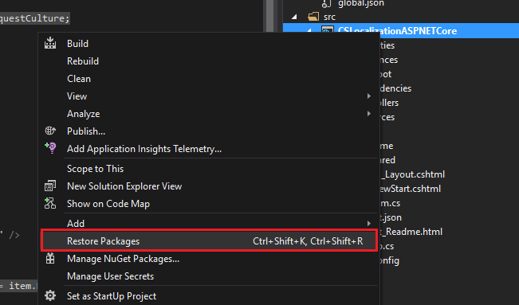
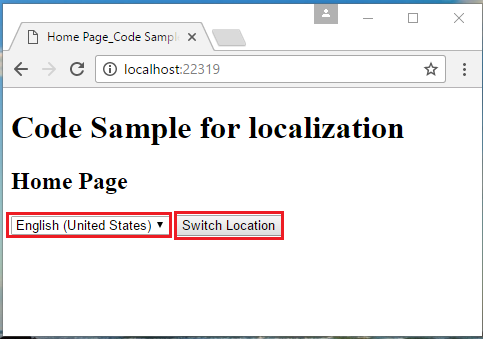
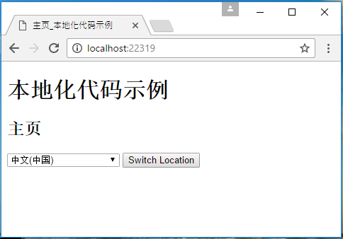

# How to achieve a localization web application in ASP.NET Core
## Requires
- Visual Studio 2015
## License
- Apache License, Version 2.0
## Technologies
- ASP.NET
- .NET
- localization
- Web App Development
## Topics
- localization
- ASP.NET Core
## Updated
- 03/08/2017
## Description

How to achieve a localization web application in ASP.NET Core

Introduction

This sample will demonstrates how to set localization of your web site in ASP.NET Core.

Sample prerequisites

.NET Core 1.0 or later version(s). <a href="https://go.microsoft.com/fwlink/?LinkID=827546" style="text-decoration:none">[.NET Core &#43; Visual Studio tooling</a>]

Microsoft Visual Studio 2015 update3 or above. [<a href="https://www.visualstudio.com/https://www.microsoft.com/en-sg/download/details.aspx?id=48146" style="text-decoration:none">Visual
 Studio 2015</a>]

Building the sample

&bull;&nbsp;Open the sample solution &ldquo;CSLocalizationASPNETCore.sln&rdquo; using Visual Studio.

&bull;&nbsp;Right click on the project &ldquo;CSLocalizationASPNETCore&rdquo; and select Restore packages.

&nbsp;

&bull;&nbsp;Press
F6 Key or select Build -&gt; Build Solution from the menu to build the sample.

Running the sample

&bull;&nbsp;Open the Sample solution using Visual Studio, then press
F5 Key or select Debug -&gt; Start Debugging from the menu.

&bull;&nbsp;When the web application is running, you can see&nbsp;the below&nbsp;page in&nbsp;your&nbsp;browser.

&nbsp;

&bull;&nbsp;Choose a language at
dropdown list, and click 
Switch Location button.

&bull;&nbsp;The language will be updated&nbsp;according to your&nbsp;choice.

Using the code

The Resource and Views look like this:

&nbsp;

&nbsp;In Startup.cs

&nbsp;

C#

Edit|Remove

csharp

<pre class="csharp">public&nbsp;void&nbsp;ConfigureServices(IServiceCollection&nbsp;services)&nbsp;
{&nbsp;
&nbsp;&nbsp;&nbsp;&nbsp;services.AddLocalization(opts&nbsp;=&gt;&nbsp;{&nbsp;opts.ResourcesPath&nbsp;=&nbsp;&quot;Resources&quot;;&nbsp;});&nbsp;
&nbsp;
&nbsp;&nbsp;&nbsp;&nbsp;services.AddMvc()&nbsp;
&nbsp;&nbsp;&nbsp;&nbsp;&nbsp;&nbsp;&nbsp;&nbsp;.AddViewLocalization(&nbsp;
&nbsp;&nbsp;&nbsp;&nbsp;&nbsp;&nbsp;&nbsp;&nbsp;&nbsp;&nbsp;&nbsp;&nbsp;Microsoft.AspNetCore.Mvc.Razor.LanguageViewLocationExpanderFormat.SubFolder,&nbsp;
&nbsp;&nbsp;&nbsp;&nbsp;&nbsp;&nbsp;&nbsp;&nbsp;&nbsp;&nbsp;&nbsp;&nbsp;opts&nbsp;=&gt;&nbsp;{&nbsp;opts.ResourcesPath&nbsp;=&nbsp;&quot;Resources&quot;;&nbsp;}&nbsp;
&nbsp;&nbsp;&nbsp;&nbsp;&nbsp;&nbsp;&nbsp;&nbsp;)&nbsp;
&nbsp;&nbsp;&nbsp;&nbsp;&nbsp;&nbsp;&nbsp;&nbsp;.AddDataAnnotationsLocalization();&nbsp;
&nbsp;
&nbsp;&nbsp;&nbsp;&nbsp;services.Configure&lt;RequestLocalizationOptions&gt;(opts&nbsp;=&gt;&nbsp;
&nbsp;&nbsp;&nbsp;&nbsp;{&nbsp;
&nbsp;&nbsp;&nbsp;&nbsp;&nbsp;&nbsp;&nbsp;&nbsp;var&nbsp;supportedCultures&nbsp;=&nbsp;new[]&nbsp;
&nbsp;&nbsp;&nbsp;&nbsp;&nbsp;&nbsp;&nbsp;&nbsp;{&nbsp;
&nbsp;&nbsp;&nbsp;&nbsp;&nbsp;&nbsp;&nbsp;&nbsp;&nbsp;&nbsp;&nbsp;&nbsp;new&nbsp;CultureInfo(&quot;en-US&quot;),&nbsp;
&nbsp;&nbsp;&nbsp;&nbsp;&nbsp;&nbsp;&nbsp;&nbsp;&nbsp;&nbsp;&nbsp;&nbsp;new&nbsp;CultureInfo(&quot;ja-JP&quot;),&nbsp;
&nbsp;&nbsp;&nbsp;&nbsp;&nbsp;&nbsp;&nbsp;&nbsp;&nbsp;&nbsp;&nbsp;&nbsp;new&nbsp;CultureInfo(&quot;zh-CN&quot;)&nbsp;
&nbsp;&nbsp;&nbsp;&nbsp;&nbsp;&nbsp;&nbsp;&nbsp;};&nbsp;
&nbsp;&nbsp;&nbsp;&nbsp;&nbsp;&nbsp;&nbsp;&nbsp;opts.DefaultRequestCulture&nbsp;=&nbsp;new&nbsp;Microsoft.AspNetCore.Localization.RequestCulture(&quot;en-US&quot;);&nbsp;
&nbsp;&nbsp;&nbsp;&nbsp;&nbsp;&nbsp;&nbsp;&nbsp;opts.SupportedCultures&nbsp;=&nbsp;supportedCultures;&nbsp;
&nbsp;&nbsp;&nbsp;&nbsp;&nbsp;&nbsp;&nbsp;&nbsp;opts.SupportedUICultures&nbsp;=&nbsp;supportedCultures;&nbsp;
&nbsp;&nbsp;&nbsp;&nbsp;});&nbsp;
}&nbsp;
&nbsp;
//&nbsp;This&nbsp;method&nbsp;gets&nbsp;called&nbsp;by&nbsp;the&nbsp;runtime.&nbsp;Use&nbsp;this&nbsp;method&nbsp;to&nbsp;configure&nbsp;the&nbsp;HTTP&nbsp;request&nbsp;pipeline.&nbsp;
public&nbsp;void&nbsp;Configure(IApplicationBuilder&nbsp;app,&nbsp;IHostingEnvironment&nbsp;env,&nbsp;ILoggerFactory&nbsp;loggerFactory)&nbsp;
{&nbsp;
&nbsp;&nbsp;&nbsp;&nbsp;app.UseRequestLocalization();&nbsp;
&nbsp;
&nbsp;&nbsp;&nbsp;&nbsp;app.UseMvc(routes&nbsp;=&gt;&nbsp;
&nbsp;&nbsp;&nbsp;&nbsp;{&nbsp;
&nbsp;&nbsp;&nbsp;&nbsp;&nbsp;&nbsp;&nbsp;&nbsp;routes.MapRoute(name:&nbsp;&quot;default&quot;,&nbsp;template:&nbsp;&quot;{controller=Home}/{action=Index}&quot;);&nbsp;
&nbsp;&nbsp;&nbsp;&nbsp;});&nbsp;
}</pre>

&nbsp;In HomeController.cs

&nbsp;

C#

Edit|Remove

csharp

<pre class="csharp">public&nbsp;class&nbsp;HomeController&nbsp;:&nbsp;Controller&nbsp;
{&nbsp;
&nbsp;&nbsp;&nbsp;&nbsp;//you&nbsp;can&nbsp;use&nbsp;the&nbsp;localizer&nbsp;in&nbsp;you&nbsp;controller&nbsp;
&nbsp;&nbsp;&nbsp;&nbsp;private&nbsp;readonly&nbsp;IStringLocalizer&lt;HomeController&gt;&nbsp;_localizer;&nbsp;
&nbsp;
&nbsp;&nbsp;&nbsp;&nbsp;public&nbsp;HomeController(IStringLocalizer&lt;HomeController&gt;&nbsp;localizer)&nbsp;
&nbsp;&nbsp;&nbsp;&nbsp;{&nbsp;
&nbsp;&nbsp;&nbsp;&nbsp;&nbsp;&nbsp;&nbsp;&nbsp;_localizer&nbsp;=&nbsp;localizer;&nbsp;
&nbsp;&nbsp;&nbsp;&nbsp;}&nbsp;
&nbsp;
&nbsp;&nbsp;&nbsp;&nbsp;public&nbsp;IActionResult&nbsp;Index()&nbsp;
&nbsp;&nbsp;&nbsp;&nbsp;{&nbsp;
&nbsp;&nbsp;&nbsp;&nbsp;&nbsp;&nbsp;&nbsp;&nbsp;return&nbsp;View();&nbsp;
&nbsp;&nbsp;&nbsp;&nbsp;}&nbsp;
&nbsp;
&nbsp;&nbsp;&nbsp;&nbsp;public&nbsp;IActionResult&nbsp;SetLanguage(string&nbsp;culture,&nbsp;string&nbsp;returnUrl)&nbsp;
&nbsp;&nbsp;&nbsp;&nbsp;{&nbsp;
&nbsp;&nbsp;&nbsp;&nbsp;&nbsp;&nbsp;&nbsp;&nbsp;Response.Cookies.Append(&nbsp;
&nbsp;&nbsp;&nbsp;&nbsp;&nbsp;&nbsp;&nbsp;&nbsp;&nbsp;&nbsp;&nbsp;&nbsp;CookieRequestCultureProvider.DefaultCookieName,&nbsp;
&nbsp;&nbsp;&nbsp;&nbsp;&nbsp;&nbsp;&nbsp;&nbsp;&nbsp;&nbsp;&nbsp;&nbsp;CookieRequestCultureProvider.MakeCookieValue(new&nbsp;RequestCulture(culture)),&nbsp;
&nbsp;&nbsp;&nbsp;&nbsp;&nbsp;&nbsp;&nbsp;&nbsp;&nbsp;&nbsp;&nbsp;&nbsp;new&nbsp;CookieOptions&nbsp;{&nbsp;Expires&nbsp;=&nbsp;DateTimeOffset.UtcNow.AddYears(1)&nbsp;}&nbsp;
&nbsp;&nbsp;&nbsp;&nbsp;&nbsp;&nbsp;&nbsp;&nbsp;);&nbsp;
&nbsp;
&nbsp;&nbsp;&nbsp;&nbsp;&nbsp;&nbsp;&nbsp;&nbsp;return&nbsp;LocalRedirect(returnUrl);&nbsp;
&nbsp;&nbsp;&nbsp;&nbsp;}&nbsp;
}&nbsp;</pre>

&nbsp;

&nbsp;

_Layout.cshtml

&nbsp;

HTML

Edit|Remove

html

<pre class="html">@using&nbsp;Microsoft.AspNetCore.Builder&nbsp;
@using&nbsp;Microsoft.AspNetCore.Localization&nbsp;
@using&nbsp;Microsoft.AspNetCore.Mvc.Localization&nbsp;
@using&nbsp;Microsoft.Extensions.Options&nbsp;
&nbsp;
@inject&nbsp;IViewLocalizer&nbsp;Localizer&nbsp;
@inject&nbsp;IOptions&lt;RequestLocalizationOptions&gt;&nbsp;LocOptions&nbsp;
@{&nbsp;
&nbsp;&nbsp;&nbsp;&nbsp;var&nbsp;cultureItems&nbsp;=&nbsp;LocOptions.Value.SupportedUICultures.ToList();&nbsp;
&nbsp;&nbsp;&nbsp;&nbsp;var&nbsp;currentCulture&nbsp;=&nbsp;Context.Features.Get&lt;IRequestCultureFeature&gt;().RequestCulture;&nbsp;
&nbsp;
&nbsp;&nbsp;&nbsp;&nbsp;var&nbsp;sampleTitle&nbsp;=&nbsp;Localizer[&quot;Code&nbsp;Sample&nbsp;for&nbsp;localization&quot;];&nbsp;
}&nbsp;
&lt;!DOCTYPE&nbsp;html&gt;&nbsp;
&nbsp;
&lt;html&gt;&nbsp;
&lt;head&gt;&nbsp;
&nbsp;&nbsp;&nbsp;&nbsp;&lt;meta&nbsp;name=&quot;viewport&quot;&nbsp;content=&quot;width=device-width&quot;&nbsp;/&gt;&nbsp;
&nbsp;&nbsp;&nbsp;&nbsp;&lt;title&gt;@(ViewBag.Title)_@sampleTitle&lt;/title&gt;&nbsp;
&lt;/head&gt;&nbsp;
&lt;body&gt;&nbsp;
&nbsp;&nbsp;&nbsp;&nbsp;&lt;h1&gt;@sampleTitle&lt;/h1&gt;&nbsp;
&nbsp;&nbsp;&nbsp;&nbsp;&lt;div&gt;&nbsp;
&nbsp;&nbsp;&nbsp;&nbsp;&nbsp;&nbsp;&nbsp;&nbsp;@RenderBody()&nbsp;
&nbsp;&nbsp;&nbsp;&nbsp;&lt;/div&gt;&nbsp;
&nbsp;&nbsp;&nbsp;&nbsp;&lt;form&nbsp;action=&quot;/Home/SetLanguage&quot;&gt;&nbsp;
&nbsp;&nbsp;&nbsp;&nbsp;&nbsp;&nbsp;&nbsp;&nbsp;&lt;input&nbsp;name=&quot;returnUrl&quot;&nbsp;type=&quot;hidden&quot;&nbsp;value=&quot;@Context.Request.Path&quot;&nbsp;/&gt;&nbsp;
&nbsp;&nbsp;&nbsp;&nbsp;&nbsp;&nbsp;&nbsp;&nbsp;&lt;select&nbsp;name=&quot;culture&quot;&gt;&nbsp;
&nbsp;&nbsp;&nbsp;&nbsp;&nbsp;&nbsp;&nbsp;&nbsp;&nbsp;&nbsp;&nbsp;&nbsp;@foreach&nbsp;(var&nbsp;item&nbsp;in&nbsp;cultureItems)&nbsp;
&nbsp;&nbsp;&nbsp;&nbsp;&nbsp;&nbsp;&nbsp;&nbsp;&nbsp;&nbsp;&nbsp;&nbsp;{&nbsp;
&nbsp;&nbsp;&nbsp;&nbsp;&nbsp;&nbsp;&nbsp;&nbsp;&nbsp;&nbsp;&nbsp;&nbsp;&nbsp;&nbsp;&nbsp;&nbsp;&lt;option&nbsp;value=&quot;@item.Name&quot;&nbsp;@(currentCulture.Culture.Name&nbsp;==&nbsp;item.Name&nbsp;?&nbsp;&quot;selected&quot;&nbsp;:&nbsp;&quot;&quot;)&gt;&nbsp;
&nbsp;&nbsp;&nbsp;&nbsp;&nbsp;&nbsp;&nbsp;&nbsp;&nbsp;&nbsp;&nbsp;&nbsp;&nbsp;&nbsp;&nbsp;&nbsp;&nbsp;&nbsp;&nbsp;&nbsp;@item.DisplayName&nbsp;
&nbsp;&nbsp;&nbsp;&nbsp;&nbsp;&nbsp;&nbsp;&nbsp;&nbsp;&nbsp;&nbsp;&nbsp;&nbsp;&nbsp;&nbsp;&nbsp;&lt;/option&gt;&nbsp;
&nbsp;&nbsp;&nbsp;&nbsp;&nbsp;&nbsp;&nbsp;&nbsp;&nbsp;&nbsp;&nbsp;&nbsp;}&nbsp;
&nbsp;&nbsp;&nbsp;&nbsp;&nbsp;&nbsp;&nbsp;&nbsp;&lt;/select&gt;&nbsp;
&nbsp;&nbsp;&nbsp;&nbsp;&nbsp;&nbsp;&nbsp;&nbsp;&lt;button&nbsp;type=&quot;submit&quot;&gt;Switch&nbsp;Location&lt;/button&gt;&nbsp;
&nbsp;&nbsp;&nbsp;&nbsp;&lt;/form&gt;&nbsp;
&lt;/body&gt;&nbsp;
&lt;/html&gt;</pre>

&nbsp;

&nbsp;

Index.cshtml

&nbsp;

HTML

Edit|Remove

html

<pre class="html">@using&nbsp;Microsoft.AspNetCore.Mvc.Localization&nbsp;
@inject&nbsp;IViewLocalizer&nbsp;LocOptions&nbsp;
@{&nbsp;&nbsp;
&nbsp;&nbsp;&nbsp;&nbsp;ViewData[&quot;Title&quot;]&nbsp;=&nbsp;LocOptions[&quot;Home&nbsp;Page&quot;];&nbsp;
}&nbsp;
&nbsp;
&lt;h2&gt;@ViewData[&quot;Title&quot;]&lt;/h2&gt;</pre>

&nbsp;

More information

Globalization and localization

<a href="https://docs.asp.net/en/latest/fundamentals/localization.html" style="text-decoration:none">https://docs.asp.net/en/latest/fundamentals/localization.html</a>

&nbsp;

&nbsp;

Microsoft All-In-One Code Framework is a free, centralized code sample library driven by developers' real-world pains and needs. The goal is to provide customer-driven code samples for all Microsoft development technologies,
 and reduce developers' efforts in solving typical programming tasks. Our team listens to developers&rsquo; pains in the MSDN forums, social media and various DEV communities. We write code samples based on developers&rsquo; frequently asked programming tasks,
 and allow developers to download them with a short sample publishing cycle. Additionally, we offer a free code sample request service. It is a proactive way for our developer community to obtain code samples directly from Microsoft.

