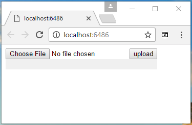

# How to achieve upload progress bar in ASP.NET Core
## Requires
- Visual Studio 2015
## License
- Apache License, Version 2.0
## Technologies
- jQuery
- Javascript
## Topics
- ASP.NET Core
- Upload progress bar
## Updated
- 03/09/2017
## Description

How to achieve upload progress bar in ASP.NET Core

Introduction

We can use the FormData Object as the data payload, use ajax to send it, and subscribe &ldquo;progress&rdquo; event of XMLHttpRequest.upload to monitor upload progress.

This sample demonstrates how to achieve it in ASP.NET Core.

Sample prerequisites

&bull;&nbsp;IE 10 or above versions

&bull;&nbsp;.NET Core 1.0 or later version(s). [<a href="https://go.microsoft.com/fwlink/?LinkID=827546" style="text-decoration:none">.NET
 Core &#43; Visual Studio tooling</a>]

&bull;&nbsp;Microsoft Visual Studio 2015 update3 or above. [<a href="https://www.microsoft.com/en-sg/download/details.aspx?id=48146" style="text-decoration:none">Visual
 Studio 2015 installer</a>]

Building the sample

&bull;&nbsp;Open the sample solution &ldquo;CSUploadProgressBar.sln&rdquo; using Visual Studio.

&bull;&nbsp;Right click on the project &ldquo;CSUploadProgressBar&rdquo; and select Restore packages.

&bull;&nbsp;Press
F6 Key or select Build -&gt; Build Solution from the menu to build the sample.

Running the sample

&bull;&nbsp;Open the sample solution using Visual Studio, then press F5 Key or select Debug -&gt; Start Debugging from the menu.

&bull;&nbsp;When the web application is running, you can see the below page in the browser.

&nbsp;

&bull;&nbsp;Click
Choose File to select a large file, then click the
upload button.

&nbsp;

&bull;&nbsp;When upload is finished, the color of the progress&nbsp;will&nbsp;turn to&nbsp;green.

Using the code

At web.config, you need to set the maxRequestLength.

&nbsp;

XML

Edit|Remove

xml

<pre class="xml">&lt;configuration&gt;&nbsp;
&nbsp;&nbsp;&lt;system.web&gt;&nbsp;
&nbsp;&nbsp;&nbsp;&nbsp;&lt;httpRuntime&nbsp;executionTimeout=&quot;100000&quot;&nbsp;maxRequestLength=&quot;524288000&quot;&nbsp;/&gt;&nbsp;
&nbsp;&nbsp;&lt;/system.web&gt;&nbsp;
&nbsp;&nbsp;&lt;system.webServer&gt;&nbsp;
&nbsp;&nbsp;&nbsp;&nbsp;&lt;security&gt;&nbsp;
&nbsp;&nbsp;&nbsp;&nbsp;&nbsp;&nbsp;&lt;requestFiltering&gt;&nbsp;
&nbsp;&nbsp;&nbsp;&nbsp;&nbsp;&nbsp;&nbsp;&nbsp;&lt;requestLimits&nbsp;maxAllowedContentLength=&quot;524288000&quot;&nbsp;/&gt;&nbsp;
&nbsp;&nbsp;&nbsp;&nbsp;&nbsp;&nbsp;&lt;/requestFiltering&gt;&nbsp;
&nbsp;&nbsp;&nbsp;&nbsp;&lt;/security&gt;&nbsp;
&nbsp;&nbsp;&lt;/system.webServer&gt;&nbsp;
&lt;/configuration&gt;&nbsp;</pre>

&nbsp;

&nbsp;The following things need to be configured at&nbsp;Startup.cs again.

&nbsp;

C#

Edit|Remove

csharp

<pre class="csharp">&nbsp;&nbsp;&nbsp;&nbsp;&nbsp;&nbsp;&nbsp;&nbsp;public&nbsp;void&nbsp;ConfigureServices(IServiceCollection&nbsp;services)&nbsp;
&nbsp;&nbsp;&nbsp;&nbsp;&nbsp;&nbsp;&nbsp;&nbsp;{&nbsp;
&nbsp;&nbsp;&nbsp;&nbsp;&nbsp;&nbsp;&nbsp;&nbsp;&nbsp;&nbsp;&nbsp;&nbsp;services.AddMvc();&nbsp;
&nbsp;&nbsp;&nbsp;&nbsp;&nbsp;&nbsp;&nbsp;&nbsp;&nbsp;&nbsp;&nbsp;&nbsp;services.Configure&lt;FormOptions&gt;(x&nbsp;=&gt;&nbsp;
&nbsp;&nbsp;&nbsp;&nbsp;&nbsp;&nbsp;&nbsp;&nbsp;&nbsp;&nbsp;&nbsp;&nbsp;{&nbsp;
&nbsp;&nbsp;&nbsp;&nbsp;&nbsp;&nbsp;&nbsp;&nbsp;&nbsp;&nbsp;&nbsp;&nbsp;&nbsp;&nbsp;&nbsp;&nbsp;x.ValueLengthLimit&nbsp;=&nbsp;int.MaxValue;&nbsp;
&nbsp;&nbsp;&nbsp;&nbsp;&nbsp;&nbsp;&nbsp;&nbsp;&nbsp;&nbsp;&nbsp;&nbsp;&nbsp;&nbsp;&nbsp;&nbsp;x.MultipartBodyLengthLimit&nbsp;=&nbsp;int.MaxValue;&nbsp;
&nbsp;&nbsp;&nbsp;&nbsp;&nbsp;&nbsp;&nbsp;&nbsp;&nbsp;&nbsp;&nbsp;&nbsp;});&nbsp;
&nbsp;&nbsp;&nbsp;&nbsp;&nbsp;&nbsp;&nbsp;&nbsp;}&nbsp;</pre>

&nbsp;

In Controller, this is just an upload target address.

&nbsp;

C#

Edit|Remove

csharp

<pre class="csharp">&nbsp;&nbsp;&nbsp;&nbsp;public&nbsp;class&nbsp;HomeController&nbsp;:&nbsp;Controller&nbsp;
&nbsp;&nbsp;&nbsp;&nbsp;{&nbsp;
&nbsp;&nbsp;&nbsp;&nbsp;&nbsp;&nbsp;&nbsp;&nbsp;public&nbsp;IActionResult&nbsp;Index()&nbsp;
&nbsp;&nbsp;&nbsp;&nbsp;&nbsp;&nbsp;&nbsp;&nbsp;{&nbsp;
&nbsp;&nbsp;&nbsp;&nbsp;&nbsp;&nbsp;&nbsp;&nbsp;&nbsp;&nbsp;&nbsp;&nbsp;return&nbsp;View();&nbsp;
&nbsp;&nbsp;&nbsp;&nbsp;&nbsp;&nbsp;&nbsp;&nbsp;}&nbsp;
&nbsp;
&nbsp;&nbsp;&nbsp;&nbsp;&nbsp;&nbsp;&nbsp;&nbsp;public&nbsp;JsonResult&nbsp;UploadFile(IList&lt;IFormFile&gt;&nbsp;files)&nbsp;
&nbsp;&nbsp;&nbsp;&nbsp;&nbsp;&nbsp;&nbsp;&nbsp;{&nbsp;
&nbsp;&nbsp;&nbsp;&nbsp;&nbsp;&nbsp;&nbsp;&nbsp;&nbsp;&nbsp;&nbsp;&nbsp;return&nbsp;Json(new&nbsp;{&nbsp;state&nbsp;=&nbsp;0,&nbsp;message&nbsp;=&nbsp;string.Empty&nbsp;});&nbsp;
&nbsp;&nbsp;&nbsp;&nbsp;&nbsp;&nbsp;&nbsp;&nbsp;}&nbsp;
&nbsp;&nbsp;&nbsp;&nbsp;}&nbsp;</pre>

&nbsp;

Finally&nbsp;comes the core code.

&nbsp;

HTML

Edit|Remove

html

<pre class="html">&nbsp;&nbsp;&nbsp;&nbsp;&lt;input&nbsp;type=&quot;file&quot;&nbsp;id=&quot;file&quot;&nbsp;/&gt;&nbsp;
&nbsp;&nbsp;&nbsp;&nbsp;&lt;button&gt;upload&lt;/button&gt;&nbsp;
&nbsp;
&nbsp;&nbsp;&nbsp;&nbsp;&lt;div&nbsp;style=&quot;position:relative;width:296px;background:#f0f0f0&quot;&gt;&nbsp;
&nbsp;&nbsp;&nbsp;&nbsp;&nbsp;&nbsp;&nbsp;&nbsp;&lt;div&nbsp;id=&quot;progress&quot;&nbsp;style=&quot;background:&nbsp;blue;&nbsp;height:&nbsp;20px;width:0&quot;&gt;&lt;/div&gt;&nbsp;
&nbsp;&nbsp;&nbsp;&nbsp;&lt;/div&gt;&nbsp;
&nbsp;
&nbsp;&nbsp;&nbsp;&nbsp;&lt;script&gt;&nbsp;
&nbsp;&nbsp;&nbsp;&nbsp;&nbsp;&nbsp;&nbsp;&nbsp;$(&quot;button&quot;).click(function&nbsp;()&nbsp;{&nbsp;
&nbsp;&nbsp;&nbsp;&nbsp;&nbsp;&nbsp;&nbsp;&nbsp;&nbsp;&nbsp;&nbsp;&nbsp;var&nbsp;progressEle&nbsp;=&nbsp;$(&quot;#progress&quot;);&nbsp;
&nbsp;&nbsp;&nbsp;&nbsp;&nbsp;&nbsp;&nbsp;&nbsp;&nbsp;&nbsp;&nbsp;&nbsp;progressEle.css(&quot;background&quot;,&nbsp;&quot;blue&quot;);&nbsp;
&nbsp;
&nbsp;&nbsp;&nbsp;&nbsp;&nbsp;&nbsp;&nbsp;&nbsp;&nbsp;&nbsp;&nbsp;&nbsp;var&nbsp;data&nbsp;=&nbsp;document.getElementById(&quot;file&quot;).files[0];&nbsp;
&nbsp;
&nbsp;&nbsp;&nbsp;&nbsp;&nbsp;&nbsp;&nbsp;&nbsp;&nbsp;&nbsp;&nbsp;&nbsp;var&nbsp;formData&nbsp;=&nbsp;new&nbsp;FormData();&nbsp;
&nbsp;
&nbsp;&nbsp;&nbsp;&nbsp;&nbsp;&nbsp;&nbsp;&nbsp;&nbsp;&nbsp;&nbsp;&nbsp;formData.append(&quot;files&quot;,&nbsp;data);&nbsp;
&nbsp;
&nbsp;&nbsp;&nbsp;&nbsp;&nbsp;&nbsp;&nbsp;&nbsp;&nbsp;&nbsp;&nbsp;&nbsp;$.ajax({&nbsp;
&nbsp;&nbsp;&nbsp;&nbsp;&nbsp;&nbsp;&nbsp;&nbsp;&nbsp;&nbsp;&nbsp;&nbsp;&nbsp;&nbsp;&nbsp;&nbsp;url:&nbsp;&quot;/Home/UploadFile&quot;,&nbsp;
&nbsp;&nbsp;&nbsp;&nbsp;&nbsp;&nbsp;&nbsp;&nbsp;&nbsp;&nbsp;&nbsp;&nbsp;&nbsp;&nbsp;&nbsp;&nbsp;data:&nbsp;formData,&nbsp;
&nbsp;&nbsp;&nbsp;&nbsp;&nbsp;&nbsp;&nbsp;&nbsp;&nbsp;&nbsp;&nbsp;&nbsp;&nbsp;&nbsp;&nbsp;&nbsp;processData:&nbsp;false,&nbsp;
&nbsp;&nbsp;&nbsp;&nbsp;&nbsp;&nbsp;&nbsp;&nbsp;&nbsp;&nbsp;&nbsp;&nbsp;&nbsp;&nbsp;&nbsp;&nbsp;contentType:&nbsp;false,&nbsp;
&nbsp;&nbsp;&nbsp;&nbsp;&nbsp;&nbsp;&nbsp;&nbsp;&nbsp;&nbsp;&nbsp;&nbsp;&nbsp;&nbsp;&nbsp;&nbsp;type:&nbsp;&quot;POST&quot;,&nbsp;
&nbsp;&nbsp;&nbsp;&nbsp;&nbsp;&nbsp;&nbsp;&nbsp;&nbsp;&nbsp;&nbsp;&nbsp;&nbsp;&nbsp;&nbsp;&nbsp;xhr:&nbsp;function&nbsp;()&nbsp;{&nbsp;
&nbsp;&nbsp;&nbsp;&nbsp;&nbsp;&nbsp;&nbsp;&nbsp;&nbsp;&nbsp;&nbsp;&nbsp;&nbsp;&nbsp;&nbsp;&nbsp;&nbsp;&nbsp;&nbsp;&nbsp;var&nbsp;xhr&nbsp;=&nbsp;new&nbsp;window.XMLHttpRequest();&nbsp;
&nbsp;&nbsp;&nbsp;&nbsp;&nbsp;&nbsp;&nbsp;&nbsp;&nbsp;&nbsp;&nbsp;&nbsp;&nbsp;&nbsp;&nbsp;&nbsp;&nbsp;&nbsp;&nbsp;&nbsp;xhr.upload.addEventListener(&quot;progress&quot;,&nbsp;function&nbsp;(evt)&nbsp;{&nbsp;
&nbsp;&nbsp;&nbsp;&nbsp;&nbsp;&nbsp;&nbsp;&nbsp;&nbsp;&nbsp;&nbsp;&nbsp;&nbsp;&nbsp;&nbsp;&nbsp;&nbsp;&nbsp;&nbsp;&nbsp;&nbsp;&nbsp;&nbsp;&nbsp;if&nbsp;(evt.lengthComputable)&nbsp;{&nbsp;
&nbsp;&nbsp;&nbsp;&nbsp;&nbsp;&nbsp;&nbsp;&nbsp;&nbsp;&nbsp;&nbsp;&nbsp;&nbsp;&nbsp;&nbsp;&nbsp;&nbsp;&nbsp;&nbsp;&nbsp;&nbsp;&nbsp;&nbsp;&nbsp;&nbsp;&nbsp;&nbsp;&nbsp;var&nbsp;progress&nbsp;=&nbsp;Math.round((evt.loaded&nbsp;/&nbsp;evt.total)&nbsp;*&nbsp;100);&nbsp;
&nbsp;&nbsp;&nbsp;&nbsp;&nbsp;&nbsp;&nbsp;&nbsp;&nbsp;&nbsp;&nbsp;&nbsp;&nbsp;&nbsp;&nbsp;&nbsp;&nbsp;&nbsp;&nbsp;&nbsp;&nbsp;&nbsp;&nbsp;&nbsp;&nbsp;&nbsp;&nbsp;&nbsp;progressEle.width(progress&nbsp;&#43;&nbsp;&quot;%&quot;);&nbsp;
&nbsp;&nbsp;&nbsp;&nbsp;&nbsp;&nbsp;&nbsp;&nbsp;&nbsp;&nbsp;&nbsp;&nbsp;&nbsp;&nbsp;&nbsp;&nbsp;&nbsp;&nbsp;&nbsp;&nbsp;&nbsp;&nbsp;&nbsp;&nbsp;}&nbsp;
&nbsp;&nbsp;&nbsp;&nbsp;&nbsp;&nbsp;&nbsp;&nbsp;&nbsp;&nbsp;&nbsp;&nbsp;&nbsp;&nbsp;&nbsp;&nbsp;&nbsp;&nbsp;&nbsp;&nbsp;},&nbsp;false);&nbsp;
&nbsp;&nbsp;&nbsp;&nbsp;&nbsp;&nbsp;&nbsp;&nbsp;&nbsp;&nbsp;&nbsp;&nbsp;&nbsp;&nbsp;&nbsp;&nbsp;&nbsp;&nbsp;&nbsp;&nbsp;return&nbsp;xhr;&nbsp;
&nbsp;&nbsp;&nbsp;&nbsp;&nbsp;&nbsp;&nbsp;&nbsp;&nbsp;&nbsp;&nbsp;&nbsp;&nbsp;&nbsp;&nbsp;&nbsp;},&nbsp;
&nbsp;&nbsp;&nbsp;&nbsp;&nbsp;&nbsp;&nbsp;&nbsp;&nbsp;&nbsp;&nbsp;&nbsp;&nbsp;&nbsp;&nbsp;&nbsp;success:&nbsp;function&nbsp;(data)&nbsp;{&nbsp;
&nbsp;&nbsp;&nbsp;&nbsp;&nbsp;&nbsp;&nbsp;&nbsp;&nbsp;&nbsp;&nbsp;&nbsp;&nbsp;&nbsp;&nbsp;&nbsp;&nbsp;&nbsp;&nbsp;&nbsp;if&nbsp;(data.state&nbsp;==&nbsp;0)&nbsp;{&nbsp;
&nbsp;&nbsp;&nbsp;&nbsp;&nbsp;&nbsp;&nbsp;&nbsp;&nbsp;&nbsp;&nbsp;&nbsp;&nbsp;&nbsp;&nbsp;&nbsp;&nbsp;&nbsp;&nbsp;&nbsp;&nbsp;&nbsp;&nbsp;&nbsp;progressEle.css(&quot;background&quot;,&nbsp;&quot;green&quot;);&nbsp;
&nbsp;&nbsp;&nbsp;&nbsp;&nbsp;&nbsp;&nbsp;&nbsp;&nbsp;&nbsp;&nbsp;&nbsp;&nbsp;&nbsp;&nbsp;&nbsp;&nbsp;&nbsp;&nbsp;&nbsp;}&nbsp;
&nbsp;&nbsp;&nbsp;&nbsp;&nbsp;&nbsp;&nbsp;&nbsp;&nbsp;&nbsp;&nbsp;&nbsp;&nbsp;&nbsp;&nbsp;&nbsp;}&nbsp;
&nbsp;&nbsp;&nbsp;&nbsp;&nbsp;&nbsp;&nbsp;&nbsp;&nbsp;&nbsp;&nbsp;&nbsp;});&nbsp;
&nbsp;&nbsp;&nbsp;&nbsp;&nbsp;&nbsp;&nbsp;&nbsp;});&nbsp;
&nbsp;&nbsp;&nbsp;&nbsp;&lt;/script&gt;&nbsp;</pre>

&nbsp;

More information

Upload large file to ASP.NET Core

<a href="https://docs.microsoft.com/en-us/aspnet/core/mvc/models/file-uploads" style="text-decoration:none">https://docs.microsoft.com/en-us/aspnet/core/mvc/models/file-uploads</a>

<a href="https://www.codeproject.com/Questions/1115853/Increase-upload-file-size-in-ASP-NET-core" style="text-decoration:none">https://www.codeproject.com/Questions/1115853/Increase-upload-file-size-in-ASP-NET-core</a>

&nbsp;

MDN document

<a href="https://developer.mozilla.org/en-US/docs/Web/API/FormData" style="text-decoration:none">https://developer.mozilla.org/en-US/docs/Web/API/FormData</a>

<a href="https://developer.mozilla.org/en-US/docs/Web/API/XMLHttpRequest/Using_XMLHttpRequest#Submitting_forms_and_uploading_files" style="text-decoration:none">https://developer.mozilla.org/en-US/docs/Web/API/XMLHttpRequest/Using_XMLHttpRequest#Submitting_forms_and_uploading_files</a>

Microsoft All-In-One Code Framework is a free, centralized code sample library driven by developers' real-world pains and needs. The goal is to provide customer-driven code samples for all Microsoft development technologies,
 and reduce developers' efforts in solving typical programming tasks. Our team listens to developers&rsquo; pains in the MSDN forums, social media and various DEV communities. We write code samples based on developers&rsquo; frequently asked programming tasks,
 and allow developers to download them with a short sample publishing cycle. Additionally, we offer a free code sample request service. It is a proactive way for our developer community to obtain code samples directly from Microsoft.

