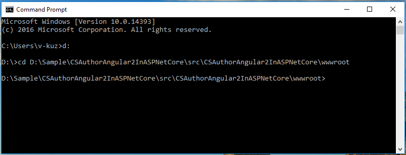
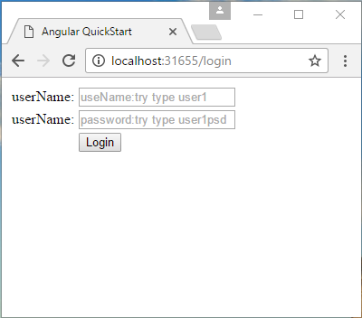
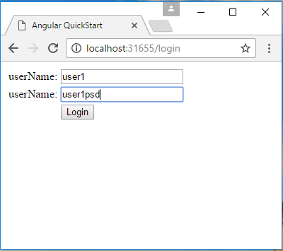

# How to authorize Angular 2 app with asp.net core web api
## Requires
- Visual Studio 2015
## License
- Apache License, Version 2.0
## Technologies
- Security
- .NET
- Authorization
## Topics
- Security
- ASP.NET Core
- Angular 2
- Token Authorization
## Updated
- 03/29/2017
## Description

如何使用 ASP.NET Core Web API 授權 Angular 2 應用程式

簡介

ASP.NET Core 是適用於 Web 的全新跨平台架構，而 angular 2 是適用於前端的新架構。

&nbsp;

此範例將會說明如何使用 ASP.NET Core Web API 授權 Angular 2 應用程式。

範例先決條件

&bull;&nbsp;.NET Core 1.0 或更新版本。[<a href="https://go.microsoft.com/fwlink/?LinkID=827546" style="text-decoration:none">.NET
 Core &#43; Visual Studio 工具</a>]

&bull;&nbsp;Microsoft Visual Studio 2015 Update 3 或更新版本。[<a href="https://www.microsoft.com/en-sg/download/details.aspx?id=48146" style="text-decoration:none">Visual
 Studio 2015 安裝程式</a>]

&bull;&nbsp;Node.js v5.0.0 或更新版本。[<a href="https://nodejs.org/en/" style="text-decoration:none">Node.js
 和 NPM</a>]

&bull;&nbsp;Npm 3.0.0 或更新版本。[<a href="https://nodejs.org/en/" style="text-decoration:none">Node.js 和 NPM</a>]

建置範例

&bull;&nbsp;按下
win &#43; R 並輸入 &nbsp;cmd，以開啟 [命令列] 視窗。

&nbsp;

&bull;&nbsp;移至此方案的
wwwroot 資料夾。

&nbsp;

&bull;&nbsp;輸入命令
npm install，然後 npm 隨即安裝封裝。

&nbsp;

&bull;&nbsp;使用 Visual Studio 開啟資料夾 &ldquo;CSAuthorAngular2InASPNetCore&rdquo; 中的範例方案 &ldquo;CSAuthorAngular2InASPNetCore.sln&rdquo;。

&bull;&nbsp;以滑鼠右鍵按一下專案 &ldquo;CSAuthorAngular2InASPNetCore&rdquo; 並選取 [還原封裝]。

&nbsp;

&bull;&nbsp;按下
F6 鍵或從功能表選取 
[建置] -&gt; [建置方案]，以建置範例。

&nbsp;

執行範例

&bull;&nbsp;使用 Visual Studio 開啟範例方案，然後按下
F5 鍵或選取功能表中的 [偵錯] -&gt; [開始偵錯]。

&bull;&nbsp;當 Web 應用程式執行時，您會在瀏覽器中看到此頁面：

&nbsp;

&bull;&nbsp;按一下
[登入] 連結，前往登入頁面。

&nbsp;

&bull;&nbsp;輸入使用者名稱
user1，密碼 user1psd，然後按一下
[登入] 按鈕。

&nbsp;

&bull;&nbsp;輸入正確的使用者名稱和密碼之後，應用程式會路由到「首頁」。&nbsp;您可以在首頁看到您的使用者名稱。&nbsp;&nbsp;

使用程式碼

&nbsp;後端

Startup.cs

&nbsp;

C#

Edit|Remove

csharp

<pre class="csharp">public&nbsp;void&nbsp;ConfigureServices(IServiceCollection&nbsp;services)&nbsp;
{&nbsp;
&nbsp;&nbsp;&nbsp;&nbsp;services.AddApplicationInsightsTelemetry(Configuration);&nbsp;
&nbsp;
&nbsp;&nbsp;&nbsp;&nbsp;services.AddAuthorization(auth&nbsp;=&gt;&nbsp;
&nbsp;&nbsp;&nbsp;&nbsp;{&nbsp;
&nbsp;&nbsp;&nbsp;&nbsp;&nbsp;&nbsp;&nbsp;&nbsp;auth.AddPolicy(&quot;Bearer&quot;,&nbsp;new&nbsp;AuthorizationPolicyBuilder()&nbsp;
&nbsp;&nbsp;&nbsp;&nbsp;&nbsp;&nbsp;&nbsp;&nbsp;&nbsp;&nbsp;&nbsp;&nbsp;.AddAuthenticationSchemes(JwtBearerDefaults.AuthenticationScheme)&nbsp;
&nbsp;&nbsp;&nbsp;&nbsp;&nbsp;&nbsp;&nbsp;&nbsp;&nbsp;&nbsp;&nbsp;&nbsp;.RequireAuthenticatedUser().Build());&nbsp;
&nbsp;&nbsp;&nbsp;&nbsp;});&nbsp;
&nbsp;
&nbsp;&nbsp;&nbsp;&nbsp;services.AddMvc();&nbsp;
}&nbsp;
&nbsp;
public&nbsp;void&nbsp;Configure(IApplicationBuilder&nbsp;app,&nbsp;IHostingEnvironment&nbsp;env,&nbsp;ILoggerFactory&nbsp;loggerFactory)&nbsp;
{&nbsp;
&nbsp;&nbsp;&nbsp;&nbsp;app.UseApplicationInsightsRequestTelemetry();&nbsp;
&nbsp;
&nbsp;&nbsp;&nbsp;&nbsp;app.UseApplicationInsightsExceptionTelemetry();&nbsp;
&nbsp;
&nbsp;&nbsp;&nbsp;&nbsp;#region&nbsp;static&nbsp;files&nbsp;
&nbsp;&nbsp;&nbsp;&nbsp;app.UseStaticFiles();&nbsp;
&nbsp;&nbsp;&nbsp;&nbsp;#endregion&nbsp;
&nbsp;
&nbsp;&nbsp;&nbsp;&nbsp;#region&nbsp;Handle&nbsp;Exception&nbsp;
&nbsp;&nbsp;&nbsp;&nbsp;app.UseExceptionHandler(appBuilder&nbsp;=&gt;&nbsp;
&nbsp;&nbsp;&nbsp;&nbsp;{&nbsp;
&nbsp;&nbsp;&nbsp;&nbsp;&nbsp;&nbsp;&nbsp;&nbsp;appBuilder.Use(async&nbsp;(context,&nbsp;next)&nbsp;=&gt;&nbsp;
&nbsp;&nbsp;&nbsp;&nbsp;&nbsp;&nbsp;&nbsp;&nbsp;{&nbsp;
&nbsp;&nbsp;&nbsp;&nbsp;&nbsp;&nbsp;&nbsp;&nbsp;&nbsp;&nbsp;&nbsp;&nbsp;var&nbsp;error&nbsp;=&nbsp;context.Features[typeof(IExceptionHandlerFeature)]&nbsp;as&nbsp;IExceptionHandlerFeature;&nbsp;
&nbsp;
&nbsp;&nbsp;&nbsp;&nbsp;&nbsp;&nbsp;&nbsp;&nbsp;&nbsp;&nbsp;&nbsp;&nbsp;if&nbsp;(error&nbsp;!=&nbsp;null&nbsp;&amp;&amp;&nbsp;error.Error&nbsp;is&nbsp;SecurityTokenExpiredException)&nbsp;
&nbsp;&nbsp;&nbsp;&nbsp;&nbsp;&nbsp;&nbsp;&nbsp;&nbsp;&nbsp;&nbsp;&nbsp;{&nbsp;
&nbsp;&nbsp;&nbsp;&nbsp;&nbsp;&nbsp;&nbsp;&nbsp;&nbsp;&nbsp;&nbsp;&nbsp;&nbsp;&nbsp;&nbsp;&nbsp;context.Response.StatusCode&nbsp;=&nbsp;401;&nbsp;
&nbsp;&nbsp;&nbsp;&nbsp;&nbsp;&nbsp;&nbsp;&nbsp;&nbsp;&nbsp;&nbsp;&nbsp;&nbsp;&nbsp;&nbsp;&nbsp;context.Response.ContentType&nbsp;=&nbsp;&quot;application/json&quot;;&nbsp;
&nbsp;
&nbsp;&nbsp;&nbsp;&nbsp;&nbsp;&nbsp;&nbsp;&nbsp;&nbsp;&nbsp;&nbsp;&nbsp;&nbsp;&nbsp;&nbsp;&nbsp;await&nbsp;context.Response.WriteAsync(JsonConvert.SerializeObject(new&nbsp;RequestResult&nbsp;
&nbsp;&nbsp;&nbsp;&nbsp;&nbsp;&nbsp;&nbsp;&nbsp;&nbsp;&nbsp;&nbsp;&nbsp;&nbsp;&nbsp;&nbsp;&nbsp;{&nbsp;
&nbsp;&nbsp;&nbsp;&nbsp;&nbsp;&nbsp;&nbsp;&nbsp;&nbsp;&nbsp;&nbsp;&nbsp;&nbsp;&nbsp;&nbsp;&nbsp;&nbsp;&nbsp;&nbsp;&nbsp;State&nbsp;=&nbsp;RequestState.NotAuth,&nbsp;
&nbsp;&nbsp;&nbsp;&nbsp;&nbsp;&nbsp;&nbsp;&nbsp;&nbsp;&nbsp;&nbsp;&nbsp;&nbsp;&nbsp;&nbsp;&nbsp;&nbsp;&nbsp;&nbsp;&nbsp;Msg&nbsp;=&nbsp;&quot;token&nbsp;expired&quot;&nbsp;
&nbsp;&nbsp;&nbsp;&nbsp;&nbsp;&nbsp;&nbsp;&nbsp;&nbsp;&nbsp;&nbsp;&nbsp;&nbsp;&nbsp;&nbsp;&nbsp;}));&nbsp;
&nbsp;&nbsp;&nbsp;&nbsp;&nbsp;&nbsp;&nbsp;&nbsp;&nbsp;&nbsp;&nbsp;&nbsp;}&nbsp;
&nbsp;&nbsp;&nbsp;&nbsp;&nbsp;&nbsp;&nbsp;&nbsp;&nbsp;&nbsp;&nbsp;&nbsp;else&nbsp;if&nbsp;(error&nbsp;!=&nbsp;null&nbsp;&amp;&amp;&nbsp;error.Error&nbsp;!=&nbsp;null)&nbsp;
&nbsp;&nbsp;&nbsp;&nbsp;&nbsp;&nbsp;&nbsp;&nbsp;&nbsp;&nbsp;&nbsp;&nbsp;{&nbsp;
&nbsp;&nbsp;&nbsp;&nbsp;&nbsp;&nbsp;&nbsp;&nbsp;&nbsp;&nbsp;&nbsp;&nbsp;&nbsp;&nbsp;&nbsp;&nbsp;context.Response.StatusCode&nbsp;=&nbsp;500;&nbsp;
&nbsp;&nbsp;&nbsp;&nbsp;&nbsp;&nbsp;&nbsp;&nbsp;&nbsp;&nbsp;&nbsp;&nbsp;&nbsp;&nbsp;&nbsp;&nbsp;context.Response.ContentType&nbsp;=&nbsp;&quot;application/json&quot;;&nbsp;
&nbsp;&nbsp;&nbsp;&nbsp;&nbsp;&nbsp;&nbsp;&nbsp;&nbsp;&nbsp;&nbsp;&nbsp;&nbsp;&nbsp;&nbsp;&nbsp;await&nbsp;context.Response.WriteAsync(JsonConvert.SerializeObject(new&nbsp;RequestResult&nbsp;
&nbsp;&nbsp;&nbsp;&nbsp;&nbsp;&nbsp;&nbsp;&nbsp;&nbsp;&nbsp;&nbsp;&nbsp;&nbsp;&nbsp;&nbsp;&nbsp;{&nbsp;
&nbsp;&nbsp;&nbsp;&nbsp;&nbsp;&nbsp;&nbsp;&nbsp;&nbsp;&nbsp;&nbsp;&nbsp;&nbsp;&nbsp;&nbsp;&nbsp;&nbsp;&nbsp;&nbsp;&nbsp;State&nbsp;=&nbsp;RequestState.Failed,&nbsp;
&nbsp;&nbsp;&nbsp;&nbsp;&nbsp;&nbsp;&nbsp;&nbsp;&nbsp;&nbsp;&nbsp;&nbsp;&nbsp;&nbsp;&nbsp;&nbsp;&nbsp;&nbsp;&nbsp;&nbsp;Msg&nbsp;=&nbsp;error.Error.Message&nbsp;
&nbsp;&nbsp;&nbsp;&nbsp;&nbsp;&nbsp;&nbsp;&nbsp;&nbsp;&nbsp;&nbsp;&nbsp;&nbsp;&nbsp;&nbsp;&nbsp;}));&nbsp;
&nbsp;&nbsp;&nbsp;&nbsp;&nbsp;&nbsp;&nbsp;&nbsp;&nbsp;&nbsp;&nbsp;&nbsp;}&nbsp;
&nbsp;&nbsp;&nbsp;&nbsp;&nbsp;&nbsp;&nbsp;&nbsp;&nbsp;&nbsp;&nbsp;&nbsp;else&nbsp;await&nbsp;next();&nbsp;
&nbsp;&nbsp;&nbsp;&nbsp;&nbsp;&nbsp;&nbsp;&nbsp;});&nbsp;
&nbsp;&nbsp;&nbsp;&nbsp;});&nbsp;
&nbsp;&nbsp;&nbsp;&nbsp;#endregion&nbsp;
&nbsp;
&nbsp;&nbsp;&nbsp;&nbsp;#region&nbsp;UseJwtBearerAuthentication&nbsp;
&nbsp;&nbsp;&nbsp;&nbsp;app.UseJwtBearerAuthentication(new&nbsp;JwtBearerOptions()&nbsp;
&nbsp;&nbsp;&nbsp;&nbsp;{&nbsp;
&nbsp;&nbsp;&nbsp;&nbsp;&nbsp;&nbsp;&nbsp;&nbsp;TokenValidationParameters&nbsp;=&nbsp;new&nbsp;TokenValidationParameters()&nbsp;
&nbsp;&nbsp;&nbsp;&nbsp;&nbsp;&nbsp;&nbsp;&nbsp;{&nbsp;
&nbsp;&nbsp;&nbsp;&nbsp;&nbsp;&nbsp;&nbsp;&nbsp;&nbsp;&nbsp;&nbsp;&nbsp;IssuerSigningKey&nbsp;=&nbsp;TokenAuthOption.Key,&nbsp;
&nbsp;&nbsp;&nbsp;&nbsp;&nbsp;&nbsp;&nbsp;&nbsp;&nbsp;&nbsp;&nbsp;&nbsp;ValidAudience&nbsp;=&nbsp;TokenAuthOption.Audience,&nbsp;
&nbsp;&nbsp;&nbsp;&nbsp;&nbsp;&nbsp;&nbsp;&nbsp;&nbsp;&nbsp;&nbsp;&nbsp;ValidIssuer&nbsp;=&nbsp;TokenAuthOption.Issuer,&nbsp;
&nbsp;&nbsp;&nbsp;&nbsp;&nbsp;&nbsp;&nbsp;&nbsp;&nbsp;&nbsp;&nbsp;&nbsp;ValidateIssuerSigningKey&nbsp;=&nbsp;true,&nbsp;
&nbsp;&nbsp;&nbsp;&nbsp;&nbsp;&nbsp;&nbsp;&nbsp;&nbsp;&nbsp;&nbsp;&nbsp;ValidateLifetime&nbsp;=&nbsp;true,&nbsp;
&nbsp;&nbsp;&nbsp;&nbsp;&nbsp;&nbsp;&nbsp;&nbsp;&nbsp;&nbsp;&nbsp;&nbsp;ClockSkew&nbsp;=&nbsp;TimeSpan.FromMinutes(0)&nbsp;
&nbsp;&nbsp;&nbsp;&nbsp;&nbsp;&nbsp;&nbsp;&nbsp;}&nbsp;
&nbsp;&nbsp;&nbsp;&nbsp;});&nbsp;
&nbsp;&nbsp;&nbsp;&nbsp;#endregion&nbsp;
&nbsp;
&nbsp;&nbsp;&nbsp;&nbsp;#region&nbsp;route&nbsp;
&nbsp;&nbsp;&nbsp;&nbsp;app.UseMvc(routes&nbsp;=&gt;&nbsp;
&nbsp;&nbsp;&nbsp;&nbsp;{&nbsp;
&nbsp;&nbsp;&nbsp;&nbsp;&nbsp;&nbsp;&nbsp;&nbsp;routes.MapRoute(&nbsp;
&nbsp;&nbsp;&nbsp;&nbsp;&nbsp;&nbsp;&nbsp;&nbsp;&nbsp;&nbsp;&nbsp;&nbsp;name:&nbsp;&quot;default&quot;,&nbsp;
&nbsp;&nbsp;&nbsp;&nbsp;&nbsp;&nbsp;&nbsp;&nbsp;&nbsp;&nbsp;&nbsp;&nbsp;template:&nbsp;&quot;{controller=Home}/{action=Index}&quot;);&nbsp;
&nbsp;
&nbsp;&nbsp;&nbsp;&nbsp;&nbsp;&nbsp;&nbsp;&nbsp;routes.MapSpaFallbackRoute(&quot;spa-fallback&quot;,&nbsp;new&nbsp;{&nbsp;controller&nbsp;=&nbsp;&quot;Home&quot;,&nbsp;action&nbsp;=&nbsp;&quot;Index&quot;&nbsp;});&nbsp;
&nbsp;&nbsp;&nbsp;&nbsp;});&nbsp;
&nbsp;&nbsp;&nbsp;&nbsp;#endregion&nbsp;
}</pre>

&nbsp;

&nbsp;

&nbsp;

TokenAuthController.cs

&nbsp;

C#

Edit|Remove

csharp

<pre class="csharp">[HttpPost]&nbsp;
public&nbsp;string&nbsp;GetAuthToken([FromBody]User&nbsp;user)&nbsp;
{&nbsp;
&nbsp;&nbsp;&nbsp;&nbsp;var&nbsp;existUser&nbsp;=&nbsp;UserStorage.Users.FirstOrDefault(u&nbsp;=&gt;&nbsp;u.Username&nbsp;==&nbsp;user.Username&nbsp;&amp;&amp;&nbsp;u.Password&nbsp;==&nbsp;user.Password);&nbsp;
&nbsp;
&nbsp;&nbsp;&nbsp;&nbsp;if&nbsp;(existUser&nbsp;!=&nbsp;null)&nbsp;
&nbsp;&nbsp;&nbsp;&nbsp;{&nbsp;
&nbsp;&nbsp;&nbsp;&nbsp;&nbsp;&nbsp;&nbsp;&nbsp;var&nbsp;requestAt&nbsp;=&nbsp;DateTime.Now;&nbsp;
&nbsp;&nbsp;&nbsp;&nbsp;&nbsp;&nbsp;&nbsp;&nbsp;var&nbsp;expiresIn&nbsp;=&nbsp;requestAt&nbsp;&#43;&nbsp;TokenAuthOption.ExpiresSpan;&nbsp;
&nbsp;&nbsp;&nbsp;&nbsp;&nbsp;&nbsp;&nbsp;&nbsp;var&nbsp;token&nbsp;=&nbsp;GenerateToken(existUser,&nbsp;expiresIn);&nbsp;
&nbsp;
&nbsp;&nbsp;&nbsp;&nbsp;&nbsp;&nbsp;&nbsp;&nbsp;return&nbsp;JsonConvert.SerializeObject(new&nbsp;RequestResult&nbsp;
&nbsp;&nbsp;&nbsp;&nbsp;&nbsp;&nbsp;&nbsp;&nbsp;{&nbsp;
&nbsp;&nbsp;&nbsp;&nbsp;&nbsp;&nbsp;&nbsp;&nbsp;&nbsp;&nbsp;&nbsp;&nbsp;State&nbsp;=&nbsp;RequestState.Success,&nbsp;
&nbsp;&nbsp;&nbsp;&nbsp;&nbsp;&nbsp;&nbsp;&nbsp;&nbsp;&nbsp;&nbsp;&nbsp;Data&nbsp;=&nbsp;new&nbsp;
&nbsp;&nbsp;&nbsp;&nbsp;&nbsp;&nbsp;&nbsp;&nbsp;&nbsp;&nbsp;&nbsp;&nbsp;{&nbsp;
&nbsp;&nbsp;&nbsp;&nbsp;&nbsp;&nbsp;&nbsp;&nbsp;&nbsp;&nbsp;&nbsp;&nbsp;&nbsp;&nbsp;&nbsp;&nbsp;requertAt&nbsp;=&nbsp;requestAt,&nbsp;
&nbsp;&nbsp;&nbsp;&nbsp;&nbsp;&nbsp;&nbsp;&nbsp;&nbsp;&nbsp;&nbsp;&nbsp;&nbsp;&nbsp;&nbsp;&nbsp;expiresIn&nbsp;=&nbsp;TokenAuthOption.ExpiresSpan.TotalSeconds,&nbsp;
&nbsp;&nbsp;&nbsp;&nbsp;&nbsp;&nbsp;&nbsp;&nbsp;&nbsp;&nbsp;&nbsp;&nbsp;&nbsp;&nbsp;&nbsp;&nbsp;tokeyType&nbsp;=&nbsp;TokenAuthOption.TokenType,&nbsp;
&nbsp;&nbsp;&nbsp;&nbsp;&nbsp;&nbsp;&nbsp;&nbsp;&nbsp;&nbsp;&nbsp;&nbsp;&nbsp;&nbsp;&nbsp;&nbsp;accessToken&nbsp;=&nbsp;token&nbsp;
&nbsp;&nbsp;&nbsp;&nbsp;&nbsp;&nbsp;&nbsp;&nbsp;&nbsp;&nbsp;&nbsp;&nbsp;}&nbsp;
&nbsp;&nbsp;&nbsp;&nbsp;&nbsp;&nbsp;&nbsp;&nbsp;});&nbsp;
&nbsp;&nbsp;&nbsp;&nbsp;}&nbsp;
&nbsp;&nbsp;&nbsp;&nbsp;else&nbsp;
&nbsp;&nbsp;&nbsp;&nbsp;{&nbsp;
&nbsp;&nbsp;&nbsp;&nbsp;&nbsp;&nbsp;&nbsp;&nbsp;return&nbsp;JsonConvert.SerializeObject(new&nbsp;RequestResult&nbsp;
&nbsp;&nbsp;&nbsp;&nbsp;&nbsp;&nbsp;&nbsp;&nbsp;{&nbsp;
&nbsp;&nbsp;&nbsp;&nbsp;&nbsp;&nbsp;&nbsp;&nbsp;&nbsp;&nbsp;&nbsp;&nbsp;State&nbsp;=&nbsp;RequestState.Failed,&nbsp;
&nbsp;&nbsp;&nbsp;&nbsp;&nbsp;&nbsp;&nbsp;&nbsp;&nbsp;&nbsp;&nbsp;&nbsp;Msg&nbsp;=&nbsp;&quot;Username&nbsp;or&nbsp;password&nbsp;is&nbsp;invalid&quot;&nbsp;
&nbsp;&nbsp;&nbsp;&nbsp;&nbsp;&nbsp;&nbsp;&nbsp;});&nbsp;
&nbsp;&nbsp;&nbsp;&nbsp;}&nbsp;
}&nbsp;
&nbsp;
private&nbsp;string&nbsp;GenerateToken(User&nbsp;user,&nbsp;DateTime&nbsp;expires)&nbsp;
{&nbsp;
&nbsp;&nbsp;&nbsp;&nbsp;var&nbsp;handler&nbsp;=&nbsp;new&nbsp;JwtSecurityTokenHandler();&nbsp;
&nbsp;
&nbsp;&nbsp;&nbsp;&nbsp;ClaimsIdentity&nbsp;identity&nbsp;=&nbsp;new&nbsp;ClaimsIdentity(&nbsp;
&nbsp;&nbsp;&nbsp;&nbsp;&nbsp;&nbsp;&nbsp;&nbsp;new&nbsp;GenericIdentity(user.Username,&nbsp;&quot;TokenAuth&quot;),&nbsp;
&nbsp;&nbsp;&nbsp;&nbsp;&nbsp;&nbsp;&nbsp;&nbsp;new[]&nbsp;{&nbsp;
&nbsp;&nbsp;&nbsp;&nbsp;&nbsp;&nbsp;&nbsp;&nbsp;&nbsp;&nbsp;&nbsp;&nbsp;new&nbsp;Claim(&quot;ID&quot;,&nbsp;user.ID.ToString())&nbsp;
&nbsp;&nbsp;&nbsp;&nbsp;&nbsp;&nbsp;&nbsp;&nbsp;}&nbsp;
&nbsp;&nbsp;&nbsp;&nbsp;);&nbsp;
&nbsp;
&nbsp;&nbsp;&nbsp;&nbsp;var&nbsp;securityToken&nbsp;=&nbsp;handler.CreateToken(new&nbsp;SecurityTokenDescriptor&nbsp;
&nbsp;&nbsp;&nbsp;&nbsp;{&nbsp;
&nbsp;&nbsp;&nbsp;&nbsp;&nbsp;&nbsp;&nbsp;&nbsp;Issuer&nbsp;=&nbsp;TokenAuthOption.Issuer,&nbsp;
&nbsp;&nbsp;&nbsp;&nbsp;&nbsp;&nbsp;&nbsp;&nbsp;Audience&nbsp;=&nbsp;TokenAuthOption.Audience,&nbsp;
&nbsp;&nbsp;&nbsp;&nbsp;&nbsp;&nbsp;&nbsp;&nbsp;SigningCredentials&nbsp;=&nbsp;TokenAuthOption.SigningCredentials,&nbsp;
&nbsp;&nbsp;&nbsp;&nbsp;&nbsp;&nbsp;&nbsp;&nbsp;Subject&nbsp;=&nbsp;identity,&nbsp;
&nbsp;&nbsp;&nbsp;&nbsp;&nbsp;&nbsp;&nbsp;&nbsp;Expires&nbsp;=&nbsp;expires&nbsp;
&nbsp;&nbsp;&nbsp;&nbsp;});&nbsp;
&nbsp;&nbsp;&nbsp;&nbsp;return&nbsp;handler.WriteToken(securityToken);&nbsp;
}</pre>

&nbsp;

&nbsp;

&nbsp;

前端

Auth.service.ts

&nbsp;

JavaScript

Edit|Remove

js

<pre class="js">login(userName:&nbsp;string,&nbsp;password:&nbsp;string):&nbsp;Promise&lt;RequestResult&gt;&nbsp;{&nbsp;
&nbsp;&nbsp;&nbsp;&nbsp;return&nbsp;this.http.post(&quot;/api/TokenAuth&quot;,&nbsp;{&nbsp;Username:&nbsp;userName,&nbsp;Password:&nbsp;password&nbsp;}).toPromise()&nbsp;
&nbsp;&nbsp;&nbsp;&nbsp;&nbsp;&nbsp;&nbsp;&nbsp;.then(response&nbsp;=&gt;&nbsp;{&nbsp;
&nbsp;&nbsp;&nbsp;&nbsp;&nbsp;&nbsp;&nbsp;&nbsp;&nbsp;&nbsp;&nbsp;&nbsp;let&nbsp;result&nbsp;=&nbsp;response.json()&nbsp;as&nbsp;RequestResult;&nbsp;
&nbsp;&nbsp;&nbsp;&nbsp;&nbsp;&nbsp;&nbsp;&nbsp;&nbsp;&nbsp;&nbsp;&nbsp;if&nbsp;(result.State&nbsp;==&nbsp;1)&nbsp;{&nbsp;
&nbsp;&nbsp;&nbsp;&nbsp;&nbsp;&nbsp;&nbsp;&nbsp;&nbsp;&nbsp;&nbsp;&nbsp;&nbsp;&nbsp;&nbsp;&nbsp;let&nbsp;json&nbsp;=&nbsp;result.Data&nbsp;as&nbsp;any;&nbsp;
&nbsp;
&nbsp;&nbsp;&nbsp;&nbsp;&nbsp;&nbsp;&nbsp;&nbsp;&nbsp;&nbsp;&nbsp;&nbsp;&nbsp;&nbsp;&nbsp;&nbsp;sessionStorage.setItem(&quot;token&quot;,&nbsp;json.accessToken);&nbsp;
&nbsp;&nbsp;&nbsp;&nbsp;&nbsp;&nbsp;&nbsp;&nbsp;&nbsp;&nbsp;&nbsp;&nbsp;}&nbsp;
&nbsp;&nbsp;&nbsp;&nbsp;&nbsp;&nbsp;&nbsp;&nbsp;&nbsp;&nbsp;&nbsp;&nbsp;return&nbsp;result;&nbsp;
&nbsp;&nbsp;&nbsp;&nbsp;&nbsp;&nbsp;&nbsp;&nbsp;})&nbsp;
&nbsp;&nbsp;&nbsp;&nbsp;&nbsp;&nbsp;&nbsp;&nbsp;.catch(this.handleError);&nbsp;
}&nbsp;&nbsp;&nbsp;&nbsp;checkLogin():&nbsp;boolean&nbsp;{&nbsp;
&nbsp;&nbsp;&nbsp;&nbsp;var&nbsp;token&nbsp;=&nbsp;sessionStorage.getItem(this.tokeyKey);&nbsp;
&nbsp;&nbsp;&nbsp;&nbsp;return&nbsp;token&nbsp;!=&nbsp;null;&nbsp;
}&nbsp;
&nbsp;
getUserInfo():&nbsp;Promise&lt;RequestResult&gt;&nbsp;{&nbsp;
&nbsp;&nbsp;&nbsp;&nbsp;return&nbsp;this.authGet(&quot;/api/TokenAuth&quot;);&nbsp;
}&nbsp;
&nbsp;
authGet(url):&nbsp;Promise&lt;RequestResult&gt;&nbsp;{&nbsp;
&nbsp;&nbsp;&nbsp;&nbsp;let&nbsp;headers&nbsp;=&nbsp;this.initAuthHeaders();&nbsp;
&nbsp;&nbsp;&nbsp;&nbsp;return&nbsp;this.http.get(url,&nbsp;{&nbsp;headers:&nbsp;headers&nbsp;}).toPromise()&nbsp;
&nbsp;&nbsp;&nbsp;&nbsp;&nbsp;&nbsp;&nbsp;&nbsp;.then(response&nbsp;=&gt;&nbsp;response.json()&nbsp;as&nbsp;RequestResult)&nbsp;
&nbsp;&nbsp;&nbsp;&nbsp;&nbsp;&nbsp;&nbsp;&nbsp;.catch(this.handleError);&nbsp;
}</pre>

&nbsp;

&nbsp;

其他相關資訊

如何在 ASP.NET Core 中實現持有人權杖驗證和授權 (英文)

&nbsp;<a href="https://code.msdn.microsoft.com/How-to-achieve-a-bearer-9448db57" style="text-decoration:none">https://code.msdn.microsoft.com/How-to-achieve-a-bearer-9448db57</a>

Angular 2 文件

&nbsp;<a href="https://angular.io/docs/ts/latest/" style="text-decoration:none">https://angular.io/docs/ts/latest/</a>

&nbsp;

Microsoft All-In-One Code Framework 是個免費的集中式程式碼範例程式庫，能解決開發人員在真實世界遇到的困境，並滿足他們的需要。目標在於提供所有 Microsoft 開發技術的客戶導向程式碼範例，並減輕開發人員解決一般程式設計工作的負擔。我們的團隊會在 MSDN 論壇、社交媒體與多個開發人員社群上，傾聽開發人員的困難之處。我們會根據開發人員常問的程式設計工作，撰寫程式碼範例，並快速發佈範例供開發人員下載。此外，我們也提供免費的程式碼範例要求服務，此舉能積極地為我們的開發人員社群直接從
 Microsoft 獲取程式碼範例。

