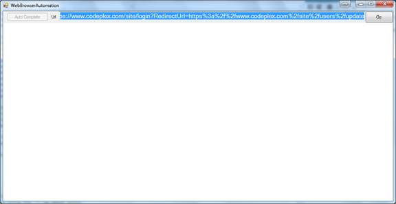

# How to automate a web page in the WebBrowser control
## Requires
- Visual Studio 2012
## License
- Apache License, Version 2.0
## Technologies
- Internet Explorer
- Internet Explorer Development
## Topics
- Automation
- WebBrowser
## Updated
- 10/15/2013
## Description

<h1>How to Automate HTML Elements Loaded in WebBrowser Control (CSWebBrowserAutomation)</h1>
<h2>Introduction</h2>
<h2>The sample demonstrates how to create a
WebBrowser which supplies following features 
</h2>
<h2>1. Manipulate the html elements and login a website automatically.
</h2>
<h2>2. Block specified sites.
</h2>
<h2>Running the Sample</h2>

Step1. Open the project in VS2012, replace the stored 
UserName and Password in StoredSites\www.codeplex.com.xml with your username and password for http://www.codeplex.com first.

Step2. Build this project in VS2012. 

Step3. Run CSWebBrowserAutomation.exe. The button &quot;Auto Complete&quot; is disabled by default.

Step4. Type <a href="https://www.codeplex.com/site/login?RedirectUrl=https%3a%2f%2fwww.codeplex.com%2fsite%2fusers%2fupdate">
https://www.codeplex.com/site/login?RedirectUrl=https%3a%2f%2fwww.codeplex.com%2fsite%2fusers%2fupdate</a> in the
Url textbox and press GO.

This url is the login page of www.codeplex.com. The
RedirectUrl means that the page will be redirected to the
url if you login the site successfully.

Step5. After the web page is loaded completed, the button &quot;Auto Complete&quot; is enabled.
Clickthe button and the web page will be 
be redirected to https://www.codeplex.com/site/users/update. 

Step6. After the new web page is loaded, click the button &quot;Auto Complete&quot; again, and the &quot;New email address&quot; field in the web page will be filled.

Step7. Type http://www.contoso.com&nbsp;
in the urltext box and press Go. You will view
a page that show you a message &quot;Sorry, this site is blocked.&quot;

<h2>Using the Code</h2>

1. Design a class XMLSerialization that can serialize an object to an XML file or
deserialize an XML file to an object. 

2. Design classes HtmlCheckBox, 
HtmlPassword, HtmlSubmit and 
HtmlText that represent the checkbox, password text box, submit button and normal text box. All the classes inherit
HtmlInputElement that represents an 
HtmlElement with the tag &quot;input&quot;. The class 
HtmlInputElementFactory is used to get an HtmlInputElement from an
HtmlElement in the web page. 

3. Design a class StoredSite that represents a site whose html elements are stored. A site is stored as an XML file under
StoredSites folder, and can be 
deserialized. 

&nbsp;&nbsp; This class also supplies a method 
FillWebPage to complete the web page automatically. If a submit button could be found, then the button will also be clicked automatically.

4. Design a class BlockSites which contains that blocked sites list. The file \Resource\BlockList.xml can be
deserialized to a BlockSites instance.

5. Design a class WebBrowserEx that inherits class 
System.Windows.Forms.WebBrowser. Override the OnNavigating method to check whether the
url is included in the block list. If so, navigate the build-in Block.htm.

&nbsp;&nbsp; Override the OnDocumentCompleted method to check whether the loaded page could be completed automatically. If the site and
url are stored, then the method AutoComplete can be used.

<a href="http://msdn.microsoft.com/en-us/library/system.xml.serialization.xmlserializer.aspx">XmlSerializer Class</a>

<a href="http://msdn.microsoft.com/en-us/library/system.windows.forms.webbrowser.aspx">WebBrowser Class</a>

