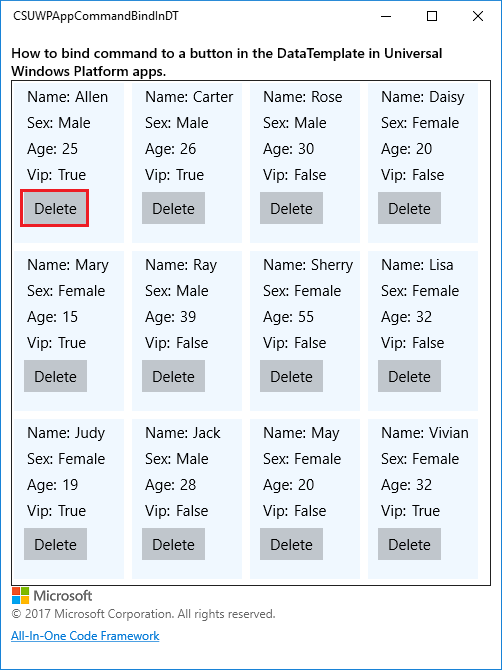
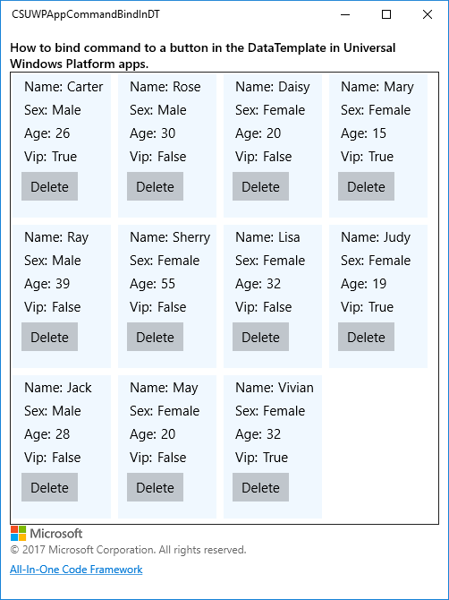

# How to bind commands to a button in the DataTemplate in UWP apps
## Requires
- Visual Studio 2017
## License
- Apache License, Version 2.0
## Technologies
- Universal Windows App Development
- Universal Windows Platform
- UWP
## Topics
- MVVM
- Button
- DataTemplate
- command
- Universal Windows Platform
- UWP
## Updated
- 05/24/2017
## Description

How
to
bind commands to a button in the DataTemplate
in Universal Windows Platform apps

This sample demonstrates how to&nbsp;bind commands to a button in the DataTemplate in Universal Windows Platform apps.

&nbsp;

This sample is upgraded from the following universal windows app sample:

<a href="https://code.msdn.microsoft.com/How-to-bind-command-to-a-299f7759" style="text-decoration:none">https://code.msdn.microsoft.com/How-to-bind-command-to-a-299f7759</a>

&nbsp;

Sample prerequisites

&bull;&nbsp;Visual Studio 2017 or above [<a href="https://www.visualstudio.com/" style="text-decoration:none">Visual
 Studio Home Page</a>]

Building the sample

&bull;&nbsp;Open the sample solution &ldquo;CSUWPAppCommandBindInDT.sln&rdquo;
 using Visual Studio.

&bull;&nbsp;Right click the project &ldquo;CSUWPAppCommandBindInDT&rdquo;
 and select Restore Packages.

&bull;&nbsp;Press
F6 Key or select
Build -&gt; Build Solution from the menu to build the sample.

Running the sample

&bull;&nbsp;Open the sample solution using Visual Studio,
select Local Machine in the toolbar
then press F5 Key or select <strong>Debug -&gt; Start Debugging
</strong>from the menu.

&bull;&nbsp;Click Delete button of the first item in the gridview.

&nbsp;

Using the code

DataTemplate of GridView.

&nbsp;

XAML

Edit|Remove

xaml

<pre class="xaml">&lt;GridView.ItemTemplate&gt;&nbsp;
&nbsp;&nbsp;&nbsp;&nbsp;&lt;DataTemplate&gt;&nbsp;
&nbsp;&nbsp;&nbsp;&nbsp;&nbsp;&nbsp;&nbsp;&nbsp;&lt;Grid&nbsp;Margin=&quot;10,0,0,10&quot;&nbsp;Width=&quot;100&quot;&nbsp;Height=&quot;150&quot;&gt;&nbsp;
&nbsp;&nbsp;&nbsp;&nbsp;&nbsp;&nbsp;&nbsp;&nbsp;&nbsp;&nbsp;&nbsp;&nbsp;&lt;StackPanel&gt;&nbsp;
&nbsp;&nbsp;&nbsp;&nbsp;&nbsp;&nbsp;&nbsp;&nbsp;&nbsp;&nbsp;&nbsp;&nbsp;&nbsp;&nbsp;&nbsp;&nbsp;&lt;StackPanel&nbsp;Orientation=&quot;Horizontal&quot;&nbsp;Margin=&quot;3,3,0,3&quot;&gt;&nbsp;
&nbsp;&nbsp;&nbsp;&nbsp;&nbsp;&nbsp;&nbsp;&nbsp;&nbsp;&nbsp;&nbsp;&nbsp;&nbsp;&nbsp;&nbsp;&nbsp;&nbsp;&nbsp;&nbsp;&nbsp;&lt;TextBlock&nbsp;Text=&quot;Name:&quot;&nbsp;Style=&quot;{StaticResource&nbsp;AppBodyTextStyle}&quot;&nbsp;Margin=&quot;0,0,5,0&quot;/&gt;&nbsp;
&nbsp;&nbsp;&nbsp;&nbsp;&nbsp;&nbsp;&nbsp;&nbsp;&nbsp;&nbsp;&nbsp;&nbsp;&nbsp;&nbsp;&nbsp;&nbsp;&nbsp;&nbsp;&nbsp;&nbsp;&lt;TextBlock&nbsp;Text=&quot;{Binding&nbsp;Name}&quot;&nbsp;Style=&quot;{StaticResource&nbsp;AppBodyTextStyle}&quot;/&gt;&nbsp;
&nbsp;&nbsp;&nbsp;&nbsp;&nbsp;&nbsp;&nbsp;&nbsp;&nbsp;&nbsp;&nbsp;&nbsp;&nbsp;&nbsp;&nbsp;&nbsp;&lt;/StackPanel&gt;&nbsp;
&nbsp;&nbsp;&nbsp;&nbsp;&nbsp;&nbsp;&nbsp;&nbsp;&nbsp;&nbsp;&nbsp;&nbsp;&nbsp;&nbsp;&nbsp;&nbsp;&lt;StackPanel&nbsp;Orientation=&quot;Horizontal&quot;&nbsp;Margin=&quot;3,3,0,3&quot;&gt;&nbsp;
&nbsp;&nbsp;&nbsp;&nbsp;&nbsp;&nbsp;&nbsp;&nbsp;&nbsp;&nbsp;&nbsp;&nbsp;&nbsp;&nbsp;&nbsp;&nbsp;&nbsp;&nbsp;&nbsp;&nbsp;&lt;TextBlock&nbsp;Text=&quot;Sex:&quot;&nbsp;Style=&quot;{StaticResource&nbsp;AppBodyTextStyle}&quot;&nbsp;Margin=&quot;0,0,5,0&quot;/&gt;&nbsp;
&nbsp;&nbsp;&nbsp;&nbsp;&nbsp;&nbsp;&nbsp;&nbsp;&nbsp;&nbsp;&nbsp;&nbsp;&nbsp;&nbsp;&nbsp;&nbsp;&nbsp;&nbsp;&nbsp;&nbsp;&lt;TextBlock&nbsp;Text=&quot;{Binding&nbsp;Sex,&nbsp;Converter={StaticResource&nbsp;SexConverter}}&quot;&nbsp;Style=&quot;{StaticResource&nbsp;AppBodyTextStyle}&quot;/&gt;&nbsp;
&nbsp;&nbsp;&nbsp;&nbsp;&nbsp;&nbsp;&nbsp;&nbsp;&nbsp;&nbsp;&nbsp;&nbsp;&nbsp;&nbsp;&nbsp;&nbsp;&lt;/StackPanel&gt;&nbsp;
&nbsp;&nbsp;&nbsp;&nbsp;&nbsp;&nbsp;&nbsp;&nbsp;&nbsp;&nbsp;&nbsp;&nbsp;&nbsp;&nbsp;&nbsp;&nbsp;&lt;StackPanel&nbsp;Orientation=&quot;Horizontal&quot;&nbsp;Margin=&quot;3,3,0,3&quot;&gt;&nbsp;
&nbsp;&nbsp;&nbsp;&nbsp;&nbsp;&nbsp;&nbsp;&nbsp;&nbsp;&nbsp;&nbsp;&nbsp;&nbsp;&nbsp;&nbsp;&nbsp;&nbsp;&nbsp;&nbsp;&nbsp;&lt;TextBlock&nbsp;Text=&quot;Age:&quot;&nbsp;Style=&quot;{StaticResource&nbsp;AppBodyTextStyle}&quot;&nbsp;Margin=&quot;0,0,5,0&quot;/&gt;&nbsp;
&nbsp;&nbsp;&nbsp;&nbsp;&nbsp;&nbsp;&nbsp;&nbsp;&nbsp;&nbsp;&nbsp;&nbsp;&nbsp;&nbsp;&nbsp;&nbsp;&nbsp;&nbsp;&nbsp;&nbsp;&lt;TextBlock&nbsp;Text=&quot;{Binding&nbsp;Age}&quot;&nbsp;Style=&quot;{StaticResource&nbsp;AppBodyTextStyle}&quot;/&gt;&nbsp;
&nbsp;&nbsp;&nbsp;&nbsp;&nbsp;&nbsp;&nbsp;&nbsp;&nbsp;&nbsp;&nbsp;&nbsp;&nbsp;&nbsp;&nbsp;&nbsp;&lt;/StackPanel&gt;&nbsp;
&nbsp;&nbsp;&nbsp;&nbsp;&nbsp;&nbsp;&nbsp;&nbsp;&nbsp;&nbsp;&nbsp;&nbsp;&nbsp;&nbsp;&nbsp;&nbsp;&lt;StackPanel&nbsp;Orientation=&quot;Horizontal&quot;&nbsp;Margin=&quot;3,3,0,3&quot;&gt;&nbsp;
&nbsp;&nbsp;&nbsp;&nbsp;&nbsp;&nbsp;&nbsp;&nbsp;&nbsp;&nbsp;&nbsp;&nbsp;&nbsp;&nbsp;&nbsp;&nbsp;&nbsp;&nbsp;&nbsp;&nbsp;&lt;TextBlock&nbsp;Text=&quot;Vip:&quot;&nbsp;Style=&quot;{StaticResource&nbsp;AppBodyTextStyle}&quot;&nbsp;Margin=&quot;0,0,5,0&quot;/&gt;&nbsp;
&nbsp;&nbsp;&nbsp;&nbsp;&nbsp;&nbsp;&nbsp;&nbsp;&nbsp;&nbsp;&nbsp;&nbsp;&nbsp;&nbsp;&nbsp;&nbsp;&nbsp;&nbsp;&nbsp;&nbsp;&lt;TextBlock&nbsp;Text=&quot;{Binding&nbsp;Vip}&quot;&nbsp;Style=&quot;{StaticResource&nbsp;AppBodyTextStyle}&quot;/&gt;&nbsp;
&nbsp;&nbsp;&nbsp;&nbsp;&nbsp;&nbsp;&nbsp;&nbsp;&nbsp;&nbsp;&nbsp;&nbsp;&nbsp;&nbsp;&nbsp;&nbsp;&lt;/StackPanel&gt;&nbsp;
&nbsp;&nbsp;&nbsp;&nbsp;&nbsp;&nbsp;&nbsp;&nbsp;&nbsp;&nbsp;&nbsp;&nbsp;&nbsp;&nbsp;&nbsp;&nbsp;&lt;Button&nbsp;Content=&quot;Delete&quot;&nbsp;Margin=&quot;0,5,0,0&quot;&nbsp;Command=&quot;{Binding&nbsp;DataContext.DeleteCommand,&nbsp;ElementName=CustomerGridView}&quot;&nbsp;CommandParameter=&quot;{Binding}&quot;/&gt;&nbsp;
&nbsp;&nbsp;&nbsp;&nbsp;&nbsp;&nbsp;&nbsp;&nbsp;&nbsp;&nbsp;&nbsp;&nbsp;&lt;/StackPanel&gt;&nbsp;
&nbsp;&nbsp;&nbsp;&nbsp;&nbsp;&nbsp;&nbsp;&nbsp;&lt;/Grid&gt;&nbsp;
&nbsp;&nbsp;&nbsp;&nbsp;&lt;/DataTemplate&gt;&nbsp;
&lt;/GridView.ItemTemplate&gt;</pre>

&nbsp;

DelegateCommand

&nbsp;

C#

Edit|Remove

csharp

<pre class="csharp">class&nbsp;DelegateCommand&nbsp;:&nbsp;ICommand&nbsp;
{&nbsp;
&nbsp;&nbsp;&nbsp;&nbsp;private&nbsp;Action&lt;object&gt;&nbsp;execute;&nbsp;
&nbsp;&nbsp;&nbsp;&nbsp;private&nbsp;Func&lt;object,&nbsp;bool&gt;&nbsp;canExecute;&nbsp;
&nbsp;
&nbsp;&nbsp;&nbsp;&nbsp;public&nbsp;DelegateCommand(Action&lt;object&gt;&nbsp;execute)&nbsp;
&nbsp;&nbsp;&nbsp;&nbsp;{&nbsp;
&nbsp;&nbsp;&nbsp;&nbsp;&nbsp;&nbsp;&nbsp;&nbsp;this.execute&nbsp;=&nbsp;execute;&nbsp;
&nbsp;&nbsp;&nbsp;&nbsp;&nbsp;&nbsp;&nbsp;&nbsp;this.canExecute&nbsp;=&nbsp;(x)&nbsp;=&gt;&nbsp;{&nbsp;return&nbsp;true;&nbsp;};&nbsp;
&nbsp;&nbsp;&nbsp;&nbsp;}&nbsp;
&nbsp;
&nbsp;&nbsp;&nbsp;&nbsp;public&nbsp;DelegateCommand(Action&lt;object&gt;&nbsp;execute,&nbsp;Func&lt;object,&nbsp;bool&gt;&nbsp;canExecute)&nbsp;
&nbsp;&nbsp;&nbsp;&nbsp;{&nbsp;
&nbsp;&nbsp;&nbsp;&nbsp;&nbsp;&nbsp;&nbsp;&nbsp;this.execute&nbsp;=&nbsp;execute;&nbsp;
&nbsp;&nbsp;&nbsp;&nbsp;&nbsp;&nbsp;&nbsp;&nbsp;this.canExecute&nbsp;=&nbsp;canExecute;&nbsp;
&nbsp;&nbsp;&nbsp;&nbsp;}&nbsp;
&nbsp;
&nbsp;&nbsp;&nbsp;&nbsp;public&nbsp;bool&nbsp;CanExecute(object&nbsp;parameter)&nbsp;
&nbsp;&nbsp;&nbsp;&nbsp;{&nbsp;
&nbsp;&nbsp;&nbsp;&nbsp;&nbsp;&nbsp;&nbsp;&nbsp;return&nbsp;canExecute(parameter);&nbsp;
&nbsp;&nbsp;&nbsp;&nbsp;}&nbsp;
&nbsp;
&nbsp;&nbsp;&nbsp;&nbsp;public&nbsp;event&nbsp;EventHandler&nbsp;CanExecuteChanged;&nbsp;
&nbsp;
&nbsp;&nbsp;&nbsp;&nbsp;public&nbsp;void&nbsp;RaiseCanExecuteChanged()&nbsp;
&nbsp;&nbsp;&nbsp;&nbsp;{&nbsp;
&nbsp;&nbsp;&nbsp;&nbsp;&nbsp;&nbsp;&nbsp;&nbsp;if&nbsp;(CanExecuteChanged&nbsp;!=&nbsp;null)&nbsp;
&nbsp;&nbsp;&nbsp;&nbsp;&nbsp;&nbsp;&nbsp;&nbsp;{&nbsp;
&nbsp;&nbsp;&nbsp;&nbsp;&nbsp;&nbsp;&nbsp;&nbsp;&nbsp;&nbsp;&nbsp;&nbsp;CanExecuteChanged(this,&nbsp;EventArgs.Empty);&nbsp;
&nbsp;&nbsp;&nbsp;&nbsp;&nbsp;&nbsp;&nbsp;&nbsp;}&nbsp;
&nbsp;&nbsp;&nbsp;&nbsp;}&nbsp;
&nbsp;
&nbsp;&nbsp;&nbsp;&nbsp;public&nbsp;void&nbsp;Execute(object&nbsp;parameter)&nbsp;
&nbsp;&nbsp;&nbsp;&nbsp;{&nbsp;
&nbsp;&nbsp;&nbsp;&nbsp;&nbsp;&nbsp;&nbsp;&nbsp;execute(parameter);&nbsp;
&nbsp;&nbsp;&nbsp;&nbsp;}&nbsp;
}&nbsp;</pre>

&nbsp;

More
information

<a href="https://docs.microsoft.com/en-us/uwp/api/Windows.UI.Xaml.Input.ICommand" style="text-decoration:none">ICommand interface</a>

Microsoft All-In-One Code Framework is a free, centralized code sample library driven by developers' real-world pains and needs. The goal is to provide customer-driven code samples for all Microsoft development technologies,
 and reduce developers' efforts in solving typical programming tasks. Our team listens to developers&rsquo; pains in the MSDN forums, social media and various DEV communities. We write code samples based on developers&rsquo; frequently asked programming tasks,
 and allow developers to download them with a short sample publishing cycle. Additionally, we offer a free code sample request service. It is a proactive way for our developer community to obtain code samples directly from Microsoft.

