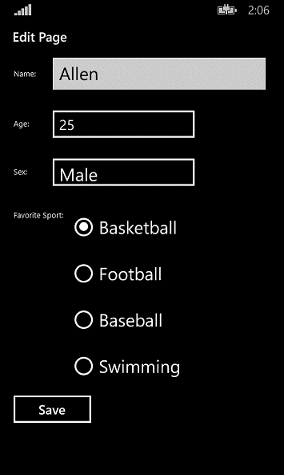

# How to bind enum to RadioButtons in universal Windows apps
## Requires
- Visual Studio 2013
## License
- Apache License, Version 2.0
## Technologies
- Windows
- Windows 8
- Windows Phone 8
- Windows Store app Development
- Windows Phone Development
- Windows 8.1
- Windows Phone 8.1
- universal windows app
## Topics
- Enum
- universal app
- radiobutton
## Updated
- 09/22/2016
## Description

<h1>

<strong>&nbsp;</strong><em>&nbsp;</em>

</h1>
<h1>How to bind enum to RadioButton in universal Windows apps</h1>
<h2>Introduction</h2>

The Customer class in this sample contains a &lsquo;Sport&rsquo; enum type property; the sample shows how to convert Enum type To Boolean type, and vice versa. It also shows how to bind the enum type to RadioButtons.

This sample was upgraded to universal Windows app which targets both Windows 8.1 and Windows Phone 8.1.

<h2>Running the Sample</h2>
<ol>
<li>After you launch the sample on Windows 8.1, this screen will be displayed. </li></ol>

The sample launching on Windows Phone 8.1:

&nbsp;

&nbsp; &nbsp; &nbsp; 2. Click to select one of the items in GridView, the edit page will be displayed. You can select other RadioButton options and click &lsquo;Save&rsquo; at the bottom of the page.

&nbsp;

&nbsp;

<h2>Using the Code</h2>

The code below shows how to create EnumToBoolConverter:

&nbsp;

C#

Edit|Remove

csharp

<pre class="csharp">public&nbsp;class&nbsp;EnumToBoolConverter&nbsp;:&nbsp;IValueConverter&nbsp;
&nbsp;
&nbsp;&nbsp;&nbsp;{&nbsp;
&nbsp;
&nbsp;&nbsp;&nbsp;&nbsp;&nbsp;&nbsp;&nbsp;public&nbsp;object&nbsp;Convert(object&nbsp;value,&nbsp;Type&nbsp;targetType,&nbsp;object&nbsp;parameter,&nbsp;string&nbsp;language)&nbsp;
&nbsp;
&nbsp;&nbsp;&nbsp;&nbsp;&nbsp;&nbsp;&nbsp;{&nbsp;
&nbsp;
&nbsp;&nbsp;&nbsp;&nbsp;&nbsp;&nbsp;&nbsp;&nbsp;&nbsp;&nbsp;&nbsp;string&nbsp;param&nbsp;=&nbsp;parameter&nbsp;as&nbsp;string;&nbsp;
&nbsp;
&nbsp;&nbsp;&nbsp;&nbsp;&nbsp;&nbsp;&nbsp;&nbsp;&nbsp;&nbsp;&nbsp;if&nbsp;(param&nbsp;==&nbsp;null)&nbsp;
&nbsp;
&nbsp;&nbsp;&nbsp;&nbsp;&nbsp;&nbsp;&nbsp;&nbsp;&nbsp;&nbsp;&nbsp;&nbsp;&nbsp;&nbsp;&nbsp;return&nbsp;DependencyProperty.UnsetValue;&nbsp;
&nbsp;
&nbsp;&nbsp;&nbsp;&nbsp;&nbsp;&nbsp;&nbsp;&nbsp;&nbsp;&nbsp;&nbsp;if&nbsp;(Enum.IsDefined(value.GetType(),&nbsp;value)&nbsp;==&nbsp;false)&nbsp;
&nbsp;
&nbsp;&nbsp;&nbsp;&nbsp;&nbsp;&nbsp;&nbsp;&nbsp;&nbsp;&nbsp;&nbsp;&nbsp;&nbsp;&nbsp;&nbsp;return&nbsp;DependencyProperty.UnsetValue;&nbsp;
&nbsp;
&nbsp;&nbsp;
&nbsp;
&nbsp;&nbsp;&nbsp;&nbsp;&nbsp;&nbsp;&nbsp;&nbsp;&nbsp;&nbsp;&nbsp;object&nbsp;paramValue&nbsp;=&nbsp;Enum.Parse(value.GetType(),&nbsp;param);&nbsp;
&nbsp;
&nbsp;&nbsp;&nbsp;&nbsp;&nbsp;&nbsp;&nbsp;&nbsp;&nbsp;&nbsp;&nbsp;return&nbsp;paramValue.Equals(value);&nbsp;
&nbsp;
&nbsp;&nbsp;&nbsp;&nbsp;&nbsp;&nbsp;&nbsp;}&nbsp;
&nbsp;
&nbsp;&nbsp;
&nbsp;
&nbsp;&nbsp;&nbsp;&nbsp;&nbsp;&nbsp;&nbsp;public&nbsp;object&nbsp;ConvertBack(object&nbsp;value,&nbsp;Type&nbsp;targetType,&nbsp;object&nbsp;parameter,&nbsp;string&nbsp;language)&nbsp;
&nbsp;
&nbsp;&nbsp;&nbsp;&nbsp;&nbsp;&nbsp;&nbsp;{&nbsp;
&nbsp;
&nbsp;&nbsp;&nbsp;&nbsp;&nbsp;&nbsp;&nbsp;&nbsp;&nbsp;&nbsp;&nbsp;string&nbsp;param&nbsp;=&nbsp;parameter&nbsp;as&nbsp;string;&nbsp;
&nbsp;
&nbsp;&nbsp;&nbsp;&nbsp;&nbsp;&nbsp;&nbsp;&nbsp;&nbsp;&nbsp;&nbsp;if&nbsp;(parameter&nbsp;==&nbsp;null)&nbsp;
&nbsp;
&nbsp;&nbsp;&nbsp;&nbsp;&nbsp;&nbsp;&nbsp;&nbsp;&nbsp;&nbsp;&nbsp;&nbsp;&nbsp;&nbsp;&nbsp;return&nbsp;DependencyProperty.UnsetValue;&nbsp;
&nbsp;
&nbsp;&nbsp;
&nbsp;
&nbsp;&nbsp;&nbsp;&nbsp;&nbsp;&nbsp;&nbsp;&nbsp;&nbsp;&nbsp;&nbsp;return&nbsp;Enum.Parse(typeof(Sport),&nbsp;param);&nbsp;
&nbsp;
&nbsp;&nbsp;&nbsp;&nbsp;&nbsp;&nbsp;&nbsp;}&nbsp;
&nbsp;
&nbsp;&nbsp;&nbsp;}&nbsp;</pre>

&nbsp;

&nbsp;

The code below shows the binding in xaml:

&nbsp;

XAML

Edit|Remove

xaml

<pre class="xaml">&lt;StackPanel&nbsp;Grid.Row=&quot;3&quot;&nbsp;Grid.Column=&quot;1&quot;&nbsp;HorizontalAlignment=&quot;Left&quot;&nbsp;VerticalAlignment=&quot;Top&quot;&nbsp;Margin=&quot;0,15,0,0&quot;&gt;&nbsp;&nbsp;
&nbsp;&nbsp;&nbsp;&nbsp;&nbsp;&nbsp;&nbsp;&nbsp;&nbsp;&nbsp;&nbsp;&nbsp;&nbsp;&nbsp;&nbsp;&nbsp;&nbsp;&nbsp;&nbsp;&nbsp;&nbsp;&nbsp;&nbsp;&nbsp;&nbsp;&nbsp;&nbsp;&nbsp;&lt;RadioButton&nbsp;IsChecked=&quot;{Binding&nbsp;Path=FavouriteSport,Converter={StaticResource&nbsp;ETBConverter},ConverterParameter=Basketball,&nbsp;Mode=TwoWay}&quot;&nbsp;FontSize=&quot;25&quot;&nbsp;Margin=&quot;0,0,0,10&quot;&gt;Basketball&lt;/RadioButton&gt;&nbsp;&nbsp;
&nbsp;&nbsp;&nbsp;&nbsp;&nbsp;&nbsp;&nbsp;&nbsp;&nbsp;&nbsp;&nbsp;&nbsp;&nbsp;&nbsp;&nbsp;&nbsp;&nbsp;&nbsp;&nbsp;&nbsp;&nbsp;&nbsp;&nbsp;&nbsp;&nbsp;&nbsp;&nbsp;&nbsp;&lt;RadioButton&nbsp;IsChecked=&quot;{Binding&nbsp;Path=FavouriteSport,Converter={StaticResource&nbsp;ETBConverter},ConverterParameter=Football,&nbsp;Mode=TwoWay}&quot;&nbsp;FontSize=&quot;25&quot;&nbsp;Margin=&quot;0,0,0,10&quot;&gt;Football&lt;/RadioButton&gt;&nbsp;&nbsp;
&nbsp;&nbsp;&nbsp;&nbsp;&nbsp;&nbsp;&nbsp;&nbsp;&nbsp;&nbsp;&nbsp;&nbsp;&nbsp;&nbsp;&nbsp;&nbsp;&nbsp;&nbsp;&nbsp;&nbsp;&nbsp;&nbsp;&nbsp;&nbsp;&nbsp;&nbsp;&nbsp;&nbsp;&lt;RadioButton&nbsp;IsChecked=&quot;{Binding&nbsp;Path=FavouriteSport,Converter={StaticResource&nbsp;ETBConverter},ConverterParameter=Baseball,&nbsp;Mode=TwoWay}&quot;&nbsp;FontSize=&quot;25&quot;&nbsp;Margin=&quot;0,0,0,10&quot;&gt;Baseball&lt;/RadioButton&gt;&nbsp;&nbsp;
&nbsp;&nbsp;&nbsp;&nbsp;&nbsp;&nbsp;&nbsp;&nbsp;&nbsp;&nbsp;&nbsp;&nbsp;&nbsp;&nbsp;&nbsp;&nbsp;&nbsp;&nbsp;&nbsp;&nbsp;&nbsp;&nbsp;&nbsp;&nbsp;&nbsp;&nbsp;&nbsp;&nbsp;&lt;RadioButton&nbsp;IsChecked=&quot;{Binding&nbsp;Path=FavouriteSport,Converter={StaticResource&nbsp;ETBConverter},ConverterParameter=Swimming,&nbsp;Mode=TwoWay}&quot;&nbsp;FontSize=&quot;25&quot;&nbsp;Margin=&quot;0,0,0,10&quot;&gt;Swimming&lt;/RadioButton&gt;&nbsp;&nbsp;
&lt;/StackPanel&gt;&nbsp;&nbsp;</pre>

&nbsp;

&nbsp;

<h2>More Information</h2>

IValueConverter Interface

<a href="http://msdn.microsoft.com/en-us/library/windows/apps/BR209903">http://msdn.microsoft.com/en-us/library/windows/apps/BR209903</a>

Microsoft All-In-One Code Framework is a free, centralized code sample library driven by developers' real-world pains and needs. The goal is to provide customer-driven code samples for all Microsoft development technologies,
 and reduce developers' efforts in solving typical programming tasks. Our team listens to developers&rsquo; pains in the MSDN forums, social media and various DEV communities. We write code samples based on developers&rsquo; frequently asked programming tasks,
 and allow developers to download them with a short sample publishing cycle. Additionally, we offer a free code sample request service. It is a proactive way for our developer community to obtain code samples directly from Microsoft.

